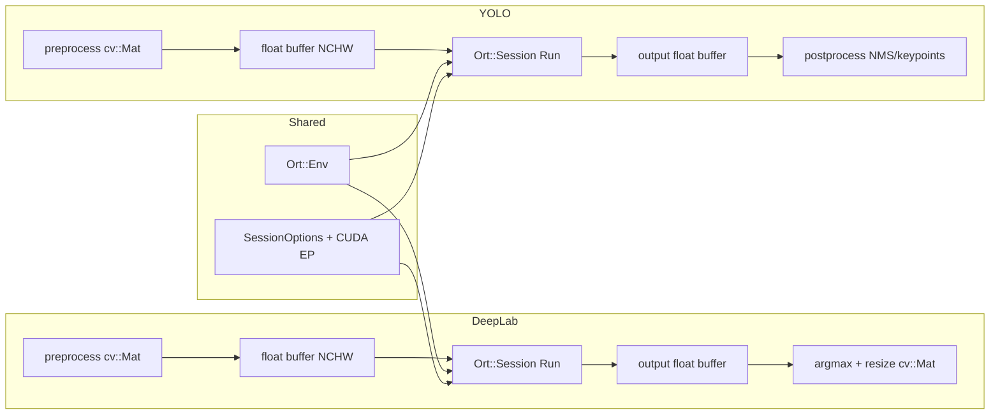

# Migrate from LibTorch to ONNX Runtime (CUDA)

## Current state

- **[deeplab_field_model.cpp](src/field_model/deeplab_field_model.cpp)** and **[yolo_keypoint_model.cpp](src/keypoint_model/yolo_keypoint_model.cpp)** use LibTorch: `torch::jit::load()` for TorchScript (`.pt`) models, `model_.forward()`, and `torch::Tensor` for preprocessing/postprocessing.
- **[CMakeLists.txt](CMakeLists.txt)** links `${TORCH_LIBRARIES}` (lines 134–137); there is no `find_package(Torch)` in the current file (likely set elsewhere or in cache).
- Config structs ([field_model/config.hpp](include/field_model/config.hpp), [keypoint_model/config.hpp](include/keypoint_model/config.hpp)) use `model_path` as a string; no schema change needed—users will point to `.onnx` files.

## Architecture after migration

## 1. Build system: ONNX Runtime with CUDA

- **Remove** all Torch usage from [CMakeLists.txt](CMakeLists.txt): drop `${TORCH_LIBRARIES}` and any `find_package(Torch)` / Torch include dirs if present.
- **Add** ONNX Runtime with CUDA:
    - **Option A:** If ONNX Runtime is installed (e.g. built from source with CUDA, or distro package): use `find_package(onnxruntime)` if available, or `find_path` / `find_library` for `onnxruntime` and the CUDA provider (e.g. `onnxruntime_providers_shared` or `onnxruntime_providers_cuda` depending on build).
    - **Option B:** Use FetchContent to build ONNX Runtime from source (slower, more control). Prefer a prebuilt package or vcpkg for faster setup.
- **Link** the main ONNX Runtime library and the CUDA execution provider library so both `deeplab_field_model` and `yolo_keypoint_model` can use CUDA.
- **Include** `onnxruntime_cxx_api.h` and, for CUDA EP, register it via `OrtSessionOptionsAppendExecutionProvider_CUDA` (or equivalent) before creating the session.

## 2. DeepLab field model

**Headers ([include/field_model/deeplab_field_model.hpp](include/field_model/deeplab_field_model.hpp))**

- Remove `#include <torch/script.h>` and `<torch/cuda.h>`.
- Replace `torch::jit::script::Module model_` and `torch::Device device_` with:
    - `Ort::Env` (can be shared or per-instance) and `Ort::Session` (or `std::unique_ptr<Ort::Session>`),
    - a `bool use_cuda_` (or enum) set from config/env (e.g. try CUDA EP first, fall back to CPU).
- Change helper signatures to use raw buffers instead of `torch::Tensor`:
    - `preprocess_image` → fill a `std::vector<float>` (or `float*` + size) in NCHW order; keep same OpenCV preprocessing (resize, normalize, ImageNet mean/std).
    - `postprocess_output` → take `const float*` (and shape: channels, height, width), perform argmax and resize to get `cv::Mat` mask (no torch types).

**Implementation ([src/field_model/deeplab_field_model.cpp](src/field_model/deeplab_field_model.cpp))**

- **Constructor:** Set `use_cuda_` (e.g. from env or default true); no `torch::cuda::is_available()`.
- **initialize():**
    - Create `Ort::Env`, `Ort::SessionOptions`, append CUDA execution provider when `use_cuda_` is true, then create `Ort::Session` from `model_path_` (expect `.onnx`).
    - Get input/output names (e.g. from session or fix to known names like `"input"` / `"output"` if the ONNX export uses them).
    - Warmup: build a dummy input `Ort::Value` (shape `[1, 3, image_size_, image_size_]`), run session, ignore output.
- **update():**
    - Call `preprocess_image` to fill the input float buffer (NCHW).
    - Create input `Ort::Value` from that buffer (tensor type float, shape `[1, 3, image_size_, image_size_]`).
    - Run `session.Run(...)` with that input and the known output name(s). DeepLab ONNX usually has one output (logits): shape `[1, num_classes, H, W]`.
    - In `postprocess_output`: use the output pointer (from `GetTensorData`), compute argmax over the channel dimension, then resize/crop (same logic as today) to produce the final `cv::Mat` mask.

**Model format**

- Config/documentation: `model_path` must point to an **ONNX** file (e.g. exported from PyTorch with `torch.onnx.export` for DeepLab). No code change to config structs.

## 3. YOLO keypoint model

**Headers ([include/keypoint_model/yolo_keypoint_model.hpp](include/keypoint_model/yolo_keypoint_model.hpp))**

- Remove all `#include <torch/...>` and `torch::*` types.
- Replace `torch::jit::script::Module model_` and `torch::Device device_` with `Ort::Env` + `Ort::Session` and `bool use_cuda_` (same pattern as DeepLab).
- Replace every `torch::Tensor` in method signatures with an abstraction used only for postprocessing. Two approaches:
    - **Recommended:** Introduce a small **tensor-like type** (e.g. in `include/onnx_tensor_utils.hpp` or similar): holds `std::vector<float>` (or non-owning pointer + shape) and dimensions `[batch, rows, cols]`. Expose only the ops needed: transpose, slice by index, split, concat, element access. Then keep the current postprocessing algorithm and rewrite it to use this type (and raw indexing where needed).
    - **Alternative:** Rewrite all postprocessing to use `std::vector<float>` + explicit shapes and manual indexing (no new type). More verbose but no extra header.

**Implementation ([src/keypoint_model/yolo_keypoint_model.cpp](src/keypoint_model/yolo_keypoint_model.cpp))**

- **Constructor / initialize():** Same pattern as DeepLab: create ONNX session with CUDA EP when `use_cuda_` is true, load from `model_path_` (`.onnx`), warmup with dummy input of shape `[1, 3, image_size_, image_size_]`.
- **Preprocess:** Keep the same OpenCV/letterbox logic; output a `std::vector<float>` (or contiguous buffer) in NCHW. No `torch::Tensor`.
- **update():** Build input `Ort::Value` from preprocessed buffer; run session; get output pointer and dimensions. Wrap the output in the chosen tensor-like type (or raw pointer + shape), then call existing postprocessing logic (NMS, xywh2xyxy, scale_boxes, keypoint extraction) implemented in terms of that type.
- **Postprocessing (nms, xywh2xyxy, non_max_suppression, scale_boxes, postprocess_output, visualize_output):**
    - Replace every `torch::Tensor` with the new type (or `float*` + shape). The current NMS already uses raw pointers for the inner loop; keep that and only change how boxes/scores/indices are obtained (from the tensor-like type or from a contiguous buffer).
    - Ensure transpose, split, concat, and indexing are implemented for the chosen abstraction so the YOLO output shape `[1, num_features, num_predictions]` can be transposed to `[1, num_predictions, num_features]` and the rest of the pipeline matches current behavior.

**Model format**

- Config/documentation: `model_path` must point to an **ONNX** file (e.g. Ultralytics YOLO: `model.export(format="onnx", ...)`). No config schema change.

## 4. Shared ONNX / tensor utilities (optional but recommended)

- **Single place for session creation:** Helper (e.g. in a new `include/onnx_session_utils.hpp` or inside an existing util) to create `Ort::Env`, set `SessionOptions`, append CUDA EP, and create `Ort::Session` from path. Both DeepLab and YOLO can call this to avoid duplication.
- **Tensor helper for YOLO:** If using the tensor-like abstraction, define it in one header (e.g. `include/onnx_tensor_utils.hpp`) and use it only in the keypoint model. Implement: construction from pointer + shape, copy, transpose(dim0, dim1), slice(batch_idx), row(i), element (i,j), and any split/cat needed for NMS and keypoint parsing. No need for a full tensor library—only what YOLO postprocessing uses.

## 5. Tests and config

- **[tests/field_model/test_deeplab_field_model.cpp](tests/field_model/test_deeplab_field_model.cpp):** Tests use a fake `model_path` and do not load a real model. Update fake path to something like `"/fake/path/model.onnx"` if you want consistency. No need for a real ONNX file in tests unless you add an integration test.
- **Config files:** Update any example or default `model_path` in `config/*.toml` to use `.onnx` extension and document that ONNX is required.
- **Training/export scripts:** Add or update export to ONNX:
    - **YOLO:** e.g. in [training/yolo/convert_to_torchscript.py](training/yolo/convert_to_torchscript.py) (or a new script): add path to export ONNX via `model.export(format="onnx", ...)` so users can produce `.onnx` for the keypoint model.
    - **DeepLab:** If you have a training/export pipeline, add an ONNX export path (e.g. `torch.onnx.export`) so the field model can be served as `.onnx`.

## 6. Dependency and install docs

- **Install:** Document that the project requires ONNX Runtime built with CUDA (or the GPU package). Remove any LibTorch install steps from [install/](install/) or [docs/](docs/) if present.
- **Jetson/Ubuntu:** If you have scripts under [install/](install/) or [scripts/](scripts/) that install LibTorch, replace them with instructions (or scripts) to install or build ONNX Runtime with CUDA support.

## Summary of file changes

| Area | Files to modify |

| ----------------- | --------------------------------------------------------------------------------------------------------------------------------------------------------------------------------------------------------------------------------------------------------- |

| Build | [CMakeLists.txt](CMakeLists.txt): remove Torch, add ONNX Runtime + CUDA provider |

| DeepLab | [include/field_model/deeplab_field_model.hpp](include/field_model/deeplab_field_model.hpp), [src/field_model/deeplab_field_model.cpp](src/field_model/deeplab_field_model.cpp): Ort::Session, float buffers, no torch |

| YOLO | [include/keypoint_model/yolo_keypoint_model.hpp](include/keypoint_model/yolo_keypoint_model.hpp), [src/keypoint_model/yolo_keypoint_model.cpp](src/keypoint_model/yolo_keypoint_model.cpp): Ort::Session, tensor helper or raw buffers for postprocessing |

| Shared (optional) | New `include/onnx_session_utils.hpp`, optionally `include/onnx_tensor_utils.hpp` |

| Tests | [tests/field_model/test_deeplab_field_model.cpp](tests/field_model/test_deeplab_field_model.cpp): fake path `.onnx` if desired |

| Export / docs | Training script(s) for ONNX export; install/docs: ONNX Runtime + CUDA instead of LibTorch |

## Risk / notes

- **ONNX output names and shapes:** DeepLab and YOLO ONNX exports must match what the code expects (single output for DeepLab with shape `[1, num_classes, H, W]`; YOLO with shape `[1, num_features, num_predictions]`). If your current TorchScript exports differ, the ONNX export step must replicate the same interface.
- **CUDA fallback:** If CUDA is unavailable, session creation with CUDA EP can fail; catch and fall back to CPU EP so behavior matches the current “CUDA not available. Using CPU.” message.
- **YOLO postprocessing:** The largest amount of work is replacing `torch::Tensor` in the YOLO postprocessing with either the minimal tensor helper or raw indexing; the algorithm (NMS, xywh2xyxy, keypoint parsing) stays the same.