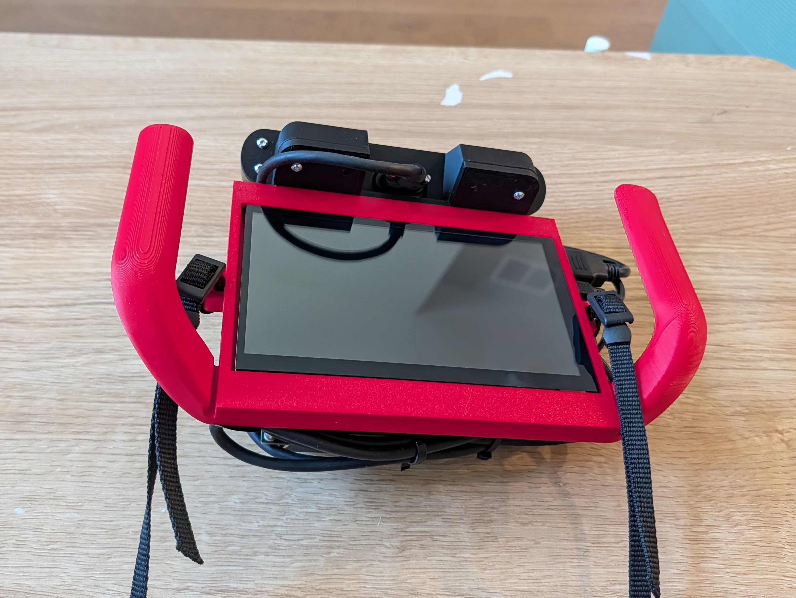
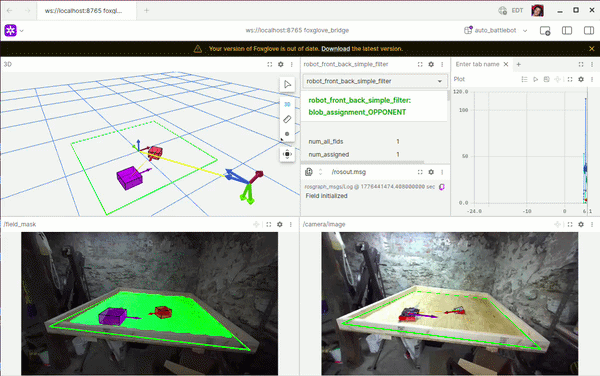
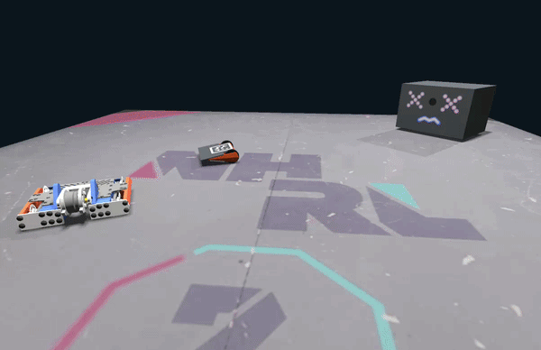

<div style="height: 220px; width: 100%; overflow: hidden; border-radius: 8px;">
  
</div>

<br/>

This project brings aim-assist and autonomous control to combat robots.

Driving skill in leagues like [NHRL](https://www.nhrl.io/) is often the deciding factor when hardware is similarly robust. The goal of this project is to deliver autonomous control to any radio-controlled combat robot.

[](https://youtu.be/DhecUUJivEk)

Play recorded video through the full control pipeline.

## Built for Low Latency

The application is written in **C++** and uses **TensorRT** for inference.

On the Jetson Orin Nano, camera capture to motor motion is **< 60 ms**.*

Supported platforms:
- Jetson Orin Nano
- Intel x86 + NVIDIA GPU
  - Ubuntu 22
  - Ubuntu 24

## Fast Deployment

At NHRL, there is no time to set up tripod hardware across 8+ cages and calibrate fixed camera systems.

This system is fully handheld. The handheld device features:
- Jetson Orin Nano
- ZED 2i stereo camera
- USB connection to any OpenTX transmitter
- 2+ hours of battery
- 8-inch LCD display

<p align="center">
  
</p>

If there is interest, I can release the BOM and parts list.

## Easy to Debug

The application uses **Foxglove** for visualization, **MCAP** for replay debugging, and ZED SDK's **SVO** format for video playback.

[](https://youtu.be/qqPpfk3PQDA)

## Simulation and Playback Testing

To reduce regression risk, the system can replay recorded SVO files as if real hardware were connected.

It also includes a simulator for closed-loop behavior testing using [Genesis](https://genesis-embodied-ai.github.io/).

[](https://youtu.be/I6TsnE2lxu0)

<p align="center"><video width="70%" src="docs/media/simulation-demo.webm" autoplay muted loop playsinline controls allowfullscreen width="100%"></video></p>

# Implementation


The system has 3 modes defined by configuration files:
- **Hardware**: Receives images from a real ZED 2i and sends control commands to a real OpenTX transmitter.
- **Simulation**: Receives images from simulation and sends commands over TCP to the simulator.
- **Playback**: Receives images from an SVO file; commands are generated but not transmitted.

## Engineering Highlights

The project focuses on end-to-end autonomy under real-time and real-world constraints.

- **Real-time systems:** C++17 implementation for camera, perception, filtering, navigation, and transmission.
- **Maintainable systems:** Components are swappable through interfaces and controlled by configuration.
- **ML in the loop:** TensorRT-accelerated YOLO segmentation and keypoint models run in the control pipeline.
- **Control + geometry:** Pursuit navigation with field-boundary clamping and velocity command generation.
- **Reproducibility/tooling:** Simulation harnesses, playback workflows, tests, and model-sync scripts reduce iteration risk.

## Pseudocode

[This document](docs/pseudo_code.md) describes runtime orchestration across modules.

## Repo Tour

- `src/`, `include/`: Core C++ runtime and interfaces
- `simulation/`: Genesis server and protocol bridge
- `config/`: Mode-specific TOML configurations
- `training/`: Synthetic data and model training utilities
- `scripts/`, `install/`: Setup, build, and run workflows
- `firmware/`: Robot-side firmware experiments and support code
- `playground/`: Experimental work

# Setup and Install

These scripts assume you are on one of the supported hardware configurations:
- Jetson Orin Nano
- Ubuntu 22 or 24 (x86 + NVIDIA GPU with compute capability 8.7 or higher)

This section assumes CUDA and TensorRT are already installed.

For Jetson-specific setup, see [docs/jetson_setup.md](docs/jetson_setup.md).

Docker support may be added in the future if needed.

To install the core application, run one of:
- `scripts/install_jetson.sh`
- `scripts/install_ubuntu_22.sh`
- `scripts/install_ubuntu_24.sh`

## Training and Python Tools

To install tools for training, firmware, and other Python workflows:

```bash
./scripts/setup_python.sh
```

## Simulation

To install and run simulation:

```bash
scripts/setup_simulation.sh
scripts/run_simulation.sh
```

## Obtaining Model Files

After running the Python tools setup script:

```bash
source ./scripts/activate_python.sh
python scripts/sync_models.py
```

The script lists model files that match your architecture. If none appear, continue to the next section.

### Creating New Engine Files

To create engine files for systems that do not have prebuilt artifacts:

For YOLO:

```bash
python training/yolo/convert_to_tensorrt.py <path to onnx file>
```

For DeepLabV3:

```bash
python training/deeplabv3/convert_to_tensorrt.py <path to pt file>
```

## Running the Application

To run playback mode:

```bash
./scripts/build_and_run.sh -c ./config/playback.toml
```

If installing on a new Jetson, deploy, build, and run the systemd service with:

```bash
./scripts/deploy_to_jetson.sh <host name or ip address>
```

To run unit tests:

```bash
./scripts/build_and_test.sh
```

## Code Style

There is no strict style guide yet. Running the formatter script applies baseline corrections:

```bash
./scripts/apply_formatting
```

#### Footnotes

* [Crossfire has 19.5 ms of latency](https://oscarliang.com/rc-protocols/#CRSF).
  The sense-and-control loop takes ~35 ms on the Jetson Orin Nano.
  Camera image acquisition takes ~20 ms.
  Because these steps are asynchronous, they cannot be summed directly.
  The stated figure is a worst-case latency guarantee.