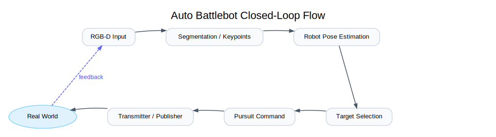

  

 

# auto-battlebots

Drive like a pro! The project brings aim-assist to the world of combat robots.
Driving skill in leagues like NHRL (https://www.nhrl.io/) is usually the deciding factor for who wins fights
assuming equally robust hardware. This project aims to deliver autonomous control to any radio-controlled
combat robot.

<video width="70%" src="docs/media/playback-demo.webm" autoplay muted loop playsinline controls allowfullscreen width="100%"></video>

Play recorded video through the system

## Built for low-latency

This application is written in **C++** and **TensorRT** for inference.

On the Jetson Orin Nano, camera capture to motor motion is <60 ms*.

Supported platforms:
- Jetson Orin Nano
- Intel x86 + NVidia GPU
    - Ubuntu 22
    - Ubuntu 24

## Fast deployment

At NHRL, there's no time to setup tripods hardware at their 8+ cages.
This system is completely handheld. The handheld device features:
- Jetson Orin Nano
- ZED 2i stereo camera
- USB connection to any OpenTX transmitter
- 2+ hours of battery
- 8 inch LCD display

## Easy to debug

This application utilizes **Foxglove** for visualization, **MCAP** for replay debugging, 
and ZED SDK's **SVO** for video playback.

<video width="70%" src="docs/media/foxglove-demo.webm" autoplay muted loop playsinline controls allowfullscreen width="100%"></video>

## Simulation and playback testing

To ensure any change doesn't cause regressions in performance, I've added the ability to replay recorded
SVO files through the system as if real hardware were connected.

I've also added a simulator to test closed-loop behavior using [Genesis](https://genesis-embodied-ai.github.io/)

<video width="70%" src="docs/media/simulation-demo.webm" autoplay muted loop playsinline controls allowfullscreen width="100%"></video>

# Implementation

The system has 3 control modes controlled by a configuration system.
- Hardware - Receive images from a real ZED 2i. Send control commands to a real OpenTX transmitter.
- Simulation - Images from simulation. Send commands via TCP to the simulation.
- Playback - Images from SVO file. Commands don't go anywhere.

## Engineering Highlights

The goal of this project is to implement end-to-end autonomy under real-time and real-world constraints.

- **Real-time systems:** C++17 implementation for camera, perception, filtering, navigation, and transmission.
- **Maintainable systems:** Each component of the system is swappable with a different implementation and controllable by configuration. Interfaces can be mix
- **ML in the loop:** TensorRT-accelerated YOLO segmentation and keypoint models running in the control pipeline.
- **Control + geometry:** Pursuit navigation with field-boundary clamping and velocity command generation.
- **Reproducibility/tooling:** Simulation harness, playback workflows, tests, and model-sync scripts to reduce iteration risk.

## Pseudo code

[This document](docs/pseudo_code.md) describes the runtime orchestration of all the modules.

## Repo tour

- `src/`, `include/`: core C++ runtime and interfaces.
- `simulation/`: Genesis server + protocol bridge.
- `config/`: mode-specific TOML configurations.
- `training/`: synthetic data + model training utilities.
- `scripts/`, `install/`: setup/build/run workflows.
- `firmware/`: robot-side firmware experiments and support code.
- `playground/`: A place to dump experiments.

# Setup and install

These scripts you're on one of the supported hardware configurations:
- Jetson Orin Nano
- Ubuntu 22 or 24 (x86 + NVidia GPU with compute capability 87 or higher)

This section assumes you have already setup CUDA and TensorRT.

[For Jetson instructions, look here.](docs/jetson_setup.md)

I may add docker support in the future if necessary.

To install the core application, run one of the following scripts:

- `scripts/install_jetson.sh`
- `scripts/install_ubuntu_22.sh`
- `scripts/install_ubuntu_24.sh`

## Training and python tools

To install tools for training, firmware and more, run the python setup script:

`./scripts/setup_python.sh`

## Simulation

To install and run the simulation, run these commands:

`scripts/setup_simulation.sh`

`scripts/run_simulation.sh`

# Obtaining model files

After running the python tools setup script, run these commands:

`source ./scripts/activate_python.sh`

`python scripts/sync_models.py`

The script will list model files that match your architecure. If none appear, move to the next section.

## Creating new engine files

To create engine files on systems I haven't pre-built for, run these scripts:

For yolo:

`python training/yolo/convert_to_tensorrt.py <path to onnx file>`

For deeplabv3:

`python training/deeplabv3/convert_to_tensorrt.py <path to pt file>`

# Running the application

To run the application in playback mode, run this command.

`./scripts/build_and_run.sh -c ./config/playback.toml`

If installing on a new Jetson, run this script to deploy, build, and run the systemd service:

`./scripts/deploy_to_jetson.sh <host name or ip address>`

To run the unit tests, run this command.

`./scripts/build_and_test.sh`

# Code style

There's no explicit style guide for this repository. Running `./scripts/apply_formatting` will apply basic style corrections.

#### Footnotes

\* - [Crossfire has 19.5 ms of latency](https://oscarliang.com/rc-protocols/#CRSF). 
    The sense and control loop takes ~35 ms on the Jetson Orin Nano.
    Camera image image acquisition takes ~20 ms.
    Because these are asynchronous, you can't simply add them together. I've put the latency of the
    worst case and am making a guaratee that latency will always less than that.