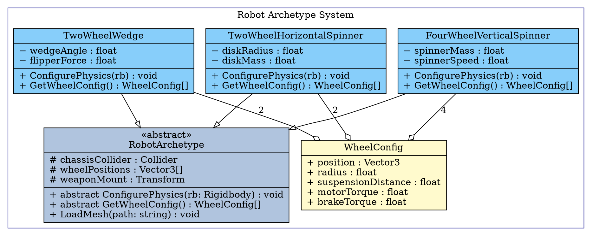
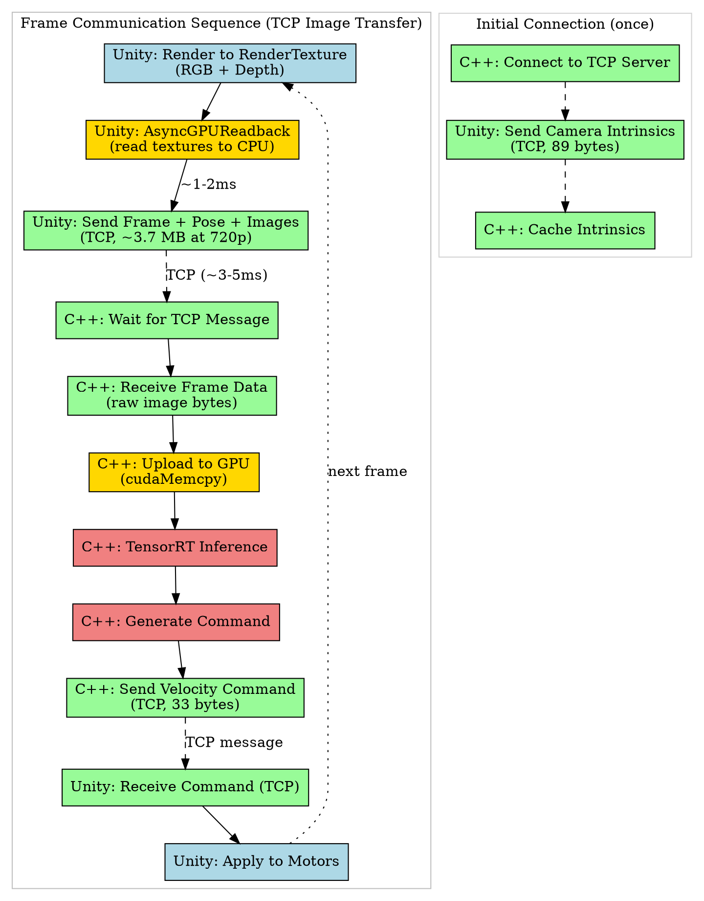
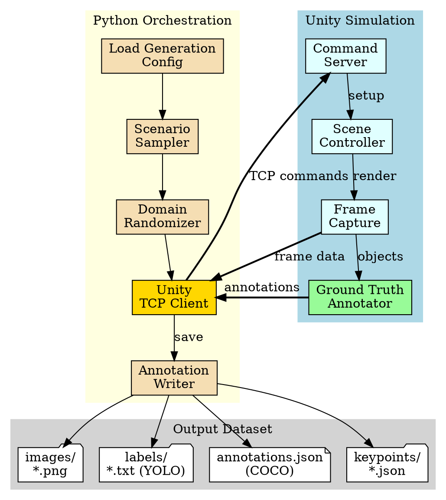
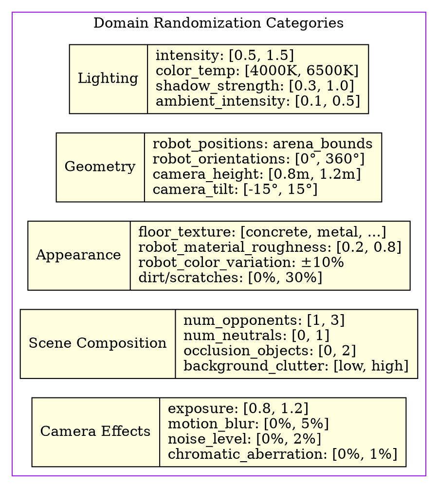

# Auto-Battlebot Simulation System Engineering Plan

**Document Version:** 1.3  
**Date:** 2026-01-30  
**Author:** Engineering Team  
**Status:** Draft

**Revision History:**
| Version | Date | Description |
|---------|------|-------------|
| 1.0 | 2026-01-24 | Initial draft with shared memory IPC approach |
| 1.1 | 2026-01-29 | Replaced IPC bridge with CUDA Interop for zero-copy GPU texture sharing |
| 1.2 | 2026-01-29 | Changed small data transfer (velocity commands, pose, camera intrinsics) from shared memory to TCP sockets |
| 1.3 | 2026-01-30 | Replaced CUDA Interop with optimized TCP image transfer using AsyncGPUReadback |

---

## Table of Contents

1. [Executive Summary](#executive-summary)
2. [Project Overview](#project-overview)
3. [Requirements](#requirements)
   - [Functional Requirements](#functional-requirements)
   - [Non-Functional Requirements](#non-functional-requirements)
4. [System Architecture](#system-architecture)
5. [Architecture Diagrams](#architecture-diagrams)
6. [Risk Assessment](#risk-assessment)
7. [Sprint Planning](#sprint-planning)
8. [Ticket Breakdown](#ticket-breakdown)

---

## Executive Summary

This document outlines the engineering plan for developing a Unity-based hardware-in-the-loop (HIL) simulation system for the Auto-Battlebot project. The simulation will enable end-to-end testing of the C++ perception and navigation stack without requiring physical hardware, accelerating development cycles and enabling automated testing scenarios.

The system will provide a virtual environment that accurately mimics the Stereolabs ZED camera output (RGB, depth, and visual SLAM pose) and receives velocity commands from the C++ application to control simulated robots. The simulation will support configurable autonomous opponent agents, enabling comprehensive testing of combat scenarios.

Additionally, the simulation will serve as a synthetic data generation platform\*\* for training machine learning models. Python scripts will orchestrate the Unity simulation to produce large-scale, annotated datasets with automatic ground-truth labels, domain randomization, and configurable scenario generation—all without involving the C++ application.

**Key Deliverables:**

- High-performance TCP bridge with Linux-optimized image transfer between Unity and C++ application
- Physically accurate robot simulation with CAD-derived assets
- Configurable autonomous agent behaviors
- Scene lighting matching real NHRL arena conditions
- Extensible robot archetype system
- Python-orchestrated synthetic data generation pipeline
- Automatic ground-truth annotation export (bounding boxes, segmentation masks, keypoints)

---

## Project Overview

### Background

The Auto-Battlebot C++ application processes camera data from a Stereolabs ZED 2i to perceive the battle arena, detect robots, and generate velocity commands for a combat robot. Currently, testing requires physical hardware setup, which is time-consuming and limits iteration speed.

### Goals

1. Enable rapid iteration on perception and navigation algorithms without physical hardware
2. Provide deterministic, reproducible test scenarios
3. Support automated regression testing
4. Allow testing of edge cases and failure modes safely
5. Generate synthetic training data for machine learning models (orchestrated via Python, independent of C++ application)

### Scope

**In Scope:**

- Unity simulation mimicking ZED camera output
- Bidirectional communication with existing C++ application
- Robot physics simulation with accurate mass/inertia properties
- Configurable opponent AI behaviors
- Scene recreation matching NHRL arena lighting
- Python-orchestrated synthetic data generation pipeline
- Automatic ground-truth annotation export (bounding boxes, segmentation, keypoints)
- Domain randomization for training data diversity

**Out of Scope:**

- Weapon physics/damage simulation (Phase 2)
- Multi-robot coordination testing (Phase 2)
- VR/AR visualization modes
- Cloud-based simulation scaling
- Real-time training integration (online learning)

---

## Requirements

### Functional Requirements

| ID     | Requirement                                                                                                | Priority | Rationale                                        |
| ------ | ---------------------------------------------------------------------------------------------------------- | -------- | ------------------------------------------------ |
| FR-001 | System shall render RGB images at minimum 720p resolution at 30+ FPS                                       | Must     | Match ZED camera minimum output specifications   |
| FR-002 | System shall generate depth images aligned with RGB images                                                 | Must     | Required for obstacle detection and navigation   |
| FR-003 | System shall provide 6-DOF camera pose (visual SLAM equivalent)                                            | Must     | Required for world-frame robot tracking          |
| FR-004 | System shall receive velocity commands (linear_x, linear_y, angular_z) from C++ application                | Must     | Core control interface                           |
| FR-005 | System shall apply velocity commands to simulated robot motors                                             | Must     | Enable closed-loop control testing               |
| FR-006 | Image transfer latency shall be ≤10ms                                                                      | Must     | Maintain real-time control loop viability        |
| FR-007 | System shall support at least 1 opponent robot at a time                                                   | Must     | Match typical combat scenario                    |
| FR-008 | System shall support 0-1 neutral robots                                                                    | Should   | Test avoidance behaviors                         |
| FR-009 | Opponent robots shall implement configurable targeting AI                                                  | Must     | Test defensive maneuvers                         |
| FR-010 | System shall load robot meshes from CAD-exported assets (DAE, FBX, OBJ)                                    | Must     | Maintain visual accuracy with real robots        |
| FR-011 | System shall support robot archetypes: 4-wheel vertical spinner, 2-wheel horizontal spinner, 2-wheel wedge | Must     | Cover common robot configurations                |
| FR-012 | System shall be configurable via external configuration files                                              | Must     | Enable test scenario scripting                   |
| FR-013 | Camera intrinsics shall match ZED 2i specifications                                                        | Should   | Ensure perception algorithm compatibility        |
| FR-014 | Scene lighting shall replicate NHRL arena conditions                                                       | Should   | Minimize domain gap in perception                |
| FR-015 | System shall support recording/playback of simulation sessions                                             | Should   | Enable regression testing                        |
| FR-016 | System shall export 2D bounding box annotations for all robots                                             | Must     | Training data for object detection models        |
| FR-017 | System shall export instance segmentation masks                                                            | Should   | Training data for segmentation models            |
| FR-018 | System shall export keypoint annotations matching robot joint definitions                                  | Must     | Training data for pose estimation models         |
| FR-019 | System shall support domain randomization (lighting, textures, positions)                                  | Must     | Improve model generalization                     |
| FR-020 | Python orchestration shall control simulation without C++ application                                      | Must     | Decouple data generation from runtime system     |
| FR-021 | System shall generate datasets in formats compatible with existing training pipeline                       | Must     | Integration with `training/` directory structure |
| FR-022 | System shall support batch generation of thousands of annotated frames                                     | Must     | Scale synthetic data production                  |
| FR-023 | Annotations shall include object class labels matching `classes.toml`                                      | Must     | Consistency with existing label schema           |
| FR-024 | System shall support up to 3 opponent robots at a time                                                     | Should   | Match typical combat scenario                    |

### Non-Functional Requirements

| ID      | Requirement                                                                       | Priority | Rationale                                                  |
| ------- | --------------------------------------------------------------------------------- | -------- | ---------------------------------------------------------- |
| NFR-001 | Unity project shall use Unity 6 LTS or later                                      | Must     | Long-term support and modern rendering                     |
| NFR-002 | TCP image transfer shall use Linux socket optimizations for low-latency localhost communication | Must     | Match development environment; maximize throughput on Linux |
| NFR-003 | System shall run on machines without dedicated GPU at reduced quality             | Should   | Enable CI/CD integration                                   |
| NFR-004 | Memory usage shall not exceed 4GB for simulation                                  | Should   | Enable parallel test execution                             |
| NFR-005 | Codebase shall follow Unity C# conventions and include XML documentation          | Must     | Maintainability                                            |
| NFR-006 | Adding a new robot shall require <30 minutes of configuration                     | Should   | Extensibility                                              |
| NFR-007 | System shall support headless operation                                           | Should   | CI/CD compatibility                                        |
| NFR-008 | Scripts shall use explicit initialization order via Script Execution Order        | Must     | Avoid race conditions                                      |
| NFR-009 | Python orchestration shall use existing project virtual environment               | Must     | Consistency with `training/` tooling                       |
| NFR-010 | Data generation shall achieve >100 annotated frames per minute                    | Should   | Practical dataset sizes                                    |
| NFR-011 | Annotation format shall be YOLO-compatible (txt) and COCO-compatible (JSON)       | Must     | Support common training frameworks                         |
| NFR-012 | Python scripts shall be executable from command line with configurable parameters | Must     | Automation and scripting                                   |

---

## System Architecture

### High-Level Architecture

The simulation system consists of four main layers:

1. **Unity Simulation Layer** - Handles rendering, physics, and robot control
2. **Communication Layer** - Manages bidirectional data transfer between Unity and C++
3. **C++ Application Layer** - Existing perception and navigation stack (unchanged)
4. **Python Data Generation Layer** - Orchestrates synthetic data generation (independent of C++)

### Communication Strategy

After evaluating options (ROS, gRPC, custom TCP, shared memory), I recommend **optimized TCP with AsyncGPUReadback** for the following reasons:

- **Simplicity:** Pure TCP implementation without native plugins or platform-specific interop
- **Compatibility:** Works with any Unity render pipeline (HDRP, URP, Built-in) and graphics API (Vulkan, OpenGL, DirectX)
- **Debuggability:** Standard tools (Wireshark, netcat) can inspect all traffic including image data
- **Portability:** Same code works across Linux and Windows without modification
- **Sufficient performance:** 3-5ms latency for 720p frames with Linux socket optimizations

The approach uses Unity's **AsyncGPUReadback** API to read rendered textures from GPU to CPU, then sends the raw image data over TCP with Linux-specific optimizations for maximum localhost throughput.

**Linux Socket Optimizations:**

1. **Large Socket Buffers:** `SO_SNDBUF`/`SO_RCVBUF` set to 4MB+ for image-sized transfers
2. **TCP_NODELAY:** Disable Nagle's algorithm for immediate packet transmission
3. **TCP_QUICKACK:** Disable delayed ACKs on receiver side
4. **SO_BUSY_POLL:** Enable busy polling for sub-millisecond receive latency
5. **Kernel Tuning:** Set `/proc/sys/net/core/rmem_max` and `wmem_max` to 16MB+

**Alternative: Unix Domain Sockets**

For same-machine communication, Unix domain sockets can be used instead of TCP to avoid TCP/IP stack overhead entirely. This provides slightly lower latency (~0.5ms improvement) at the cost of portability.

A single **TCP socket** handles all data exchange including:
- RGB and Depth image frames (via `FrameReadyWithData` message type)
- Pose metadata (camera transform)
- Velocity commands (linear_x, linear_y, angular_z)
- Camera intrinsics (sent once on connection, cached by C++ application)

**Performance Expectations:**

| Resolution | RGBA Size | Transfer Time (optimized TCP) |
|------------|-----------|------------------------------|
| 720p (1280x720) | 3.7 MB | ~3-5 ms |
| 1080p (1920x1080) | 8.3 MB | ~6-10 ms |
| 480p (640x480) | 1.2 MB | ~1-2 ms |

Note: AsyncGPUReadback adds ~1-2ms latency. Total frame latency is readback + transfer time.

### Data Flow

```
Unity Simulation                    TCP Communication               C++ Application
┌─────────────────┐                ┌─────────────────┐             ┌─────────────────┐
│  Scene Renderer │                │                 │             │                 │
│  (HDRP/URP)     │                │  TCP Socket     │             │ SimRgbdCamera   │
│                 │──AsyncGPU─────▶│  (localhost)    │──Raw───────▶│ (implements     │
│  Camera System  │  Readback      │  + Linux opts   │  Bytes      │  RgbdCameraInterface)
│                 │────Pose───────▶│                 │             │                 │
│  Robot Physics  │◀───Velocity────│                 │◀────────────│ SimTransmitter  │
│  Motor Control  │                │                 │             │ (implements     │
│                 │                │                 │             │  TransmitterInterface)
└─────────────────┘                └─────────────────┘             └─────────────────┘

Note: RGB and Depth frames are read via AsyncGPUReadback and sent as raw bytes over TCP.
Frame data (~3.7 MB at 720p) plus metadata (~200 bytes) transfers per frame.
Linux socket optimizations (large buffers, TCP_NODELAY, etc.) minimize transfer latency.
```

### Unity Component Architecture

```
SimulationManager (Singleton)
├── CameraSimulator
│   ├── RgbCameraCapture (renders to RenderTexture)
│   ├── DepthCameraCapture (renders to RenderTexture)
│   └── PoseTracker
├── TcpImageBridge
│   ├── AsyncGPUReadbackManager (reads textures from GPU)
│   └── TcpBridge (handles all data via TCP socket)
│       ├── FrameSender (sends RGB + Depth frames with pose)
│       ├── CommandReader (reads velocity commands)
│       └── IntrinsicsProvider (sends camera intrinsics on connection)
├── RobotManager
│   ├── ControlledRobot
│   │   ├── DriveController
│   │   └── RobotModel
│   └── AutonomousRobot[]
│       ├── AIController
│       ├── DriveController
│       └── RobotModel
├── ArenaManager
│   ├── ArenaGeometry
│   └── LightingController
├── ConfigurationLoader
└── DataGenerationController (for synthetic data mode)
    ├── AnnotationExporter
    ├── DomainRandomizer
    └── ScenarioGenerator
```

### Synthetic Data Generation Architecture

The synthetic data generation pipeline operates independently of the C++ application, using Python to orchestrate Unity via a lightweight TCP command interface.

```
Python Orchestrator                    Unity Simulation
┌─────────────────────┐               ┌─────────────────────┐
│  DatasetGenerator   │───Commands───▶│ DataGenerationCtrl  │
│  - scenario configs │               │ - scene setup       │
│  - randomization    │               │ - robot positioning │
│  - batch control    │               │ - lighting control  │
│                     │               │                     │
│  AnnotationWriter   │◀──Frames+─────│ AnnotationExporter  │
│  - YOLO format      │   Annotations │ - bounding boxes    │
│  - COCO format      │               │ - segmentation      │
│  - keypoints        │               │ - keypoints         │
│                     │               │                     │
│  DomainRandomizer   │───Params─────▶│ Randomizer          │
│  - lighting ranges  │               │ - texture swap      │
│  - pose sampling    │               │ - lighting adjust   │
└─────────────────────┘               └─────────────────────┘
         │
         ▼
┌─────────────────────┐
│  training/data/     │
│  - images/          │
│  - labels/          │
│  - annotations.json │
└─────────────────────┘
```

### Python Component Architecture

```
training/generator/
├── generate_dataset.py          # Main entry point
├── unity_client.py              # TCP communication with Unity
├── scenario_sampler.py          # Random scenario generation
├── domain_randomizer.py         # Randomization parameter sampling
├── annotation_writer.py         # Multi-format annotation export
├── config/
│   └── generation_config.toml   # Dataset generation settings
└── schemas/
    ├── yolo_format.py           # YOLO annotation utilities
    └── coco_format.py           # COCO annotation utilities
```

---

## Architecture Diagrams

### System Data Flow Diagram

```dot
digraph SystemDataFlow {
    rankdir=LR;
    node [shape=box, style=filled];

    subgraph cluster_unity {
        label="Unity Simulation";
        style=filled;
        color=lightblue;

        scene [label="Scene\nRenderer", fillcolor=lightcyan];
        camera [label="Virtual\nCamera", fillcolor=lightcyan];
        physics [label="Physics\nEngine", fillcolor=lightcyan];
        motor [label="Motor\nController", fillcolor=lightcyan];
        ai [label="AI\nController", fillcolor=lightyellow];
        rgb_tex [label="RGB\nRenderTexture", shape=note, fillcolor=lightyellow];
        depth_tex [label="Depth\nRenderTexture", shape=note, fillcolor=lightyellow];

        scene -> camera [label="render"];
        physics -> scene [label="transforms"];
        motor -> physics [label="forces"];
        ai -> motor [label="opponent\ncommands", style=dashed];
        camera -> rgb_tex;
        camera -> depth_tex;
    }

    subgraph cluster_tcp {
        label="TCP Communication Layer";
        style=filled;
        color=orange;

        async_readback [label="AsyncGPU\nReadback", shape=box3d, fillcolor=gold];
        tcp_socket [label="TCP Socket\n(localhost:18707)\n+ Linux opts", shape=diamond, fillcolor=white];
    }

    subgraph cluster_cpp {
        label="C++ Application";
        style=filled;
        color=lightgreen;

        sim_camera [label="SimRgbdCamera\n(RgbdCameraInterface)", fillcolor=palegreen];
        perception [label="TensorRT\nInference", fillcolor=palegreen];
        navigation [label="Navigation\nSystem", fillcolor=palegreen];
        sim_tx [label="SimTransmitter\n(TransmitterInterface)", fillcolor=palegreen];

        sim_camera -> perception [label="GPU upload"];
        perception -> navigation [label="RobotDescriptions"];
        navigation -> sim_tx [label="VelocityCommand"];
    }

    rgb_tex -> async_readback [label="readback\nrequest", style=bold, color=red];
    depth_tex -> async_readback [label="readback\nrequest", style=bold, color=red];
    async_readback -> tcp_socket [label="raw bytes", style=bold];
    tcp_socket -> sim_camera [label="frame data +\npose + intrinsics", style=bold];
    
    camera -> tcp_socket [label="pose"];
    sim_tx -> tcp_socket [label="velocity\ncommands"];
    tcp_socket -> motor [label="velocity"];
}
```


<details>
    <summary>Dot diagram code</summary>



</details>

### Unity Class Structure Diagram

```dot
digraph UnityClassStructure {
    rankdir=TB;
    node [shape=record, style=filled, fillcolor=lightyellow];

    // Interfaces
    subgraph cluster_interfaces {
        label="Interfaces";
        color=gray;

        IRobotController [label="{«interface»\nIRobotController|+ Initialize() : void\l+ ApplyVelocity(vel: Vector3) : void\l+ GetPose() : Pose\l}"];
        IAIBehavior [label="{«interface»\nIAIBehavior|+ Initialize(config: AIConfig) : void\l+ Update() : VelocityCommand\l+ SetTarget(target: Transform) : void\l}"];
        ICameraSimulator [label="{«interface»\nICameraSimulator|+ CaptureRgb() : Texture2D\l+ CaptureDepth() : float[,]\l+ GetPose() : Matrix4x4\l}"];
    }

    // Core Managers
    subgraph cluster_managers {
        label="Managers (Singletons)";
        color=blue;

        SimulationManager [label="{SimulationManager|− instance : SimulationManager\l− config : SimulationConfig\l− isRunning : bool\l|+ Initialize() : void\l+ StartSimulation() : void\l+ StopSimulation() : void\l+ GetConfig() : SimulationConfig\l}", fillcolor=lightblue];

        RobotManager [label="{RobotManager|− controlledRobot : ControlledRobot\l− opponents : List\<AutonomousRobot\>\l− neutrals : List\<AutonomousRobot\>\l|+ SpawnRobot(config: RobotConfig) : Robot\l+ GetControlledRobot() : ControlledRobot\l+ GetOpponents() : List\<Robot\>\l}", fillcolor=lightblue];

        ArenaManager [label="{ArenaManager|− lighting : LightingConfig\l− boundaries : Collider[]\l|+ SetLighting(config: LightingConfig) : void\l+ GetBounds() : Bounds\l}", fillcolor=lightblue];
    }

    // Communication - TCP with AsyncGPUReadback
    subgraph cluster_comm {
        label="TCP Image Transfer";
        color=orange;

        TcpImageBridge [label="{TcpImageBridge|− rgbTexture : RenderTexture\l− depthTexture : RenderTexture\l− readbackManager : AsyncGPUReadbackManager\l− tcpBridge : TcpBridge\l|+ RegisterTextures() : void\l+ SignalFrameReady() : void\l+ ReceiveCommand() : VelocityCommand\l}", fillcolor=gold];

        AsyncGPUReadbackManager [label="{AsyncGPUReadbackManager|− rgbReadbackData : byte[]\l− depthReadbackData : byte[]\l− pendingReadbacks : int\l|+ RequestReadback(tex: RenderTexture) : void\l+ OnReadbackComplete(data: NativeArray) : void\l+ GetFrameData() : (byte[], byte[])\l}", fillcolor=gold];

        TcpBridge [label="{TcpBridge|− tcpClient : TcpClient\l− port : int\l− socketBufferSize : int\l|+ Connect(host: string, port: int) : void\l+ SendFrameWithData(pose, rgb, depth) : void\l+ SendIntrinsics(intrinsics: CameraIntrinsics) : void\l+ ReceiveCommand() : VelocityCommand\l+ ConfigureLinuxOptimizations() : void\l}", fillcolor=palegreen];

        CommandReader [label="{CommandReader|− tcpBridge : TcpBridge\l|+ ReadCommand() : VelocityCommand\l}", fillcolor=palegreen];

        IntrinsicsProvider [label="{IntrinsicsProvider|− tcpBridge : TcpBridge\l− intrinsics : CameraIntrinsics\l|+ SendIntrinsicsOnConnect() : void\l}", fillcolor=palegreen];
    }

    // Robots
    subgraph cluster_robots {
        label="Robot Components";
        color=orange;

        RobotBase [label="{«abstract»\nRobotBase|# config : RobotConfig\l# driveController : DriveController\l# rigidBody : Rigidbody\l|+ Initialize(config: RobotConfig) : void\l+ GetPose() : Pose\l# abstract OnUpdate() : void\l}", fillcolor=peachpuff];

        ControlledRobot [label="{ControlledRobot|− lastCommand : VelocityCommand\l|+ ApplyCommand(cmd: VelocityCommand) : void\l# override OnUpdate() : void\l}", fillcolor=peachpuff];

        AutonomousRobot [label="{AutonomousRobot|− aiBehavior : IAIBehavior\l− target : Transform\l|+ SetBehavior(behavior: IAIBehavior) : void\l# override OnUpdate() : void\l}", fillcolor=peachpuff];

        DriveController [label="{DriveController|− wheels : WheelCollider[]\l− driveType : DriveType\l|+ SetVelocity(linear: Vector3, angular: float) : void\l+ GetCurrentVelocity() : Vector3\l}", fillcolor=peachpuff];
    }

    // AI Behaviors
    subgraph cluster_ai {
        label="AI Behaviors";
        color=purple;

        AggressiveAI [label="{AggressiveAI|− chargeSpeed : float\l− attackDistance : float\l|+ Update() : VelocityCommand\l}", fillcolor=plum];

        PatrolAI [label="{PatrolAI|− waypoints : Vector3[]\l− currentWaypoint : int\l|+ Update() : VelocityCommand\l}", fillcolor=plum];

        NeutralAI [label="{NeutralAI|− avoidanceRadius : float\l|+ Update() : VelocityCommand\l}", fillcolor=plum];
    }

    // Camera
    subgraph cluster_camera {
        label="Camera System";
        color=red;

        CameraSimulator [label="{CameraSimulator|− rgbCamera : Camera\l− depthCamera : Camera\l− intrinsics : Matrix4x4\l|+ CaptureRgb() : Texture2D\l+ CaptureDepth() : float[,]\l+ GetPose() : Matrix4x4\l}", fillcolor=lightsalmon];

        ZED2iProfile [label="{ZED2iProfile|+ width : int = 1280\l+ height : int = 720\l+ fov : float = 110\l+ fx, fy, cx, cy : float\l}", fillcolor=lightsalmon];
    }

    // Configuration
    subgraph cluster_config {
        label="Configuration";
        color=brown;

        SimulationConfig [label="{SimulationConfig|+ frameRate : int\l+ robots : RobotConfig[]\l+ lighting : LightingConfig\l+ ipcSettings : IPCConfig\l}", fillcolor=wheat];

        RobotConfig [label="{RobotConfig|+ label : string\l+ group : RobotGroup\l+ archetype : RobotArchetype\l+ meshPath : string\l+ mass : float\l+ aiConfig : AIConfig\l}", fillcolor=wheat];

        AIConfig [label="{AIConfig|+ behaviorType : AIBehaviorType\l+ aggressiveness : float\l+ reactionTime : float\l+ parameters : Dictionary\l}", fillcolor=wheat];
    }

    // Data Generation (Synthetic Training Data)
    subgraph cluster_datagen {
        label="Data Generation";
        color=darkgreen;

        DataGenerationServer [label="{DataGenerationServer|− tcpListener : TcpListener\l− port : int\l|+ StartServer() : void\l+ HandleCommand(cmd: Command) : Response\l+ StopServer() : void\l}", fillcolor=darkseagreen];

        AnnotationExporter [label="{AnnotationExporter|− camera : Camera\l|+ GetBoundingBoxes() : BBox[]\l+ GetSegmentationMask() : Texture2D\l+ GetKeypoints() : Keypoint[]\l+ ExportAnnotations() : AnnotationData\l}", fillcolor=darkseagreen];

        DomainRandomizer [label="{DomainRandomizer|− config : RandomizationConfig\l− seed : int\l|+ RandomizeLighting() : void\l+ RandomizeGeometry() : void\l+ RandomizeAppearance() : void\l+ RandomizeCamera() : void\l+ SetSeed(seed: int) : void\l}", fillcolor=darkseagreen];

        ScenarioController [label="{ScenarioController|− currentScenario : Scenario\l|+ SetupScenario(config: ScenarioConfig) : void\l+ PlaceRobots(positions: Pose[]) : void\l+ Reset() : void\l}", fillcolor=darkseagreen];
    }

    // Relationships
    SimulationManager -> RobotManager [arrowhead=diamond];
    SimulationManager -> ArenaManager [arrowhead=diamond];
    SimulationManager -> TcpImageBridge [arrowhead=diamond];
    SimulationManager -> CameraSimulator [arrowhead=diamond];

    TcpImageBridge -> AsyncGPUReadbackManager [arrowhead=diamond];
    TcpImageBridge -> TcpBridge [arrowhead=diamond];
    TcpImageBridge -> CommandReader [arrowhead=diamond];
    CameraSimulator -> TcpImageBridge [arrowhead=odiamond, label="texture handles"];

    RobotManager -> ControlledRobot [arrowhead=odiamond];
    RobotManager -> AutonomousRobot [arrowhead=odiamond, label="0..*"];

    RobotBase -> IRobotController [style=dashed, arrowhead=empty];
    ControlledRobot -> RobotBase [arrowhead=empty];
    AutonomousRobot -> RobotBase [arrowhead=empty];

    RobotBase -> DriveController [arrowhead=diamond];
    AutonomousRobot -> IAIBehavior [arrowhead=odiamond];

    AggressiveAI -> IAIBehavior [style=dashed, arrowhead=empty];
    PatrolAI -> IAIBehavior [style=dashed, arrowhead=empty];
    NeutralAI -> IAIBehavior [style=dashed, arrowhead=empty];

    CameraSimulator -> ICameraSimulator [style=dashed, arrowhead=empty];
    CameraSimulator -> ZED2iProfile [arrowhead=odiamond];

    SimulationConfig -> RobotConfig [arrowhead=odiamond, label="1..*"];
    RobotConfig -> AIConfig [arrowhead=odiamond];

    // Data Generation relationships
    SimulationManager -> DataGenerationServer [arrowhead=odiamond, style=dashed, label="optional"];
    DataGenerationServer -> AnnotationExporter [arrowhead=diamond];
    DataGenerationServer -> DomainRandomizer [arrowhead=diamond];
    DataGenerationServer -> ScenarioController [arrowhead=diamond];
    ScenarioController -> RobotManager [arrowhead=odiamond];
    AnnotationExporter -> CameraSimulator [arrowhead=odiamond];
}
```


<details>
    <summary>Dot diagram code</summary>



</details>

### Robot Archetype Hierarchy Diagram


<details>
    <summary>Dot diagram code</summary>



</details>

### Communication Sequence Diagram


<details>
    <summary>Dot diagram code</summary>



</details>

### Synthetic Data Generation Flow Diagram


<details>
    <summary>Dot diagram code</summary>



</details>

### Domain Randomization Parameters Diagram


<details>
    <summary>Dot diagram code</summary>



</details>

---

## Risk Assessment

### Technical Risks

| ID     | Risk                                                            | Probability | Impact | Mitigation Strategy                                                                |
| ------ | --------------------------------------------------------------- | ----------- | ------ | ---------------------------------------------------------------------------------- |
| TR-001 | TCP image transfer latency exceeds 10ms requirement             | Medium      | High   | Use Linux socket optimizations; benchmark early; consider Unix domain sockets      |
| TR-002 | Unity physics does not accurately model robot dynamics          | Medium      | Medium | Tune physics parameters against real robot telemetry; accept approximation         |
| TR-003 | Depth rendering does not match ZED sensor characteristics       | Medium      | Medium | Apply post-processing to simulate sensor noise and artifacts                       |
| TR-004 | AsyncGPUReadback stalls rendering pipeline                      | Low         | Medium | Use double-buffering; profile readback timing; optimize texture formats            |
| TR-005 | Unity rendering performance insufficient for real-time          | Low         | High   | Profile early; reduce quality settings; support headless mode                      |
| TR-006 | Script initialization order causes race conditions              | Medium      | Medium | Use explicit Script Execution Order; document dependencies                         |
| TR-007 | CAD mesh import issues (scale, orientation, format)             | High        | Low    | Standardize export pipeline; create validation tool                                |
| TR-008 | Sim-to-real domain gap degrades model performance               | High        | High   | Extensive domain randomization; validate with real data holdout                    |
| TR-009 | Annotation accuracy differs from manual labels                  | Medium      | High   | Validate against manually labeled subset; tune projection math                     |
| TR-010 | Python-Unity TCP communication unreliable                       | Low         | Medium | Implement retry logic; use well-tested socket patterns                             |
| TR-011 | Synthetic data generation too slow for practical dataset sizes  | Medium      | Medium | Profile and optimize; support parallel Unity instances                             |
| TR-012 | Socket buffer size limits on default kernel configuration       | Medium      | Low    | Document kernel tuning requirements; provide setup scripts                         |
| TR-013 | Image data corruption during TCP transfer                       | Low         | High   | Add checksums/validation; implement retry logic                                    |

### Schedule Risks

| ID     | Risk                                                    | Probability | Impact | Mitigation Strategy                                                      |
| ------ | ------------------------------------------------------- | ----------- | ------ | ------------------------------------------------------------------------ |
| SR-001 | TCP socket optimization takes longer than estimated     | Low         | Medium | Use well-documented Linux socket options; test on target hardware early  |
| SR-002 | Robot archetype system over-engineered                  | Medium      | Medium | Start with concrete implementations; abstract later                      |
| SR-003 | Lighting tuning requires many iterations                | High        | Low    | Capture reference images early; accept subpar accuracy                   |
| SR-004 | Domain randomization parameter tuning is time-consuming | High        | Medium | Start with literature-based defaults; iterate based on model performance |

### Integration Risks

| ID     | Risk                                                          | Probability | Impact | Mitigation Strategy                                        |
| ------ | ------------------------------------------------------------- | ----------- | ------ | ---------------------------------------------------------- |
| IR-001 | C++ interface changes break simulation                        | Low         | Medium | Define interface contract; version the IPC protocol        |
| IR-002 | Coordinate system mismatch (Unity Y-up vs. ROS convention)    | High        | Medium | Document coordinate transforms clearly; unit tests         |
| IR-003 | Timing differences between simulation and real system         | Medium      | Medium | Support configurable time scaling; lockstep mode           |
| IR-004 | Synthetic labels incompatible with existing training pipeline | Medium      | High   | Match existing `training/` conventions exactly; test early |
| IR-005 | Class label mismatch between simulation and `classes.toml`    | Low         | High   | Use same TOML config; automated validation                 |

---

## Sprint Planning

### Sprint Overview

| Sprint   | Duration | Focus          | Key Deliverables                                              |
| -------- | -------- | -------------- | ------------------------------------------------------------- |
| Sprint 1 | 2 weeks  | Foundation     | IPC prototype, basic Unity structure, C++ interfaces          |
| Sprint 2 | 2 weeks  | Camera System  | RGB/Depth capture, pose tracking, camera profile              |
| Sprint 3 | 2 weeks  | Robot System   | Robot base classes, archetypes, controlled robot              |
| Sprint 4 | 2 weeks  | AI & Arena     | Autonomous agents, arena setup, lighting                      |
| Sprint 5 | 2 weeks  | Integration    | End-to-end testing, configuration system, polish              |
| Sprint 6 | 2 weeks  | Synthetic Data | Python orchestration, annotation export, domain randomization |
| Sprint 7 | 1 week   | Stabilization  | Bug fixes, documentation, CI/CD integration                   |

### Sprint 1: Foundation (Weeks 1-2)

**Goal:** Establish TCP communication infrastructure with optimized image transfer

**Tickets:** SIM-001 through SIM-005

### Sprint 2: Camera System (Weeks 3-4)

**Goal:** Implement virtual camera matching ZED 2i specifications

**Tickets:** SIM-006 through SIM-010

### Sprint 3: Robot System (Weeks 5-6)

**Goal:** Implement robot physics and archetype system

**Tickets:** SIM-011 through SIM-017

### Sprint 4: AI & Arena (Weeks 7-8)

**Goal:** Implement autonomous agents and arena environment

**Tickets:** SIM-018 through SIM-023

### Sprint 5: Integration (Weeks 9-10)

**Goal:** Full system integration and configuration

**Tickets:** SIM-024 through SIM-028

### Sprint 6: Synthetic Data Generation (Weeks 11-12)

**Goal:** Implement Python-orchestrated synthetic data generation pipeline

**Tickets:** SIM-032 through SIM-039

### Sprint 7: Stabilization (Week 13)

**Goal:** Polish, documentation, and CI/CD

**Tickets:** SIM-029 through SIM-031

---

## Ticket Breakdown

---

### ✅️ SIM-001: Create Unity Project Structure and Script Execution Framework

**Sprint:** 1  
**Estimate:** 3 points  
**Type:** Task  
**Priority:** Critical

**Description:**

Set up the foundational Unity project structure with proper folder organization, assembly definitions, and script execution order configuration. This establishes the baseline for all subsequent development and ensures scripts initialize in a deterministic order.

**Tasks:**

1. Create folder structure: `Scripts/Core`, `Scripts/Communication`, `Scripts/Robots`, `Scripts/AI`, `Scripts/Camera`, `Scripts/Arena`, `Scripts/Configuration`
2. Create assembly definition files for each module to enforce dependency boundaries
3. Configure Script Execution Order in Project Settings for core managers
4. Create `SimulationManager` singleton with initialization lifecycle hooks
5. Implement `IInitializable` interface for components requiring ordered initialization
6. Create `InitializationPhase` enum (PreInit, Init, PostInit, Ready)
7. Set up `.gitignore` for Unity-specific files

**Acceptance Criteria:**

- [ ] Folder structure matches specification
- [ ] Assembly definitions compile without circular dependencies
- [ ] `SimulationManager` initializes before all other simulation scripts
- [ ] Components implementing `IInitializable` are called in correct phase order
- [ ] Project compiles without warnings
- [ ] Unity version is 6 LTS or later

**Dependencies:** None

**Notes:**

```
Execution Order Reference:
-1000: SimulationManager
-500: ConfigurationLoader
-100: CommunicationBridge
0: Default (RobotManager, ArenaManager, CameraSimulator)
100: Robot components
200: AI components
```

---

### ✅️ SIM-002: Implement Linux-Optimized TCP Image Transfer

**Sprint:** 1  
**Estimate:** 5 points  
**Type:** Task  
**Priority:** Critical

**Description:**

Implement high-performance TCP image transfer using Unity's AsyncGPUReadback API with Linux-specific socket optimizations. This enables the simulation to send rendered frames to the C++ application with minimal latency (~3-5ms for 720p).

**Tasks:**

1. Research and document Linux socket optimization options for localhost
2. Implement `AsyncGPUReadbackManager` class:
   - Request texture readback using `AsyncGPUReadback.Request()`
   - Handle double-buffering to avoid pipeline stalls
   - Convert NativeArray to byte[] for TCP transmission
3. Configure TCP socket with Linux optimizations:
   - Set `SO_SNDBUF`/`SO_RCVBUF` to 4MB+ via socket options
   - Enable `TCP_NODELAY` to disable Nagle's algorithm
   - Enable `TCP_QUICKACK` on receiver side
   - Optionally enable `SO_BUSY_POLL` for lowest latency
4. Benchmark transfer performance at various resolutions
5. Document kernel tuning requirements (`rmem_max`, `wmem_max`)
6. Create setup script for kernel parameter configuration

**Acceptance Criteria:**

- [ ] AsyncGPUReadback successfully reads RenderTextures to CPU
- [ ] TCP transfer of 720p RGBA frame completes in <5ms on localhost
- [ ] No frame data corruption during transfer
- [ ] Socket buffer sizes configurable at runtime
- [ ] Works on Ubuntu 22.04 and 24.04
- [ ] Kernel tuning requirements documented
- [ ] Fallback behavior when optimizations unavailable

**Dependencies:** SIM-001

**Technical Notes:**

```cpp
// Linux socket optimizations (C++ receiver side)
void configure_socket_optimizations(int socket_fd) {
    // Large receive buffer (4MB)
    int buf_size = 4 * 1024 * 1024;
    setsockopt(socket_fd, SOL_SOCKET, SO_RCVBUF, &buf_size, sizeof(buf_size));
    
    // Disable Nagle's algorithm
    int flag = 1;
    setsockopt(socket_fd, IPPROTO_TCP, TCP_NODELAY, &flag, sizeof(flag));
    
    // Disable delayed ACKs (Linux-specific)
    setsockopt(socket_fd, IPPROTO_TCP, TCP_QUICKACK, &flag, sizeof(flag));
    
    // Optional: busy polling for lowest latency
    // Requires CAP_NET_ADMIN or kernel config
    int busy_poll_us = 50;  // 50 microseconds
    setsockopt(socket_fd, SOL_SOCKET, SO_BUSY_POLL, &busy_poll_us, sizeof(busy_poll_us));
}

// Kernel tuning (run once, requires root)
// echo 16777216 > /proc/sys/net/core/rmem_max
// echo 16777216 > /proc/sys/net/core/wmem_max
```

```csharp
// Unity C# socket optimizations
void ConfigureSocketOptions(TcpClient client)
{
    client.NoDelay = true;  // TCP_NODELAY
    client.SendBufferSize = 4 * 1024 * 1024;  // 4MB
    client.ReceiveBufferSize = 4 * 1024 * 1024;
}
```

---

### ✅️ SIM-003: Implement Unity TcpImageBridge Component

**Sprint:** 1  
**Estimate:** 3 points  
**Type:** Task  
**Priority:** Critical

**Description:**

Create the Unity `TcpImageBridge` MonoBehaviour that coordinates AsyncGPUReadback with TCP transmission, providing the main interface for sending rendered frames to the C++ application.

**Tasks:**

1. Create `TcpImageBridge` MonoBehaviour
2. Integrate `AsyncGPUReadbackManager` for texture readback
3. Implement frame transmission workflow:
   - Capture rendered frame via AsyncGPUReadback
   - Serialize frame header (pose, dimensions, timestamp)
   - Send header + raw image data over TCP
4. Create `TcpBridge` for TCP socket communication with optimizations
5. Create `CommandReader` for velocity commands (via TCP)
6. Create `IntrinsicsProvider` to send camera intrinsics on connection
7. Implement double-buffering to overlap readback with transmission
8. Implement proper cleanup in `OnDestroy`

**Acceptance Criteria:**

- [ ] RenderTextures successfully read via AsyncGPUReadback
- [ ] Frame data sent correctly over TCP
- [ ] TCP connection established with C++ application
- [ ] Velocity commands read correctly from C++ application via TCP
- [ ] Camera intrinsics sent to C++ on connection
- [ ] No memory leaks or dangling references
- [ ] Works with any Unity render pipeline (HDRP, URP, Built-in)
- [ ] Performance metrics available (readback time, send time)

**Dependencies:** SIM-001, SIM-002

**Technical Notes:**

```csharp
public class TcpImageBridge : MonoBehaviour
{
    private RenderTexture rgbTexture;
    private RenderTexture depthTexture;
    private TcpBridge tcpBridge;
    private AsyncGPUReadbackManager readbackManager;
    
    // Frame data buffers (double-buffered)
    private byte[] rgbData;
    private byte[] depthData;
    private bool readbackPending;

    public void RegisterTextures(RenderTexture rgb, RenderTexture depth)
    {
        rgbTexture = rgb;
        depthTexture = depth;
        
        // Allocate buffers
        rgbData = new byte[rgb.width * rgb.height * 4];
        depthData = new byte[depth.width * depth.height * 4];
    }
    
    public void SignalFrameReady(Matrix4x4 pose)
    {
        if (readbackPending) return;  // Skip if previous frame still processing
        
        readbackPending = true;
        
        // Request async readback of both textures
        AsyncGPUReadback.Request(rgbTexture, 0, request => {
            if (!request.hasError) {
                NativeArray<byte>.Copy(request.GetData<byte>(), rgbData);
                CheckAndSendFrame(pose);
            }
        });
        
        AsyncGPUReadback.Request(depthTexture, 0, request => {
            if (!request.hasError) {
                NativeArray<byte>.Copy(request.GetData<byte>(), depthData);
                CheckAndSendFrame(pose);
            }
        });
    }
    
    private void CheckAndSendFrame(Matrix4x4 pose)
    {
        // Send when both readbacks complete
        tcpBridge.SendFrameWithData(pose, rgbData, depthData, 
            rgbTexture.width, rgbTexture.height);
        readbackPending = false;
    }
}

// TCP Bridge with Linux optimizations
public class TcpBridge
{
    private TcpClient client;
    private NetworkStream stream;
    private const int DEFAULT_PORT = 18707;
    private const int BUFFER_SIZE = 4 * 1024 * 1024;  // 4MB
    
    public void Connect(string host = "127.0.0.1", int port = DEFAULT_PORT)
    {
        client = new TcpClient();
        client.Connect(host, port);
        
        // Apply Linux optimizations
        client.NoDelay = true;
        client.SendBufferSize = BUFFER_SIZE;
        client.ReceiveBufferSize = BUFFER_SIZE;
        
        stream = client.GetStream();
    }
    
    public void SendFrameWithData(Matrix4x4 pose, byte[] rgb, byte[] depth, 
        int width, int height)
    {
        // Message: type(1) + frameId(8) + timestamp(8) + pose(128) + 
        //          dimensions(16) + sizes(8) + rgb_data + depth_data
        // Send header + raw image bytes
    }
    
    public VelocityCommand ReceiveCommand()
    {
        // Command message: type(1) + commandId(8) + linear_x,linear_y,angular_z(24)
        byte[] buffer = new byte[33];
        stream.Read(buffer, 0, buffer.Length);
        return new VelocityCommand();
    }
}
```

---

### ✅️ SIM-004: Implement TCP Communication Protocol

**Sprint:** 1  
**Estimate:** 5 points  
**Type:** Task  
**Priority:** High

**Description:**

Implement a TCP socket-based communication protocol for transferring all data between Unity and C++. This includes frame data with raw images, pose metadata, velocity commands, and camera intrinsics. TCP provides better portability and debuggability compared to shared memory while maintaining sufficient performance over localhost with Linux socket optimizations.

**Tasks:**

1. Define message protocol with typed messages:
   - `FRAME_READY` (Unity→C++): frame_id, timestamp, pose matrix (legacy/metadata only)
   - `FRAME_READY_WITH_DATA` (Unity→C++): header + raw RGB + depth image bytes
   - `VELOCITY_COMMAND` (C++→Unity): command_id, linear_x, linear_y, angular_z
   - `CAMERA_INTRINSICS` (Unity→C++): fx, fy, cx, cy, distortion coefficients
   - `FRAME_PROCESSED` (C++→Unity): frame_id acknowledgment
2. Create `TcpServer` class in Unity (listens on configurable port, default 18707)
3. Create `TcpClient` class in C++ application with Linux socket optimizations
4. Implement message serialization/deserialization (little-endian, variable-size for images)
5. Send camera intrinsics once on initial connection
6. Send frame data with images via `FRAME_READY_WITH_DATA`
7. Receive velocity commands asynchronously (non-blocking read)
8. Support connection timeout and automatic reconnection
9. Apply Linux socket optimizations (large buffers, TCP_NODELAY, TCP_QUICKACK)

**Message Format:**

```
All messages start with: [type: u8]

FRAME_READY (73 bytes) - Legacy/metadata only:
  - type: 0x01
  - frame_id: u64
  - timestamp_ns: u64
  - pose: f64[16] (4x4 matrix, row-major)

VELOCITY_COMMAND (33 bytes):
  - type: 0x02
  - command_id: u64
  - linear_x: f64
  - linear_y: f64
  - angular_z: f64

CAMERA_INTRINSICS (89 bytes):
  - type: 0x03
  - width: u32
  - height: u32
  - fx, fy, cx, cy: f64[4]
  - distortion: f64[5] (k1, k2, p1, p2, k3)

FRAME_PROCESSED (9 bytes):
  - type: 0x04
  - frame_id: u64

FRAME_READY_WITH_DATA (variable size, ~3.7MB for 720p):
  - type: 0x09
  - frame_id: u64
  - timestamp_ns: u64
  - pose: f64[16] (4x4 matrix, row-major)
  - rgb_width: u32
  - rgb_height: u32
  - depth_width: u32
  - depth_height: u32
  - rgb_data_size: u32
  - depth_data_size: u32
  - rgb_data: u8[rgb_data_size] (RGBA bytes)
  - depth_data: u8[depth_data_size] (float32 bytes)

FRAME_READY_WITH_DATA_NO_DEPTH (variable size):
  - type: 0x0A
  - (same as above but depth_data_size = 0, no depth_data)
```

**Linux Socket Optimizations (C++ side):**

```cpp
// Set large receive buffer (4MB)
int buf_size = 4 * 1024 * 1024;
setsockopt(fd, SOL_SOCKET, SO_RCVBUF, &buf_size, sizeof(buf_size));

// Disable Nagle's algorithm
int flag = 1;
setsockopt(fd, IPPROTO_TCP, TCP_NODELAY, &flag, sizeof(flag));

// Disable delayed ACKs
setsockopt(fd, IPPROTO_TCP, TCP_QUICKACK, &flag, sizeof(flag));
```

**Acceptance Criteria:**

- [ ] TCP transfer of 720p frame completes in <5ms over localhost
- [ ] Pose data correctly transferred with each frame
- [ ] RGB and depth image data correctly transferred and parseable
- [ ] Velocity commands correctly transferred from C++ to Unity
- [ ] Camera intrinsics sent once on connection and cached by C++
- [ ] C++ can timeout if Unity stops sending (configurable timeout)
- [ ] Reconnection works without restarting either application
- [ ] Error states are logged clearly with message context
- [ ] Protocol handles partial reads/writes correctly
- [ ] Linux socket optimizations applied and verified

**Dependencies:** SIM-001

---

### ✅️ SIM-005: Implement SimRgbdCamera and SimTransmitter C++ Classes with TCP Image Receive

**Sprint:** 1  
**Estimate:** 8 points  
**Type:** Task  
**Priority:** Critical

**Description:**

Create C++ implementations of `RgbdCameraInterface` and `TransmitterInterface` that receive image data from Unity via optimized TCP. The `SimRgbdCamera` receives raw image bytes over TCP and uploads them to GPU for TensorRT inference. Pose and velocity commands are also exchanged via the same TCP connection.

**Tasks:**

1. Create `SimRgbdCamera` class implementing `RgbdCameraInterface`
   - Implement `initialize()`: connect TCP socket, configure Linux optimizations, receive camera intrinsics
   - Implement `get()`:
     - Wait for `FrameReadyWithData` message from Unity (via TCP)
     - Parse header (pose, dimensions, data sizes)
     - Read raw RGB and depth image bytes from TCP
     - Upload image data to GPU via `cudaMemcpy`
     - Populate `CameraData` with cv::Mat (CPU) or GPU pointers
   - Implement `should_close()`: check for TCP disconnect or shutdown signal
   - Cache camera intrinsics received on connection
2. Apply Linux socket optimizations on receiver side:
   - Set `SO_RCVBUF` to 4MB+
   - Enable `TCP_QUICKACK` for reduced ACK latency
   - Optionally enable `SO_BUSY_POLL` for lowest latency
3. Create `SimTcpClient` class for TCP communication:
   - Connect to Unity server (host, port configurable)
   - Receive and parse `CAMERA_INTRINSICS` message on connect
   - Receive and parse `FRAME_READY_WITH_DATA` messages with images and pose
   - Send `VELOCITY_COMMAND` messages
   - Handle reconnection on disconnect
4. Create `SimTransmitter` class implementing `TransmitterInterface`
   - Implement `initialize()`: store reference to TCP client
   - Implement `send()`: send `VelocityCommand` via TCP
   - Implement `update()`: return empty `CommandFeedback` (simulation mode)
   - Implement `did_init_button_press()`: return true after first frame
5. Add GPU upload path for TensorRT inference
6. Add configuration options for TCP host/port
7. Create factory functions for simulation mode

**Acceptance Criteria:**

- [ ] `SimRgbdCamera::get()` returns valid `CameraData` with RGB and depth images
- [ ] Images successfully uploaded to GPU for TensorRT inference
- [ ] End-to-end frame latency <10ms (including TCP transfer)
- [ ] `SimTransmitter::send()` correctly sends velocity commands via TCP
- [ ] Camera intrinsics received and cached on connection
- [ ] Integration test passes with Unity simulation running
- [ ] TCP reconnection works if Unity restarts
- [ ] Memory leaks checked with Valgrind
- [ ] Existing CPU-based camera paths still work (e.g., ZED camera)
- [ ] Configuration via TOML matches existing patterns

**Dependencies:** SIM-002, SIM-003, SIM-004

**Files to Create/Modify:**

- `include/rgbd_camera/sim_rgbd_camera.hpp`
- `src/rgbd_camera/sim_rgbd_camera.cpp`
- `include/transmitter/sim_transmitter.hpp`
- `src/transmitter/sim_transmitter.cpp`
- `include/communication/sim_tcp_client.hpp` (new)
- `src/communication/sim_tcp_client.cpp` (new)
- `include/data_structures/camera_data.hpp` (extend if needed)
- `include/data_structures/camera_intrinsics.hpp` (new)

**Technical Notes:**

```cpp
// Camera intrinsics struct (received via TCP on connection)
struct CameraIntrinsics {
    uint32_t width;
    uint32_t height;
    double fx, fy, cx, cy;
    double distortion[5];  // k1, k2, p1, p2, k3
};

// FrameReadyWithDataMessage contains raw image bytes
struct FrameReadyWithDataMessage {
    uint64_t frame_id;
    uint64_t timestamp_ns;
    Transform pose;
    uint32_t rgb_width, rgb_height;
    uint32_t depth_width, depth_height;
    std::vector<uint8_t> rgb_data;    // RGBA raw bytes
    std::vector<uint8_t> depth_data;  // Float32 raw bytes
};

// SimTcpClient - Singleton for shared access between SimRgbdCamera and SimTransmitter
class SimTcpClient {
public:
    // Singleton access
    static SimTcpClient& instance() {
        static SimTcpClient instance;
        return instance;
    }
    
    // Delete copy/move constructors for singleton
    SimTcpClient(const SimTcpClient&) = delete;
    SimTcpClient& operator=(const SimTcpClient&) = delete;
    
    // Connection management
    bool connect(const std::string& host, int port);
    void disconnect();
    bool is_connected() const { return connected_; }
    
    // Configure Linux socket optimizations
    void configure_optimizations();
    
    // Receive camera intrinsics (called once on connect)
    std::optional<CameraIntrinsics> receive_intrinsics();
    
    // Receive frame with image data (blocking with timeout)
    std::optional<FrameReadyWithDataMessage> wait_for_frame_with_data(
        std::chrono::milliseconds timeout);
    
    // Send velocity command (thread-safe)
    bool send_velocity_command(const VelocityCommand& cmd);
    
    // Get cached intrinsics
    const CameraIntrinsics& get_intrinsics() const { return intrinsics_; }
    
private:
    SimTcpClient() = default;  // Private constructor for singleton
    
    int socket_fd_ = -1;
    std::string host_;
    int port_ = 18707;
    bool connected_ = false;
    CameraIntrinsics intrinsics_{};
    std::vector<uint8_t> recv_buffer_;  // Large buffer for image data (4MB+)
    std::mutex send_mutex_;  // Thread-safe sending
};

// SimRgbdCamera implementation
class SimRgbdCamera : public RgbdCameraInterface {
public:
    void initialize(const SimRgbdCameraConfig& config) override {
        auto& client = SimTcpClient::instance();
        if (!client.connect(config.host, config.port)) {
            throw std::runtime_error("Failed to connect to Unity simulation");
        }
        client.configure_optimizations();
        
        // Receive and cache camera intrinsics
        auto intrinsics = client.receive_intrinsics();
        if (!intrinsics) {
            throw std::runtime_error("Failed to receive camera intrinsics");
        }
        intrinsics_ = *intrinsics;
    }
    
    CameraData get() override {
        auto& client = SimTcpClient::instance();
        auto frame_msg = client.wait_for_frame_with_data(
            std::chrono::milliseconds(100));
        if (!frame_msg) {
            throw std::runtime_error("Frame timeout");
        }

        CameraData data;
        
        // Convert raw bytes to cv::Mat (RGBA -> BGR for OpenCV)
        cv::Mat rgba(frame_msg->rgb_height, frame_msg->rgb_width, CV_8UC4,
                     frame_msg->rgb_data.data());
        cv::cvtColor(rgba, data.rgb, cv::COLOR_RGBA2BGR);
        
        // Depth is already float32
        data.depth = cv::Mat(frame_msg->depth_height, frame_msg->depth_width, 
                             CV_32F, frame_msg->depth_data.data()).clone();
        
        data.pose = frame_msg->pose;
        data.header.timestamp = frame_msg->timestamp_ns;
        data.header.frame_id = frame_msg->frame_id;

        return data;
    }
    
    bool should_close() override {
        return !SimTcpClient::instance().is_connected();
    }
    
    const CameraIntrinsics& get_intrinsics() const {
        return intrinsics_;
    }

private:
    CameraIntrinsics intrinsics_;
};

// SimTransmitter implementation
class SimTransmitter : public TransmitterInterface {
public:
    void initialize(const SimTransmitterConfig& config) override {
        // SimTcpClient singleton already connected by SimRgbdCamera
        if (!SimTcpClient::instance().is_connected()) {
            throw std::runtime_error("SimTcpClient not connected");
        }
        initialized_ = true;
    }
    
    void send(const VelocityCommand& cmd) override {
        SimTcpClient::instance().send_velocity_command(cmd);
    }
    
    CommandFeedback update() override {
        // Simulation mode: no feedback from hardware
        return CommandFeedback{};
    }
    
    bool did_init_button_press() override {
        // Always ready in simulation mode
        return initialized_;
    }

private:
    bool initialized_ = false;
};

// Linux socket optimization implementation
void SimTcpClient::configure_optimizations() {
    if (socket_fd_ < 0) return;
    
    // Large receive buffer (4MB) for image data
    int buf_size = 4 * 1024 * 1024;
    setsockopt(socket_fd_, SOL_SOCKET, SO_RCVBUF, &buf_size, sizeof(buf_size));
    setsockopt(socket_fd_, SOL_SOCKET, SO_SNDBUF, &buf_size, sizeof(buf_size));
    
    // Disable Nagle's algorithm
    int flag = 1;
    setsockopt(socket_fd_, IPPROTO_TCP, TCP_NODELAY, &flag, sizeof(flag));
    
    // Disable delayed ACKs (Linux-specific)
    setsockopt(socket_fd_, IPPROTO_TCP, TCP_QUICKACK, &flag, sizeof(flag));
    
    // Pre-allocate receive buffer
    recv_buffer_.resize(8 * 1024 * 1024);  // 8MB for headroom
}
```

---

### SIM-006: Implement RGB Camera Capture in Unity

**Sprint:** 2  
**Estimate:** 5 points  
**Type:** Task  
**Priority:** Critical

**Description:**

Implement the RGB camera capture system that renders to a RenderTexture for AsyncGPUReadback and TCP transfer. Must match ZED 2i camera characteristics. Textures are read back to CPU via AsyncGPUReadback and sent over TCP to the C++ application.

**Tasks:**

1. Create `CameraSimulator` MonoBehaviour
2. Configure camera with ZED 2i intrinsics:
   - Resolution: 1280x720 (configurable to 1920x1080, 640x360)
   - FOV: 110° horizontal, 70° vertical
   - Intrinsic matrix matching ZED SDK values
3. Set up RenderTexture for off-screen rendering:
   - Use RGBA32 format (compatible with AsyncGPUReadback)
   - Works with any render pipeline (HDRP, URP, Built-in)
4. Register texture with TcpImageBridge for AsyncGPUReadback
5. Profile and optimize for target frame rate
6. Ensure texture format compatible with efficient readback

**Acceptance Criteria:**

- [ ] Renders at 60+ FPS at 1080p
- [ ] Camera intrinsics match ZED 2i specifications
- [ ] RenderTexture compatible with AsyncGPUReadback
- [ ] Texture format produces expected byte layout
- [ ] Resolution is configurable
- [ ] Lens distortion can be optionally applied
- [ ] AsyncGPUReadback completes within 2ms

**Dependencies:** SIM-001

**Technical Notes:**

```
ZED 2i Intrinsics (1080p):
fx = 1061.4892578125, fy = 1061.4892578125
cx = 971.2513427734375, cy = 561.7954711914062
k1, k2, p1, p2, k3 = [0, 0, 0, 0, 0]

RenderTexture setup for AsyncGPUReadback:
- antiAliasing = 1 (avoid MSAA for clean readback)
- colorFormat = RenderTextureFormat.ARGB32
- depthBufferBits = 0 (separate depth texture)
- useMipMap = false
```

---

### SIM-007: Implement Depth Camera Capture in Unity

**Sprint:** 2  
**Estimate:** 5 points  
**Type:** Task  
**Priority:** Critical

**Description:**

Implement depth image capture that generates per-pixel depth values matching the ZED camera's depth output characteristics. Depth renders to a RenderTexture for AsyncGPUReadback and TCP transfer to the C++ application.

**Tasks:**

1. Create depth rendering camera with custom shader
2. Implement linearized depth calculation (Unity depth is non-linear)
3. Configure depth range matching ZED 2i (0.3m - 20m)
4. Render to RenderTexture with R32_SFloat format (float32)
5. Register texture with TcpImageBridge for AsyncGPUReadback
6. Add optional depth noise simulation (Gaussian noise, distance-dependent) via shader
7. Handle sky/infinity as special depth value (0 or max_depth)
8. Ensure texture format compatible with efficient readback

**Acceptance Criteria:**

- [ ] Depth values are in meters (linearized from Unity depth buffer)
- [ ] Depth is aligned with RGB image (same camera pose)
- [ ] Valid range is 0.3m - 20m
- [ ] Invalid depth (sky, out of range) handled consistently
- [ ] Depth texture compatible with AsyncGPUReadback
- [ ] R32_SFloat format produces correct float32 bytes
- [ ] Depth noise approximates real sensor characteristics (optional shader)
- [ ] Performance impact <2ms per frame

**Dependencies:** SIM-006

**Shader Reference:**

```hlsl
// Linear eye depth from Unity depth buffer
float LinearEyeDepth(float z) {
    return 1.0 / (_ZBufferParams.z * z + _ZBufferParams.w);
}
```

---

### SIM-008: Implement Camera Pose Tracking

**Sprint:** 2  
**Estimate:** 3 points  
**Type:** Task  
**Priority:** Critical

**Description:**

Track the camera's 6-DOF pose in the simulation world frame and convert it to the coordinate system expected by the C++ application (ROS conventions). This mimics the ZED's visual SLAM output.

**Tasks:**

1. Extract camera transform from Unity (position + rotation)
2. Convert from Unity coordinate system (Y-up, left-handed) to ROS (Z-up, right-handed)
3. Build 4x4 homogeneous transformation matrix
4. Implement transform from world frame to visual odometry frame
5. Add optional pose noise for realism
6. Ensure timestamp synchronization with image capture

**Acceptance Criteria:**

- [ ] Pose is a valid 4x4 homogeneous transform
- [ ] Coordinate system matches `TransformStamped` expectations
- [ ] Rotation is valid (orthonormal, det=1)
- [ ] Pose timestamp matches image timestamps
- [ ] Transform chain is documented

**Dependencies:** SIM-006

**Coordinate Transform:**

```
Unity:     X-right, Y-up, Z-forward (left-handed)
ROS/C++:   X-forward, Y-left, Z-up (right-handed)

T_ros = T_convert * T_unity * T_convert^-1
```

---

### SIM-009: Create ZED 2i Camera Profile Configuration

**Sprint:** 2  
**Estimate:** 2 points  
**Type:** Task  
**Priority:** Medium

**Description:**

Create a data-driven camera profile system that encapsulates ZED 2i specifications and allows for future camera profiles. This centralizes camera parameters for easy maintenance.

**Tasks:**

1. Create `CameraProfile` ScriptableObject
2. Define fields for all ZED 2i parameters:
   - Resolution presets (720p, 1080p, VGA)
   - Intrinsic matrix
   - Distortion coefficients
   - Depth range
   - Frame rate limits
3. Create default ZED 2i profile asset
4. Integrate profile with `CameraSimulator`
5. Support runtime profile switching

**Acceptance Criteria:**

- [ ] ZED 2i profile matches official specifications
- [ ] Profile is editable in Unity Inspector
- [ ] Camera uses profile parameters at runtime
- [ ] Profile can be changed without code modification
- [ ] Documentation includes parameter sources

**Dependencies:** SIM-006

---

### SIM-010: Integrate Camera System with TcpImageBridge

**Sprint:** 2  
**Estimate:** 3 points  
**Type:** Task  
**Priority:** Critical

**Description:**

Connect the camera capture system to the TcpImageBridge, registering RenderTextures for AsyncGPUReadback and implementing the complete frame pipeline from render to TCP transmission.

**Tasks:**

1. Wire `CameraSimulator` to `TcpImageBridge`
2. Register RGB and Depth RenderTextures with TcpImageBridge on initialization
3. Implement render callback to trigger AsyncGPUReadback after render completes
4. Wire pose data to frame transmission
5. Send camera intrinsics via TCP on initial connection
6. Implement frame rate limiting
7. Add frame skip detection and logging
8. Create performance dashboard showing readback and TCP transfer times (optional)

**Acceptance Criteria:**

- [ ] RenderTextures successfully registered with TcpImageBridge
- [ ] AsyncGPUReadback triggered after each render
- [ ] Frame data + pose correctly transmitted to C++ via TCP
- [ ] Camera intrinsics sent on initial TCP connection
- [ ] C++ application receives valid CameraData with images
- [ ] End-to-end latency <10ms (render complete to C++ receive complete)
- [ ] Dropped frames are logged with reason

**Dependencies:** SIM-002, SIM-003, SIM-004, SIM-006, SIM-007, SIM-008

---

### SIM-011: Implement Robot Base Class and Interface

**Sprint:** 3  
**Estimate:** 5 points  
**Type:** Task  
**Priority:** Critical

**Description:**

Create the foundational robot class hierarchy that all simulated robots inherit from. This provides common functionality for physics, positioning, and state management.

**Tasks:**

1. Create `IRobotController` interface
2. Create abstract `RobotBase` MonoBehaviour
   - Rigidbody configuration
   - Pose getter/setter
   - Collision layer setup
   - Debug visualization
3. Implement common physics setup (mass, drag, angular drag)
4. Create `RobotState` struct (position, velocity, health placeholder)
5. Implement bounds checking against arena
6. Add reset/respawn functionality

**Acceptance Criteria:**

- [ ] `RobotBase` compiles and can be inherited
- [ ] Rigidbody configured with sensible defaults
- [ ] Pose getter returns correct world-space pose
- [ ] Robots stay within arena bounds
- [ ] Reset returns robot to spawn position
- [ ] Debug gizmos show robot bounds and orientation

**Dependencies:** SIM-001

---

### SIM-012: Implement Drive Controller for Robot Locomotion

**Sprint:** 3  
**Estimate:** 5 points  
**Type:** Task  
**Priority:** Critical

**Description:**

Create the drive controller that translates velocity commands into wheel/track forces. Must support differential drive (2-wheel) and mecanum-style (4-wheel) configurations.

**Tasks:**

1. Create `DriveController` component
2. Define `DriveType` enum (Differential, Mecanum, Tank)
3. Implement differential drive kinematics:
   - `linear_x` → forward thrust
   - `angular_z` → differential wheel speeds
4. Implement mecanum drive kinematics:
   - Full holonomic motion (linear_x, linear_y, angular_z)
5. Configure wheel colliders for ground contact
6. Add velocity limiting and acceleration ramping
7. Tune friction and slip parameters

**Acceptance Criteria:**

- [ ] Differential drive responds correctly to (linear_x, 0, angular_z)
- [ ] Mecanum drive responds correctly to (linear_x, linear_y, angular_z)
- [ ] Maximum velocities are configurable
- [ ] Acceleration is smooth (no instant velocity changes)
- [ ] Robots maintain traction on arena floor
- [ ] Works with different wheel configurations

**Dependencies:** SIM-011

**Kinematics Reference:**

```
Differential Drive:
v_left = linear_x - angular_z * wheel_base / 2
v_right = linear_x + angular_z * wheel_base / 2

Mecanum Drive:
v_fl = linear_x - linear_y - angular_z * (L + W)
v_fr = linear_x + linear_y + angular_z * (L + W)
v_rl = linear_x + linear_y - angular_z * (L + W)
v_rr = linear_x - linear_y + angular_z * (L + W)
```

---

### SIM-013: Implement Controlled Robot Class

**Sprint:** 3  
**Estimate:** 3 points  
**Type:** Task  
**Priority:** Critical

**Description:**

Create the `ControlledRobot` class representing the robot controlled by the C++ application. This robot receives velocity commands from the communication bridge and applies them via the drive controller.

**Tasks:**

1. Create `ControlledRobot` class extending `RobotBase`
2. Implement command receiving from `CommunicationBridge`
3. Apply commands to `DriveController`
4. Handle command timeout (stop if no commands received)
5. Expose state for debugging (last command, velocity)
6. Add command interpolation for smooth motion

**Acceptance Criteria:**

- [ ] Receives commands from C++ application via TCP
- [ ] Applies commands to drive system immediately
- [ ] Stops gracefully if commands timeout (>100ms)
- [ ] Command history available for debugging
- [ ] Integrates with `RobotManager`

**Dependencies:** SIM-011, SIM-012, SIM-010

---

### SIM-014: Implement Robot Archetype Base and Factory

**Sprint:** 3  
**Estimate:** 5 points  
**Type:** Task  
**Priority:** High

**Description:**

Create the archetype system that provides templates for common robot configurations. Archetypes define wheel placement, weapon mounting, and physics properties that can be customized per-robot.

**Tasks:**

1. Create abstract `RobotArchetype` ScriptableObject
2. Define archetype properties:
   - Wheel positions (relative to chassis center)
   - Wheel configuration (radius, suspension, torque)
   - Weapon mount point
   - Default mass distribution
   - Collision mesh references
3. Create `RobotArchetypeFactory` for instantiation
4. Implement mesh loading from path
5. Create prefab generation from archetype + mesh

**Acceptance Criteria:**

- [ ] Archetypes are editable ScriptableObjects
- [ ] Factory creates configured robots from archetype + config
- [ ] Mesh loading works for DAE, FBX, OBJ formats
- [ ] Generated robots have correct physics properties
- [ ] Archetype system is documented with examples

**Dependencies:** SIM-011, SIM-012

---

### SIM-015: Implement Four-Wheel Vertical Spinner Archetype

**Sprint:** 3  
**Estimate:** 3 points  
**Type:** Task  
**Priority:** High

**Description:**

Create the archetype for four-wheel vertical spinner robots (like MR STABS). This is the primary archetype for the controlled robot.

**Tasks:**

1. Create `FourWheelVerticalSpinnerArchetype` ScriptableObject
2. Configure wheel positions for 4-corner layout
3. Set up weapon spinner attachment point (front-mounted)
4. Configure mass distribution (heavy front for spinner)
5. Create archetype asset with default values
6. Test with MR STABS MK1 and MK2 meshes

**Acceptance Criteria:**

- [ ] Four wheels positioned correctly
- [ ] Weapon mount positioned at front
- [ ] Works with existing MR STABS meshes
- [ ] Physics feel appropriate for combat robot
- [ ] Can customize wheel spacing and spinner position

**Dependencies:** SIM-014

---

### SIM-016: Implement Two-Wheel Horizontal Spinner Archetype

**Sprint:** 3  
**Estimate:** 3 points  
**Type:** Task  
**Priority:** High

**Description:**

Create the archetype for two-wheel horizontal spinner robots (like MRS BUFF). These are common opponent configurations.

**Tasks:**

1. Create `TwoWheelHorizontalSpinnerArchetype` ScriptableObject
2. Configure wheel positions for rear-mounted wheels
3. Set up horizontal weapon disk mount
4. Configure mass distribution (centered for balance)
5. Create archetype asset
6. Test with MRS BUFF MK1 and MK2 meshes

**Acceptance Criteria:**

- [ ] Two wheels positioned at rear
- [ ] Horizontal spinner mount configured
- [ ] Works with MRS BUFF meshes
- [ ] Differential drive kinematics work correctly
- [ ] Customizable weapon disk position

**Dependencies:** SIM-014

---

### SIM-017: Implement Two-Wheel Wedge Archetype

**Sprint:** 3  
**Estimate:** 2 points  
**Type:** Task  
**Priority:** Medium

**Description:**

Create the archetype for two-wheel wedge robots. These are simpler robots often used as neutral bots or basic opponents.

**Tasks:**

1. Create `TwoWheelWedgeArchetype` ScriptableObject
2. Configure wheel positions
3. Set up wedge collision geometry
4. Configure low center of mass
5. Create archetype asset

**Acceptance Criteria:**

- [ ] Two wheels configured correctly
- [ ] Wedge collision works as expected
- [ ] Low center of gravity prevents tipping
- [ ] Suitable for neutral robot behavior

**Dependencies:** SIM-014

---

### SIM-018: Implement Autonomous Robot Class

**Sprint:** 4  
**Estimate:** 3 points  
**Type:** Task  
**Priority:** Critical

**Description:**

Create the `AutonomousRobot` class for AI-controlled robots (opponents and neutrals). These robots use behavior components to generate their own velocity commands.

**Tasks:**

1. Create `AutonomousRobot` class extending `RobotBase`
2. Implement `IAIBehavior` interface hookup
3. Create behavior update loop (runs in FixedUpdate)
4. Implement target assignment system
5. Add behavior switching capability
6. Support pause/resume for debugging

**Acceptance Criteria:**

- [ ] Autonomous robots move independently
- [ ] Behavior can be assigned at runtime
- [ ] Targets can be set and changed
- [ ] Behavior updates at physics rate
- [ ] Can pause AI for debugging

**Dependencies:** SIM-011, SIM-012

---

### SIM-019: Implement Aggressive AI Behavior

**Sprint:** 4  
**Estimate:** 5 points  
**Type:** Task  
**Priority:** Critical

**Description:**

Implement the aggressive AI behavior that actively pursues and attacks the target robot. This is the primary opponent behavior.

**Tasks:**

1. Create `AggressiveAI` class implementing `IAIBehavior`
2. Implement target tracking (position prediction)
3. Create pursuit steering behavior
4. Implement attack patterns (charge, circle, feint)
5. Add configurable parameters:
   - Aggression level (affects attack frequency)
   - Reaction time (artificial delay)
   - Accuracy (aim wobble)
6. Integrate with pathfinding (simple obstacle avoidance)

**Acceptance Criteria:**

- [ ] AI pursues target robot
- [ ] Attack patterns vary based on configuration
- [ ] Reaction time creates exploitable delays
- [ ] AI avoids arena walls
- [ ] Difficulty is configurable via parameters
- [ ] Behavior is deterministic given same seed

**Dependencies:** SIM-018

---

### SIM-020: Implement Patrol AI Behavior

**Sprint:** 4  
**Estimate:** 3 points  
**Type:** Task  
**Priority:** Medium

**Description:**

Implement patrol behavior where robots follow waypoints, useful for creating predictable opponent patterns or neutral robot movement.

**Tasks:**

1. Create `PatrolAI` class implementing `IAIBehavior`
2. Implement waypoint following
3. Support loop and ping-pong patrol modes
4. Add dwell time at waypoints
5. Implement smooth cornering

**Acceptance Criteria:**

- [ ] Robot follows waypoint sequence
- [ ] Loop and ping-pong modes work
- [ ] Smooth movement between waypoints
- [ ] Dwell time is configurable
- [ ] Can be combined with aggression (patrol until target spotted)

**Dependencies:** SIM-018

---

### SIM-021: Implement Neutral AI Behavior

**Sprint:** 4  
**Estimate:** 3 points  
**Type:** Task  
**Priority:** Medium

**Description:**

Implement neutral robot behavior that avoids combat. Neutral robots should wander and avoid both the controlled robot and opponents.

**Tasks:**

1. Create `NeutralAI` class implementing `IAIBehavior`
2. Implement avoidance steering for all robots
3. Create random wandering behavior
4. Add configurable avoidance radius
5. Implement flee behavior when approached

**Acceptance Criteria:**

- [ ] Neutral robot avoids all other robots
- [ ] Wanders when not fleeing
- [ ] Avoidance radius is configurable
- [ ] Does not get stuck in corners
- [ ] Prioritizes survival over pathing

**Dependencies:** SIM-018

---

### SIM-022: Set Up NHRL Arena Environment

**Sprint:** 4  
**Estimate:** 5 points  
**Type:** Task  
**Priority:** High

**Description:**

Configure the simulation arena to match the NHRL (National Havoc Robot League) battle box specifications, including geometry, materials, and boundaries.

**Tasks:**

1. Import and configure NHRL Cage model
2. Set up collision boundaries
3. Configure floor material (friction properties)
4. Set up wall collision layers
5. Add arena bounds for robot containment
6. Create hazard zones (if applicable)
7. Configure physics layers and collision matrix

**Acceptance Criteria:**

- [ ] Arena matches NHRL specifications (dimensions)
- [ ] Robots cannot escape arena bounds
- [ ] Floor friction feels appropriate
- [ ] Walls have proper collision response
- [ ] Physics layers prevent unwanted collisions
- [ ] Arena loads from existing NHRL Cage asset

**Dependencies:** SIM-001

---

### SIM-023: Implement Arena Lighting System

**Sprint:** 4  
**Estimate:** 5 points  
**Type:** Task  
**Priority:** High

**Description:**

Configure lighting to match real NHRL arena conditions for minimal domain gap between simulation and real camera footage.

**Tasks:**

1. Research NHRL lighting setup (overhead fluorescent/LED arrays)
2. Configure HDRP lighting settings
3. Create main overhead light array
4. Add fill lights to reduce harsh shadows
5. Configure ambient lighting
6. Set up light probes for indirect lighting on robots
7. Create reference comparison tool (real vs sim screenshots)
8. Fine-tune based on real footage

**Acceptance Criteria:**

- [ ] Lighting subjectively matches real footage
- [ ] No extreme shadows that obscure robots
- [ ] Consistent lighting across arena
- [ ] Robot materials render correctly
- [ ] Performance within budget (no dynamic shadow updates needed)
- [ ] Reference images documented

**Dependencies:** SIM-022

---

### SIM-024: Implement Configuration System

**Sprint:** 5  
**Estimate:** 5 points  
**Type:** Task  
**Priority:** Critical

**Description:**

Create a comprehensive configuration system that allows scenarios to be defined in external files (TOML format for consistency with C++ application).

**Tasks:**

1. Create `ConfigurationLoader` class
2. Define TOML schema for simulation configuration:
   - Simulation settings (frame rate, IPC paths)
   - Robot configurations (label, group, archetype, mesh, spawn position)
   - AI configurations (behavior type, parameters)
   - Lighting presets
3. Integrate TOML parser (Tommy or Tomlyn)
4. Create configuration validation
5. Support hot-reloading during development
6. Create example configuration files

**Acceptance Criteria:**

- [ ] Configuration loads from TOML files
- [ ] Schema is documented
- [ ] Invalid configurations produce clear errors
- [ ] Hot-reload works in Editor (optional in build)
- [ ] Example configs provided for common scenarios
- [ ] Format compatible with existing `robots.toml`

**Dependencies:** SIM-001, SIM-013, SIM-018

**Example Configuration:**

```toml
[simulation]
frame_rate = 30
ipc_image_path = "/dev/shm/auto_battlebot_frames"
ipc_command_path = "/dev/shm/auto_battlebot_commands"

[[robots]]
label = "MR_STABS_MK2"
group = "OURS"
archetype = "FourWheelVerticalSpinner"
mesh_path = "Models/MR STABS MK2/Mr Stabs Mk2 Chassis.fbx"
spawn_position = { x = 0, y = 0.1, z = -1.5 }

[[robots]]
label = "OPPONENT_1"
group = "THEIRS"
archetype = "TwoWheelHorizontalSpinner"
mesh_path = "Models/MRS BUFF MK2/Mrs Buff Mk2 Chassis.dae"
spawn_position = { x = 0, y = 0.1, z = 1.5 }

[robots.ai]
behavior = "Aggressive"
aggression = 0.8
reaction_time = 0.15
```

---

### SIM-025: Implement Robot Manager and Spawning System

**Sprint:** 5  
**Estimate:** 3 points  
**Type:** Task  
**Priority:** Critical

**Description:**

Create the RobotManager that orchestrates robot instantiation, lifecycle, and provides access to robot references for other systems.

**Tasks:**

1. Create `RobotManager` singleton
2. Implement robot spawning from configuration
3. Track controlled robot reference
4. Track opponent and neutral lists
5. Implement robot reset/respawn
6. Add robot removal/destruction handling
7. Expose robot queries (by label, by group)

**Acceptance Criteria:**

- [ ] Spawns all configured robots at start
- [ ] Controlled robot accessible via `GetControlledRobot()`
- [ ] Opponents accessible via `GetOpponents()`
- [ ] Respawn resets robots to spawn positions
- [ ] Can query robots by label
- [ ] Handles robot destruction gracefully

**Dependencies:** SIM-011, SIM-013, SIM-018, SIM-024

---

### SIM-026: End-to-End Integration Testing

**Sprint:** 5  
**Estimate:** 8 points  
**Type:** Task  
**Priority:** Critical

**Description:**

Perform comprehensive integration testing to verify the complete TCP image transfer pipeline from Unity rendering through AsyncGPUReadback, TCP transmission, GPU upload, TensorRT inference, to motor command application.

**Tasks:**

1. Create integration test scene
2. Verify AsyncGPUReadback correctly captures rendered textures
3. Verify TCP transfer completes within latency targets
4. Verify image quality matches expectations (visual inspection)
5. Verify depth accuracy with known distances
6. Verify pose accuracy with known positions
7. Verify velocity command application
8. Measure and optimize end-to-end latency
9. Test with full C++ application stack
10. Test on Jetson Orin Nano target hardware
11. Document performance characteristics

**Acceptance Criteria:**

- [ ] C++ application receives valid camera data via TCP
- [ ] Images correctly uploaded to GPU for TensorRT inference
- [ ] Depth values accurate within 5% at 1-3m range
- [ ] Pose values accurate within 1cm translation, 1° rotation
- [ ] Velocity commands applied within one physics step
- [ ] End-to-end latency <15ms at 30 FPS (including transfer time)
- [ ] Full perception pipeline produces valid robot detections
- [ ] Navigation generates reasonable velocity commands
- [ ] No memory leaks over extended run (1+ hours)
- [ ] Works on Jetson Orin Nano

**Dependencies:** SIM-010, SIM-013, SIM-022, SIM-023, SIM-025

---

### SIM-027: Create Robot Asset Import Pipeline

**Sprint:** 5  
**Estimate:** 3 points  
**Type:** Task  
**Priority:** Medium

**Description:**

Create tooling and documentation for importing new robot CAD assets into the simulation with correct scale, orientation, and material setup.

**Tasks:**

1. Document CAD export requirements (format, units, orientation)
2. Create import settings preset for robot meshes
3. Create material assignment workflow
4. Build validation script to check imported meshes
5. Document complete workflow with screenshots
6. Test with at least one new robot import

**Acceptance Criteria:**

- [ ] Import workflow documented step-by-step
- [ ] Import settings preset available
- [ ] Validation script catches common issues
- [ ] New robot can be added in <30 minutes
- [ ] Existing models verified against workflow

**Dependencies:** SIM-014

---

### SIM-028: Implement Recording and Playback System

**Sprint:** 5  
**Estimate:** 5 points  
**Type:** Task  
**Priority:** Medium

**Description:**

Create a system to record simulation sessions (robot positions, commands, timing) for replay and regression testing.

**Tasks:**

1. Create `SessionRecorder` class
2. Define recording format (JSON or binary)
3. Record: timestamps, robot poses, velocity commands, events
4. Create `SessionPlayback` class
5. Implement playback with speed control
6. Add comparison mode (overlay two sessions)
7. Integrate with Unity Test Framework for assertions

**Acceptance Criteria:**

- [ ] Sessions can be recorded to file
- [ ] Sessions can be played back deterministically
- [ ] Playback speed is adjustable (0.5x - 4x)
- [ ] Recording file size reasonable (<10MB/minute)
- [ ] Can use recordings in automated tests
- [ ] Comparison mode shows divergence

**Dependencies:** SIM-025

---

### SIM-032: Implement Unity TCP Command Server for Data Generation

**Sprint:** 6  
**Estimate:** 5 points  
**Type:** Task  
**Priority:** Critical

**Description:**

Create a TCP server in Unity that accepts commands from the Python orchestrator for controlling scene setup, robot positioning, and frame capture. This enables Python to drive the simulation without requiring the C++ application.

**Tasks:**

1. Create `DataGenerationServer` MonoBehaviour
2. Implement TCP listener on configurable port (default: 9999)
3. Define command protocol (JSON-based messages):
   - `SET_SCENE`: Configure arena and lighting
   - `SPAWN_ROBOT`: Add robot with specified properties
   - `SET_ROBOT_POSE`: Position and orient a robot
   - `SET_CAMERA_POSE`: Position the virtual camera
   - `CAPTURE_FRAME`: Render and return frame data
   - `GET_ANNOTATIONS`: Return ground truth for current frame
   - `RANDOMIZE`: Apply domain randomization with parameters
   - `RESET`: Clear scene to initial state
4. Implement message framing (length-prefixed)
5. Handle multiple sequential requests
6. Add timeout and error handling

**Acceptance Criteria:**

- [ ] Server accepts TCP connections on configurable port
- [ ] All defined commands implemented and tested
- [ ] Command protocol documented with examples
- [ ] Error responses include descriptive messages
- [ ] Server handles malformed requests gracefully
- [ ] Connection can be reused for multiple commands

**Dependencies:** SIM-001, SIM-006, SIM-025

**Protocol Example:**

```json
// Request
{"command": "SET_ROBOT_POSE", "robot_id": "OPPONENT_1", "position": [1.0, 0.1, 0.5], "rotation": [0, 45, 0]}

// Response
{"status": "ok", "timestamp": 1706123456.789}
```

---

### SIM-033: Implement Python Unity Client Library

**Sprint:** 6  
**Estimate:** 5 points  
**Type:** Task  
**Priority:** Critical

**Description:**

Create a Python client library that communicates with the Unity TCP server, providing a clean API for controlling the simulation and retrieving frames with annotations.

**Tasks:**

1. Create `unity_client.py` module in `training/generator/`
2. Implement `UnitySimClient` class with connection management
3. Implement high-level methods:
   - `connect()` / `disconnect()`
   - `set_scene(config)`
   - `spawn_robot(robot_config)`
   - `set_robot_pose(robot_id, position, rotation)`
   - `set_camera_pose(position, rotation)`
   - `capture_frame()` → returns RGB image + depth + pose
   - `get_annotations()` → returns bounding boxes, masks, keypoints
   - `apply_randomization(params)`
   - `reset()`
4. Implement automatic reconnection on failure
5. Add type hints and docstrings
6. Create unit tests with mock server

**Acceptance Criteria:**

- [ ] Client connects to Unity server reliably
- [ ] All server commands have corresponding client methods
- [ ] Methods return typed dataclasses (not raw dicts)
- [ ] Connection failures raise clear exceptions
- [ ] Automatic retry on transient failures
- [ ] Unit tests achieve >80% coverage
- [ ] Works with project's existing virtual environment

**Dependencies:** SIM-032

**Usage Example:**

```python
from training.generator.unity_client import UnitySimClient

client = UnitySimClient(host="localhost", port=9999)
client.connect()

client.spawn_robot(RobotConfig(label="MR_STABS_MK2", group="OURS"))
client.set_robot_pose("MR_STABS_MK2", position=(0, 0.1, -1), rotation=(0, 0, 0))

frame = client.capture_frame()
annotations = client.get_annotations()

client.disconnect()
```

---

### SIM-034: Implement Ground Truth Annotation Exporter in Unity

**Sprint:** 6  
**Estimate:** 8 points  
**Type:** Task  
**Priority:** Critical

**Description:**

Create the Unity-side annotation system that extracts ground truth labels from the scene, including 2D bounding boxes, segmentation masks, and keypoint locations.

**Tasks:**

1. Create `AnnotationExporter` class
2. Implement 2D bounding box calculation:
   - Project robot mesh bounds to screen space
   - Handle partial occlusion (visible bounds only)
   - Calculate tight-fitting boxes from mesh vertices
3. Implement instance segmentation mask generation:
   - Render object IDs to separate render target
   - Use replacement shader for ID rendering
   - Export as PNG with unique colors per instance
4. Implement keypoint annotation:
   - Define keypoint positions on robot archetypes
   - Project 3D keypoints to 2D image coordinates
   - Mark occluded keypoints as not visible
5. Include class labels from robot configuration
6. Output in structured format for Python consumption

**Acceptance Criteria:**

- [ ] Bounding boxes tightly fit visible robot portions
- [ ] Occluded robots have reduced/no bounding boxes
- [ ] Segmentation masks have pixel-perfect instance separation
- [ ] Keypoints correctly project to image coordinates
- [ ] Occluded keypoints marked with visibility flag
- [ ] Class labels match `classes.toml` definitions
- [ ] All annotation data serializable to JSON

**Dependencies:** SIM-006, SIM-011, SIM-025

**Annotation Output Structure:**

```json
{
  "frame_id": 1234,
  "image_width": 1280,
  "image_height": 720,
  "objects": [
    {
      "id": "MR_STABS_MK2",
      "class": "MR_STABS_MK2",
      "class_id": 1,
      "bbox": [x, y, width, height],
      "bbox_normalized": [x, y, w, h],
      "segmentation_color": [255, 0, 0],
      "keypoints": [
        {"name": "front_left_wheel", "x": 320, "y": 400, "visible": true},
        {"name": "weapon_center", "x": 340, "y": 380, "visible": true}
      ]
    }
  ]
}
```

---

### SIM-035: Implement Domain Randomization System

**Sprint:** 6  
**Estimate:** 5 points  
**Type:** Task  
**Priority:** Critical

**Description:**

Create a domain randomization system that varies visual and geometric properties of the scene to improve model generalization from synthetic to real data.

**Tasks:**

1. Create `DomainRandomizer` component in Unity
2. Implement lighting randomization:
   - Intensity variation
   - Color temperature shifts
   - Shadow strength
   - Additional random light sources
3. Implement geometry randomization:
   - Robot spawn positions within arena
   - Robot orientations
   - Camera position/angle perturbations
4. Implement appearance randomization:
   - Material property variations (roughness, metallic)
   - Color tint variations per robot
   - Floor texture swapping
   - Dirt/scratch overlay effects
5. Implement camera effect randomization:
   - Exposure variation
   - Minor motion blur
   - Sensor noise injection
6. Create `RandomizationConfig` to control ranges
7. Support seeded randomization for reproducibility

**Acceptance Criteria:**

- [ ] Lighting varies within configured ranges
- [ ] Robot positions uniformly sampled in arena
- [ ] Material properties visibly vary between frames
- [ ] Camera effects applied without artifacts
- [ ] Randomization seed produces identical results
- [ ] All parameters configurable via TOML
- [ ] Visual diversity verified with sample grid image

**Dependencies:** SIM-022, SIM-023, SIM-025

**Configuration Example:**

```toml
[randomization.lighting]
intensity_range = [0.6, 1.4]
color_temp_range = [4500, 6000]
shadow_strength_range = [0.4, 1.0]

[randomization.geometry]
robot_position_noise = 0.5  # meters
robot_rotation_noise = 180  # degrees
camera_position_noise = 0.1  # meters

[randomization.appearance]
material_roughness_range = [0.2, 0.8]
color_variation = 0.1  # ±10% RGB
enable_dirt_overlay = true
dirt_intensity_range = [0.0, 0.3]

[randomization.camera]
exposure_range = [0.9, 1.1]
noise_intensity = 0.01
```

---

### SIM-036: Implement Annotation Writer (YOLO + COCO Formats)

**Sprint:** 6  
**Estimate:** 5 points  
**Type:** Task  
**Priority:** Critical

**Description:**

Create Python module that converts Unity annotations to standard training formats (YOLO and COCO), enabling direct use with common object detection training pipelines.

**Tasks:**

1. Create `annotation_writer.py` module
2. Implement YOLO format writer:
   - One `.txt` file per image
   - Format: `class_id x_center y_center width height` (normalized)
   - Support keypoint extension: `class_id x y w h kp1_x kp1_y kp1_v ...`
3. Implement COCO format writer:
   - Single `annotations.json` for dataset
   - Include images, annotations, categories sections
   - Support bounding boxes and keypoints
   - Support segmentation polygons (from masks)
4. Implement image saving with consistent naming
5. Generate dataset split files (train/val/test)
6. Create `classes.txt` and `data.yaml` for YOLO training
7. Validate output against format specifications

**Acceptance Criteria:**

- [ ] YOLO format validates with `ultralytics` library
- [ ] COCO format validates with `pycocotools`
- [ ] Image filenames match annotation references
- [ ] Class IDs consistent with `classes.toml`
- [ ] Split ratios configurable (default 80/10/10)
- [ ] Output structure compatible with existing `training/` directory

**Dependencies:** SIM-033, SIM-034

**Output Structure:**

```
training/data/synthetic_dataset_YYYYMMDD/
├── images/
│   ├── train/
│   │   ├── 000001.png
│   │   └── ...
│   ├── val/
│   └── test/
├── labels/
│   ├── train/
│   │   ├── 000001.txt
│   │   └── ...
│   ├── val/
│   └── test/
├── annotations/
│   ├── train.json  (COCO format)
│   ├── val.json
│   └── test.json
├── classes.txt
└── data.yaml
```

---

### SIM-037: Implement Dataset Generation Orchestrator

**Sprint:** 6  
**Estimate:** 5 points  
**Type:** Task  
**Priority:** Critical

**Description:**

Create the main Python script that orchestrates large-scale synthetic dataset generation, coordinating scenario sampling, Unity control, and annotation writing.

**Tasks:**

1. Create `generate_dataset.py` main entry point
2. Implement command-line interface with argparse:
   - `--config`: Path to generation config TOML
   - `--output`: Output directory
   - `--num-frames`: Number of frames to generate
   - `--seed`: Random seed for reproducibility
   - `--split`: Train/val/test ratios
3. Implement scenario sampling:
   - Random robot counts and types
   - Random positions respecting constraints
   - Random lighting and appearance
4. Implement batch generation loop:
   - Setup scene via Unity client
   - Apply randomization
   - Capture frame and annotations
   - Write to disk
   - Progress reporting
5. Implement resumption from partial runs
6. Add generation statistics logging

**Acceptance Criteria:**

- [ ] CLI accepts all specified arguments
- [ ] Generates specified number of frames
- [ ] Seed produces reproducible datasets
- [ ] Progress reported to console
- [ ] Can resume interrupted generation
- [ ] Statistics logged (generation rate, errors)
- [ ] Exit code 0 on success, non-zero on failure

**Dependencies:** SIM-033, SIM-035, SIM-036

**Usage Example:**

```bash
cd training/generator
python generate_dataset.py \
    --config config/generation_config.toml \
    --output ../data/synthetic_v1 \
    --num-frames 10000 \
    --seed 42 \
    --split 0.8 0.1 0.1
```

---

### SIM-038: Create Scenario Configuration System

**Sprint:** 6  
**Estimate:** 3 points  
**Type:** Task  
**Priority:** High

**Description:**

Define the TOML configuration schema for synthetic data generation scenarios, controlling what types of scenes are generated and with what parameters.

**Tasks:**

1. Create `generation_config.toml` schema
2. Define sections:
   - `[unity]`: Connection settings
   - `[dataset]`: Output format options
   - `[scenarios]`: Scene composition rules
   - `[randomization]`: Domain randomization ranges
   - `[robots]`: Available robot types and weights
3. Implement configuration loader in Python
4. Implement configuration validation
5. Create example configurations for different use cases:
   - Basic detection training
   - Keypoint training
   - Specific robot focus
6. Document all configuration options

**Acceptance Criteria:**

- [ ] Schema covers all generation parameters
- [ ] Loader produces typed configuration objects
- [ ] Invalid configurations produce clear errors
- [ ] Example configs provided and documented
- [ ] Integration with generate_dataset.py

**Dependencies:** SIM-033

**Example Configuration:**

```toml
[unity]
host = "localhost"
port = 9999
timeout_seconds = 30

[dataset]
image_width = 1280
image_height = 720
formats = ["yolo", "coco"]
include_depth = false
include_segmentation = true
include_keypoints = true

[scenarios]
min_robots = 2
max_robots = 4
controlled_robot = "MR_STABS_MK2"
opponent_pool = ["MRS_BUFF_MK1", "MRS_BUFF_MK2", "OPPONENT"]
neutral_probability = 0.2
neutral_pool = ["WEDGE_BOT"]

[scenarios.camera]
height_range = [0.9, 1.1]
look_at_arena_center = true
position_noise = 0.05

[robots.MR_STABS_MK2]
archetype = "FourWheelVerticalSpinner"
mesh_path = "Models/MR STABS MK2/Mr Stabs Mk2 Chassis.fbx"
class_id = 1
keypoints = ["front_left_wheel", "front_right_wheel", "rear_left_wheel", "rear_right_wheel", "weapon_center"]

[robots.MRS_BUFF_MK1]
archetype = "TwoWheelHorizontalSpinner"
mesh_path = "Models/MRS BUFF MK1/Mrs. Buff Chassis Parts.dae"
class_id = 2
keypoints = ["left_wheel", "right_wheel", "weapon_center"]
```

---

### SIM-039: Validate Synthetic Data Pipeline End-to-End

**Sprint:** 6  
**Estimate:** 5 points  
**Type:** Task  
**Priority:** Critical

**Description:**

Perform comprehensive validation of the synthetic data generation pipeline, ensuring generated datasets work with the existing training infrastructure and produce models that perform on real data.

**Tasks:**

1. Generate test dataset (1000 frames)
2. Validate annotation accuracy:
   - Visual inspection of bounding box overlays
   - Check keypoint projections on sample images
   - Verify segmentation mask alignment
3. Test training pipeline integration:
   - Load dataset with YOLO training script
   - Run abbreviated training (few epochs)
   - Verify training completes without errors
4. Measure domain gap:
   - Train model on synthetic data
   - Evaluate on real validation set
   - Document performance delta
5. Benchmark generation performance:
   - Measure frames per minute
   - Identify bottlenecks
   - Document hardware requirements
6. Create validation report

**Acceptance Criteria:**

- [ ] 95%+ of bounding boxes visually correct
- [ ] Keypoints within 5 pixels of correct position
- [ ] YOLO training script loads dataset without modification
- [ ] Training runs complete without errors
- [ ] Performance metrics documented
- [ ] Generation achieves >100 frames/minute target
- [ ] Validation report written

**Dependencies:** SIM-034, SIM-036, SIM-037

---

### SIM-029: Implement Headless Mode for CI/CD

**Sprint:** 7  
**Estimate:** 3 points  
**Type:** Task  
**Priority:** Medium

**Description:**

Enable the simulation to run without a display for automated testing in CI/CD pipelines. TCP image transfer works with any GPU backend, making CI integration more flexible than previous approaches.

**Tasks:**

1. Configure build for headless/server mode with GPU rendering
2. Use virtual framebuffer (Xvfb) on Linux for headless GPU rendering
3. Verify AsyncGPUReadback works in headless mode
4. Add command-line argument parsing
5. Implement exit conditions (time, events)
6. Create test script for CI integration
7. Document CI setup requirements
8. Create software rendering fallback for non-GPU CI (slower but functional)

**Acceptance Criteria:**

- [ ] Simulation runs headless with Xvfb on Linux
- [ ] AsyncGPUReadback and TCP transfer work in headless mode
- [ ] Camera capture still works in headless mode
- [ ] Can run on standard CI runners with software rendering (slower)
- [ ] GPU-enabled CI runners achieve full performance
- [ ] Exit code reflects test success/failure
- [ ] CI integration documented

**Dependencies:** SIM-026

**Note:** TCP image transfer works with software rendering for CI without GPUs, though at reduced frame rates. GPU-enabled CI runners recommended for performance testing.

---

### SIM-030: Performance Optimization Pass

**Sprint:** 7  
**Estimate:** 3 points  
**Type:** Task  
**Priority:** Medium

**Description:**

Profile and optimize the simulation to meet performance targets on reference hardware, with focus on the AsyncGPUReadback and TCP transfer pipeline.

**Tasks:**

1. Profile with Unity Profiler
2. Identify CPU bottlenecks (readback, TCP, serialization)
3. Identify GPU bottlenecks (rendering)
4. Optimize AsyncGPUReadback timing (double-buffering, texture formats)
5. Optimize TCP socket buffer sizes for target frame sizes
6. Verify Linux socket optimizations are effective
7. Optimize camera RenderTexture formats for efficient readback
8. Create quality presets (High, Medium, Low)
9. Document performance characteristics
10. Profile on Jetson Orin Nano specifically

**Acceptance Criteria:**

- [ ] 60+ FPS on reference desktop hardware
- [ ] 30+ FPS on Jetson Orin Nano
- [ ] <4GB memory usage (CPU + GPU combined)
- [ ] AsyncGPUReadback latency <2ms
- [ ] TCP transfer latency <5ms for 720p frame
- [ ] End-to-end frame latency <10ms
- [ ] Quality presets provide options
- [ ] Performance documented for desktop and Jetson hardware

**Dependencies:** SIM-026

---

### SIM-031: Documentation and Developer Guide

**Sprint:** 7  
**Estimate:** 5 points  
**Type:** Task  
**Priority:** High

**Description:**

Create comprehensive documentation for developers working with the simulation system, including TCP socket tuning, C++ integration mode, and the Python synthetic data generation pipeline.

**Tasks:**

1. Create README with quick start guide
2. Document architecture overview with TCP image transfer data flow
3. Document configuration options
4. Create "Adding a New Robot" guide
5. Create "Creating AI Behaviors" guide
6. Document TCP protocol specification:
   - Message types and formats
   - Frame data serialization
   - Synchronization protocol
   - Error handling and recovery
7. Document hardware requirements
8. Create "Linux Socket Tuning" guide:
   - Kernel parameter configuration (rmem_max, wmem_max)
   - Socket option settings
   - Verification and benchmarking
   - Jetson-specific setup
9. Create troubleshooting guide (common TCP/networking issues)
10. Add inline code documentation
11. Document synthetic data generation pipeline:
    - Installation and setup
    - Configuration options
    - Running dataset generation
    - Output format specifications
12. Create "Training with Synthetic Data" guide
13. Document domain randomization parameters and tuning

**Acceptance Criteria:**

- [ ] README enables new developer to run simulation in <15 minutes
- [ ] All configuration options documented
- [ ] TCP socket tuning guide tested on fresh Ubuntu install
- [ ] New robot guide tested by someone unfamiliar with system
- [ ] TCP protocol fully specified
- [ ] Code has XML documentation for public APIs
- [ ] Linux kernel tuning requirements documented
- [ ] Synthetic data generation documented with examples
- [ ] Data generation can be run by following docs alone

**Dependencies:** All previous tickets

---

## Appendix A: Technology Stack

| Component              | Technology               | Version | Rationale                                                 |
| ---------------------- | ------------------------ | ------- | --------------------------------------------------------- |
| Game Engine            | Unity                    | 6 LTS   | Modern rendering, C# scripting, physics                   |
| Render Pipeline        | HDRP, URP, or Built-in   | Latest  | Any render pipeline supported via AsyncGPUReadback        |
| Image Transfer         | AsyncGPUReadback + TCP   | N/A     | GPU texture readback with optimized TCP transmission      |
| Socket Optimization    | Linux kernel tuning      | N/A     | Large buffers, TCP_NODELAY, TCP_QUICKACK for low latency  |
| IPC (All Data)         | TCP sockets              | N/A     | Images, pose, velocity commands, camera intrinsics        |
| IPC (Data Gen)         | TCP sockets              | N/A     | Cross-process Python↔Unity communication                  |
| Configuration          | TOML                     | 1.0     | Consistent with C++ application                           |
| Testing                | Unity Test Framework     | Latest  | Native Unity integration                                  |
| Python                 | Python                   | 3.10+   | Match existing training environment                       |
| Data Gen Orchestration | Custom scripts           | N/A     | Flexible scenario generation                              |
| Annotation Format      | YOLO + COCO              | N/A     | Industry standard training formats                        |
| Image Processing       | OpenCV, Pillow           | Latest  | Image I/O and manipulation                                |
| COCO Tools             | pycocotools              | Latest  | COCO format validation                                    |

**Linux Socket Optimization Requirements:**

- Kernel parameters tuned for large socket buffers (`rmem_max`, `wmem_max` >= 16MB)
- TCP_NODELAY for immediate packet transmission
- TCP_QUICKACK for reduced ACK latency
- Optional: SO_BUSY_POLL for sub-millisecond latency (requires CAP_NET_ADMIN)

## Appendix B: Reference Hardware

**Development:**

- Intel i7 or equivalent
- 16GB RAM
- GPU recommended for rendering performance (any modern GPU)
- Ubuntu 22.04 (primary) or Ubuntu 24.04

**Target Deployment:**

- NVIDIA Jetson Orin Nano (primary target)
- JetPack 6.x
- 8GB RAM

**CI/CD:**

- 4 vCPU
- 8GB RAM
- GPU optional (headless rendering supported)
- Ubuntu 22.04

**Note:** GPU is recommended for rendering performance but not strictly required. TCP image transfer works with any graphics backend. For CI/CD, headless rendering with software rasterization is possible but slower.

## Appendix C: Glossary

| Term                  | Definition                                                                                  |
| --------------------- | ------------------------------------------------------------------------------------------- |
| NHRL                  | National Havoc Robot League - combat robot competition                                      |
| ZED                   | Stereolabs depth camera product line                                                        |
| Visual SLAM           | Simultaneous Localization and Mapping using camera images                                   |
| IPC                   | Inter-Process Communication                                                                 |
| HDRP                  | High Definition Render Pipeline (Unity)                                                     |
| URP                   | Universal Render Pipeline (Unity) - lighter weight alternative to HDRP                      |
| Archetype             | Template defining common robot configuration patterns                                       |
| HIL                   | Hardware-in-the-Loop testing                                                                |
| Domain Randomization  | Technique of varying simulation parameters to improve model generalization                  |
| Sim-to-Real Gap       | Performance difference when applying simulation-trained models to real data                 |
| YOLO                  | You Only Look Once - popular object detection architecture and label format                 |
| COCO                  | Common Objects in Context - standard dataset format for object detection                    |
| Ground Truth          | Correct annotations used for training/evaluation (vs. predictions)                          |
| Instance Segmentation | Per-pixel labeling that distinguishes individual object instances                           |
| Keypoint Detection    | Locating specific semantic points on objects (e.g., wheel centers)                          |
| AsyncGPUReadback      | Unity API for asynchronous GPU-to-CPU texture reads without blocking render thread          |
| TCP_NODELAY           | Socket option that disables Nagle's algorithm for immediate packet transmission             |
| TCP_QUICKACK          | Linux socket option that disables delayed ACKs for lower latency                            |
| SO_BUSY_POLL          | Linux socket option for busy polling to achieve sub-millisecond receive latency             |
| Socket Buffer         | Kernel memory allocated for TCP send/receive operations (SO_SNDBUF/SO_RCVBUF)               |

## Appendix D: AI code generation rules

Don't AI generate code for the C++ code without understand every line.
The preferred method, if generation is used, is to rewrite the generated code once you
understand the methodology.

The AI should not generate .meta files. These are auto generated.

---

_Document End_
