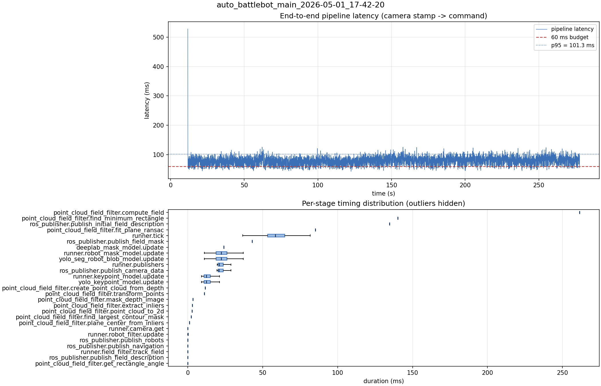

# Latency report: auto_battlebot_main_2026-05-01_17-42-20

- Source: `data/recordings/auto_battlebot_main_2026-05-01_17-42-20.mcap`
- Generated: 2026-07-23 23:00 by `scripts/mcap_latency_report.py`
- Duration: 277.7 s
- Loop rate: 17.2 Hz mean
- End-to-end latency: mean 77.5 ms / p95 101.3 ms / max 528.4 ms
- Budget: 60 ms -> p95 is OVER BUDGET

| Stage | n | mean (ms) | median (ms) | p95 (ms) | max (ms) | % of tick |
| --- | ---: | ---: | ---: | ---: | ---: | ---: |
| point_cloud_field_filter.compute_field | 1 | 261.48 | 261.48 | 261.48 | 261.48 | 442.7% |
| point_cloud_field_filter.find_minimum_rectangle | 1 | 140.11 | 140.11 | 140.11 | 140.11 | 237.2% |
| ros_publisher.publish_initial_field_description | 1 | 134.68 | 134.68 | 134.68 | 134.68 | 228.0% |
| point_cloud_field_filter.fit_plane_ransac | 1 | 85.20 | 85.20 | 85.20 | 85.20 | 144.2% |
| pipeline.latency | 4,380 | 77.55 | 77.61 | 101.31 | 528.39 | - |
| runner.tick | 4,642 | 59.07 | 58.44 | 74.21 | 589.49 | 100.0% |
| ros_publisher.publish_field_mask | 1 | 42.99 | 42.99 | 42.99 | 42.99 | 72.8% |
| deeplab_mask_model.update | 1 | 24.09 | 24.09 | 24.09 | 24.09 | 40.8% |
| runner.robot_mask_model.update | 4,380 | 22.83 | 22.29 | 32.64 | 58.63 | 38.6% |
| yolo_seg_robot_blob_model.update | 4,380 | 22.81 | 22.28 | 32.59 | 58.61 | 38.6% |
| runner.publishers | 4,380 | 22.37 | 20.91 | 29.01 | 40.69 | 37.9% |
| ros_publisher.publish_camera_data | 4,642 | 22.33 | 20.87 | 29.13 | 42.70 | 37.8% |
| runner.keypoint_model.update | 4,380 | 13.33 | 12.46 | 19.46 | 34.70 | 22.6% |
| yolo_keypoint_model.update | 4,380 | 13.33 | 12.46 | 19.45 | 34.69 | 22.6% |
| point_cloud_field_filter.create_point_cloud_from_depth | 1 | 11.68 | 11.68 | 11.68 | 11.68 | 19.8% |
| point_cloud_field_filter.transform_points | 1 | 11.13 | 11.13 | 11.13 | 11.13 | 18.8% |
| point_cloud_field_filter.mask_depth_image | 1 | 3.37 | 3.37 | 3.37 | 3.37 | 5.7% |
| point_cloud_field_filter.extract_inliers | 1 | 2.96 | 2.96 | 2.96 | 2.96 | 5.0% |
| point_cloud_field_filter.point_cloud_to_2d | 1 | 2.90 | 2.90 | 2.90 | 2.90 | 4.9% |
| point_cloud_field_filter.find_largest_contour_mask | 1 | 2.34 | 2.34 | 2.34 | 2.34 | 4.0% |
| point_cloud_field_filter.plane_center_from_inliers | 1 | 1.14 | 1.14 | 1.14 | 1.14 | 1.9% |
| runner.camera.get | 4,642 | 1.04 | 0.01 | 8.46 | 62.57 | 1.8% |
| runner.robot_filter.update | 4,380 | 0.13 | 0.12 | 0.17 | 3.32 | 0.2% |
| ros_publisher.publish_robots | 4,380 | 0.08 | 0.06 | 0.12 | 4.39 | 0.1% |
| ros_publisher.publish_navigation | 4,380 | 0.04 | 0.03 | 0.09 | 3.39 | 0.1% |
| runner.field_filter.track_field | 4,380 | 0.01 | 0.01 | 0.02 | 2.10 | 0.0% |
| ros_publisher.publish_field_description | 4,380 | 0.01 | 0.01 | 0.01 | 1.04 | 0.0% |
| point_cloud_field_filter.get_rectangle_angle | 1 | 0.01 | 0.01 | 0.01 | 0.01 | 0.0% |

