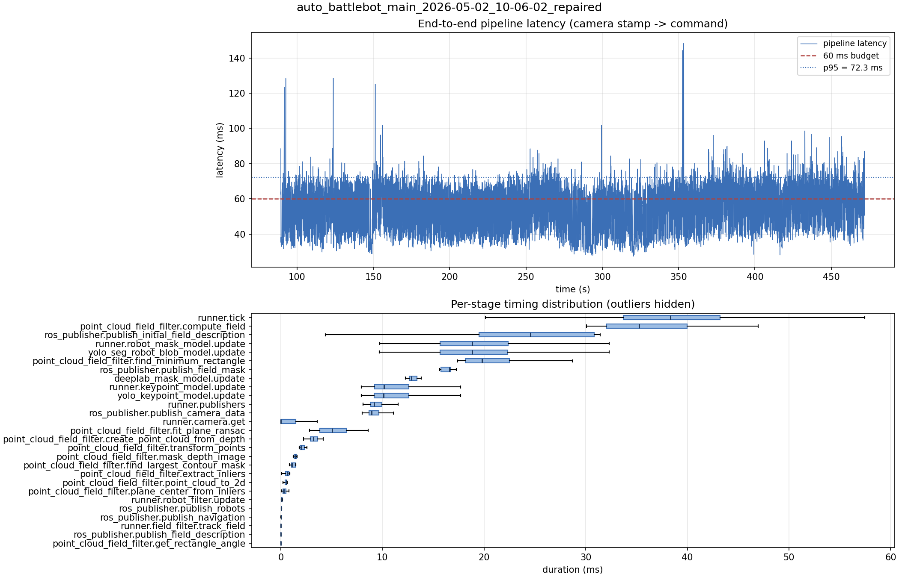

# Latency report: auto_battlebot_main_2026-05-02_10-06-02_repaired

- Source: `data/recordings/auto_battlebot_main_2026-05-02_10-06-02_repaired.mcap`
- Generated: 2026-07-23 23:00 by `scripts/mcap_latency_report.py`
- Duration: 472.0 s
- Loop rate: 25.7 Hz mean
- End-to-end latency: mean 53.8 ms / p95 72.3 ms / max 148.3 ms
- Budget: 60 ms -> p95 is OVER BUDGET

| Stage | n | mean (ms) | median (ms) | p95 (ms) | max (ms) | % of tick |
| --- | ---: | ---: | ---: | ---: | ---: | ---: |
| pipeline.latency | 9,159 | 53.77 | 54.44 | 72.25 | 148.34 | - |
| runner.tick | 11,826 | 39.22 | 38.31 | 51.06 | 210.99 | 100.0% |
| point_cloud_field_filter.compute_field | 7 | 34.05 | 35.24 | 46.17 | 46.97 | 86.8% |
| ros_publisher.publish_initial_field_description | 7 | 23.00 | 24.54 | 31.26 | 31.41 | 58.6% |
| runner.robot_mask_model.update | 9,159 | 19.38 | 18.85 | 28.28 | 45.14 | 49.4% |
| yolo_seg_robot_blob_model.update | 9,159 | 19.36 | 18.84 | 28.27 | 45.12 | 49.4% |
| point_cloud_field_filter.find_minimum_rectangle | 7 | 18.96 | 19.80 | 27.20 | 28.68 | 48.3% |
| ros_publisher.publish_field_mask | 7 | 16.35 | 16.61 | 17.12 | 17.28 | 41.7% |
| deeplab_mask_model.update | 7 | 13.38 | 12.84 | 15.68 | 16.48 | 34.1% |
| runner.keypoint_model.update | 9,159 | 11.15 | 10.14 | 16.24 | 32.53 | 28.4% |
| yolo_keypoint_model.update | 9,159 | 11.14 | 10.13 | 16.23 | 32.53 | 28.4% |
| runner.publishers | 9,159 | 9.70 | 9.20 | 12.84 | 20.56 | 24.7% |
| ros_publisher.publish_camera_data | 11,826 | 9.40 | 8.92 | 12.28 | 20.48 | 24.0% |
| runner.camera.get | 11,826 | 5.38 | 0.01 | 24.54 | 67.98 | 13.7% |
| point_cloud_field_filter.fit_plane_ransac | 7 | 5.30 | 5.06 | 8.27 | 8.58 | 13.5% |
| point_cloud_field_filter.create_point_cloud_from_depth | 7 | 3.23 | 3.20 | 4.01 | 4.16 | 8.2% |
| point_cloud_field_filter.transform_points | 7 | 2.01 | 2.02 | 3.03 | 3.22 | 5.1% |
| point_cloud_field_filter.mask_depth_image | 7 | 1.49 | 1.42 | 1.90 | 2.02 | 3.8% |
| point_cloud_field_filter.find_largest_contour_mask | 7 | 1.20 | 1.11 | 1.47 | 1.49 | 3.1% |
| point_cloud_field_filter.extract_inliers | 7 | 0.60 | 0.64 | 0.87 | 0.89 | 1.5% |
| point_cloud_field_filter.point_cloud_to_2d | 7 | 0.49 | 0.55 | 0.63 | 0.64 | 1.2% |
| point_cloud_field_filter.plane_center_from_inliers | 7 | 0.38 | 0.28 | 0.79 | 0.81 | 1.0% |
| runner.robot_filter.update | 9,159 | 0.11 | 0.10 | 0.15 | 4.30 | 0.3% |
| ros_publisher.publish_robots | 9,159 | 0.08 | 0.06 | 0.12 | 3.83 | 0.2% |
| ros_publisher.publish_navigation | 9,159 | 0.05 | 0.03 | 0.10 | 2.70 | 0.1% |
| runner.field_filter.track_field | 9,159 | 0.01 | 0.01 | 0.02 | 5.14 | 0.0% |
| ros_publisher.publish_field_description | 9,159 | 0.01 | 0.01 | 0.01 | 4.67 | 0.0% |
| point_cloud_field_filter.get_rectangle_angle | 7 | 0.00 | 0.00 | 0.01 | 0.01 | 0.0% |

