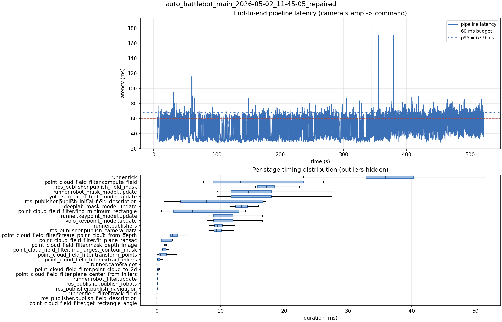

# Latency report: auto_battlebot_main_2026-05-02_11-45-05_repaired

- Source: `data/recordings/auto_battlebot_main_2026-05-02_11-45-05_repaired.mcap`
- Generated: 2026-07-23 23:00 by `scripts/mcap_latency_report.py`
- Duration: 522.5 s
- Loop rate: 26.8 Hz mean
- End-to-end latency: mean 48.0 ms / p95 67.9 ms / max 185.4 ms
- Budget: 60 ms -> p95 is OVER BUDGET

| Stage | n | mean (ms) | median (ms) | p95 (ms) | max (ms) | % of tick |
| --- | ---: | ---: | ---: | ---: | ---: | ---: |
| pipeline.latency | 13,586 | 47.98 | 47.96 | 67.91 | 185.44 | - |
| runner.tick | 13,719 | 37.23 | 35.92 | 48.20 | 250.80 | 100.0% |
| point_cloud_field_filter.compute_field | 16 | 22.72 | 13.13 | 65.93 | 72.15 | 61.0% |
| ros_publisher.publish_field_mask | 16 | 17.68 | 17.19 | 21.93 | 22.38 | 47.5% |
| runner.robot_mask_model.update | 13,586 | 15.45 | 14.32 | 24.44 | 44.60 | 41.5% |
| yolo_seg_robot_blob_model.update | 13,586 | 15.43 | 14.30 | 24.42 | 44.59 | 41.5% |
| ros_publisher.publish_initial_field_description | 16 | 14.07 | 7.74 | 45.33 | 46.10 | 37.8% |
| deeplab_mask_model.update | 16 | 13.60 | 13.30 | 16.26 | 17.18 | 36.5% |
| point_cloud_field_filter.find_minimum_rectangle | 16 | 11.97 | 5.58 | 41.82 | 44.30 | 32.2% |
| runner.keypoint_model.update | 13,586 | 10.77 | 9.77 | 16.02 | 26.80 | 28.9% |
| yolo_keypoint_model.update | 13,586 | 10.76 | 9.76 | 16.02 | 26.79 | 28.9% |
| runner.publishers | 13,586 | 9.92 | 9.47 | 12.89 | 22.48 | 26.6% |
| ros_publisher.publish_camera_data | 13,719 | 9.81 | 9.37 | 12.75 | 25.91 | 26.4% |
| point_cloud_field_filter.create_point_cloud_from_depth | 16 | 2.84 | 2.44 | 4.35 | 4.61 | 7.6% |
| point_cloud_field_filter.fit_plane_ransac | 16 | 2.63 | 1.27 | 9.55 | 10.00 | 7.1% |
| point_cloud_field_filter.mask_depth_image | 16 | 1.35 | 1.32 | 1.55 | 1.70 | 3.6% |
| point_cloud_field_filter.find_largest_contour_mask | 16 | 1.20 | 1.11 | 1.85 | 1.89 | 3.2% |
| point_cloud_field_filter.transform_points | 16 | 1.18 | 0.61 | 3.71 | 4.33 | 3.2% |
| point_cloud_field_filter.extract_inliers | 16 | 0.60 | 0.15 | 2.20 | 5.09 | 1.6% |
| runner.camera.get | 13,719 | 0.53 | 0.01 | 2.43 | 67.41 | 1.4% |
| point_cloud_field_filter.point_cloud_to_2d | 16 | 0.32 | 0.21 | 0.89 | 0.90 | 0.9% |
| point_cloud_field_filter.plane_center_from_inliers | 16 | 0.16 | 0.10 | 0.51 | 0.54 | 0.4% |
| runner.robot_filter.update | 13,586 | 0.09 | 0.08 | 0.13 | 6.56 | 0.2% |
| ros_publisher.publish_robots | 13,586 | 0.07 | 0.05 | 0.12 | 5.34 | 0.2% |
| ros_publisher.publish_navigation | 13,586 | 0.04 | 0.03 | 0.08 | 24.74 | 0.1% |
| runner.field_filter.track_field | 13,586 | 0.01 | 0.01 | 0.02 | 3.21 | 0.0% |
| ros_publisher.publish_field_description | 13,586 | 0.01 | 0.01 | 0.01 | 0.93 | 0.0% |
| point_cloud_field_filter.get_rectangle_angle | 16 | 0.00 | 0.00 | 0.01 | 0.01 | 0.0% |

