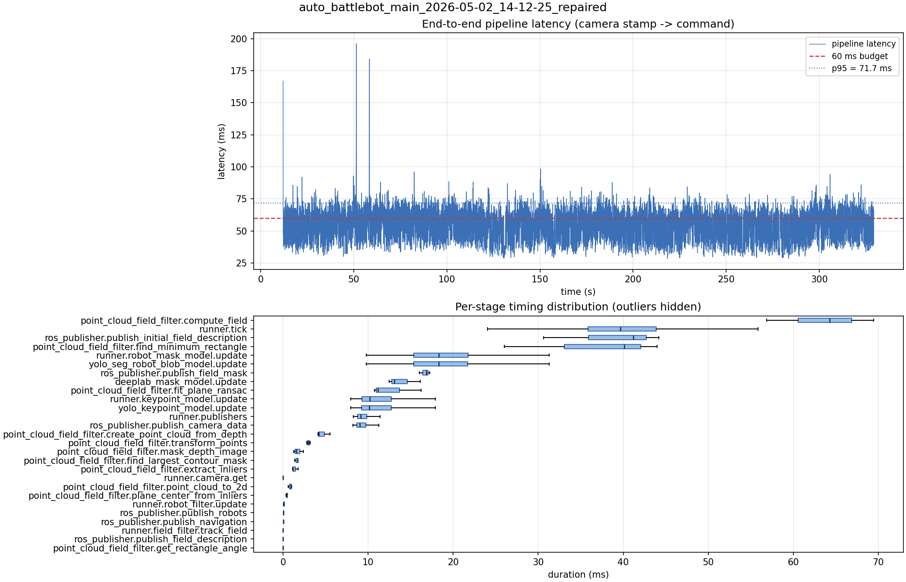

# Latency report: auto_battlebot_main_2026-05-02_14-12-25_repaired

- Source: `data/recordings/auto_battlebot_main_2026-05-02_14-12-25_repaired.mcap`
- Generated: 2026-07-23 23:00 by `scripts/mcap_latency_report.py`
- Duration: 329.2 s
- Loop rate: 24.9 Hz mean
- End-to-end latency: mean 53.3 ms / p95 71.7 ms / max 196.1 ms
- Budget: 60 ms -> p95 is OVER BUDGET

| Stage | n | mean (ms) | median (ms) | p95 (ms) | max (ms) | % of tick |
| --- | ---: | ---: | ---: | ---: | ---: | ---: |
| point_cloud_field_filter.compute_field | 3 | 63.54 | 64.29 | 68.95 | 69.47 | 157.8% |
| pipeline.latency | 7,688 | 53.31 | 53.84 | 71.74 | 196.12 | - |
| runner.tick | 8,031 | 40.27 | 39.68 | 50.85 | 227.75 | 100.0% |
| ros_publisher.publish_initial_field_description | 3 | 38.68 | 41.17 | 43.90 | 44.21 | 96.1% |
| point_cloud_field_filter.find_minimum_rectangle | 3 | 36.71 | 40.13 | 43.58 | 43.96 | 91.2% |
| runner.robot_mask_model.update | 7,688 | 18.85 | 18.31 | 27.44 | 44.86 | 46.8% |
| yolo_seg_robot_blob_model.update | 7,688 | 18.83 | 18.29 | 27.43 | 44.85 | 46.8% |
| ros_publisher.publish_field_mask | 3 | 16.69 | 16.82 | 17.20 | 17.24 | 41.4% |
| deeplab_mask_model.update | 3 | 13.91 | 13.09 | 15.84 | 16.14 | 34.5% |
| point_cloud_field_filter.fit_plane_ransac | 3 | 12.73 | 11.18 | 15.73 | 16.24 | 31.6% |
| runner.keypoint_model.update | 7,688 | 11.17 | 10.17 | 16.18 | 32.88 | 27.7% |
| yolo_keypoint_model.update | 7,688 | 11.17 | 10.16 | 16.18 | 32.88 | 27.7% |
| runner.publishers | 7,688 | 9.62 | 9.14 | 12.60 | 26.03 | 23.9% |
| ros_publisher.publish_camera_data | 8,031 | 9.53 | 9.03 | 12.55 | 25.94 | 23.7% |
| point_cloud_field_filter.create_point_cloud_from_depth | 3 | 4.61 | 4.18 | 5.39 | 5.52 | 11.4% |
| point_cloud_field_filter.transform_points | 3 | 2.98 | 2.94 | 3.17 | 3.20 | 7.4% |
| point_cloud_field_filter.mask_depth_image | 3 | 1.73 | 1.57 | 2.29 | 2.37 | 4.3% |
| point_cloud_field_filter.find_largest_contour_mask | 3 | 1.60 | 1.73 | 1.74 | 1.74 | 4.0% |
| point_cloud_field_filter.extract_inliers | 3 | 1.35 | 1.18 | 1.70 | 1.76 | 3.4% |
| runner.camera.get | 8,031 | 1.04 | 0.01 | 3.18 | 61.91 | 2.6% |
| point_cloud_field_filter.point_cloud_to_2d | 3 | 0.83 | 0.89 | 0.98 | 0.99 | 2.1% |
| point_cloud_field_filter.plane_center_from_inliers | 3 | 0.44 | 0.47 | 0.50 | 0.51 | 1.1% |
| runner.robot_filter.update | 7,688 | 0.12 | 0.11 | 0.16 | 5.09 | 0.3% |
| ros_publisher.publish_robots | 7,688 | 0.08 | 0.06 | 0.12 | 5.66 | 0.2% |
| ros_publisher.publish_navigation | 7,688 | 0.05 | 0.03 | 0.10 | 4.49 | 0.1% |
| runner.field_filter.track_field | 7,688 | 0.01 | 0.01 | 0.02 | 5.25 | 0.0% |
| ros_publisher.publish_field_description | 7,688 | 0.01 | 0.01 | 0.01 | 0.84 | 0.0% |
| point_cloud_field_filter.get_rectangle_angle | 3 | 0.00 | 0.01 | 0.01 | 0.01 | 0.0% |

