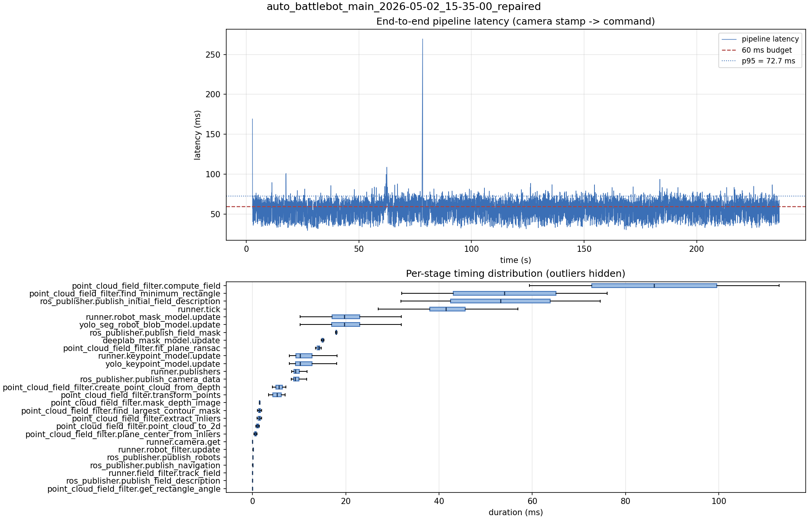

# Latency report: auto_battlebot_main_2026-05-02_15-35-00_repaired

- Source: `data/recordings/auto_battlebot_main_2026-05-02_15-35-00_repaired.mcap`
- Generated: 2026-07-23 23:00 by `scripts/mcap_latency_report.py`
- Duration: 236.6 s
- Loop rate: 23.8 Hz mean
- End-to-end latency: mean 55.3 ms / p95 72.7 ms / max 269.4 ms
- Budget: 60 ms -> p95 is OVER BUDGET

| Stage | n | mean (ms) | median (ms) | p95 (ms) | max (ms) | % of tick |
| --- | ---: | ---: | ---: | ---: | ---: | ---: |
| point_cloud_field_filter.compute_field | 2 | 86.16 | 86.16 | 110.28 | 112.96 | 204.5% |
| pipeline.latency | 5,464 | 55.33 | 55.75 | 72.72 | 269.40 | - |
| point_cloud_field_filter.find_minimum_rectangle | 2 | 54.04 | 54.04 | 73.86 | 76.06 | 128.3% |
| ros_publisher.publish_initial_field_description | 2 | 53.18 | 53.18 | 72.42 | 74.55 | 126.3% |
| runner.tick | 5,531 | 42.12 | 41.48 | 51.74 | 314.05 | 100.0% |
| runner.robot_mask_model.update | 5,464 | 20.27 | 19.69 | 28.03 | 53.52 | 48.1% |
| yolo_seg_robot_blob_model.update | 5,464 | 20.26 | 19.68 | 28.02 | 53.51 | 48.1% |
| ros_publisher.publish_field_mask | 2 | 17.98 | 17.98 | 18.14 | 18.16 | 42.7% |
| deeplab_mask_model.update | 2 | 15.06 | 15.06 | 15.32 | 15.35 | 35.8% |
| point_cloud_field_filter.fit_plane_ransac | 2 | 14.14 | 14.14 | 14.71 | 14.78 | 33.6% |
| runner.keypoint_model.update | 5,464 | 11.25 | 10.26 | 16.35 | 34.02 | 26.7% |
| yolo_keypoint_model.update | 5,464 | 11.24 | 10.25 | 16.34 | 34.02 | 26.7% |
| runner.publishers | 5,464 | 9.79 | 9.24 | 12.97 | 22.60 | 23.2% |
| ros_publisher.publish_camera_data | 5,531 | 9.69 | 9.13 | 12.94 | 22.56 | 23.0% |
| point_cloud_field_filter.create_point_cloud_from_depth | 2 | 5.72 | 5.72 | 7.01 | 7.15 | 13.6% |
| point_cloud_field_filter.transform_points | 2 | 5.27 | 5.27 | 6.86 | 7.04 | 12.5% |
| point_cloud_field_filter.mask_depth_image | 2 | 1.53 | 1.53 | 1.59 | 1.59 | 3.6% |
| point_cloud_field_filter.find_largest_contour_mask | 2 | 1.51 | 1.51 | 1.94 | 1.99 | 3.6% |
| point_cloud_field_filter.extract_inliers | 2 | 1.49 | 1.49 | 1.94 | 1.99 | 3.5% |
| point_cloud_field_filter.point_cloud_to_2d | 2 | 1.09 | 1.09 | 1.43 | 1.47 | 2.6% |
| point_cloud_field_filter.plane_center_from_inliers | 2 | 0.65 | 0.65 | 0.92 | 0.95 | 1.6% |
| runner.camera.get | 5,531 | 0.32 | 0.01 | 0.06 | 56.16 | 0.8% |
| runner.robot_filter.update | 5,464 | 0.13 | 0.12 | 0.17 | 5.33 | 0.3% |
| ros_publisher.publish_robots | 5,464 | 0.07 | 0.06 | 0.12 | 3.22 | 0.2% |
| ros_publisher.publish_navigation | 5,464 | 0.05 | 0.03 | 0.10 | 3.40 | 0.1% |
| runner.field_filter.track_field | 5,464 | 0.01 | 0.01 | 0.02 | 2.77 | 0.0% |
| ros_publisher.publish_field_description | 5,464 | 0.01 | 0.01 | 0.01 | 2.87 | 0.0% |
| point_cloud_field_filter.get_rectangle_angle | 2 | 0.00 | 0.00 | 0.00 | 0.01 | 0.0% |

