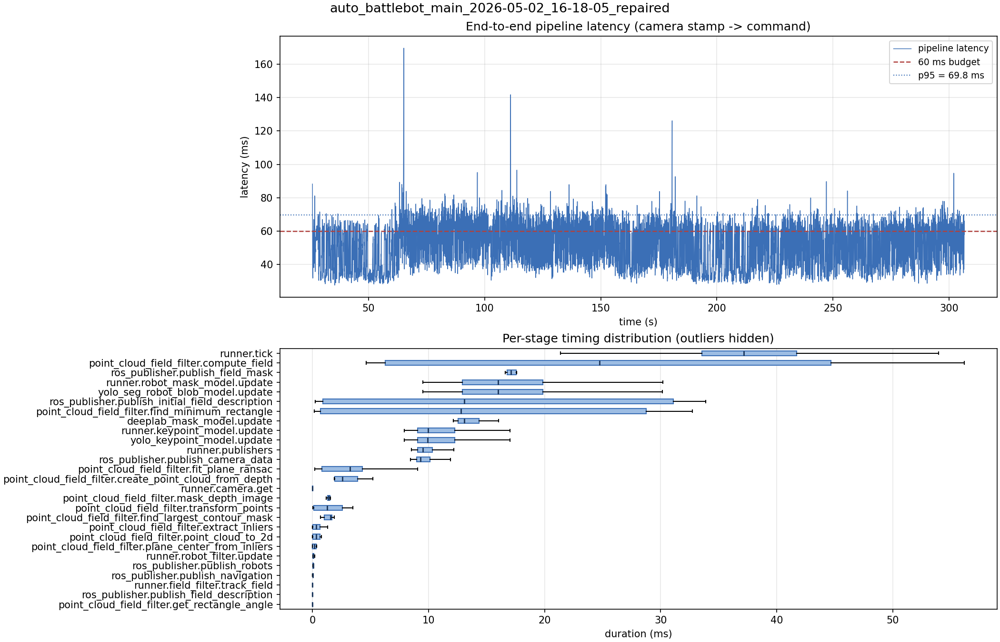

# Latency report: auto_battlebot_main_2026-05-02_16-18-05_repaired

- Source: `data/recordings/auto_battlebot_main_2026-05-02_16-18-05_repaired.mcap`
- Generated: 2026-07-23 23:00 by `scripts/mcap_latency_report.py`
- Duration: 306.6 s
- Loop rate: 26.3 Hz mean
- End-to-end latency: mean 50.4 ms / p95 69.8 ms / max 169.6 ms
- Budget: 60 ms -> p95 is OVER BUDGET

| Stage | n | mean (ms) | median (ms) | p95 (ms) | max (ms) | % of tick |
| --- | ---: | ---: | ---: | ---: | ---: | ---: |
| pipeline.latency | 7,108 | 50.41 | 51.03 | 69.81 | 169.63 | - |
| runner.tick | 7,870 | 38.12 | 37.17 | 49.04 | 210.27 | 100.0% |
| point_cloud_field_filter.compute_field | 6 | 26.95 | 24.71 | 53.66 | 56.16 | 70.7% |
| ros_publisher.publish_field_mask | 6 | 18.51 | 17.10 | 23.80 | 25.86 | 48.5% |
| runner.robot_mask_model.update | 7,108 | 16.78 | 16.00 | 25.82 | 44.93 | 44.0% |
| yolo_seg_robot_blob_model.update | 7,108 | 16.77 | 15.98 | 25.81 | 44.92 | 44.0% |
| ros_publisher.publish_initial_field_description | 6 | 15.69 | 13.07 | 33.66 | 33.87 | 41.2% |
| point_cloud_field_filter.find_minimum_rectangle | 6 | 14.87 | 12.80 | 32.08 | 32.75 | 39.0% |
| deeplab_mask_model.update | 6 | 13.57 | 13.07 | 15.70 | 16.05 | 35.6% |
| runner.keypoint_model.update | 7,108 | 10.94 | 9.94 | 16.00 | 29.38 | 28.7% |
| yolo_keypoint_model.update | 7,108 | 10.93 | 9.94 | 16.00 | 29.38 | 28.7% |
| runner.publishers | 7,108 | 10.01 | 9.50 | 13.22 | 35.10 | 26.3% |
| ros_publisher.publish_camera_data | 7,870 | 9.86 | 9.32 | 13.06 | 23.27 | 25.9% |
| point_cloud_field_filter.fit_plane_ransac | 6 | 3.40 | 3.25 | 7.91 | 9.05 | 8.9% |
| point_cloud_field_filter.create_point_cloud_from_depth | 6 | 3.05 | 2.59 | 4.93 | 5.19 | 8.0% |
| runner.camera.get | 7,870 | 2.32 | 0.01 | 22.65 | 68.56 | 6.1% |
| point_cloud_field_filter.mask_depth_image | 6 | 1.49 | 1.38 | 2.00 | 2.15 | 3.9% |
| point_cloud_field_filter.transform_points | 6 | 1.46 | 1.25 | 3.27 | 3.47 | 3.8% |
| point_cloud_field_filter.find_largest_contour_mask | 6 | 1.37 | 1.55 | 1.83 | 1.87 | 3.6% |
| point_cloud_field_filter.extract_inliers | 6 | 0.44 | 0.33 | 1.14 | 1.30 | 1.2% |
| point_cloud_field_filter.point_cloud_to_2d | 6 | 0.36 | 0.32 | 0.75 | 0.77 | 0.9% |
| point_cloud_field_filter.plane_center_from_inliers | 6 | 0.18 | 0.17 | 0.36 | 0.37 | 0.5% |
| runner.robot_filter.update | 7,108 | 0.10 | 0.09 | 0.14 | 4.79 | 0.3% |
| ros_publisher.publish_robots | 7,108 | 0.07 | 0.06 | 0.12 | 24.93 | 0.2% |
| ros_publisher.publish_navigation | 7,108 | 0.05 | 0.03 | 0.10 | 3.49 | 0.1% |
| runner.field_filter.track_field | 7,108 | 0.01 | 0.01 | 0.02 | 1.70 | 0.0% |
| ros_publisher.publish_field_description | 7,108 | 0.01 | 0.01 | 0.01 | 2.18 | 0.0% |
| point_cloud_field_filter.get_rectangle_angle | 6 | 0.00 | 0.00 | 0.01 | 0.01 | 0.0% |

