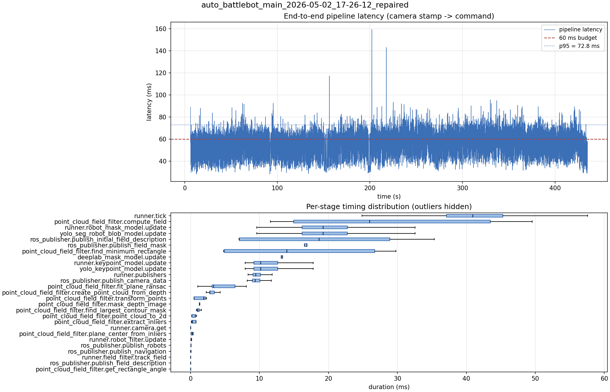

# Latency report: auto_battlebot_main_2026-05-02_17-26-12_repaired

- Source: `data/recordings/auto_battlebot_main_2026-05-02_17-26-12_repaired.mcap`
- Generated: 2026-07-23 23:00 by `scripts/mcap_latency_report.py`
- Duration: 435.1 s
- Loop rate: 24.3 Hz mean
- End-to-end latency: mean 54.3 ms / p95 72.8 ms / max 159.4 ms
- Budget: 60 ms -> p95 is OVER BUDGET

| Stage | n | mean (ms) | median (ms) | p95 (ms) | max (ms) | % of tick |
| --- | ---: | ---: | ---: | ---: | ---: | ---: |
| pipeline.latency | 10,142 | 54.30 | 54.89 | 72.84 | 159.37 | - |
| runner.tick | 10,305 | 41.52 | 40.88 | 52.65 | 211.73 | 100.0% |
| point_cloud_field_filter.compute_field | 5 | 29.11 | 25.95 | 48.33 | 49.54 | 70.1% |
| runner.robot_mask_model.update | 10,142 | 19.72 | 19.22 | 28.65 | 44.38 | 47.5% |
| yolo_seg_robot_blob_model.update | 10,142 | 19.71 | 19.21 | 28.63 | 44.36 | 47.5% |
| ros_publisher.publish_initial_field_description | 5 | 19.39 | 18.64 | 34.05 | 35.35 | 46.7% |
| ros_publisher.publish_field_mask | 5 | 16.98 | 16.83 | 18.48 | 18.88 | 40.9% |
| point_cloud_field_filter.find_minimum_rectangle | 5 | 16.02 | 13.94 | 29.16 | 29.77 | 38.6% |
| deeplab_mask_model.update | 5 | 13.88 | 13.16 | 16.41 | 17.17 | 33.4% |
| runner.keypoint_model.update | 10,142 | 11.14 | 10.15 | 16.20 | 32.54 | 26.8% |
| yolo_keypoint_model.update | 10,142 | 11.13 | 10.15 | 16.19 | 32.53 | 26.8% |
| runner.publishers | 10,142 | 9.94 | 9.45 | 13.15 | 23.83 | 23.9% |
| ros_publisher.publish_camera_data | 10,305 | 9.85 | 9.34 | 13.05 | 35.00 | 23.7% |
| point_cloud_field_filter.fit_plane_ransac | 5 | 4.41 | 3.33 | 7.76 | 8.10 | 10.6% |
| point_cloud_field_filter.create_point_cloud_from_depth | 5 | 3.11 | 2.78 | 4.12 | 4.28 | 7.5% |
| point_cloud_field_filter.transform_points | 5 | 1.47 | 1.89 | 2.29 | 2.33 | 3.5% |
| point_cloud_field_filter.mask_depth_image | 5 | 1.32 | 1.28 | 1.44 | 1.46 | 3.2% |
| point_cloud_field_filter.find_largest_contour_mask | 5 | 1.13 | 1.00 | 1.51 | 1.58 | 2.7% |
| point_cloud_field_filter.point_cloud_to_2d | 5 | 0.53 | 0.67 | 0.86 | 0.90 | 1.3% |
| point_cloud_field_filter.extract_inliers | 5 | 0.43 | 0.27 | 0.81 | 0.81 | 1.0% |
| runner.camera.get | 10,305 | 0.41 | 0.01 | 0.92 | 65.95 | 1.0% |
| point_cloud_field_filter.plane_center_from_inliers | 5 | 0.24 | 0.23 | 0.39 | 0.39 | 0.6% |
| runner.robot_filter.update | 10,142 | 0.12 | 0.11 | 0.16 | 6.03 | 0.3% |
| ros_publisher.publish_robots | 10,142 | 0.07 | 0.06 | 0.12 | 4.76 | 0.2% |
| ros_publisher.publish_navigation | 10,142 | 0.05 | 0.03 | 0.09 | 4.46 | 0.1% |
| runner.field_filter.track_field | 10,142 | 0.01 | 0.01 | 0.01 | 0.67 | 0.0% |
| ros_publisher.publish_field_description | 10,142 | 0.01 | 0.01 | 0.01 | 0.81 | 0.0% |
| point_cloud_field_filter.get_rectangle_angle | 5 | 0.00 | 0.00 | 0.00 | 0.01 | 0.0% |

