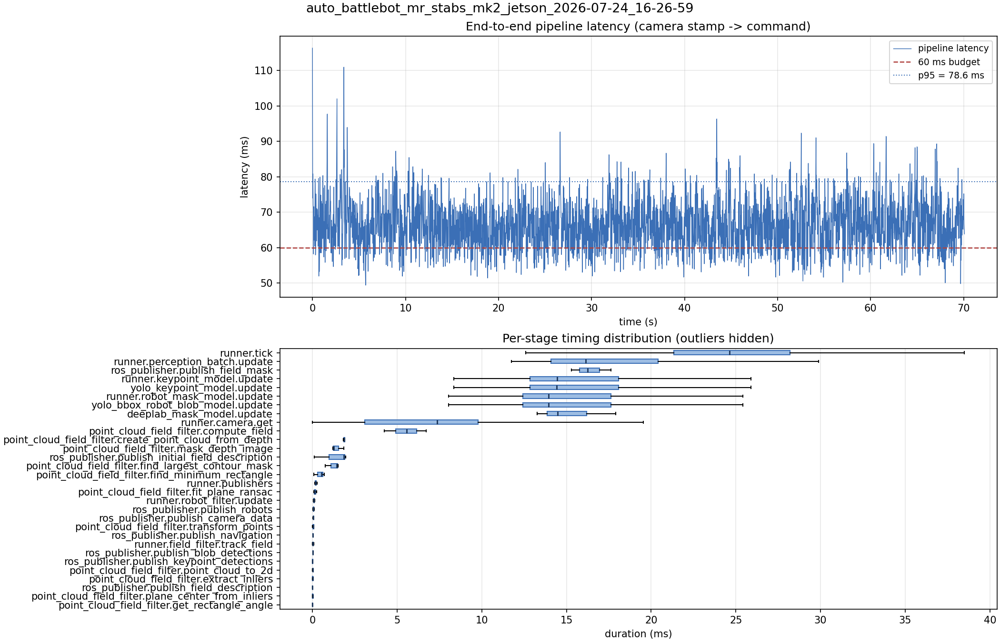

# Latency report: auto_battlebot_mr_stabs_mk2_jetson_2026-07-24_16-26-59

ZED 720p 60 FPS, max loop rate 120 Hz.

- Source: `/home/ben/Desktop/auto_battlebot_mr_stabs_mk2_jetson_2026-07-24_16-26-59.mcap`
- Generated: 2026-07-24 16:28 by `scripts/mcap_latency_report.py`
- Duration: 70.1 s
- Window: after field init (9.0 s into the recording)
- Loop rate: 41.4 Hz mean
- End-to-end latency: mean 66.4 ms / p95 78.6 ms / max 116.3 ms
- Budget: 60 ms -> p95 is OVER BUDGET

| Stage | n | mean (ms) | median (ms) | p95 (ms) | max (ms) | % of tick |
| --- | ---: | ---: | ---: | ---: | ---: | ---: |
| pipeline.latency | 2,765 | 66.43 | 66.12 | 78.65 | 116.30 | - |
| runner.tick | 2,765 | 24.99 | 24.62 | 34.73 | 121.62 | 100.0% |
| runner.perception_batch.update | 2,765 | 17.58 | 16.14 | 25.72 | 40.96 | 70.4% |
| ros_publisher.publish_field_mask | 3 | 16.39 | 16.24 | 17.50 | 17.64 | 65.6% |
| runner.keypoint_model.update | 2,765 | 15.81 | 14.44 | 24.38 | 38.95 | 63.3% |
| yolo_keypoint_model.update | 2,765 | 15.81 | 14.43 | 24.37 | 38.95 | 63.3% |
| runner.robot_mask_model.update | 2,765 | 15.34 | 13.95 | 23.88 | 39.76 | 61.4% |
| yolo_bbox_robot_blob_model.update | 2,765 | 15.33 | 13.95 | 23.87 | 39.75 | 61.4% |
| deeplab_mask_model.update | 3 | 15.22 | 14.46 | 17.57 | 17.92 | 60.9% |
| runner.camera.get | 2,765 | 6.56 | 7.37 | 13.34 | 46.66 | 26.3% |
| point_cloud_field_filter.compute_field | 3 | 5.51 | 5.57 | 6.60 | 6.72 | 22.0% |
| point_cloud_field_filter.create_point_cloud_from_depth | 3 | 1.87 | 1.89 | 1.92 | 1.92 | 7.5% |
| point_cloud_field_filter.mask_depth_image | 3 | 1.44 | 1.25 | 1.79 | 1.85 | 5.7% |
| ros_publisher.publish_initial_field_description | 3 | 1.32 | 1.86 | 1.96 | 1.97 | 5.3% |
| point_cloud_field_filter.find_largest_contour_mask | 3 | 1.23 | 1.43 | 1.51 | 1.52 | 4.9% |
| point_cloud_field_filter.find_minimum_rectangle | 3 | 0.44 | 0.53 | 0.68 | 0.69 | 1.7% |
| runner.publishers | 2,765 | 0.22 | 0.20 | 0.32 | 2.09 | 0.9% |
| point_cloud_field_filter.fit_plane_ransac | 3 | 0.15 | 0.14 | 0.24 | 0.25 | 0.6% |
| runner.robot_filter.update | 2,765 | 0.09 | 0.08 | 0.13 | 0.88 | 0.4% |
| ros_publisher.publish_robots | 2,765 | 0.06 | 0.05 | 0.09 | 1.41 | 0.2% |
| ros_publisher.publish_camera_data | 2,765 | 0.05 | 0.05 | 0.07 | 1.06 | 0.2% |
| point_cloud_field_filter.transform_points | 3 | 0.05 | 0.06 | 0.08 | 0.08 | 0.2% |
| ros_publisher.publish_navigation | 2,765 | 0.03 | 0.02 | 0.05 | 1.27 | 0.1% |
| runner.field_filter.track_field | 2,765 | 0.03 | 0.02 | 0.06 | 0.75 | 0.1% |
| ros_publisher.publish_blob_detections | 2,765 | 0.03 | 0.02 | 0.04 | 0.78 | 0.1% |
| ros_publisher.publish_keypoint_detections | 2,765 | 0.02 | 0.01 | 0.04 | 1.16 | 0.1% |
| point_cloud_field_filter.point_cloud_to_2d | 3 | 0.02 | 0.02 | 0.02 | 0.03 | 0.1% |
| point_cloud_field_filter.extract_inliers | 3 | 0.01 | 0.01 | 0.03 | 0.03 | 0.1% |
| ros_publisher.publish_field_description | 2,765 | 0.01 | 0.01 | 0.01 | 0.99 | 0.0% |
| point_cloud_field_filter.plane_center_from_inliers | 3 | 0.01 | 0.01 | 0.01 | 0.01 | 0.0% |
| point_cloud_field_filter.get_rectangle_angle | 3 | 0.00 | 0.00 | 0.00 | 0.00 | 0.0% |

