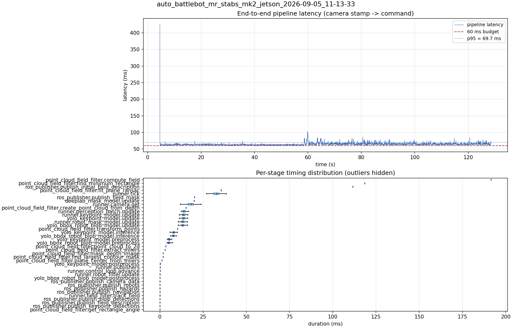

# Latency report: auto_battlebot_mr_stabs_mk2_jetson_2026-09-05_11-13-33

baseline: yolo26n_nhrl_robots_bbox_2class_mixed_2026-07-31_aarch64_sm87.engine

- Source: `/home/ben/auto-battlebot/data/recordings/auto_battlebot_mr_stabs_mk2_jetson_2026-09-05_11-13-33.mcap`
- Generated: 2026-09-05 11:33 by `scripts/mcap_latency_report.py`
- Duration: 128.5 s
- Loop rate: 30.6 Hz mean
- End-to-end latency: mean 64.5 ms / p95 69.7 ms / max 424.9 ms
- Budget: 60 ms -> p95 is OVER BUDGET

| Stage | n | mean (ms) | median (ms) | p95 (ms) | max (ms) | % of tick |
| --- | ---: | ---: | ---: | ---: | ---: | ---: |
| point_cloud_field_filter.compute_field | 1 | 191.58 | 191.58 | 191.58 | 191.58 | 585.2% |
| point_cloud_field_filter.find_minimum_rectangle | 1 | 118.45 | 118.45 | 118.45 | 118.45 | 361.8% |
| ros_publisher.publish_initial_field_description | 1 | 111.62 | 111.62 | 111.62 | 111.62 | 341.0% |
| pipeline.latency | 3,719 | 64.49 | 63.46 | 69.70 | 424.86 | - |
| point_cloud_field_filter.fit_plane_ransac | 1 | 35.41 | 35.41 | 35.41 | 35.41 | 108.2% |
| runner.tick | 3,839 | 32.74 | 32.82 | 37.37 | 405.89 | 100.0% |
| ros_publisher.publish_field_mask | 1 | 20.10 | 20.10 | 20.10 | 20.10 | 61.4% |
| deeplab_mask_model.update | 1 | 19.82 | 19.82 | 19.82 | 19.82 | 60.5% |
| runner.camera.get | 3,839 | 17.95 | 18.05 | 22.22 | 51.96 | 54.8% |
| point_cloud_field_filter.create_point_cloud_from_depth | 1 | 15.18 | 15.18 | 15.18 | 15.18 | 46.4% |
| runner.perception_batch.update | 3,719 | 14.27 | 13.93 | 16.67 | 35.13 | 43.6% |
| runner.keypoint_model.update | 3,719 | 13.92 | 13.66 | 15.99 | 35.04 | 42.5% |
| yolo_keypoint_model.update | 3,719 | 13.91 | 13.65 | 15.99 | 35.04 | 42.5% |
| runner.robot_mask_model.update | 3,719 | 13.41 | 13.16 | 15.49 | 30.58 | 41.0% |
| yolo_bbox_robot_blob_model.update | 3,719 | 13.41 | 13.16 | 15.48 | 30.57 | 41.0% |
| point_cloud_field_filter.transform_points | 1 | 10.20 | 10.20 | 10.20 | 10.20 | 31.2% |
| yolo_keypoint_model.inference | 3,719 | 8.16 | 8.00 | 9.82 | 28.43 | 24.9% |
| yolo_bbox_robot_blob_model.inference | 3,719 | 7.95 | 7.75 | 9.39 | 23.87 | 24.3% |
| yolo_keypoint_model.preprocess | 3,719 | 5.42 | 5.26 | 6.65 | 13.87 | 16.6% |
| yolo_bbox_robot_blob_model.preprocess | 3,719 | 5.32 | 5.16 | 6.67 | 17.36 | 16.3% |
| point_cloud_field_filter.point_cloud_to_2d | 1 | 3.44 | 3.44 | 3.44 | 3.44 | 10.5% |
| point_cloud_field_filter.extract_inliers | 1 | 3.08 | 3.08 | 3.08 | 3.08 | 9.4% |
| point_cloud_field_filter.mask_depth_image | 1 | 1.95 | 1.95 | 1.95 | 1.95 | 5.9% |
| point_cloud_field_filter.find_largest_contour_mask | 1 | 1.83 | 1.83 | 1.83 | 1.83 | 5.6% |
| point_cloud_field_filter.plane_center_from_inliers | 1 | 1.23 | 1.23 | 1.23 | 1.23 | 3.7% |
| yolo_keypoint_model.postprocess | 3,719 | 0.28 | 0.24 | 0.34 | 6.61 | 0.9% |
| runner.publishers | 3,719 | 0.26 | 0.24 | 0.31 | 3.73 | 0.8% |
| runner.control_loop.advance | 3,719 | 0.18 | 0.17 | 0.23 | 3.69 | 0.6% |
| runner.robot_filter.update | 3,719 | 0.13 | 0.12 | 0.16 | 3.48 | 0.4% |
| yolo_bbox_robot_blob_model.postprocess | 3,719 | 0.08 | 0.07 | 0.09 | 4.25 | 0.2% |
| ros_publisher.publish_camera_data | 3,839 | 0.07 | 0.06 | 0.08 | 0.96 | 0.2% |
| ros_publisher.publish_robots | 3,719 | 0.06 | 0.06 | 0.09 | 1.08 | 0.2% |
| ros_publisher.publish_hazards | 3,719 | 0.04 | 0.04 | 0.04 | 1.91 | 0.1% |
| ros_publisher.publish_navigation | 3,719 | 0.03 | 0.03 | 0.03 | 0.86 | 0.1% |
| runner.field_filter.track_field | 3,719 | 0.02 | 0.02 | 0.05 | 0.17 | 0.1% |
| ros_publisher.publish_blob_detections | 3,719 | 0.02 | 0.02 | 0.03 | 3.46 | 0.1% |
| ros_publisher.publish_field_description | 3,719 | 0.01 | 0.01 | 0.01 | 1.04 | 0.0% |
| ros_publisher.publish_keypoint_detections | 3,719 | 0.01 | 0.01 | 0.01 | 0.44 | 0.0% |
| point_cloud_field_filter.get_rectangle_angle | 1 | 0.01 | 0.01 | 0.01 | 0.01 | 0.0% |

