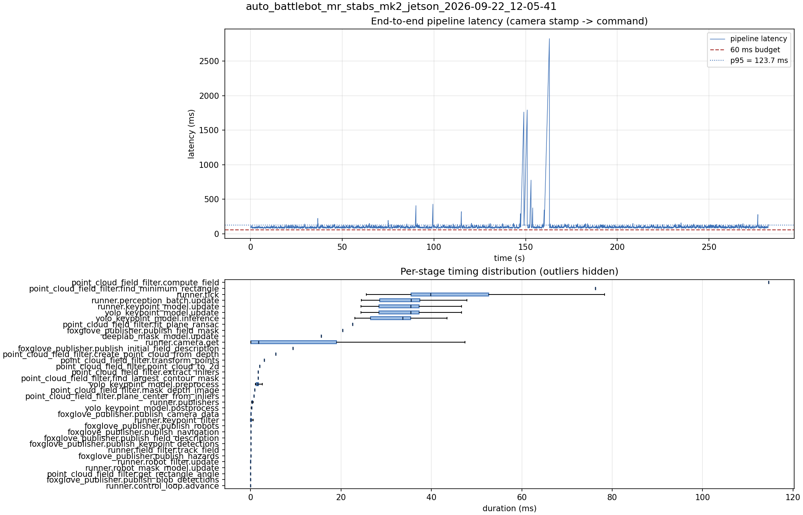

# Latency report: auto_battlebot_mr_stabs_mk2_jetson_2026-09-22_12-05-41

- Source: `/home/ben/auto-battlebot/data/recordings/auto_battlebot_mr_stabs_mk2_jetson_2026-09-22_12-05-41.mcap`
- Generated: 2026-09-22 12:14 by `scripts/mcap_latency_report.py`
- Duration: 282.5 s
- Window: after field init (3.8 s into the recording)
- Loop rate: 24.1 Hz mean
- End-to-end latency: mean 100.0 ms / p95 123.7 ms / max 2825.1 ms
- Budget: 60 ms -> p95 is OVER BUDGET

| Stage | n | mean (ms) | median (ms) | p95 (ms) | max (ms) | % of tick |
| --- | ---: | ---: | ---: | ---: | ---: | ---: |
| point_cloud_field_filter.compute_field | 1 | 114.57 | 114.57 | 114.57 | 114.57 | 250.1% |
| pipeline.latency | 6,062 | 100.02 | 96.57 | 123.70 | 2825.07 | - |
| point_cloud_field_filter.find_minimum_rectangle | 1 | 76.26 | 76.26 | 76.26 | 76.26 | 166.5% |
| runner.tick | 6,062 | 45.80 | 39.85 | 72.71 | 2815.47 | 100.0% |
| runner.perception_batch.update | 6,062 | 33.87 | 35.53 | 39.87 | 47.84 | 73.9% |
| runner.keypoint_model.update | 6,062 | 33.70 | 35.41 | 39.50 | 46.65 | 73.6% |
| yolo_keypoint_model.update | 6,062 | 33.70 | 35.40 | 39.50 | 46.65 | 73.6% |
| yolo_keypoint_model.inference | 6,062 | 31.82 | 33.61 | 37.05 | 43.43 | 69.5% |
| point_cloud_field_filter.fit_plane_ransac | 1 | 22.57 | 22.57 | 22.57 | 22.57 | 49.3% |
| foxglove_publisher.publish_field_mask | 1 | 20.39 | 20.39 | 20.39 | 20.39 | 44.5% |
| deeplab_mask_model.update | 1 | 15.62 | 15.62 | 15.62 | 15.62 | 34.1% |
| runner.camera.get | 6,062 | 11.02 | 1.71 | 38.14 | 2778.55 | 24.1% |
| foxglove_publisher.publish_initial_field_description | 1 | 9.33 | 9.33 | 9.33 | 9.33 | 20.4% |
| point_cloud_field_filter.create_point_cloud_from_depth | 1 | 5.53 | 5.53 | 5.53 | 5.53 | 12.1% |
| point_cloud_field_filter.transform_points | 1 | 3.02 | 3.02 | 3.02 | 3.02 | 6.6% |
| point_cloud_field_filter.point_cloud_to_2d | 1 | 1.96 | 1.96 | 1.96 | 1.96 | 4.3% |
| point_cloud_field_filter.extract_inliers | 1 | 1.66 | 1.66 | 1.66 | 1.66 | 3.6% |
| point_cloud_field_filter.find_largest_contour_mask | 1 | 1.63 | 1.63 | 1.63 | 1.63 | 3.6% |
| yolo_keypoint_model.preprocess | 6,062 | 1.61 | 1.45 | 2.61 | 6.95 | 3.5% |
| point_cloud_field_filter.mask_depth_image | 1 | 0.88 | 0.88 | 0.88 | 0.88 | 1.9% |
| point_cloud_field_filter.plane_center_from_inliers | 1 | 0.73 | 0.73 | 0.73 | 0.73 | 1.6% |
| runner.publishers | 6,062 | 0.34 | 0.32 | 0.46 | 5.34 | 0.7% |
| yolo_keypoint_model.postprocess | 6,062 | 0.22 | 0.19 | 0.36 | 4.96 | 0.5% |
| foxglove_publisher.publish_camera_data | 6,062 | 0.10 | 0.09 | 0.18 | 5.15 | 0.2% |
| runner.keypoint_filter | 6,062 | 0.09 | 0.00 | 0.26 | 4.41 | 0.2% |
| foxglove_publisher.publish_robots | 6,062 | 0.07 | 0.06 | 0.15 | 3.09 | 0.2% |
| foxglove_publisher.publish_navigation | 6,062 | 0.06 | 0.04 | 0.13 | 3.75 | 0.1% |
| foxglove_publisher.publish_field_description | 6,062 | 0.04 | 0.04 | 0.07 | 1.35 | 0.1% |
| foxglove_publisher.publish_keypoint_detections | 6,062 | 0.02 | 0.02 | 0.03 | 3.02 | 0.0% |
| runner.field_filter.track_field | 6,062 | 0.02 | 0.02 | 0.05 | 2.96 | 0.0% |
| foxglove_publisher.publish_hazards | 6,062 | 0.02 | 0.02 | 0.03 | 0.89 | 0.0% |
| runner.robot_filter.update | 6,062 | 0.02 | 0.01 | 0.08 | 0.56 | 0.0% |
| runner.robot_mask_model.update | 6,062 | 0.00 | 0.00 | 0.00 | 3.50 | 0.0% |
| point_cloud_field_filter.get_rectangle_angle | 1 | 0.00 | 0.00 | 0.00 | 0.00 | 0.0% |
| foxglove_publisher.publish_blob_detections | 6,062 | 0.00 | 0.00 | 0.00 | 0.44 | 0.0% |
| runner.control_loop.advance | 6,062 | 0.00 | 0.00 | 0.00 | 0.02 | 0.0% |

