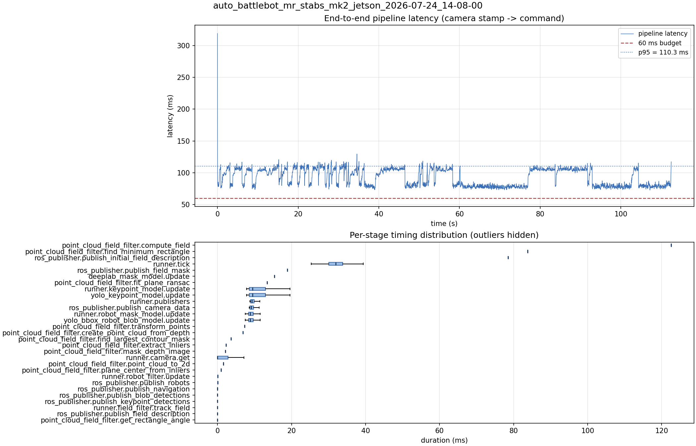

# Latency report: auto_battlebot_mr_stabs_mk2_jetson_2026-07-24_14-08-00

- Source: `/home/ben/Desktop/auto_battlebot_mr_stabs_mk2_jetson_2026-07-24_14-08-00.mcap`
- Generated: 2026-07-24 14:11 by `scripts/mcap_latency_report.py`
- Duration: 112.5 s
- Window: after field init (5.2 s into the recording)
- Loop rate: 29.9 Hz mean
- End-to-end latency: mean 92.6 ms / p95 110.3 ms / max 319.2 ms
- Budget: 60 ms -> p95 is OVER BUDGET

| Stage | n | mean (ms) | median (ms) | p95 (ms) | max (ms) | % of tick |
| --- | ---: | ---: | ---: | ---: | ---: | ---: |
| point_cloud_field_filter.compute_field | 1 | 122.58 | 122.58 | 122.58 | 122.58 | 380.4% |
| pipeline.latency | 3,343 | 92.63 | 95.78 | 110.26 | 319.16 | - |
| point_cloud_field_filter.find_minimum_rectangle | 1 | 83.81 | 83.81 | 83.81 | 83.81 | 260.1% |
| ros_publisher.publish_initial_field_description | 1 | 78.49 | 78.49 | 78.49 | 78.49 | 243.6% |
| runner.tick | 3,343 | 32.23 | 31.99 | 37.43 | 328.68 | 100.0% |
| ros_publisher.publish_field_mask | 1 | 18.86 | 18.86 | 18.86 | 18.86 | 58.5% |
| deeplab_mask_model.update | 1 | 15.35 | 15.35 | 15.35 | 15.35 | 47.6% |
| point_cloud_field_filter.fit_plane_ransac | 1 | 13.40 | 13.40 | 13.40 | 13.40 | 41.6% |
| runner.keypoint_model.update | 3,343 | 10.75 | 9.50 | 15.56 | 24.76 | 33.3% |
| yolo_keypoint_model.update | 3,343 | 10.74 | 9.49 | 15.56 | 24.76 | 33.3% |
| runner.publishers | 3,343 | 9.73 | 9.31 | 12.64 | 16.90 | 30.2% |
| ros_publisher.publish_camera_data | 3,343 | 9.57 | 9.16 | 12.46 | 16.71 | 29.7% |
| runner.robot_mask_model.update | 3,343 | 9.49 | 8.89 | 14.01 | 25.32 | 29.4% |
| yolo_bbox_robot_blob_model.update | 3,343 | 9.48 | 8.88 | 14.00 | 25.32 | 29.4% |
| point_cloud_field_filter.transform_points | 1 | 7.32 | 7.32 | 7.32 | 7.32 | 22.7% |
| point_cloud_field_filter.create_point_cloud_from_depth | 1 | 6.92 | 6.92 | 6.92 | 6.92 | 21.5% |
| point_cloud_field_filter.find_largest_contour_mask | 1 | 3.67 | 3.67 | 3.67 | 3.67 | 11.4% |
| point_cloud_field_filter.extract_inliers | 1 | 2.32 | 2.32 | 2.32 | 2.32 | 7.2% |
| point_cloud_field_filter.mask_depth_image | 1 | 2.16 | 2.16 | 2.16 | 2.16 | 6.7% |
| runner.camera.get | 3,343 | 1.58 | 0.02 | 6.69 | 63.30 | 4.9% |
| point_cloud_field_filter.point_cloud_to_2d | 1 | 1.56 | 1.56 | 1.56 | 1.56 | 4.8% |
| point_cloud_field_filter.plane_center_from_inliers | 1 | 0.94 | 0.94 | 0.94 | 0.94 | 2.9% |
| runner.robot_filter.update | 3,343 | 0.09 | 0.07 | 0.10 | 4.71 | 0.3% |
| ros_publisher.publish_robots | 3,343 | 0.06 | 0.05 | 0.12 | 2.19 | 0.2% |
| ros_publisher.publish_navigation | 3,343 | 0.04 | 0.03 | 0.06 | 1.26 | 0.1% |
| ros_publisher.publish_blob_detections | 3,343 | 0.03 | 0.02 | 0.05 | 3.11 | 0.1% |
| ros_publisher.publish_keypoint_detections | 3,343 | 0.02 | 0.01 | 0.04 | 3.11 | 0.1% |
| runner.field_filter.track_field | 3,343 | 0.02 | 0.01 | 0.04 | 0.61 | 0.1% |
| ros_publisher.publish_field_description | 3,343 | 0.01 | 0.01 | 0.01 | 0.90 | 0.0% |
| point_cloud_field_filter.get_rectangle_angle | 1 | 0.01 | 0.01 | 0.01 | 0.01 | 0.0% |

