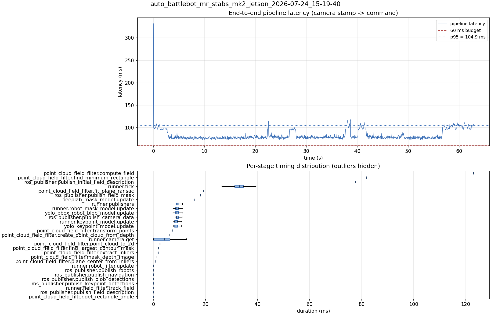

# Latency report: auto_battlebot_mr_stabs_mk2_jetson_2026-07-24_15-19-40

- Source: `/home/ben/Desktop/auto_battlebot_mr_stabs_mk2_jetson_2026-07-24_15-19-40.mcap`
- Generated: 2026-07-24 15:22 by `scripts/mcap_latency_report.py`
- Duration: 62.8 s
- Window: after field init (3.6 s into the recording)
- Loop rate: 30.2 Hz mean
- End-to-end latency: mean 83.0 ms / p95 104.9 ms / max 331.8 ms
- Budget: 60 ms -> p95 is OVER BUDGET

| Stage | n | mean (ms) | median (ms) | p95 (ms) | max (ms) | % of tick |
| --- | ---: | ---: | ---: | ---: | ---: | ---: |
| point_cloud_field_filter.compute_field | 1 | 123.00 | 123.00 | 123.00 | 123.00 | 371.4% |
| pipeline.latency | 1,883 | 83.03 | 78.75 | 104.85 | 331.83 | - |
| point_cloud_field_filter.find_minimum_rectangle | 1 | 81.73 | 81.73 | 81.73 | 81.73 | 246.8% |
| ros_publisher.publish_initial_field_description | 1 | 77.68 | 77.68 | 77.68 | 77.68 | 234.6% |
| runner.tick | 1,883 | 33.12 | 32.96 | 37.63 | 338.73 | 100.0% |
| point_cloud_field_filter.fit_plane_ransac | 1 | 19.09 | 19.09 | 19.09 | 19.09 | 57.6% |
| ros_publisher.publish_field_mask | 1 | 18.04 | 18.04 | 18.04 | 18.04 | 54.5% |
| deeplab_mask_model.update | 1 | 15.60 | 15.60 | 15.60 | 15.60 | 47.1% |
| runner.publishers | 1,883 | 9.55 | 9.08 | 11.60 | 19.23 | 28.8% |
| runner.robot_mask_model.update | 1,883 | 9.52 | 8.98 | 14.02 | 20.94 | 28.7% |
| yolo_bbox_robot_blob_model.update | 1,883 | 9.52 | 8.97 | 14.02 | 20.94 | 28.7% |
| ros_publisher.publish_camera_data | 1,883 | 9.40 | 8.93 | 11.45 | 18.99 | 28.4% |
| runner.keypoint_model.update | 1,883 | 9.30 | 8.63 | 14.54 | 20.15 | 28.1% |
| yolo_keypoint_model.update | 1,883 | 9.30 | 8.63 | 14.53 | 20.14 | 28.1% |
| point_cloud_field_filter.transform_points | 1 | 7.16 | 7.16 | 7.16 | 7.16 | 21.6% |
| point_cloud_field_filter.create_point_cloud_from_depth | 1 | 6.25 | 6.25 | 6.25 | 6.25 | 18.9% |
| runner.camera.get | 1,883 | 4.01 | 4.22 | 8.83 | 64.19 | 12.1% |
| point_cloud_field_filter.point_cloud_to_2d | 1 | 2.52 | 2.52 | 2.52 | 2.52 | 7.6% |
| point_cloud_field_filter.find_largest_contour_mask | 1 | 1.91 | 1.91 | 1.91 | 1.91 | 5.8% |
| point_cloud_field_filter.extract_inliers | 1 | 1.79 | 1.79 | 1.79 | 1.79 | 5.4% |
| point_cloud_field_filter.mask_depth_image | 1 | 1.32 | 1.32 | 1.32 | 1.32 | 4.0% |
| point_cloud_field_filter.plane_center_from_inliers | 1 | 0.86 | 0.86 | 0.86 | 0.86 | 2.6% |
| runner.robot_filter.update | 1,883 | 0.09 | 0.07 | 0.10 | 4.84 | 0.3% |
| ros_publisher.publish_robots | 1,883 | 0.06 | 0.05 | 0.09 | 1.39 | 0.2% |
| ros_publisher.publish_navigation | 1,883 | 0.04 | 0.03 | 0.06 | 0.98 | 0.1% |
| ros_publisher.publish_blob_detections | 1,883 | 0.03 | 0.02 | 0.05 | 1.76 | 0.1% |
| ros_publisher.publish_keypoint_detections | 1,883 | 0.02 | 0.01 | 0.04 | 2.75 | 0.1% |
| runner.field_filter.track_field | 1,883 | 0.02 | 0.02 | 0.04 | 0.13 | 0.1% |
| ros_publisher.publish_field_description | 1,883 | 0.01 | 0.01 | 0.01 | 0.23 | 0.0% |
| point_cloud_field_filter.get_rectangle_angle | 1 | 0.01 | 0.01 | 0.01 | 0.01 | 0.0% |

