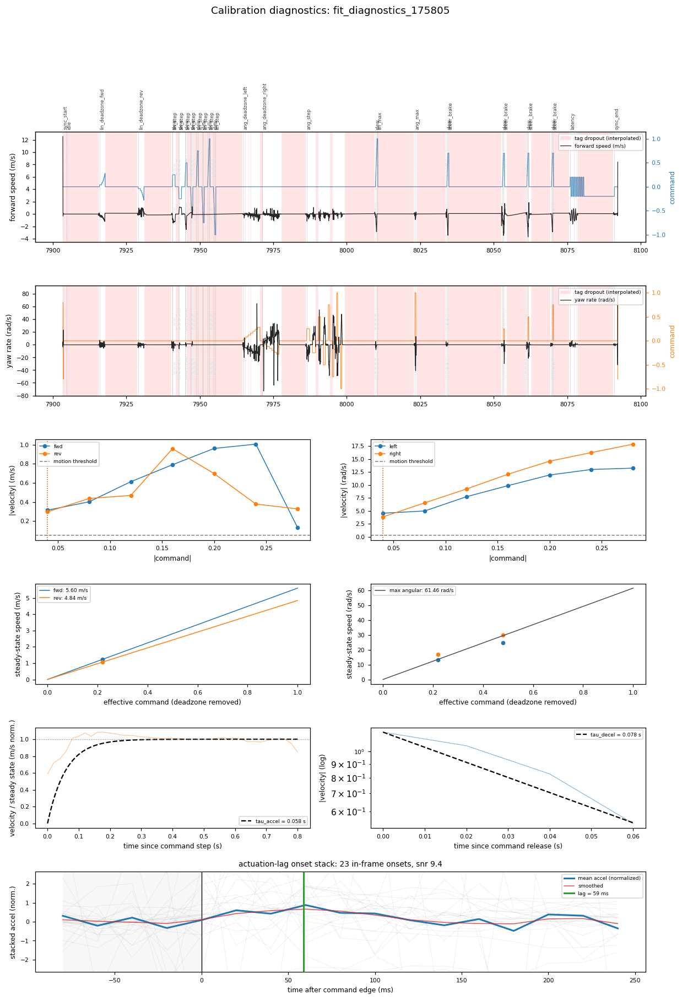

# Mr Stabs Mk2 plant calibration

Fit of the tank drivetrain plant for Mr Stabs Mk2 from three AprilTag drive-calibration sessions on
2026-07-03. Each session runs the scripted excitation protocol in `apriltag_track.py --drive`, solves
ground-truth pose from an overhead OAK-1 camera, and fits the plant with
`playground/calibration/fit_plant_calib.py`.

## TL;DR recommendations

Use run `175805` as the parameter source. It is the only session that fit every parameter, and it has by
far the strongest latency signal.

```toml
# simulation/kinematic_sim.toml [our_robot]
max_linear_speed_fwd = 5.60    # medium confidence
max_linear_speed_rev = 4.84    # low-medium confidence
max_angular_speed    = 61.5    # medium confidence
tau_linear_accel     = 0.058   # low confidence (one clean rise; fit corrected, see below)
tau_linear_decel     = 0.078   # low confidence (one clean coast tail)
tau_angular_accel    = 0.066   # low confidence (one clean rise)

# simulation/kinematic_sim.toml [latency]
command_ms = 60                # from the pooled onset stack, high confidence
```

The time constants are now measured correctly (`fit_plant_calib.py` was fixed, see "Time-constant fit
fix" below), but each rests on a single clean segment because the robot leaves frame under linear motion.
They are all ~40-80 ms, the same order as the transport lag, which is physically sensible for a small
combat drivetrain. Re-record to firm them up.

```toml
# config/main.toml [transmitter]
lifted_deadzone_percent = 4    # deadzone is at or below the smallest tested step (0.04)
```

The single number I trust most is **actuation latency ~60ms**. It matches the project's assumed 60ms
end-to-end budget. Everything else is limited by poor tag visibility and should be re-recorded before
being used for aggressive control tuning.

## The runs

| Run | Time | Latency-battery step | Overall in-frame | Notes |
|-----|------|----------------------|------------------|-------|
| `170958` | 17:09 | ±0.80 | 29% | most aggressive latency steps, worst latency-phase visibility (10%) |
| `175145` | 17:51 | ±0.35 | 33% | fit the fewest parameters |
| `175805` | 17:58 | ±0.20 | 23% | fit every parameter; strongest latency signal (snr 9.4) |

"Overall in-frame" is the fraction of the analysis grid where the tag was actually seen. The rest is
linear interpolation across dropouts, not measurement.

## Data quality is the dominant limitation

The tag drops out of the overhead camera for most of every session. Below is per-phase visibility.
Anything under ~50% means the fit for that phase is working off mostly interpolated pose.

| Phase | 170958 | 175145 | 175805 |
|-------|-------:|-------:|-------:|
| lin_deadzone_fwd | 48 | 70 | 66 |
| lin_deadzone_rev | 98 | 95 | 50 |
| lin_step | 15 | 46 | 27 |
| lin_max | 51 | 15 | 14 |
| ang_deadzone_left | 90 | 33 | 68 |
| ang_deadzone_right | 89 | 42 | 79 |
| ang_step | 83 | 79 | 77 |
| ang_max | 88 | 32 | 30 |
| steer_brake | 52 | 10 | 55 |
| latency | 10 | 28 | 42 |

Two patterns:

- **Linear motion loses the tag.** `lin_step` and `lin_max` are the worst phases (14-46%). Driving
  forward/back walks the robot toward the frame edge or flips it, so the linear speed and linear tau fits
  have the least data.
- **Rotation stays in frame.** `ang_step` is the best-populated phase in every run (77-83%). Pure
  rotation keeps the robot planted. This is why the latency fit leans on angular onsets.

The red bands in the timeline panels below are these dropouts. On most runs, red covers the majority of
the timeline.

## How each parameter is derived

`fit_plant_calib.py --plot` now emits a six-row diagnostic figure per run so the derivation of each number
is visible, not just the number. Reference figure is run `175805`:



Reading the panels top to bottom:

1. **Linear timeline** (forward speed vs `cmd_lin`). Red = tag dropout. Dotted verticals + top labels mark
   protocol phases. This is the raw data: what excitation ran when, and where truth is real vs interpolated.
2. **Angular timeline** (yaw rate vs `cmd_ang`). Same layout. Note how much cleaner the angular response is.
3. **Deadzone staircase.** Median sustained |velocity| at each command level. The dashed line is the motion
   threshold; the dotted vertical is the picked deadzone. Both channels first exceed the threshold at the
   smallest tested step (0.04), so the true deadzone is at or below that.
4. **Steady-state gain.** Steady-state speed vs effective command (deadzone removed), one point per held
   segment. The fit slope is the max speed. Note the linear fit extrapolates from only two clusters near
   command 0.2-0.5 out to 1.0, so max linear speed is an extrapolation.
5. **Rise time constant.** Normalized rise curves per segment (dropouts break the line) with the
   first-order model at the fitted `tau_accel = 0.058 s`. The model now tracks the measured rise, which
   settles in ~0.1s. This panel is what originally exposed the fit bug (see "Time-constant fit fix").
6. **Coast decay.** Zero-command tails on a log axis; a straight line is a first-order decay at `tau_decel`.
7. **Actuation-lag onset stack** (full width, bottom). Faint gray = individual per-onset acceleration
   windows. Bold blue = their average. The average rises off the gray pre-edge baseline band and peaks at
   the green line, which is the fitted lag. This is the latency derivation in one picture.

Companion figures: [run 170958](assets/fit_diagnostics_170958.png),
[run 175145](assets/fit_diagnostics_175145.png).

## Results across runs

`nan` means the phase had too little in-frame data to fit.

| Parameter | 170958 | 175145 | 175805 | Recommended | Confidence |
|-----------|-------:|-------:|-------:|------------:|-----------|
| linear deadzone fwd/rev | 0.04 | 0.04 | 0.04 | ≤0.04 | high (floored at smallest step) |
| angular deadzone L/R | 0.04 | nan | 0.04 | ≤0.04 | high |
| max linear speed fwd (m/s) | nan | 5.79 | 5.60 | 5.6 | medium |
| max linear speed rev (m/s) | nan | nan | 4.84 | 4.84 | low-medium |
| max angular speed (rad/s) | 65.9 | nan | 61.5 | 61 | medium |
| tau linear accel (s) | nan | nan | 0.058 | 0.058 | low (one clean rise) |
| tau linear decel (s) | nan | nan | 0.078 | 0.078 | low (one clean coast) |
| tau angular accel (s) | 0.038 | nan | 0.066 | 0.05-0.07 | low (one clean rise/run) |
| steer-brake coeff | nan | nan | nan | unmeasured | none |
| actuation lag (ms) | 39 | 61 | 59 | 60 | high (from 175805) |

## Latency: the headline result

The dedicated latency battery does not work on its own. Its aggressive bipolar steps (±0.8, ±0.35, ±0.2
across the three runs) flip the robot or drive it out of frame, so during that phase the tag is visible
only 10-42% of the time. The old estimator cross-correlated the command against a velocity that was mostly
interpolation, and returned garbage: **0 / 240 / 80 ms** across the three runs.

The estimator now ignores the latency battery as a special case and instead pools every clean command edge
in the whole session:

- Linear edges are timed against forward acceleration, angular edges against yaw acceleration. The
  transport delay is the same physical path (Crossfire + ESC + mechanical) for both, so they stack.
- Any edge whose response window overlaps a tag dropout is rejected, which removes the flipped segments and
  leans the estimate on the many in-frame angular-step onsets.
- Per-channel polarity is recovered from the data. Both channels turned out anti-correlated with their
  command (corr -0.45 to -0.78): the solved pose frame is inverted relative to the command frame, a
  mirrored-tag / 180° mount effect. Magnitude fits are immune because they use absolute values, but the
  sign-matched stacking needed the correction.
- Lag is the peak of the stacked acceleration. For a delay + first-order plant, `dv/dt` is zero until motion
  starts then jumps to its maximum exactly at the transport delay, so the peak is the lag.

Result:

| Run | lag | onsets | snr |
|-----|----:|-------:|----:|
| 170958 | 39 ms | 26 | 3.1 |
| 175145 | 61 ms | 21 | 2.9 |
| 175805 | 59 ms | 23 | 9.4 |

The high-confidence run (`175805`, snr 9.4) gives **59ms**. Use `command_ms = 60`.

## Time-constant fit fix

The first pass reported `tau_linear_accel = 1.116 s` and `tau_angular_accel = 2.229 s`, which the rise
panel visibly contradicted (the robot settles in ~0.1s). Two bugs, both now fixed in `fit_plant_calib.py`:

- **Fit window.** `_rise_tau` selected the 15-85% amplitude band over the *entire* hold. For a fast rise
  that is ~4 samples, the band correctly caught the rising samples but then also caught a late
  steady-state sample where noise dipped back into the band. One point at large t with a small residual
  flattens the log-linear slope and inflates tau 10-20x. Fix: fit only the first contiguous in-band run
  (the leading rise), ignoring later re-entries.
- **Dropouts.** Rise and coast samples that fall in a tag dropout are interpolation, not measurement. Fix:
  drop gapped samples from the rise fit, require the coast portion to be in-frame, and take the
  steady-state speed from in-frame samples only.

After the fix, `tau_linear_accel = 0.058 s`, `tau_linear_decel = 0.078 s`, `tau_angular_accel = 0.066 s`
(all from run 175805). Max speeds, deadzones, and latency are unchanged.

## Reliability caveats

- **Time constants rest on one segment each.** The fix is correct, but the robot leaves frame under linear
  motion, so only one clean linear rise and one clean coast tail survive in the best run. The values are
  physically sensible (~40-80 ms) but need a cleaner re-record to trust for tuning.
- **`steer_brake_coeff` was never measured.** It needs the steer-brake grid held with `cmd_lin > 0.5` while
  visible, and that combination never survived the dropouts. n/a in all three runs.
- **Max speeds are extrapolations.** Both come from a handful of mid-range segments extended to full
  command. Directionally right, exact value soft.
- **Deadzone is floored.** 0.04 is the smallest command step the staircase tested, and motion already
  exceeded threshold there, so the real deadzone is ≤0.04, not exactly 0.04.

## Next steps

The single fix that unblocks everything is keeping the tag in frame during linear motion. In priority order:

1. **Re-record with the tag visible under linear motion.** Options: wider camera FOV, smaller drive
   excursions in `lin_step`/`lin_max`, or a tag mounted where it stays visible when the robot pitches. Aim
   for >70% visibility in the linear phases, matching what rotation already achieves.
2. **Soften the latency battery** so it stops flipping the robot. The pooled-onset estimator already makes a
   dedicated battery unnecessary, but gentler steps would still add clean onsets instead of dropouts.
3. **Re-fit the taus** once linear visibility is good. The estimator is fixed, but each time constant still
   rests on a single clean segment. More in-frame rises and coast tails would firm up the accel/decel
   constants, which matter most for the coast/overshoot behavior the control plan is trying to fix.
4. **Feed the trusted numbers into the sim now.** Latency (60ms), deadzone (≤0.04), and max speeds are good
   enough to start Stage 1 of the control improvement plan; refine the taus after re-recording.
