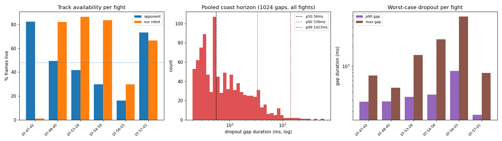

# Perception reliability: May competition fights

Stage 0 measurement of opponent-track reliability across the six NHRL May-02-2026 competition fights,
replayed through `config/experiments/label_playback.toml` on 2026-07-02. This answers the control plan's
open question: how long must the predictor coast through perception dropouts?

Tool: `training/model_eval/perception_reliability.py`, reading the `perception` diagnostics the runner
emits per tick (`their_count_live`, `our_present_live`; `src/runner.cpp:426`). Each `/diagnostics` message
is one tick, stamped with the camera frame time, so dropout durations are real time.

## Headline

- **A live opponent is present in only 48% of frames** (frame-weighted over 10,822 frames / 299 s). We are
  aiming at a stale or coasted target more than half the time. This is the stale-target problem the plan is
  built around, quantified.
- **Most dropouts are short** (median 56 ms ≈ 2 frames): a constant-velocity predictor bridges these easily.
- **The tail is severe**: 10% of dropouts exceed 338 ms, 5% exceed 500 ms, 1.7% exceed 1 s, worst case
  **5.8 s**. At 2 m/s a 340 ms coast is 0.68 m of opponent travel (3 robot lengths), so constant-velocity
  prediction is unreliable past ~p90. These long gaps are exactly what a max-coast timeout and confidence
  gate must catch.
- **Reliability is highly fight-dependent**: opponent-live ranges 16% to 82% across the six fights.

## Per-fight results

Fights are labelled by replay timestamp (the source SVO is not recorded in the MCAP metadata). Frame rate
is ~37-38 fps throughout.

| Fight | Frames | Dur (s) | Opponent live | Our-robot live | Gaps | Gap median | Gap p90 | Gap max | Churn (jr/s) |
|-------|-------:|--------:|--------------:|---------------:|-----:|-----------:|--------:|--------:|-------------:|
| 07-47-42 | 1789 | 48.9 | **82.3%** | 1.1% | 84 | 40 ms | 283 ms | 716 ms | 0.29 |
| 07-48-40 | 756 | 21.0 | 49.5% | 82.1% | 105 | 60 ms | 285 ms | 464 ms | 1.24 |
| 07-53-28 | 2451 | 67.5 | 41.7% | 86.4% | 291 | 59 ms | 337 ms | 1490 ms | 1.57 |
| 07-54-58 | 2037 | 56.9 | 29.7% | 83.5% | 237 | 59 ms | 365 ms | 2589 ms | 1.46 |
| 07-56-03 | 1850 | 50.0 | **16.2%** | 29.7% | 122 | 94 ms | 841 ms | **5776 ms** | 0.84 |
| 07-57-01 | 1939 | 54.4 | 73.2% | 66.5% | 185 | 48 ms | 177 ms | 784 ms | 3.51 |

Per-fight detail plots (availability timeline + gap histogram):
[07-47-42](assets/perception_bag_07-47-42.png),
[07-48-40](assets/perception_bag_07-48-40.png),
[07-53-28](assets/perception_bag_07-53-28.png),
[07-54-58](assets/perception_bag_07-54-58.png),
[07-56-03](assets/perception_bag_07-56-03.png),
[07-57-01](assets/perception_bag_07-57-01.png).

## Pooled coast-horizon distribution

Over all 1024 dropout gaps in the six fights:

| Percentile | Gap duration |
|-----------|-------------:|
| p50 | 56 ms |
| p75 | 144 ms |
| p90 | 338 ms |
| p95 | 497 ms |
| p99 | 1423 ms |
| max | 5776 ms |

5.0% of dropouts exceed 500 ms; 1.7% exceed 1 s. The distribution is heavy-tailed: the median is one to two
frames, but the worst 5% dominate the risk.

## What this means for the control plan

1. **Stage 2 (constant-velocity prediction) is worth doing and sufficient for the common case.** Median and
   even p75 dropouts (≤144 ms) are 3-5 frames; a constant-velocity forward-projection over the ~60 ms
   latency plus a short coast covers them. Wire up `lookahead_time`.
2. **Stage 4 (robustify) is not optional, the tail forces it.** Set the max-coast timeout near p90-p95, so
   roughly **350-500 ms**. Within that window, coast on the last predicted trajectory; past it, stop chasing
   a hallucinated detection and hold or widen the aim tolerance. 95% of dropouts recover within ~500 ms; the
   5% that do not (up to 5.8 s) must not be full-sent, they point at walls.
3. **Stage 3 (intercept bias) is justified by the 48% stale rate.** Because the target is stale more than
   half the time, bias the approach heading so a miss overruns into open field or the opponent, not a wall.
4. **Self-pose prediction needs a fallback.** Our-robot tracking is only 58% live pooled and collapses to
   **1.1% in fight 07-47-42**. Stage 2's Smith-predictor self-pose forward-simulation cannot assume our
   robot is tracked; it must fall back to command-feedback dead-reckoning (which `update_with_prediction`
   already supports) when our pose is stale.

## Caveats

- **Inference host differs from the robot.** These replays run the real Jetson-captured SVO frames, but
  perception runs on the desktop CUDA/GPU, not the Jetson TensorRT engines. Detection counts can differ
  slightly from live on-robot behavior. Treat these as a close proxy, not identical to the Jetson.
- **Track-ID-switch rate is a proxy.** The `jump_reject` rate (0.3-3.5/s) reflects the FrameId assigner
  refusing far reassignments; it is not a true count of a physical robot swapping slots. Exact switch
  tracking needs a small addition to the perception diagnostics block (log the live THEIRS FrameId set at
  `src/runner.cpp:426`).
- **Fight 07-47-42 is an outlier worth investigating**: 82% opponent tracking but 1.1% our-robot tracking.
  Our bot's front/back keypoints were essentially never detected that fight (wrong bot, orientation, or
  occlusion). Diagnose separately before trusting self-pose in similar conditions.

## Next steps

1. **Set the Stage 4 max-coast timeout to ~400 ms** (between p90 and p95) as the first cut, tunable in sim.
2. **Add per-slot FrameId logging** for a true track-ID-switch rate, then re-run this tool.
3. **Investigate the 07-47-42 self-tracking collapse.**
4. **Feed the coast-horizon distribution into the Stage 1 sim** as the perception-dropout injection model:
   sample dropout gaps from this pooled distribution rather than a fixed rate.
