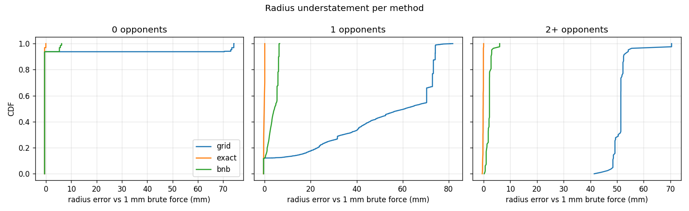
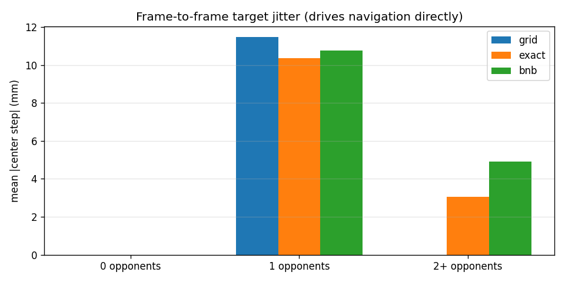
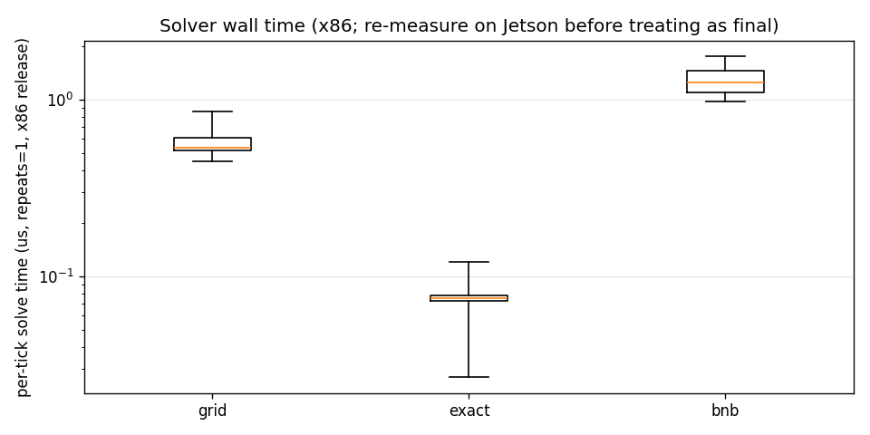

# Run-away solver report

Compared the three largest-empty-circle solver candidates from
`run_away_mode_plan.md` on 52,032 ticks across the six May 2 Jetson fight
recordings, against a 1 mm brute-force reference computed on every tick. All
three land 3 to 4 orders of magnitude under the latency budget on x86, so the
decision comes down to fidelity and jitter, as the plan predicted.

The exact constraint-triple solver (method B) matched brute force on every one
of the 52,032 ticks, is the fastest of the three (0.075 us median, 15
evaluations), and tracks the true optimum's frame-to-frame motion most
faithfully. I recommend it. `SafestPointTarget::solve()` stays a noop until this
pick is confirmed; nothing is wired and no solver has been deleted.

## Setup

- Traces: `playground/run_away_solver/extract_traces.py` over
  `data/recordings/auto_battlebot_main_2026-05-02_*_repaired.mcap` (the
  marker/diagnostics files; the `__T` siblings hold images). One row per
  `/robot_markers` tick. 52,032 ticks total: 5,215 with zero opponent tracks,
  46,733 with one, 84 with two or more.
- Positions come from the `robot_bounds` CUBE markers in the field frame via the
  new `diag_io.load_robot_positions()`. Stale (coasted) tracks are included
  because markers do not encode staleness; that is also what the selector sees
  at runtime.
- Trace hand-check (10-06 recording): 24 Hz tick rate, detected field
  2.11 x 2.21 m, positions bounded by the walls except wall-hugging fixes that
  poke past the fitted border (22.5% of opponent fixes, median 27 mm past, max
  0.54 m). Out-of-rectangle sites are therefore common real input, not an edge
  case.
- Solvers are the production code in `src/target_selector/empty_circle_solver.cpp`,
  called through the nanobind module (`build/python`, release build, x86).
  Timing wraps only the solver call, `repeats = 1`; a cache-warm `repeats = 20`
  pass is reported as a lower bound.
- Parameters: grid `h = 0.15 m`, branch and bound `tolerance = 0.01 m`,
  reference brute force `h = 0.001 m` (about 4.9M evaluations per tick, 8.9 ms,
  run on every tick of every recording).

## How each solver works

All four maximize the same objective. For a candidate center `c` inside the
field rectangle with half extents `half_x, half_y` and opponent positions
`o_i`:

```
wall_clearance(c) = min(half_x - |c.x|, half_y - |c.y|)
opp_clearance(c)  = min over i of distance(c, o_i)
radius(c)         = min(wall_clearance(c), opp_clearance(c))
```

`radius(c)` is the largest circle centered at `c` that stays inside the walls
and contains no opponent; the solvers differ only in how they search for its
argmax. One shared property does the heavy lifting: `radius` is a min of
1-Lipschitz functions (distance to a line, distance to a point), so it is
itself 1-Lipschitz. Moving the center by `d` changes the radius by at most
`d`. That turns every grid spacing into a hard error bound and gives branch
and bound its pruning rule. The function is not concave, so there is no
gradient method to reach for.

**Brute force (reference).** Evaluate `radius` at every node of a 1 mm grid
and keep the best. By the Lipschitz bound the best node is within
`0.001 / sqrt(2) = 0.71 mm` of the true optimum, which is why it can serve as
ground truth. About 4.9M evaluations per tick; only feasible here because the
loop is release-built C++.

**Coarse grid (method A).** The same single pass at `h = 0.15 m`, roughly
16 x 16 nodes, no refinement. Cheapest possible code: two comparisons and one
distance per opponent per node, no allocation, no branching, no degenerate
cases. The price is the same Lipschitz bound at coarse spacing: the reported
radius can understate the truth by up to `0.15 / sqrt(2) = 106 mm`, and the
returned center snaps to grid nodes, so it holds still and then hops a whole
cell.

**Exact constraint-triple enumeration (method B).** The optimum is a vertex of
the generalized Voronoi diagram of the four wall lines plus the opponent
point sites: at the optimum at least three constraints are active (the circle
touches three things). Instead of building that diagram, enumerate every
triple of the `4 + N` constraints and solve each in closed form:

- Three walls: contains one opposite pair, which pins the center to the
  mid-line; the third wall fixes the position along it.
- Two opposite walls + a point: the mid-line fixes the radius; intersecting
  with the point's distance circle is a square root.
- Two perpendicular walls + a point: equidistance from both walls puts the
  center on a corner diagonal; equating the point distance is a quadratic in
  the radius.
- One wall + two points: the center lies on the pair's perpendicular
  bisector; equating wall distance and point distance along it is a
  quadratic.
- Three points: the circumcenter, when the sites are not collinear.

Each triple yields zero, one, or two candidates. Every candidate is scored
with the true `radius(c)`, which doubles as the feasibility check (a candidate
outside the rectangle or crowding an unrelated opponent scores low and
loses). Degenerate triples, coincident sites, collinear sites, sites outside
the field, produce no candidate and are skipped; the optimum is still covered
by the surviving triples. With one opponent this is about 16 evaluations.
The result is exact, with no accuracy knob, and most of the code is the
case-by-case geometry above.

**Lipschitz branch and bound (method C).** Start with a coarse cell grid
(`0.20 m` cells), evaluate each cell center, and keep the best value `r*`.
No point inside a cell can beat its center value by more than the cell
half-diagonal (Lipschitz again), so any cell whose bound
`value + half_diagonal` falls below `r*` cannot contain the optimum and is
discarded. Subdivide the survivors into four, halve the cell size, and repeat
until the half-diagonal is under the tolerance (`0.01 m` here). Accuracy is a
config knob rather than a fixed grid consequence, and there are no geometric
special cases; the cost is data-dependent, which is why it had to be measured
(on these fights it pruned to about the coarse grid's evaluation count while
cutting the radius error by an order of magnitude, 44.9 mm mean to 3.2 mm).

## Validation: exact vs brute force, every tick

| Recording | Ticks | Max deficit (mm) | Max excess (mm) | Bound (mm) | Over bound |
| --------- | ----- | ---------------- | --------------- | ---------- | ---------- |
| 10-06 | 9,156 | 0.000 | 0.532 | 0.707 | 0 |
| 11-45 | 13,464 | -0.038 | 0.543 | 0.707 | 0 |
| 14-12 | 7,688 | 0.000 | 0.584 | 0.707 | 0 |
| 15-35 | 5,464 | -0.040 | 0.520 | 0.707 | 0 |
| 16-18 | 6,121 | 0.000 | 0.543 | 0.707 | 0 |
| 17-26 | 10,139 | -0.002 | 0.580 | 0.707 | 0 |

Deficit is brute minus exact: it never goes positive past float noise, so exact
never falls below the sampled optimum. Excess stays inside the brute-force grid
bound `h / sqrt(2) = 0.707 mm`. Method B is exact on all real data, including
coincident tracks and out-of-field sites. The degenerate cases are additionally
locked by unit tests in `tests/test_empty_circle_solver.cpp`.

## Metrics

All ticks pooled ("all" bucket); radius error is against the 1 mm reference.
The full split by opponent count is in the appendix below (source:
`playground/run_away_solver/out/summary.csv`).

| Metric | grid (h=0.15) | exact | bnb (tol=0.01) |
| ------ | ------------- | ----- | -------------- |
| Radius error mean (mm) | 44.9 | -0.3 | 3.2 |
| Radius error p95 (mm) | 74.2 | 0.0 | 6.2 |
| Radius error max (mm) | 81.8 | 0.0 | 6.5 |
| Center displacement mean (m) | 0.070 | 0.046 | 0.018 |
| Center displacement p95 (m) | 0.119 | 0.159 | 0.061 |
| Jitter mean (mm/step) | 10.3 | 9.3 | 9.7 |
| Jitter hops > 10 cm (% of steps) | 4.9 | 2.3 | 2.4 |
| Evaluations mean | 265 | 15.3 | 269 |
| Time p50 (us, repeats=1) | 0.54 | 0.075 | 1.25 |
| Time p95 (us) | 0.86 | 0.12 | 1.76 |
| Time p50 warm (us, repeats=20) | 0.56 | 0.056 | 1.15 |

Reference brute force: jitter mean 9.3 mm, hops > 10 cm on 2.3% of steps. The
true optimum itself hops when the opponent moves, so 2.3% is the floor; a good
method should match it, not beat it.

Reading the table:

- **Radius fidelity.** Grid understates the radius by up to 82 mm, right in
  line with its 106 mm theoretical bound. That error lands directly on the
  "nowhere safe" comparison against the robot half-diagonal (113 mm). Branch
  and bound stays inside its 10 mm tolerance knob. Exact is exact.
- **Jitter shape.** Grid's mean jitter looks fine, but the shape is wrong: it
  snaps to nodes, so 95% of its steps are exactly zero and the rest are whole
  node hops (p95 within the one-opponent bucket: 143 mm). Its > 10 cm hop rate
  is 4.9%, twice the true rate. Exact and bnb both track the true motion at
  2.3 to 2.4%. The `retarget_improvement_m` hysteresis in `SafestPointTarget`
  will suppress some of this either way, but starting from faithful motion
  beats filtering a jumpy one.
- **Center displacement in the 0-opponent bucket is plateau ambiguity, not
  error.** With no opponent the solution set is a segment of tied points; exact
  returns a segment endpoint, brute returns its first scan-order node, and both
  radii agree to 0.5 mm. This is why displacement is split out and radius error
  is the fidelity metric.
- **Cost.** Exact averages 15 candidate evaluations per tick against 265 for
  both grid and bnb, and is 7x faster than grid and 16x faster than bnb. The
  evaluations column is machine independent and predicts the same ordering on
  the Jetson.



The CDF shows the shape behind the table: grid's error spreads across its full
0 to 82 mm range while bnb stays under 6.5 mm and exact sits at zero.





## The open question: "nowhere safe" never happened

The plan left open what to do when the best circle is smaller than the robot's
half-diagonal (113 mm). Across all 52,032 ticks the minimum best radius any
method returned was 598 mm (grid) and the true minimum was 671 mm. The case did
not occur once in six real fights, even with wall-hugging opponents. Returning
the best spot unconditionally is the right behavior; no `std::nullopt` path or
config knob is warranted.

## Pick, pending review

Exact (method B), reasons in order:

1. Its radius is exact, and the radius is what the nowhere-safe test and the
   retarget hysteresis both consume. Grid's 74 mm p95 understatement is 2/3 of
   the robot half-diagonal.
2. It matched brute force on every tick of every recording, so the
   degenerate-case handling (the reason to distrust it) has been validated on
   exactly the data that produces degeneracies, plus unit tests.
3. It is the cheapest at runtime and needs no accuracy knob in the config.

The honest cost: it is about 140 lines of case-by-case geometry versus 20 for
the grid. The mitigations are the per-tick validation above and the geometric
unit tests.

Branch and bound is a solid second (bounded 6.5 mm error, faithful jitter, no
degenerate cases) if we would rather carry a tolerance knob than the geometry.
Grid is out: the radius understatement and doubled hop rate are real costs and
its speed advantage buys nothing at these magnitudes.

Timing caveat: these are x86 numbers. Rebuild the module on the Jetson with
`-DBUILD_PYTHON_BINDINGS=ON` and re-run `compare_solvers.py` on the same traces
before treating timing as final. All three are so far under the 60 ms budget
that the pick should not change on timing alone; evaluations per tick already
predict the ordering there.

## Appendix: full summary split by opponent count

Rendered from `playground/run_away_solver/out/summary.csv`; the per-tick data
behind it is `out/results.csv` (40 MB, regenerable in about 15 minutes with
`compare_solvers.py`). Buckets with 84 ticks (2+) are thin; read them as
anecdotes, not statistics.

Accuracy vs the 1 mm brute-force reference:

| Method | Opponents | Ticks | Radius err mean (mm) | Radius err p95 (mm) | Radius err max (mm) | Center disp mean (m) | Center disp p95 (m) | Center disp max (m) |
|:-------|:----------|------:|---------------------:|--------------------:|--------------------:|---------------------:|--------------------:|--------------------:|
| brute | all | 52,032 | 0 | 0 | 0 | 0 | 0 | 0 |
| brute | 0 | 5,215 | 0 | 0 | 0 | 0 | 0 | 0 |
| brute | 1 | 46,733 | 0 | 0 | 0 | 0 | 0 | 0 |
| brute | 2+ | 84 | 0 | 0 | 0 | 0 | 0 | 0 |
| grid | all | 52,032 | 44.9 | 74.2 | 81.8 | 0.070 | 0.119 | 1.324 |
| grid | 0 | 5,215 | 4.1 | 73.0 | 74.2 | 0.017 | 0.079 | 0.090 |
| grid | 1 | 46,733 | 49.5 | 74.2 | 81.8 | 0.076 | 0.131 | 1.324 |
| grid | 2+ | 84 | 51.5 | 54.2 | 70.5 | 0.149 | 0.153 | 0.157 |
| exact | all | 52,032 | -0.3 | 0.0 | 0.0 | 0.046 | 0.159 | 0.741 |
| exact | 0 | 5,215 | -0.5 | -0.5 | 0.0 | 0.151 | 0.159 | 0.159 |
| exact | 1 | 46,733 | -0.2 | 0.0 | 0.0 | 0.035 | 0.159 | 0.741 |
| exact | 2+ | 84 | -0.2 | -0.1 | 0.0 | 0.002 | 0.003 | 0.049 |
| bnb | all | 52,032 | 3.2 | 6.2 | 6.5 | 0.018 | 0.061 | 0.963 |
| bnb | 0 | 5,215 | -0.1 | 5.3 | 6.2 | 0.058 | 0.061 | 0.061 |
| bnb | 1 | 46,733 | 3.6 | 6.2 | 6.5 | 0.014 | 0.061 | 0.963 |
| bnb | 2+ | 84 | 2.1 | 3.0 | 6.0 | 0.005 | 0.007 | 0.033 |

Jitter, cost, and timing (jitter medians are omitted: stale tracks repeat
positions, so most steps are exactly zero and every median lands there):

| Method | Opponents | Jitter mean (mm) | Jitter p95 (mm) | Hops >10 cm (%) | Evaluations mean | Time p50 (us) | Time p95 (us) | Time warm p50 (us) | Nowhere-safe rate |
|:-------|:----------|-----------------:|----------------:|----------------:|-----------------:|--------------:|--------------:|-------------------:|------------------:|
| brute | all | 9.3 | 31.1 | 2.34 | 4,946,779 | 8867 | 9517 | 8867 | 0 |
| brute | 0 | 0.0 | 0.0 | 0.00 | 4,800,706 | 6548 | 6823 | 6548 | 0 |
| brute | 1 | 10.3 | 34.6 | 2.59 | 4,963,547 | 8929 | 9879 | 8929 | 0 |
| brute | 2+ | 4.3 | 11.6 | 1.20 | 4,686,840 | 11047 | 15851 | 11047 | 0 |
| grid | all | 10.3 | 0.0 | 4.85 | 265 | 0.536 | 0.864 | 0.556 | 0 |
| grid | 0 | 0.0 | 0.0 | 0.00 | 256 | 0.446 | 0.481 | 0.460 | 0 |
| grid | 1 | 11.5 | 143.5 | 5.40 | 266 | 0.542 | 0.864 | 0.563 | 0 |
| grid | 2+ | 0.0 | 0.0 | 0.00 | 256 | 1.214 | 1.232 | 1.096 | 0 |
| exact | all | 9.3 | 32.1 | 2.25 | 15 | 0.075 | 0.121 | 0.056 | 0 |
| exact | 0 | 0.0 | 0.0 | 0.00 | 5 | 0.027 | 0.028 | 0.022 | 0 |
| exact | 1 | 10.4 | 37.9 | 2.50 | 16 | 0.075 | 0.122 | 0.056 | 0 |
| exact | 2+ | 3.0 | 11.1 | 0.00 | 46 | 0.642 | 0.824 | 0.434 | 0 |
| bnb | all | 9.7 | 33.4 | 2.38 | 269 | 1.252 | 1.756 | 1.149 | 0 |
| bnb | 0 | 0.0 | 0.0 | 0.00 | 342 | 1.320 | 1.374 | 1.310 | 0 |
| bnb | 1 | 10.8 | 36.0 | 2.64 | 261 | 1.203 | 1.772 | 1.132 | 0 |
| bnb | 2+ | 4.9 | 22.6 | 1.20 | 231 | 1.855 | 2.052 | 1.835 | 0 |

Bucket quirks worth knowing before reading too much into single cells:

- Grid's "all" jitter p95 is 0.0 while its 1-opponent p95 is 143.5 mm. Both are
  right: over 95% of pooled steps are zero (the argmax node holds while the
  opponent moves within a cell), and when the node does change the step is a
  whole cell.
- Grid shows zero jitter in the 0 and 2+ buckets because those ticks cluster in
  runs where the tied plateau keeps the same scan-order winner.
- The exact solver's 0-opponent radius error of -0.5 mm is it beating the
  brute-force sample by the sample's own grid offset, not a disagreement.

## Next steps

1. Ben reviews this pick. `SafestPointTarget::solve()` is a noop until then.
2. Jetson confirmation run: build the module on the Jetson, re-run the batch on
   the same trace CSVs (no camera or radio needed).
3. Wire `solve()` to the winner, delete the two losers, log the winning radius
   next to the target in `ControlLoop`, and add the solver-dependent
   `SafestPointTarget` geometric tests from the plan.
4. Bench test the transmitter track: flip the CH7 switch and watch
   `switch_states`; confirm the trainer-enable hold-at-standstill path now that
   CH6 carries the switch.
