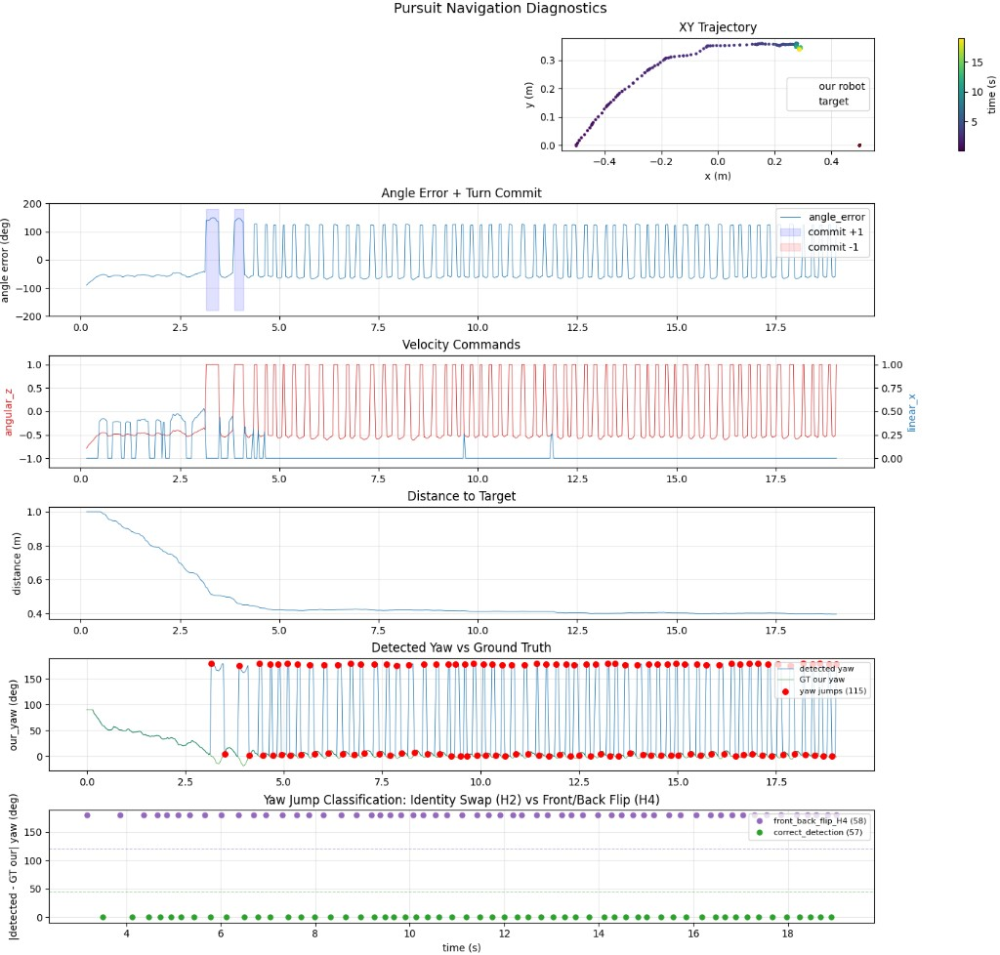
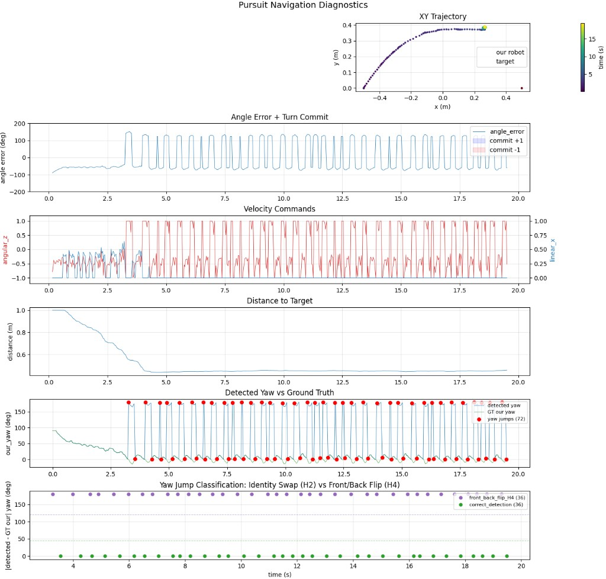
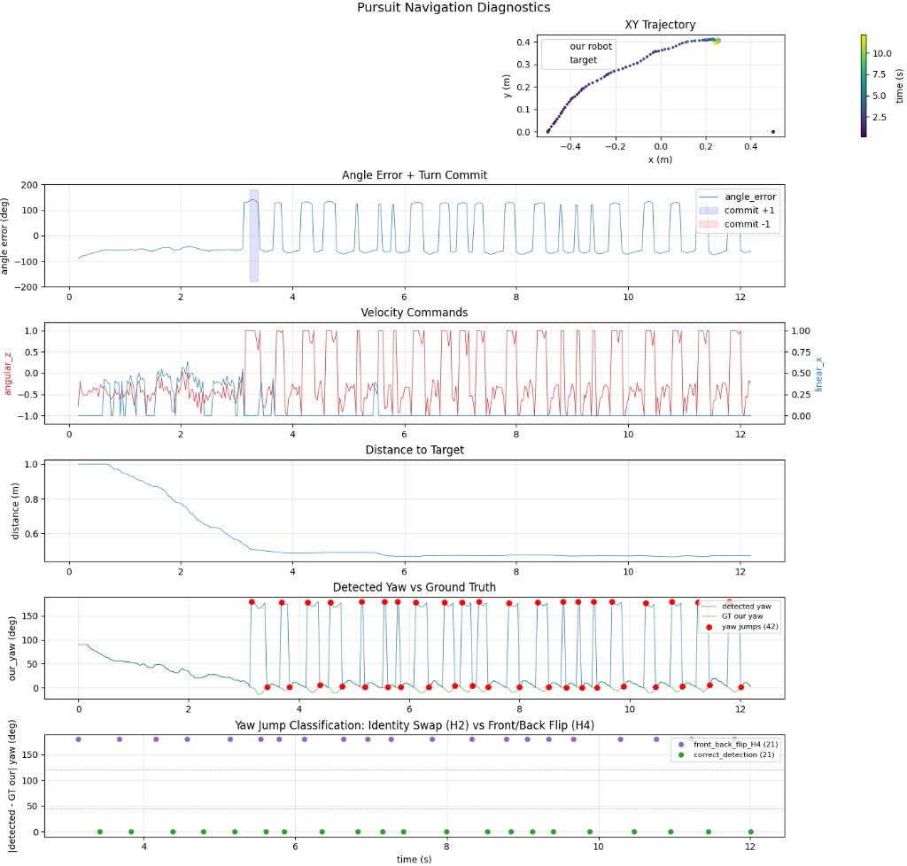
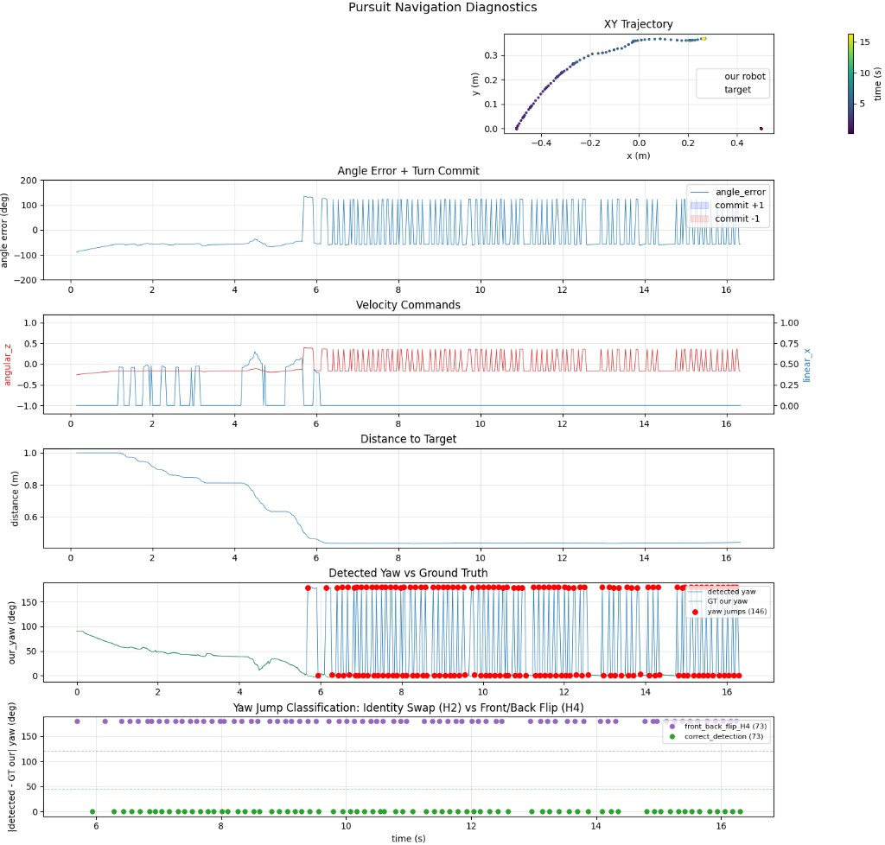
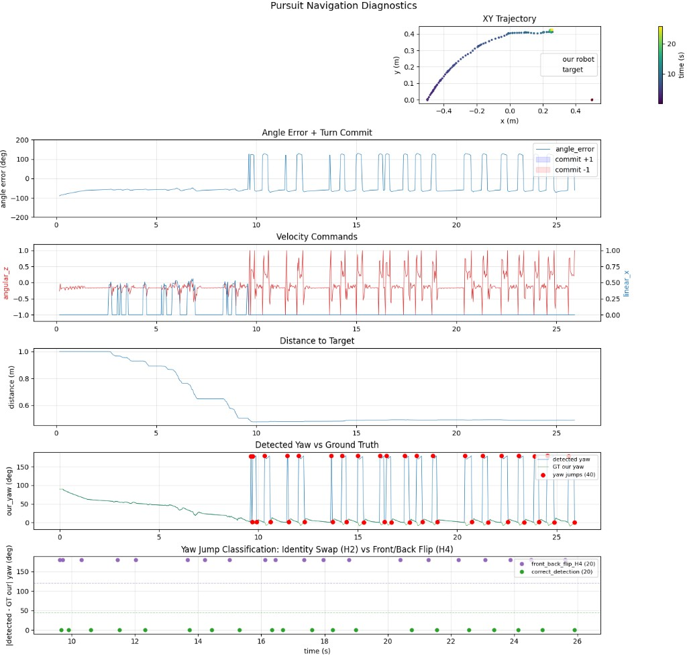
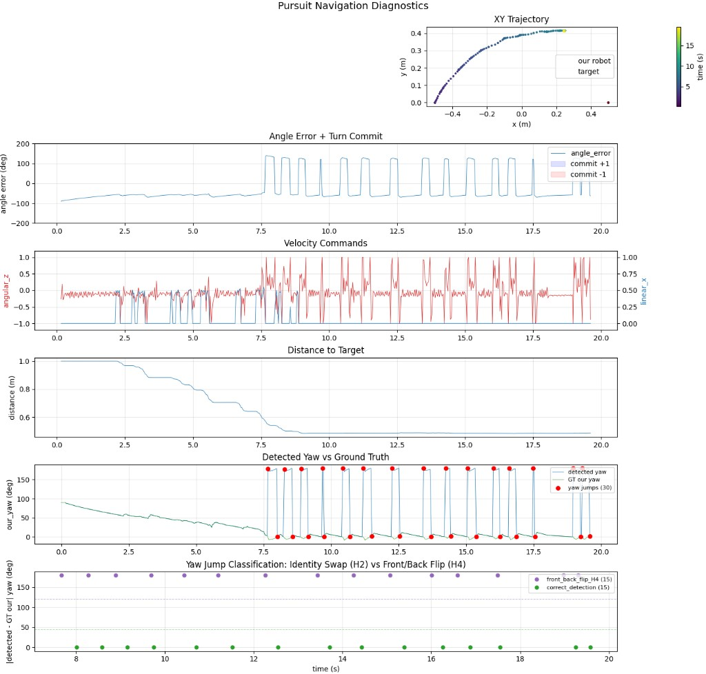

# Controller Investigation Results

## Background

[Experiment 1](experiment1_results.md) identified persistent yaw oscillation in the pursuit navigation controller. Initial hypotheses blamed perception (H2: identity swaps, H4: front/back yaw flips). A ground truth robot filter (`GroundTruthRobotFilter`) was built to bypass neural net detections entirely and test the controller in isolation with perfect pose data from the simulation.

## Experiment 1-GT: Ground truth perception baseline

### Setup

- Same scenario as Experiment 1: static opponent at `[0.5, 0]`, our robot at `[-0.5, 0]` facing +y (90 deg initial error).
- **Perception bypassed**: `NoopKeypointModel` + `GroundTruthRobotFilter` read poses directly from the simulation via `SimConnection`.
- Ground truth poses of all robots logged to MCAP by `SimRgbdCamera` for post-hoc comparison.
- Config: `config/experiment1_gt.toml`

### Results

| Metric | Value |
| --- | --- |
| Duration (s) | 19.0 |
| Ticks | 587 |
| Mean \|angle_error\| (deg) | 80.8 |
| Max \|angle_error\| (deg) | 150.3 |
| Settling time (<10 deg for 1s) | NEVER |
| Time to target (<0.15m) | NEVER |
| Yaw jumps (>90 deg) | 115 |
| -> identity swaps (H2) | 0 |
| -> front/back flips (H4) | 58 |
| -> correct detections | 57 |



### Key finding

With perfect ground truth perception, the robot **still oscillates identically** to the NN-based runs. Mean angle error is 80.8 deg -- the same as Experiment 1's 0 ms baseline (79.6 deg). This conclusively proved that **perception is not the root cause**; the controller itself is broken.

The 58 "front/back flips" classified by the analysis script are the robot physically spinning >90 deg/frame in the physics sim, not perception artifacts.

## Experiment 4: Hysteresis A/B test with PD controller

### Setup

Added two new configurable parameters to `PursuitNavigation`:
- `angular_kd`: derivative gain for angular control (D-term opposes rapid error change)
- `enable_hysteresis`: toggle for the committed-turn-direction logic

Tested with `kp=3.0, kd=1.0` (the original proportional gain plus moderate damping).

### Results

| Metric | Hysteresis OFF | Hysteresis ON |
| --- | --- | --- |
| Duration (s) | 19.5 | 12.2 |
| Mean \|angle_error\| (deg) | 85.2 | 80.5 |
| Settling time | NEVER | NEVER |
| Yaw jumps | 72 | 42 |

#### Hysteresis OFF (kp=3.0, kd=1.0)



#### Hysteresis ON (kp=3.0, kd=1.0)



### Analysis

Neither variant settles. The D-term at kd=1.0 had no meaningful effect because at `kp=3.0 / max_angular_velocity=6.0`, the P-term saturates at +-1.0 for any error beyond 115 deg. The controller operates as a bang-bang controller for most of the oscillation range, and the D-term cannot help when the output is already clipped.

## Experiment 4b: Reduced gain sweep (kp=1.0)

### Setup

Reduced `kp` to 1.0 so the controller never saturates (max output at 180 deg error: `1.0 * pi / 6.0 = 0.52`). Swept `kd` over {0.0, 1.0, 2.0} with hysteresis disabled.

### Results

| Metric | kd=0.0 | kd=1.0 | kd=2.0 |
| --- | --- | --- | --- |
| Duration (s) | 16.3 | 25.9 | 19.6 |
| Ticks | 496 | 790 | 599 |
| Mean \|angle_error\| (deg) | 72.6 | 73.7 | 74.8 |
| Settling time | NEVER | NEVER | NEVER |
| Yaw jumps | 146 | 40 | 30 |

#### kp=1.0, kd=0.0 (P-only, reduced gain)



#### kp=1.0, kd=1.0



#### kp=1.0, kd=2.0



### Analysis

The D-term trend is clear: yaw jumps decreased monotonically (146 -> 40 -> 30) and the initial convergence phase lengthened. However, **no configuration ever settled**. In every run, the robot correctly converges during pure rotation (t=0 to t~5-9s), then oscillation begins the instant forward motion starts.

A critical pattern emerged across all experiments: the reported yaw oscillated between ~0 deg and ~170 deg, **never going negative**. This is not physically possible for a robot that turns past 0 deg heading -- it should report small negative yaw values, not jump to +170 deg.

## Root cause: `quaternion_to_euler` bug in `transform_utils.cpp`

### The bug

The yaw extraction in `src/transform_utils.cpp` used Eigen's `eulerAngles(2, 1, 0)`:

```cpp
Eigen::Vector3d euler_angles = rotation_matrix.eulerAngles(2, 1, 0);
yaw = euler_angles(0);  // range: [0, pi] -- WRONG
```

Eigen's `eulerAngles()` constrains the first decomposition angle to **[0, pi]**, not [-pi, pi]. This means:

| True yaw | Reported yaw | Error introduced |
| --- | --- | --- |
| +10 deg | +10 deg | 0 deg (correct) |
| -1 deg | ~179 deg | **180 deg phantom error** |
| -10 deg | ~170 deg | **180 deg phantom error** |
| -90 deg | ~90 deg (via pitch/roll flip) | **ambiguous** |

When the robot's heading crosses 0 deg going clockwise (a common scenario when pursuing a target to the east), the reported yaw **discontinuously jumps from ~0 to ~180 deg**. The controller interprets this as a 180 deg heading error and commands maximum correction in the opposite direction, which pushes the yaw back across 0, triggering the jump again. This creates a sustained oscillation that no amount of gain tuning can resolve.

### Why it was invisible until now

- The bug only manifests when yaw crosses 0 rad. Many test scenarios had robots facing directions where yaw stayed in [0, pi].
- The oscillation looks identical to perception-caused yaw flips (H4), which misdirected the investigation toward neural net issues.
- The GT comparison correctly showed detected yaw matching GT yaw -- because both used the same broken `quaternion_to_euler` function.

### The fix

Replaced Eigen's `eulerAngles` with direct atan2-based extraction, matching the convention already used correctly in the Python simulation code:

```cpp
// Yaw (Z)
double siny_cosp = 2.0 * (w * z + x * y);
double cosy_cosp = 1.0 - 2.0 * (y * y + z * z);
yaw = std::atan2(siny_cosp, cosy_cosp);  // range: [-pi, pi]
```

This returns yaw in [-pi, pi] with no discontinuity at 0.

## Updated hypothesis status

| Hypothesis | Status | Evidence |
| --- | --- | --- |
| H1 (lag) | Secondary contributor | Spin events increase with injected lag, but baseline is broken regardless. |
| H2 (identity swaps) | Not tested in isolation | GT experiment bypassed perception entirely; 0 swaps as expected. |
| H3 (gain tuning) | Masked by bug | Cannot evaluate until the yaw extraction is correct. |
| H4 (yaw flips) | **Misattributed** | All "flips" were caused by `quaternion_to_euler` wrapping, not perception. |
| H5 (hysteresis) | Inconclusive | Hysteresis made no difference because the oscillation source was the yaw bug. |
| H6 (no D-term) | Masked by bug | D-term showed correct damping trend but couldn't fix a sensor discontinuity. |
| H7 (target switching) | Active problem | 111 switches with 1 opponent; still needs investigation. |
| **quaternion_to_euler bug** | **ROOT CAUSE** | Yaw constrained to [0, pi] by Eigen's eulerAngles; fixed with atan2. |

## Next steps

1. **Re-run experiment 4b** with the fixed `quaternion_to_euler` to validate that the P-only controller converges.
2. **Re-evaluate gains (H3) and D-term (H6)** now that the sensor is correct.
3. **Re-run with NN perception** to measure the actual impact of H2/H4/H7 without the yaw bug masking everything.
