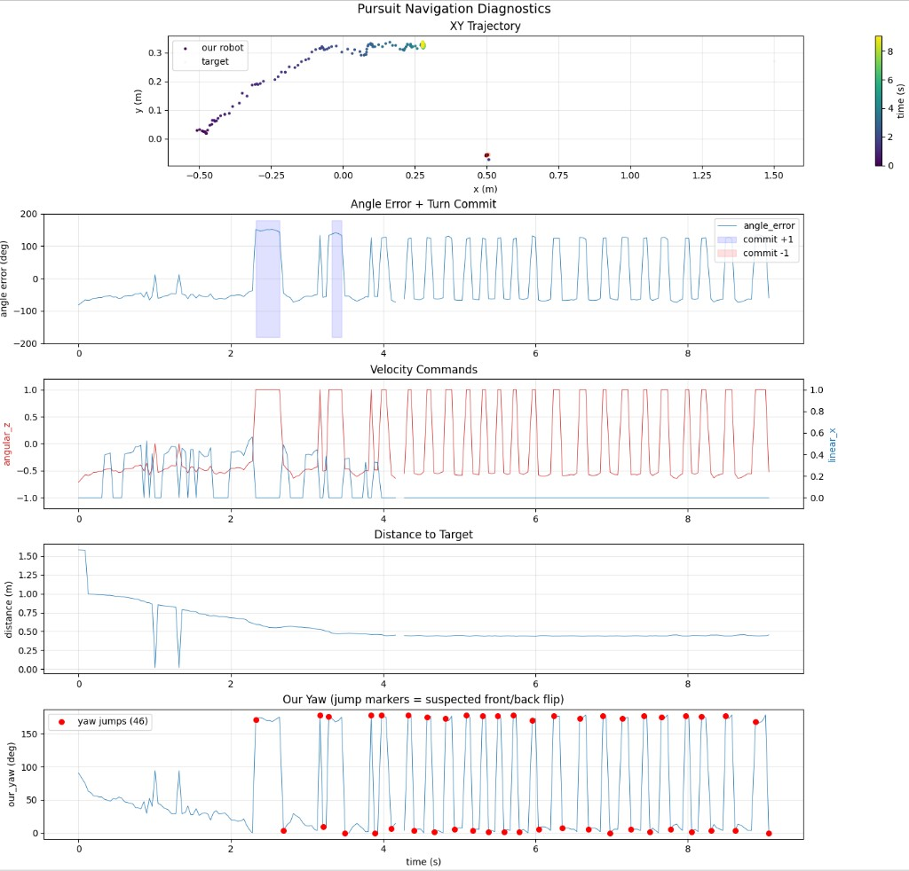
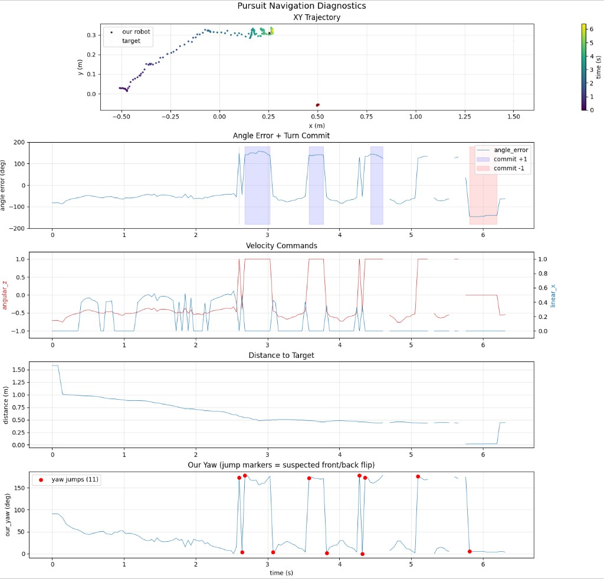
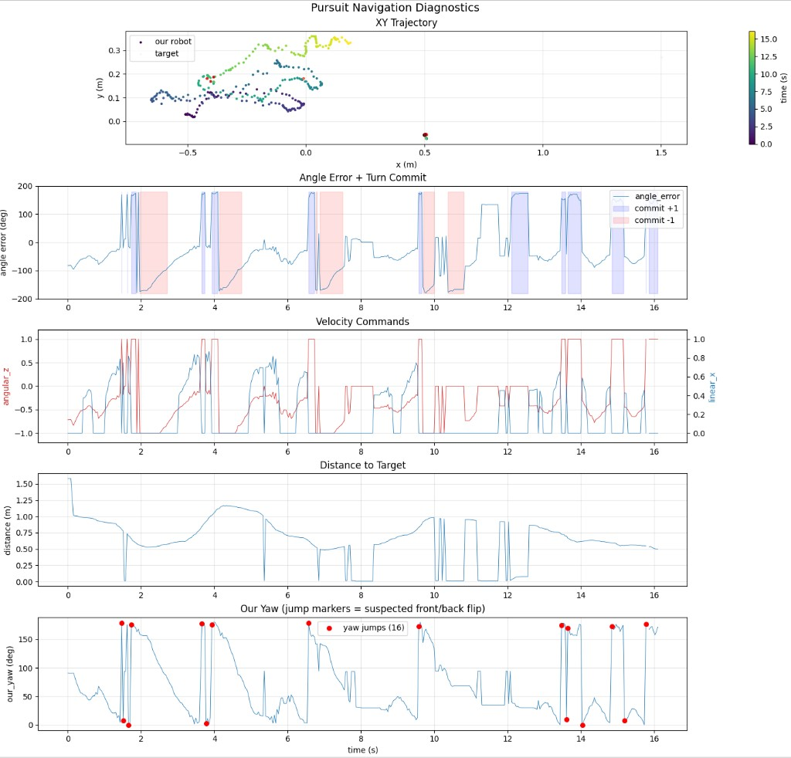
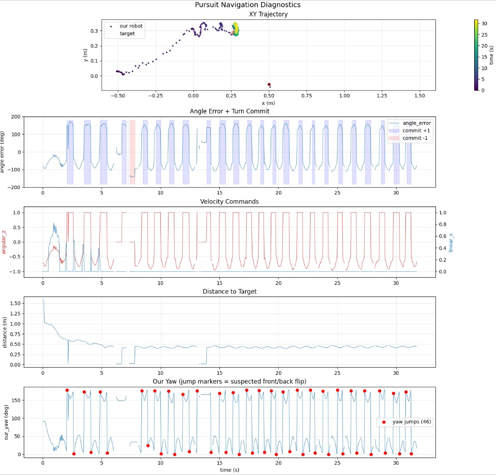

# Experiment 1 Results: Isolate Lag (H1)

## Setup

- **Sim config**: `simulation/sim_config_experiment1.toml`
- **Scenario**: One static opponent (house_bot) at `[0.5, 0.0]`. Our robot (mr_stabs_mk2) at `[-0.5, 0.0]`, facing +y (`start_rotation = 90 deg`). This creates 90 deg of initial heading error -- the target is due east, the robot faces north.
- **Variable**: `command_delay_ms` in `config/experiment1/classes.toml`, swept over {0, 50, 100, 200} ms.
- **Implementation**: `SimTransmitter` buffers commands in a time-stamped deque and only forwards them to the sim connection once their age exceeds `command_delay_ms`.
- **Recording**: MCAP with all topics enabled, ~10-30 seconds per run.

## Results

### Summary Table

| Metric                     | 0 ms    | 50 ms   | 100 ms | 200 ms    |
| -------------------------- | ------- | ------- | ------ | --------- |
| Duration (s)               | 13.2    | 13.4    | 16.1   | 31.7      |
| Ticks                      | 324     | 337     | 395    | 770       |
| Mean \|angle_error\| (deg) | 79.6    | 82.5    | 87.8   | **103.1** |
| Max \|angle_error\| (deg)  | 151.9   | 158.9   | 179.5  | 172.2     |
| Yaw jumps (>90 deg)        | **46**  | 11      | 16     | **46**    |
| Position jumps (>0.2m)     | 4       | 0       | 22     | 2         |
| Target switches            | **111** | **196** | 12     | 48        |
| Spin events                | 0       | 0       | 3      | **10**    |
| Spin event total (s)       | 0.0     | 0.0     | 2.4    | 5.4       |
| Pipeline latency mean (ms) | 13.1    | 12.8    | 12.9   | 12.8      |
| Pipeline latency p95 (ms)  | 14.9    | 14.4    | 14.6   | 14.9      |
| Pipeline latency max (ms)  | 172.3   | 142.5   | 138.3  | 143.0     |

### Diagnostic Plots

#### 0 ms delay (baseline)

#### 50 ms delay

#### 100 ms delay

#### 200 ms delay

## Analysis

### H1 verdict: Lag is a secondary contributor, not the primary cause

Increasing command delay degrades performance measurably:

- Mean |angle_error| rises from 79.6 deg (0 ms) to 103.1 deg (200 ms).
- Spin events appear at 100 ms (3 events, 2.4 s) and grow at 200 ms (10 events, 5.4 s).
- The 200 ms run took 31.7 s to record 770 ticks without ever converging to the target; the robot spirals in the left half of the field.

However, the **baseline (0 ms) is already catastrophically bad**: 79.6 deg mean angle error means the robot spends most of its time pointed nearly perpendicular to the target. The actual pipeline latency is only ~13 ms, which is not a problem. Adding artificial lag makes a bad situation worse, but lag is not the root cause.

### Unexpected finding: Yaw jumps are dominant -- but cause is ambiguous (H2 vs H4)

The most striking result is **46 yaw jumps in the 0 ms baseline**. The yaw plot (bottom panel of the 0 ms figure) shows `our_yaw_deg` oscillating between ~0 deg and ~170 deg starting at t=3s. Each jump causes the controller to see a massive phantom angle error and command a hard correction to a non-existent problem.

**Correction (post-observation):** Video review revealed that these yaw jumps correlate with the neural net locking onto the wrong robot entirely (identity swap, H2), not front/back flips on the correct robot (H4). When the NN briefly assigns the opponent's identity to our robot, the detected yaw changes because the opponent has a different orientation -- this looks identical to a front/back flip in the angle data alone. **Ground truth pose comparison is required to distinguish H2 from H4.** This has now been implemented: the sim sends ground truth poses of all robots, and the analysis script classifies each yaw jump by comparing the detected pose to GT positions of our robot and all opponents.

### Unexpected finding: Phantom target detections (H7)

With only one physical opponent, the nav logged **111 target switches** in the 0 ms run and **196 in the 50 ms run**. This means the perception pipeline is generating multiple distinct detections for the same physical robot -- likely both a HOUSE_BOT keypoint detection and an OPPONENT mask detection, assigned to different frame IDs. The navigation's closest-target logic switches between these phantom targets every few ticks.

### Hysteresis amplifies yaw flip damage (H5)

The 200 ms plot shows nearly continuous blue "commit +1" bands in the angle error panel while the error oscillates wildly. The failure chain:

1. A yaw flip (H4) causes `angle_error` to jump past 135 deg.
2. The hysteresis commits to a turn direction.
3. The next yaw flip occurs before `|angle_error|` drops below the 90 deg release threshold.
4. The hysteresis stays locked, and the robot keeps spinning the wrong way.

## Conclusions

| Hypothesis            | Status                         | Evidence                                                                                   |
| --------------------- | ------------------------------ | ------------------------------------------------------------------------------------------ |
| H1 (lag)              | **Secondary contributor**      | Spin events 0 -> 10 across sweep, but baseline already broken. Real latency is only 13 ms. |
| H2 (identity swaps)   | **Likely primary cause**       | 46 yaw jumps at 0 ms. Video review shows NN locking onto wrong robot. Pending GT confirmation. |
| H4 (yaw flips)        | **Unknown -- needs GT data**   | Cannot distinguish from H2 without ground truth comparison. Previously assumed primary.     |
| H7 (target switching) | **Active problem**             | 111 switches with 1 physical opponent. Phantom dual-detections.                            |
| H5 (hysteresis)       | **Amplifier**                  | Locks in wrong direction after yaw flips, prevents recovery.                               |

## Recommended Next Steps

1. **Re-run experiment 1 with ground truth logging**: The sim now sends GT poses of all robots. The analysis script classifies each yaw jump as identity swap (H2) or front/back flip (H4) by comparing detected pose to GT. This will definitively attribute the yaw jumps.
2. **Investigate H7**: Determine why one opponent produces multiple target detections. May be a frame_id assignment issue in the robot filter.
3. **A/B test hysteresis (H5)**: Once perception is more stable, test whether disabling the committed-turn logic improves or degrades convergence.
