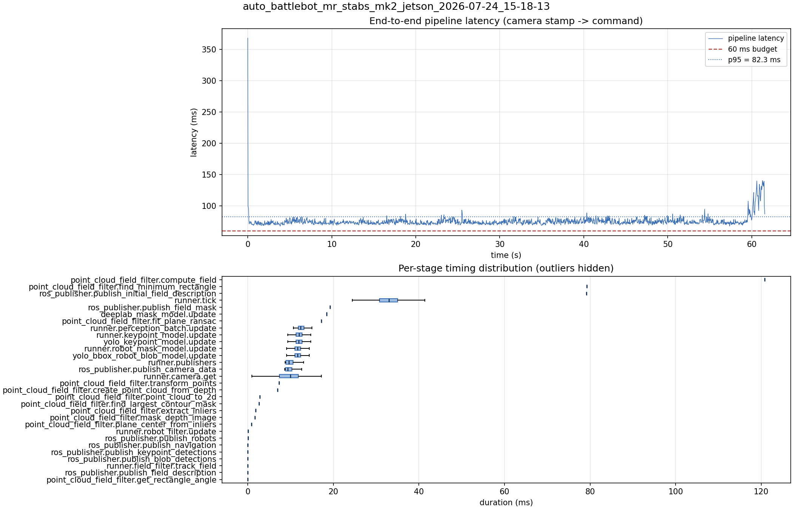

# Latency report: auto_battlebot_mr_stabs_mk2_jetson_2026-07-24_15-18-13

Context: live Jetson, mr_stabs_mk2, 720p30. parallel_models = true, max_loop_rate raised to 60 so the loop frame-locks to the 30 fps camera. Before the publish_camera_data guard/reorder. Parallel side of the loop-rate A/B.

- Source: `/home/ben/Desktop/auto_battlebot_mr_stabs_mk2_jetson_2026-07-24_15-18-13.mcap`
- Generated: 2026-07-24 15:22 by `scripts/mcap_latency_report.py`
- Duration: 61.6 s
- Window: after field init (5.5 s into the recording)
- Loop rate: 30.4 Hz mean
- End-to-end latency: mean 75.2 ms / p95 82.3 ms / max 368.1 ms
- Budget: 60 ms -> p95 is OVER BUDGET

| Stage | n | mean (ms) | median (ms) | p95 (ms) | max (ms) | % of tick |
| --- | ---: | ---: | ---: | ---: | ---: | ---: |
| point_cloud_field_filter.compute_field | 1 | 120.84 | 120.84 | 120.84 | 120.84 | 364.4% |
| point_cloud_field_filter.find_minimum_rectangle | 1 | 79.25 | 79.25 | 79.25 | 79.25 | 239.0% |
| ros_publisher.publish_initial_field_description | 1 | 79.17 | 79.17 | 79.17 | 79.17 | 238.7% |
| pipeline.latency | 1,844 | 75.18 | 73.37 | 82.27 | 368.14 | - |
| runner.tick | 1,844 | 33.17 | 33.01 | 39.13 | 377.66 | 100.0% |
| ros_publisher.publish_field_mask | 1 | 19.22 | 19.22 | 19.22 | 19.22 | 58.0% |
| deeplab_mask_model.update | 1 | 18.45 | 18.45 | 18.45 | 18.45 | 55.6% |
| point_cloud_field_filter.fit_plane_ransac | 1 | 17.18 | 17.18 | 17.18 | 17.18 | 51.8% |
| runner.perception_batch.update | 1,844 | 12.86 | 12.38 | 15.71 | 43.56 | 38.8% |
| runner.keypoint_model.update | 1,844 | 12.22 | 11.96 | 14.38 | 42.16 | 36.9% |
| yolo_keypoint_model.update | 1,844 | 12.22 | 11.95 | 14.37 | 42.15 | 36.8% |
| runner.robot_mask_model.update | 1,844 | 11.90 | 11.66 | 14.20 | 36.45 | 35.9% |
| yolo_bbox_robot_blob_model.update | 1,844 | 11.90 | 11.66 | 14.19 | 36.44 | 35.9% |
| runner.publishers | 1,844 | 10.17 | 9.58 | 13.89 | 23.18 | 30.7% |
| ros_publisher.publish_camera_data | 1,844 | 9.99 | 9.37 | 13.70 | 23.07 | 30.1% |
| runner.camera.get | 1,844 | 9.39 | 9.94 | 13.88 | 109.47 | 28.3% |
| point_cloud_field_filter.transform_points | 1 | 7.35 | 7.35 | 7.35 | 7.35 | 22.1% |
| point_cloud_field_filter.create_point_cloud_from_depth | 1 | 6.93 | 6.93 | 6.93 | 6.93 | 20.9% |
| point_cloud_field_filter.point_cloud_to_2d | 1 | 2.80 | 2.80 | 2.80 | 2.80 | 8.5% |
| point_cloud_field_filter.find_largest_contour_mask | 1 | 2.60 | 2.60 | 2.60 | 2.60 | 7.9% |
| point_cloud_field_filter.extract_inliers | 1 | 1.83 | 1.83 | 1.83 | 1.83 | 5.5% |
| point_cloud_field_filter.mask_depth_image | 1 | 1.67 | 1.67 | 1.67 | 1.67 | 5.0% |
| point_cloud_field_filter.plane_center_from_inliers | 1 | 0.87 | 0.87 | 0.87 | 0.87 | 2.6% |
| runner.robot_filter.update | 1,844 | 0.09 | 0.08 | 0.11 | 4.28 | 0.3% |
| ros_publisher.publish_robots | 1,844 | 0.07 | 0.05 | 0.13 | 2.95 | 0.2% |
| ros_publisher.publish_navigation | 1,844 | 0.04 | 0.03 | 0.06 | 4.70 | 0.1% |
| ros_publisher.publish_keypoint_detections | 1,844 | 0.04 | 0.01 | 0.04 | 3.94 | 0.1% |
| ros_publisher.publish_blob_detections | 1,844 | 0.03 | 0.02 | 0.04 | 2.15 | 0.1% |
| runner.field_filter.track_field | 1,844 | 0.02 | 0.02 | 0.04 | 0.19 | 0.1% |
| ros_publisher.publish_field_description | 1,844 | 0.01 | 0.01 | 0.01 | 2.25 | 0.0% |
| point_cloud_field_filter.get_rectangle_angle | 1 | 0.01 | 0.01 | 0.01 | 0.01 | 0.0% |

