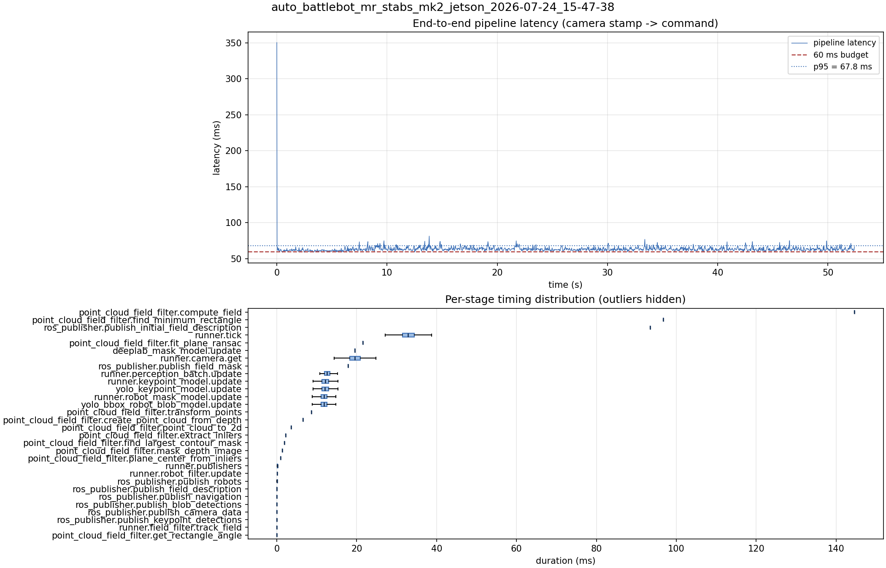

# Latency report: auto_battlebot_mr_stabs_mk2_jetson_2026-07-24_15-47-38

Context: live Jetson, mr_stabs_mk2, 720p30. parallel_models = true, max_loop_rate = 60, plus the publish_camera_data guard/reorder (first Jetson test of that fix: e2e 75.2 -> 63.4 ms vs the 15-18-13 run) but before the shared-preprocess cache (batch still 12.7 ms). Sits between 15-18-13 and 16-15-54 in the day's progression.

- Source: `/home/ben/Desktop/auto_battlebot_mr_stabs_mk2_jetson_2026-07-24_15-47-38.mcap`
- Generated: 2026-07-24 15:50 by `scripts/mcap_latency_report.py`
- Duration: 52.4 s
- Window: after field init (3.8 s into the recording)
- Loop rate: 30.2 Hz mean
- End-to-end latency: mean 63.4 ms / p95 67.8 ms / max 350.5 ms
- Budget: 60 ms -> p95 is OVER BUDGET

| Stage | n | mean (ms) | median (ms) | p95 (ms) | max (ms) | % of tick |
| --- | ---: | ---: | ---: | ---: | ---: | ---: |
| point_cloud_field_filter.compute_field | 1 | 144.60 | 144.60 | 144.60 | 144.60 | 436.4% |
| point_cloud_field_filter.find_minimum_rectangle | 1 | 96.76 | 96.76 | 96.76 | 96.76 | 292.0% |
| ros_publisher.publish_initial_field_description | 1 | 93.44 | 93.44 | 93.44 | 93.44 | 282.0% |
| pipeline.latency | 1,574 | 63.44 | 62.82 | 67.75 | 350.51 | - |
| runner.tick | 1,574 | 33.14 | 32.88 | 37.42 | 366.41 | 100.0% |
| point_cloud_field_filter.fit_plane_ransac | 1 | 21.55 | 21.55 | 21.55 | 21.55 | 65.0% |
| deeplab_mask_model.update | 1 | 19.55 | 19.55 | 19.55 | 19.55 | 59.0% |
| runner.camera.get | 1,574 | 19.45 | 19.56 | 23.05 | 69.52 | 58.7% |
| ros_publisher.publish_field_mask | 1 | 17.87 | 17.87 | 17.87 | 17.87 | 53.9% |
| runner.perception_batch.update | 1,574 | 12.74 | 12.53 | 14.75 | 24.13 | 38.5% |
| runner.keypoint_model.update | 1,574 | 12.17 | 12.08 | 14.25 | 22.13 | 36.7% |
| yolo_keypoint_model.update | 1,574 | 12.16 | 12.07 | 14.25 | 22.12 | 36.7% |
| runner.robot_mask_model.update | 1,574 | 11.85 | 11.78 | 13.86 | 22.09 | 35.8% |
| yolo_bbox_robot_blob_model.update | 1,574 | 11.84 | 11.77 | 13.85 | 22.08 | 35.7% |
| point_cloud_field_filter.transform_points | 1 | 8.67 | 8.67 | 8.67 | 8.67 | 26.2% |
| point_cloud_field_filter.create_point_cloud_from_depth | 1 | 6.58 | 6.58 | 6.58 | 6.58 | 19.9% |
| point_cloud_field_filter.point_cloud_to_2d | 1 | 3.55 | 3.55 | 3.55 | 3.55 | 10.7% |
| point_cloud_field_filter.extract_inliers | 1 | 2.16 | 2.16 | 2.16 | 2.16 | 6.5% |
| point_cloud_field_filter.find_largest_contour_mask | 1 | 1.91 | 1.91 | 1.91 | 1.91 | 5.8% |
| point_cloud_field_filter.mask_depth_image | 1 | 1.31 | 1.31 | 1.31 | 1.31 | 3.9% |
| point_cloud_field_filter.plane_center_from_inliers | 1 | 0.95 | 0.95 | 0.95 | 0.95 | 2.9% |
| runner.publishers | 1,574 | 0.17 | 0.15 | 0.20 | 1.28 | 0.5% |
| runner.robot_filter.update | 1,574 | 0.08 | 0.08 | 0.11 | 0.23 | 0.2% |
| ros_publisher.publish_robots | 1,574 | 0.07 | 0.07 | 0.10 | 0.94 | 0.2% |
| ros_publisher.publish_field_description | 1,574 | 0.04 | 0.03 | 0.04 | 0.09 | 0.1% |
| ros_publisher.publish_navigation | 1,574 | 0.03 | 0.03 | 0.04 | 0.13 | 0.1% |
| ros_publisher.publish_blob_detections | 1,574 | 0.03 | 0.02 | 0.03 | 1.11 | 0.1% |
| ros_publisher.publish_camera_data | 1,574 | 0.02 | 0.02 | 0.03 | 0.87 | 0.1% |
| ros_publisher.publish_keypoint_detections | 1,574 | 0.02 | 0.01 | 0.03 | 1.02 | 0.1% |
| runner.field_filter.track_field | 1,574 | 0.02 | 0.02 | 0.04 | 0.10 | 0.1% |
| point_cloud_field_filter.get_rectangle_angle | 1 | 0.01 | 0.01 | 0.01 | 0.01 | 0.0% |

