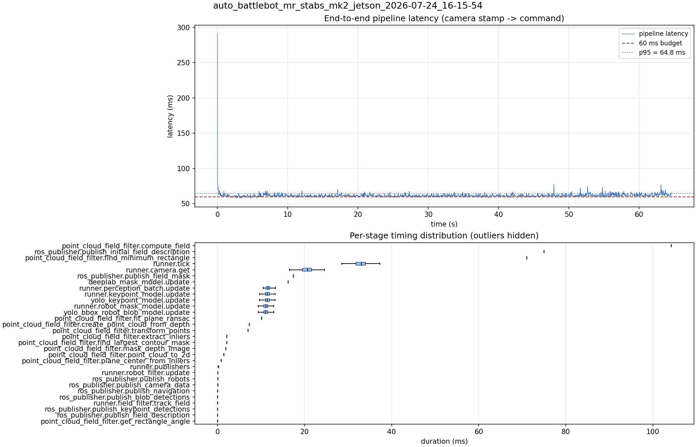

# Latency report: auto_battlebot_mr_stabs_mk2_jetson_2026-07-24_16-15-54

Context: live Jetson, mr_stabs_mk2, 720p30. parallel_models = true, max_loop_rate = 60, plus the publish_camera_data guard/reorder (10 ms -> 0.05 ms, moved after send) and the shared-preprocess input cache (batch 12.9 -> 11.7 ms; later reverted, see ../shared_preprocess_2026-07-24.md). Best end-to-end so far: 61.6 ms mean / 64.8 ms p95.

- Source: `/home/ben/Desktop/auto_battlebot_mr_stabs_mk2_jetson_2026-07-24_16-15-54.mcap`
- Generated: 2026-07-24 16:17 by `scripts/mcap_latency_report.py`
- Duration: 64.6 s
- Window: after field init (3.6 s into the recording)
- Loop rate: 30.1 Hz mean
- End-to-end latency: mean 61.6 ms / p95 64.8 ms / max 291.2 ms
- Budget: 60 ms -> p95 is OVER BUDGET

| Stage | n | mean (ms) | median (ms) | p95 (ms) | max (ms) | % of tick |
| --- | ---: | ---: | ---: | ---: | ---: | ---: |
| point_cloud_field_filter.compute_field | 1 | 104.21 | 104.21 | 104.21 | 104.21 | 315.2% |
| ros_publisher.publish_initial_field_description | 1 | 74.95 | 74.95 | 74.95 | 74.95 | 226.7% |
| point_cloud_field_filter.find_minimum_rectangle | 1 | 70.99 | 70.99 | 70.99 | 70.99 | 214.7% |
| pipeline.latency | 1,939 | 61.63 | 61.11 | 64.78 | 291.25 | - |
| runner.tick | 1,939 | 33.06 | 33.01 | 36.23 | 306.36 | 100.0% |
| runner.camera.get | 1,939 | 20.46 | 20.66 | 23.10 | 70.56 | 61.9% |
| ros_publisher.publish_field_mask | 1 | 17.39 | 17.39 | 17.39 | 17.39 | 52.6% |
| deeplab_mask_model.update | 1 | 16.23 | 16.23 | 16.23 | 16.23 | 49.1% |
| runner.perception_batch.update | 1,939 | 11.74 | 11.57 | 13.13 | 21.66 | 35.5% |
| runner.keypoint_model.update | 1,939 | 11.48 | 11.42 | 12.87 | 20.93 | 34.7% |
| yolo_keypoint_model.update | 1,939 | 11.48 | 11.41 | 12.87 | 20.92 | 34.7% |
| runner.robot_mask_model.update | 1,939 | 11.14 | 11.07 | 12.57 | 20.80 | 33.7% |
| yolo_bbox_robot_blob_model.update | 1,939 | 11.14 | 11.06 | 12.56 | 20.80 | 33.7% |
| point_cloud_field_filter.fit_plane_ransac | 1 | 10.14 | 10.14 | 10.14 | 10.14 | 30.7% |
| point_cloud_field_filter.create_point_cloud_from_depth | 1 | 7.32 | 7.32 | 7.32 | 7.32 | 22.1% |
| point_cloud_field_filter.transform_points | 1 | 7.01 | 7.01 | 7.01 | 7.01 | 21.2% |
| point_cloud_field_filter.extract_inliers | 1 | 2.13 | 2.13 | 2.13 | 2.13 | 6.4% |
| point_cloud_field_filter.find_largest_contour_mask | 1 | 2.12 | 2.12 | 2.12 | 2.12 | 6.4% |
| point_cloud_field_filter.mask_depth_image | 1 | 1.89 | 1.89 | 1.89 | 1.89 | 5.7% |
| point_cloud_field_filter.point_cloud_to_2d | 1 | 1.46 | 1.46 | 1.46 | 1.46 | 4.4% |
| point_cloud_field_filter.plane_center_from_inliers | 1 | 0.80 | 0.80 | 0.80 | 0.80 | 2.4% |
| runner.publishers | 1,939 | 0.21 | 0.20 | 0.27 | 1.22 | 0.6% |
| runner.robot_filter.update | 1,939 | 0.08 | 0.08 | 0.11 | 0.57 | 0.3% |
| ros_publisher.publish_robots | 1,939 | 0.07 | 0.07 | 0.09 | 0.96 | 0.2% |
| ros_publisher.publish_camera_data | 1,939 | 0.05 | 0.04 | 0.07 | 0.40 | 0.1% |
| ros_publisher.publish_navigation | 1,939 | 0.03 | 0.03 | 0.04 | 1.05 | 0.1% |
| ros_publisher.publish_blob_detections | 1,939 | 0.02 | 0.02 | 0.03 | 0.18 | 0.1% |
| runner.field_filter.track_field | 1,939 | 0.02 | 0.02 | 0.05 | 0.28 | 0.1% |
| ros_publisher.publish_keypoint_detections | 1,939 | 0.02 | 0.01 | 0.03 | 0.79 | 0.1% |
| ros_publisher.publish_field_description | 1,939 | 0.01 | 0.01 | 0.01 | 0.15 | 0.0% |
| point_cloud_field_filter.get_rectangle_angle | 1 | 0.01 | 0.01 | 0.01 | 0.01 | 0.0% |

