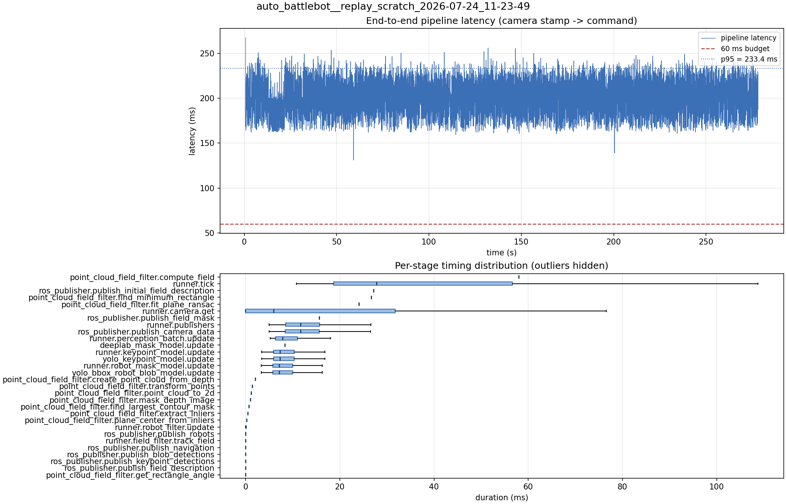

# Latency report: 2026-05-01T17-42-24 (par)

- Source: `data/recordings/auto_battlebot__replay_scratch_2026-07-24_11-23-49.mcap`
- Generated: 2026-07-24 11:50 by `scripts/mcap_latency_report.py`
- Duration: 278.2 s
- Loop rate: 26.8 Hz mean
- End-to-end latency: mean 204.3 ms / p95 233.4 ms / max 267.5 ms
- Budget: 60 ms -> p95 is OVER BUDGET

| Stage | n | mean (ms) | median (ms) | p95 (ms) | max (ms) | % of tick |
| --- | ---: | ---: | ---: | ---: | ---: | ---: |
| pipeline.latency | 6,093 | 204.33 | 207.73 | 233.42 | 267.45 | - |
| point_cloud_field_filter.compute_field | 1 | 58.00 | 58.00 | 58.00 | 58.00 | 154.5% |
| runner.tick | 6,101 | 37.53 | 27.83 | 82.81 | 247.17 | 100.0% |
| ros_publisher.publish_initial_field_description | 1 | 27.15 | 27.15 | 27.15 | 27.15 | 72.3% |
| point_cloud_field_filter.find_minimum_rectangle | 1 | 26.73 | 26.73 | 26.73 | 26.73 | 71.2% |
| point_cloud_field_filter.fit_plane_ransac | 1 | 24.05 | 24.05 | 24.05 | 24.05 | 64.1% |
| runner.camera.get | 6,101 | 15.98 | 5.95 | 53.58 | 122.91 | 42.6% |
| ros_publisher.publish_field_mask | 1 | 15.66 | 15.66 | 15.66 | 15.66 | 41.7% |
| runner.publishers | 6,093 | 12.42 | 11.71 | 21.63 | 36.77 | 33.1% |
| ros_publisher.publish_camera_data | 6,101 | 12.37 | 11.66 | 21.58 | 36.62 | 33.0% |
| runner.perception_batch.update | 6,093 | 9.00 | 7.88 | 15.72 | 28.57 | 24.0% |
| deeplab_mask_model.update | 1 | 8.37 | 8.37 | 8.37 | 8.37 | 22.3% |
| runner.keypoint_model.update | 6,093 | 8.35 | 7.32 | 14.61 | 28.34 | 22.3% |
| yolo_keypoint_model.update | 6,093 | 8.35 | 7.32 | 14.60 | 28.34 | 22.2% |
| runner.robot_mask_model.update | 6,093 | 8.15 | 7.11 | 14.22 | 24.35 | 21.7% |
| yolo_bbox_robot_blob_model.update | 6,093 | 8.15 | 7.11 | 14.21 | 24.34 | 21.7% |
| point_cloud_field_filter.create_point_cloud_from_depth | 1 | 2.03 | 2.03 | 2.03 | 2.03 | 5.4% |
| point_cloud_field_filter.transform_points | 1 | 1.46 | 1.46 | 1.46 | 1.46 | 3.9% |
| point_cloud_field_filter.point_cloud_to_2d | 1 | 1.17 | 1.17 | 1.17 | 1.17 | 3.1% |
| point_cloud_field_filter.mask_depth_image | 1 | 1.02 | 1.02 | 1.02 | 1.02 | 2.7% |
| point_cloud_field_filter.find_largest_contour_mask | 1 | 0.70 | 0.70 | 0.70 | 0.70 | 1.9% |
| point_cloud_field_filter.extract_inliers | 1 | 0.43 | 0.43 | 0.43 | 0.43 | 1.1% |
| point_cloud_field_filter.plane_center_from_inliers | 1 | 0.22 | 0.22 | 0.22 | 0.22 | 0.6% |
| runner.robot_filter.update | 6,093 | 0.06 | 0.06 | 0.12 | 0.30 | 0.2% |
| ros_publisher.publish_robots | 6,093 | 0.02 | 0.02 | 0.03 | 1.69 | 0.1% |
| runner.field_filter.track_field | 6,093 | 0.01 | 0.01 | 0.02 | 0.22 | 0.0% |
| ros_publisher.publish_navigation | 6,093 | 0.01 | 0.01 | 0.02 | 0.64 | 0.0% |
| ros_publisher.publish_blob_detections | 6,093 | 0.01 | 0.01 | 0.02 | 0.14 | 0.0% |
| ros_publisher.publish_keypoint_detections | 6,093 | 0.00 | 0.00 | 0.01 | 0.62 | 0.0% |
| ros_publisher.publish_field_description | 6,093 | 0.00 | 0.00 | 0.01 | 0.15 | 0.0% |
| point_cloud_field_filter.get_rectangle_angle | 1 | 0.00 | 0.00 | 0.00 | 0.00 | 0.0% |

