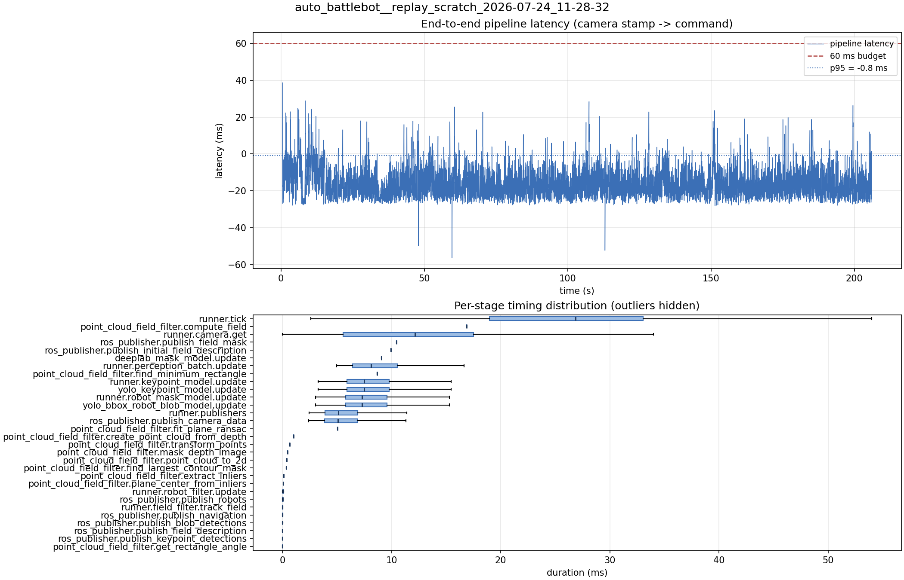

# Latency report: 2026-05-02T10-06-06 (par)

Context: desktop x86 replay of an NHRL May SVO (mrs_buff_mk3_playback base, prescribed svo_start_frame, real-time mode, max_loop_rate = 30). ParallelModelBatch with both engines on the default CUDA stream. Phase 2 of the desktop A/B in ../comparison.md.

- Source: `data/recordings/auto_battlebot__replay_scratch_2026-07-24_11-28-32.mcap`
- Generated: 2026-07-24 11:50 by `scripts/mcap_latency_report.py`
- Duration: 206.1 s
- Loop rate: 33.1 Hz mean
- End-to-end latency: mean -15.5 ms / p95 -0.8 ms / max 38.7 ms
- Budget: 60 ms -> p95 is within budget

| Stage | n | mean (ms) | median (ms) | p95 (ms) | max (ms) | % of tick |
| --- | ---: | ---: | ---: | ---: | ---: | ---: |
| runner.tick | 6,150 | 26.33 | 26.86 | 41.71 | 118.15 | 100.0% |
| point_cloud_field_filter.compute_field | 1 | 16.89 | 16.89 | 16.89 | 16.89 | 64.2% |
| runner.camera.get | 6,150 | 11.67 | 12.15 | 23.65 | 60.61 | 44.3% |
| ros_publisher.publish_field_mask | 1 | 10.44 | 10.44 | 10.44 | 10.44 | 39.6% |
| ros_publisher.publish_initial_field_description | 1 | 9.93 | 9.93 | 9.93 | 9.93 | 37.7% |
| deeplab_mask_model.update | 1 | 9.06 | 9.06 | 9.06 | 9.06 | 34.4% |
| runner.perception_batch.update | 6,138 | 8.79 | 8.11 | 14.05 | 28.51 | 33.4% |
| point_cloud_field_filter.find_minimum_rectangle | 1 | 8.67 | 8.67 | 8.67 | 8.67 | 32.9% |
| runner.keypoint_model.update | 6,138 | 8.10 | 7.47 | 13.26 | 27.38 | 30.8% |
| yolo_keypoint_model.update | 6,138 | 8.10 | 7.47 | 13.25 | 27.38 | 30.8% |
| runner.robot_mask_model.update | 6,138 | 7.93 | 7.31 | 13.08 | 25.62 | 30.1% |
| yolo_bbox_robot_blob_model.update | 6,138 | 7.92 | 7.30 | 13.07 | 25.60 | 30.1% |
| runner.publishers | 6,138 | 5.75 | 5.13 | 10.84 | 21.00 | 21.8% |
| ros_publisher.publish_camera_data | 6,150 | 5.71 | 5.08 | 10.78 | 20.92 | 21.7% |
| point_cloud_field_filter.fit_plane_ransac | 1 | 5.03 | 5.03 | 5.03 | 5.03 | 19.1% |
| point_cloud_field_filter.create_point_cloud_from_depth | 1 | 1.00 | 1.00 | 1.00 | 1.00 | 3.8% |
| point_cloud_field_filter.transform_points | 1 | 0.66 | 0.66 | 0.66 | 0.66 | 2.5% |
| point_cloud_field_filter.mask_depth_image | 1 | 0.48 | 0.48 | 0.48 | 0.48 | 1.8% |
| point_cloud_field_filter.point_cloud_to_2d | 1 | 0.39 | 0.39 | 0.39 | 0.39 | 1.5% |
| point_cloud_field_filter.find_largest_contour_mask | 1 | 0.35 | 0.35 | 0.35 | 0.35 | 1.3% |
| point_cloud_field_filter.extract_inliers | 1 | 0.13 | 0.13 | 0.13 | 0.13 | 0.5% |
| point_cloud_field_filter.plane_center_from_inliers | 1 | 0.08 | 0.08 | 0.08 | 0.08 | 0.3% |
| runner.robot_filter.update | 6,138 | 0.05 | 0.04 | 0.09 | 0.25 | 0.2% |
| ros_publisher.publish_robots | 6,138 | 0.02 | 0.02 | 0.04 | 4.16 | 0.1% |
| runner.field_filter.track_field | 6,138 | 0.01 | 0.01 | 0.03 | 0.20 | 0.1% |
| ros_publisher.publish_navigation | 6,138 | 0.01 | 0.01 | 0.03 | 1.16 | 0.0% |
| ros_publisher.publish_blob_detections | 6,138 | 0.01 | 0.01 | 0.03 | 0.42 | 0.0% |
| ros_publisher.publish_field_description | 6,138 | 0.01 | 0.00 | 0.01 | 0.05 | 0.0% |
| ros_publisher.publish_keypoint_detections | 6,138 | 0.00 | 0.00 | 0.01 | 2.90 | 0.0% |
| point_cloud_field_filter.get_rectangle_angle | 1 | 0.00 | 0.00 | 0.00 | 0.00 | 0.0% |
| pipeline.latency | 6,138 | -15.51 | -16.99 | -0.84 | 38.66 | - |

