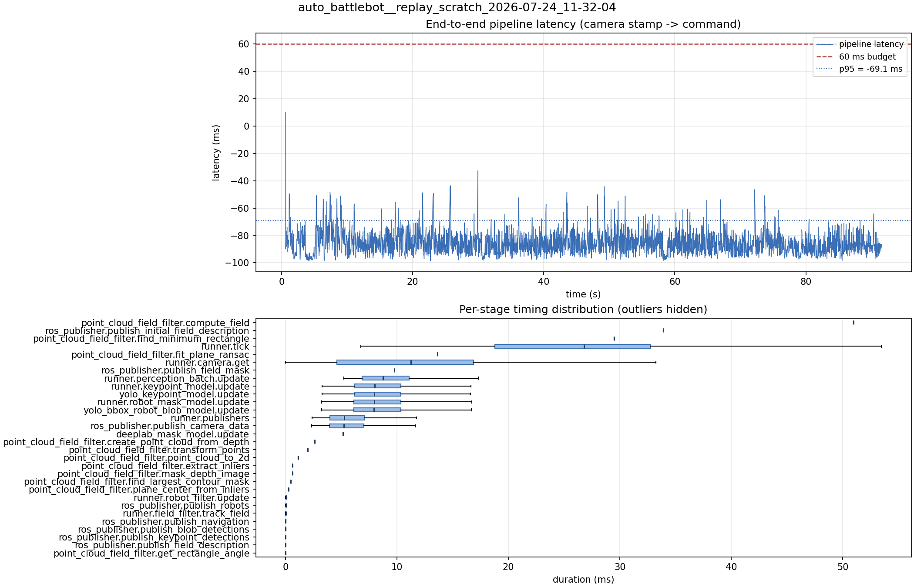

# Latency report: 2026-05-02T11-45-08 (par)

- Source: `data/recordings/auto_battlebot__replay_scratch_2026-07-24_11-32-04.mcap`
- Generated: 2026-07-24 11:50 by `scripts/mcap_latency_report.py`
- Duration: 91.5 s
- Loop rate: 33.1 Hz mean
- End-to-end latency: mean -84.8 ms / p95 -69.1 ms / max 9.9 ms
- Budget: 60 ms -> p95 is within budget

| Stage | n | mean (ms) | median (ms) | p95 (ms) | max (ms) | % of tick |
| --- | ---: | ---: | ---: | ---: | ---: | ---: |
| point_cloud_field_filter.compute_field | 1 | 50.96 | 50.96 | 50.96 | 50.96 | 194.4% |
| ros_publisher.publish_initial_field_description | 1 | 33.90 | 33.90 | 33.90 | 33.90 | 129.3% |
| point_cloud_field_filter.find_minimum_rectangle | 1 | 29.48 | 29.48 | 29.48 | 29.48 | 112.4% |
| runner.tick | 2,728 | 26.22 | 26.79 | 41.54 | 159.28 | 100.0% |
| point_cloud_field_filter.fit_plane_ransac | 1 | 13.61 | 13.61 | 13.61 | 13.61 | 51.9% |
| runner.camera.get | 2,728 | 10.99 | 11.25 | 23.34 | 49.11 | 41.9% |
| ros_publisher.publish_field_mask | 1 | 9.76 | 9.76 | 9.76 | 9.76 | 37.2% |
| runner.perception_batch.update | 2,715 | 9.24 | 8.74 | 14.51 | 24.20 | 35.2% |
| runner.keypoint_model.update | 2,715 | 8.53 | 7.98 | 13.65 | 24.04 | 32.5% |
| yolo_keypoint_model.update | 2,715 | 8.52 | 7.98 | 13.64 | 24.04 | 32.5% |
| runner.robot_mask_model.update | 2,715 | 8.45 | 7.95 | 13.59 | 21.94 | 32.2% |
| yolo_bbox_robot_blob_model.update | 2,715 | 8.44 | 7.94 | 13.58 | 21.93 | 32.2% |
| runner.publishers | 2,715 | 5.84 | 5.26 | 11.19 | 22.78 | 22.3% |
| ros_publisher.publish_camera_data | 2,728 | 5.80 | 5.21 | 11.19 | 22.58 | 22.1% |
| deeplab_mask_model.update | 1 | 5.15 | 5.15 | 5.15 | 5.15 | 19.7% |
| point_cloud_field_filter.create_point_cloud_from_depth | 1 | 2.62 | 2.62 | 2.62 | 2.62 | 10.0% |
| point_cloud_field_filter.transform_points | 1 | 2.00 | 2.00 | 2.00 | 2.00 | 7.6% |
| point_cloud_field_filter.point_cloud_to_2d | 1 | 1.14 | 1.14 | 1.14 | 1.14 | 4.4% |
| point_cloud_field_filter.extract_inliers | 1 | 0.64 | 0.64 | 0.64 | 0.64 | 2.4% |
| point_cloud_field_filter.mask_depth_image | 1 | 0.63 | 0.63 | 0.63 | 0.63 | 2.4% |
| point_cloud_field_filter.find_largest_contour_mask | 1 | 0.46 | 0.46 | 0.46 | 0.46 | 1.7% |
| point_cloud_field_filter.plane_center_from_inliers | 1 | 0.26 | 0.26 | 0.26 | 0.26 | 1.0% |
| runner.robot_filter.update | 2,715 | 0.06 | 0.06 | 0.11 | 0.31 | 0.2% |
| ros_publisher.publish_robots | 2,715 | 0.02 | 0.02 | 0.05 | 0.91 | 0.1% |
| runner.field_filter.track_field | 2,715 | 0.02 | 0.01 | 0.04 | 0.22 | 0.1% |
| ros_publisher.publish_navigation | 2,715 | 0.01 | 0.01 | 0.03 | 0.82 | 0.0% |
| ros_publisher.publish_blob_detections | 2,715 | 0.01 | 0.01 | 0.03 | 0.89 | 0.0% |
| ros_publisher.publish_keypoint_detections | 2,715 | 0.01 | 0.00 | 0.01 | 0.66 | 0.0% |
| ros_publisher.publish_field_description | 2,715 | 0.01 | 0.00 | 0.01 | 0.13 | 0.0% |
| point_cloud_field_filter.get_rectangle_angle | 1 | 0.00 | 0.00 | 0.00 | 0.00 | 0.0% |
| pipeline.latency | 2,715 | -84.81 | -86.20 | -69.12 | 9.94 | - |

