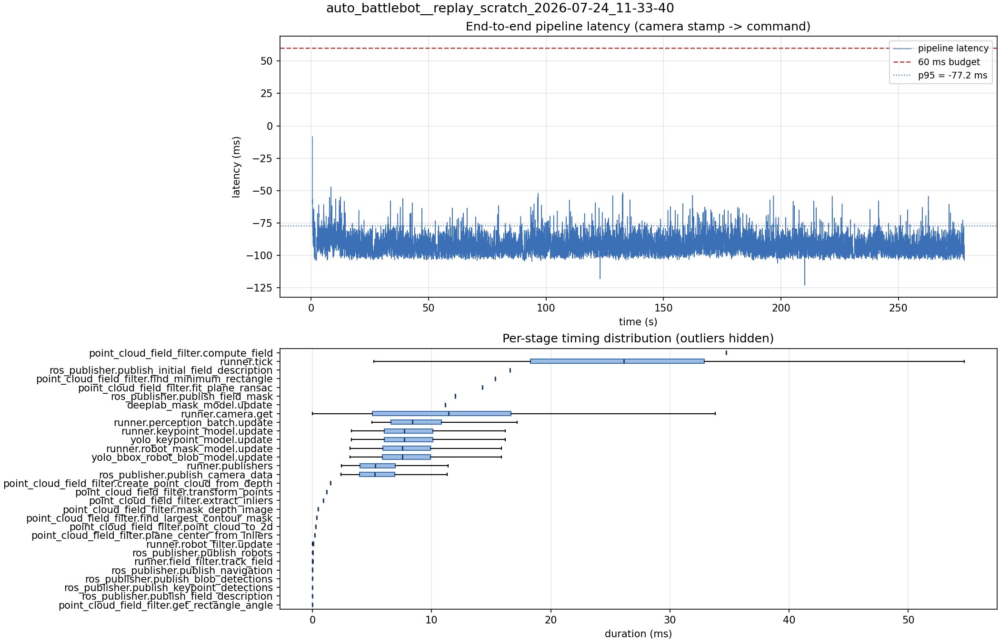

# Latency report: 2026-05-02T14-12-27 (par)

Context: desktop x86 replay of an NHRL May SVO (mrs_buff_mk3_playback base, prescribed svo_start_frame, real-time mode, max_loop_rate = 30). ParallelModelBatch with both engines on the default CUDA stream. Phase 2 of the desktop A/B in ../comparison.md.

- Source: `data/recordings/auto_battlebot__replay_scratch_2026-07-24_11-33-40.mcap`
- Generated: 2026-07-24 11:50 by `scripts/mcap_latency_report.py`
- Duration: 278.1 s
- Loop rate: 33.2 Hz mean
- End-to-end latency: mean -91.3 ms / p95 -77.2 ms / max -8.3 ms
- Budget: 60 ms -> p95 is within budget

| Stage | n | mean (ms) | median (ms) | p95 (ms) | max (ms) | % of tick |
| --- | ---: | ---: | ---: | ---: | ---: | ---: |
| point_cloud_field_filter.compute_field | 1 | 34.72 | 34.72 | 34.72 | 34.72 | 133.6% |
| runner.tick | 8,313 | 26.00 | 26.15 | 42.00 | 149.64 | 100.0% |
| ros_publisher.publish_initial_field_description | 1 | 16.59 | 16.59 | 16.59 | 16.59 | 63.8% |
| point_cloud_field_filter.find_minimum_rectangle | 1 | 15.36 | 15.36 | 15.36 | 15.36 | 59.1% |
| point_cloud_field_filter.fit_plane_ransac | 1 | 14.28 | 14.28 | 14.28 | 14.28 | 54.9% |
| ros_publisher.publish_field_mask | 1 | 12.00 | 12.00 | 12.00 | 12.00 | 46.2% |
| deeplab_mask_model.update | 1 | 11.14 | 11.14 | 11.14 | 11.14 | 42.9% |
| runner.camera.get | 8,313 | 11.08 | 11.43 | 23.34 | 63.67 | 42.6% |
| runner.perception_batch.update | 8,302 | 8.99 | 8.40 | 14.25 | 26.28 | 34.6% |
| runner.keypoint_model.update | 8,302 | 8.28 | 7.71 | 13.51 | 23.26 | 31.8% |
| yolo_keypoint_model.update | 8,302 | 8.28 | 7.70 | 13.50 | 23.25 | 31.8% |
| runner.robot_mask_model.update | 8,302 | 8.12 | 7.56 | 13.24 | 25.95 | 31.2% |
| yolo_bbox_robot_blob_model.update | 8,302 | 8.12 | 7.55 | 13.23 | 25.94 | 31.2% |
| runner.publishers | 8,302 | 5.78 | 5.27 | 10.62 | 19.82 | 22.2% |
| ros_publisher.publish_camera_data | 8,313 | 5.73 | 5.22 | 10.56 | 19.74 | 22.0% |
| point_cloud_field_filter.create_point_cloud_from_depth | 1 | 1.53 | 1.53 | 1.53 | 1.53 | 5.9% |
| point_cloud_field_filter.transform_points | 1 | 1.21 | 1.21 | 1.21 | 1.21 | 4.6% |
| point_cloud_field_filter.extract_inliers | 1 | 0.93 | 0.93 | 0.93 | 0.93 | 3.6% |
| point_cloud_field_filter.mask_depth_image | 1 | 0.48 | 0.48 | 0.48 | 0.48 | 1.9% |
| point_cloud_field_filter.find_largest_contour_mask | 1 | 0.36 | 0.36 | 0.36 | 0.36 | 1.4% |
| point_cloud_field_filter.point_cloud_to_2d | 1 | 0.29 | 0.29 | 0.29 | 0.29 | 1.1% |
| point_cloud_field_filter.plane_center_from_inliers | 1 | 0.19 | 0.19 | 0.19 | 0.19 | 0.7% |
| runner.robot_filter.update | 8,302 | 0.06 | 0.06 | 0.11 | 0.32 | 0.2% |
| ros_publisher.publish_robots | 8,302 | 0.02 | 0.02 | 0.05 | 1.77 | 0.1% |
| runner.field_filter.track_field | 8,302 | 0.02 | 0.01 | 0.03 | 0.21 | 0.1% |
| ros_publisher.publish_navigation | 8,302 | 0.01 | 0.01 | 0.03 | 1.38 | 0.0% |
| ros_publisher.publish_blob_detections | 8,302 | 0.01 | 0.01 | 0.03 | 0.81 | 0.0% |
| ros_publisher.publish_keypoint_detections | 8,302 | 0.01 | 0.00 | 0.01 | 0.46 | 0.0% |
| ros_publisher.publish_field_description | 8,302 | 0.01 | 0.00 | 0.01 | 0.76 | 0.0% |
| point_cloud_field_filter.get_rectangle_angle | 1 | 0.00 | 0.00 | 0.00 | 0.00 | 0.0% |
| pipeline.latency | 8,302 | -91.33 | -92.32 | -77.23 | -8.28 | - |

