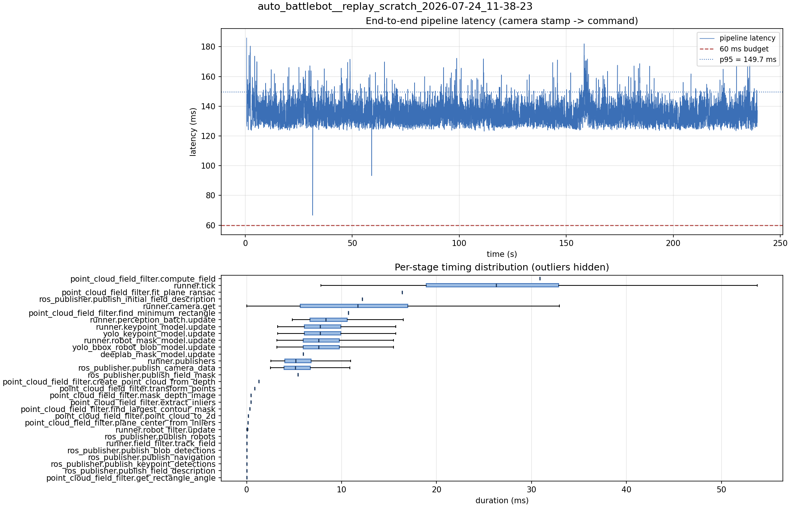

# Latency report: 2026-05-02T15-35-04 (par)

Context: desktop x86 replay of an NHRL May SVO (mrs_buff_mk3_playback base, prescribed svo_start_frame, real-time mode, max_loop_rate = 30). ParallelModelBatch with both engines on the default CUDA stream. Phase 2 of the desktop A/B in ../comparison.md.

- Source: `data/recordings/auto_battlebot__replay_scratch_2026-07-24_11-38-23.mcap`
- Generated: 2026-07-24 11:50 by `scripts/mcap_latency_report.py`
- Duration: 239.3 s
- Loop rate: 33.2 Hz mean
- End-to-end latency: mean 135.7 ms / p95 149.7 ms / max 185.9 ms
- Budget: 60 ms -> p95 is OVER BUDGET

| Stage | n | mean (ms) | median (ms) | p95 (ms) | max (ms) | % of tick |
| --- | ---: | ---: | ---: | ---: | ---: | ---: |
| pipeline.latency | 7,143 | 135.75 | 134.53 | 149.66 | 185.85 | - |
| point_cloud_field_filter.compute_field | 1 | 30.86 | 30.86 | 30.86 | 30.86 | 118.1% |
| runner.tick | 7,154 | 26.14 | 26.29 | 41.95 | 166.45 | 100.0% |
| point_cloud_field_filter.fit_plane_ransac | 1 | 16.38 | 16.38 | 16.38 | 16.38 | 62.7% |
| ros_publisher.publish_initial_field_description | 1 | 12.18 | 12.18 | 12.18 | 12.18 | 46.6% |
| runner.camera.get | 7,154 | 11.38 | 11.71 | 23.28 | 100.02 | 43.5% |
| point_cloud_field_filter.find_minimum_rectangle | 1 | 10.72 | 10.72 | 10.72 | 10.72 | 41.0% |
| runner.perception_batch.update | 7,143 | 8.92 | 8.35 | 13.99 | 24.32 | 34.1% |
| runner.keypoint_model.update | 7,143 | 8.26 | 7.75 | 13.26 | 24.14 | 31.6% |
| yolo_keypoint_model.update | 7,143 | 8.25 | 7.75 | 13.26 | 24.14 | 31.6% |
| runner.robot_mask_model.update | 7,143 | 8.10 | 7.59 | 13.14 | 24.06 | 31.0% |
| yolo_bbox_robot_blob_model.update | 7,143 | 8.10 | 7.58 | 13.14 | 24.05 | 31.0% |
| deeplab_mask_model.update | 1 | 5.98 | 5.98 | 5.98 | 5.98 | 22.9% |
| runner.publishers | 7,143 | 5.70 | 5.16 | 10.29 | 20.59 | 21.8% |
| ros_publisher.publish_camera_data | 7,154 | 5.65 | 5.12 | 10.22 | 20.50 | 21.6% |
| ros_publisher.publish_field_mask | 1 | 5.39 | 5.39 | 5.39 | 5.39 | 20.6% |
| point_cloud_field_filter.create_point_cloud_from_depth | 1 | 1.26 | 1.26 | 1.26 | 1.26 | 4.8% |
| point_cloud_field_filter.transform_points | 1 | 0.86 | 0.86 | 0.86 | 0.86 | 3.3% |
| point_cloud_field_filter.mask_depth_image | 1 | 0.45 | 0.45 | 0.45 | 0.45 | 1.7% |
| point_cloud_field_filter.extract_inliers | 1 | 0.44 | 0.44 | 0.44 | 0.44 | 1.7% |
| point_cloud_field_filter.find_largest_contour_mask | 1 | 0.31 | 0.31 | 0.31 | 0.31 | 1.2% |
| point_cloud_field_filter.point_cloud_to_2d | 1 | 0.19 | 0.19 | 0.19 | 0.19 | 0.7% |
| point_cloud_field_filter.plane_center_from_inliers | 1 | 0.12 | 0.12 | 0.12 | 0.12 | 0.5% |
| runner.robot_filter.update | 7,143 | 0.06 | 0.06 | 0.11 | 0.28 | 0.2% |
| ros_publisher.publish_robots | 7,143 | 0.02 | 0.02 | 0.05 | 1.21 | 0.1% |
| runner.field_filter.track_field | 7,143 | 0.02 | 0.01 | 0.03 | 0.24 | 0.1% |
| ros_publisher.publish_blob_detections | 7,143 | 0.01 | 0.01 | 0.03 | 0.71 | 0.0% |
| ros_publisher.publish_navigation | 7,143 | 0.01 | 0.01 | 0.03 | 1.16 | 0.0% |
| ros_publisher.publish_keypoint_detections | 7,143 | 0.01 | 0.00 | 0.01 | 0.34 | 0.0% |
| ros_publisher.publish_field_description | 7,143 | 0.01 | 0.00 | 0.01 | 0.94 | 0.0% |
| point_cloud_field_filter.get_rectangle_angle | 1 | 0.00 | 0.00 | 0.00 | 0.00 | 0.0% |

