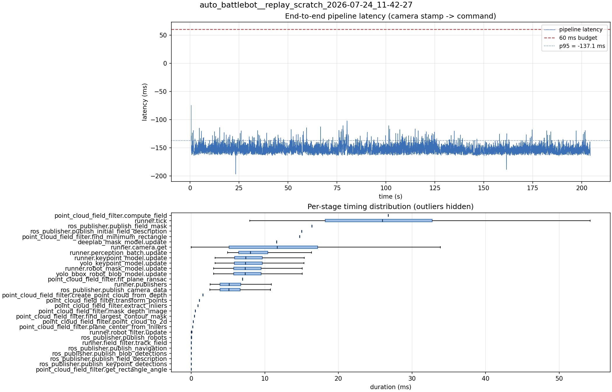

# Latency report: 2026-05-02T16-18-07 (par)

Context: desktop x86 replay of an NHRL May SVO (mrs_buff_mk3_playback base, prescribed svo_start_frame, real-time mode, max_loop_rate = 30). ParallelModelBatch with both engines on the default CUDA stream. Phase 2 of the desktop A/B in ../comparison.md.

- Source: `data/recordings/auto_battlebot__replay_scratch_2026-07-24_11-42-27.mcap`
- Generated: 2026-07-24 11:50 by `scripts/mcap_latency_report.py`
- Duration: 204.4 s
- Loop rate: 33.2 Hz mean
- End-to-end latency: mean -151.7 ms / p95 -137.1 ms / max -74.8 ms
- Budget: 60 ms -> p95 is within budget

| Stage | n | mean (ms) | median (ms) | p95 (ms) | max (ms) | % of tick |
| --- | ---: | ---: | ---: | ---: | ---: | ---: |
| point_cloud_field_filter.compute_field | 1 | 26.77 | 26.77 | 26.77 | 26.77 | 103.6% |
| runner.tick | 6,124 | 25.85 | 25.98 | 41.69 | 152.64 | 100.0% |
| ros_publisher.publish_field_mask | 1 | 16.40 | 16.40 | 16.40 | 16.40 | 63.5% |
| ros_publisher.publish_initial_field_description | 1 | 14.99 | 14.99 | 14.99 | 14.99 | 58.0% |
| point_cloud_field_filter.find_minimum_rectangle | 1 | 14.71 | 14.71 | 14.71 | 14.71 | 56.9% |
| deeplab_mask_model.update | 1 | 11.58 | 11.58 | 11.58 | 11.58 | 44.8% |
| runner.camera.get | 6,124 | 11.36 | 11.69 | 23.46 | 72.10 | 44.0% |
| runner.perception_batch.update | 6,112 | 8.72 | 8.03 | 14.02 | 25.42 | 33.7% |
| runner.keypoint_model.update | 6,112 | 8.02 | 7.38 | 13.19 | 23.88 | 31.0% |
| yolo_keypoint_model.update | 6,112 | 8.02 | 7.38 | 13.19 | 23.87 | 31.0% |
| runner.robot_mask_model.update | 6,112 | 7.88 | 7.31 | 12.98 | 24.21 | 30.5% |
| yolo_bbox_robot_blob_model.update | 6,112 | 7.88 | 7.31 | 12.97 | 24.20 | 30.5% |
| point_cloud_field_filter.fit_plane_ransac | 1 | 6.95 | 6.95 | 6.95 | 6.95 | 26.9% |
| runner.publishers | 6,112 | 5.65 | 5.13 | 10.18 | 21.92 | 21.8% |
| ros_publisher.publish_camera_data | 6,124 | 5.61 | 5.09 | 10.14 | 21.79 | 21.7% |
| point_cloud_field_filter.create_point_cloud_from_depth | 1 | 1.57 | 1.57 | 1.57 | 1.57 | 6.1% |
| point_cloud_field_filter.transform_points | 1 | 1.09 | 1.09 | 1.09 | 1.09 | 4.2% |
| point_cloud_field_filter.extract_inliers | 1 | 0.89 | 0.89 | 0.89 | 0.89 | 3.4% |
| point_cloud_field_filter.mask_depth_image | 1 | 0.54 | 0.54 | 0.54 | 0.54 | 2.1% |
| point_cloud_field_filter.find_largest_contour_mask | 1 | 0.42 | 0.42 | 0.42 | 0.42 | 1.6% |
| point_cloud_field_filter.point_cloud_to_2d | 1 | 0.27 | 0.27 | 0.27 | 0.27 | 1.1% |
| point_cloud_field_filter.plane_center_from_inliers | 1 | 0.19 | 0.19 | 0.19 | 0.19 | 0.7% |
| runner.robot_filter.update | 6,112 | 0.04 | 0.04 | 0.09 | 0.29 | 0.2% |
| ros_publisher.publish_robots | 6,112 | 0.02 | 0.02 | 0.04 | 0.67 | 0.1% |
| runner.field_filter.track_field | 6,112 | 0.01 | 0.01 | 0.03 | 0.23 | 0.1% |
| ros_publisher.publish_navigation | 6,112 | 0.01 | 0.01 | 0.03 | 1.00 | 0.0% |
| ros_publisher.publish_blob_detections | 6,112 | 0.01 | 0.01 | 0.02 | 0.17 | 0.0% |
| ros_publisher.publish_field_description | 6,112 | 0.01 | 0.00 | 0.01 | 0.77 | 0.0% |
| ros_publisher.publish_keypoint_detections | 6,112 | 0.00 | 0.00 | 0.01 | 0.41 | 0.0% |
| point_cloud_field_filter.get_rectangle_angle | 1 | 0.00 | 0.00 | 0.00 | 0.00 | 0.0% |
| pipeline.latency | 6,112 | -151.71 | -153.06 | -137.11 | -74.77 | - |

