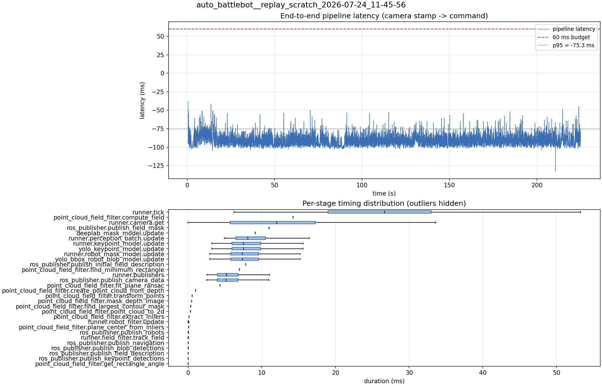

# Latency report: 2026-05-02T17-26-14 (par)

- Source: `data/recordings/auto_battlebot__replay_scratch_2026-07-24_11-45-56.mcap`
- Generated: 2026-07-24 11:50 by `scripts/mcap_latency_report.py`
- Duration: 225.0 s
- Loop rate: 33.1 Hz mean
- End-to-end latency: mean -89.8 ms / p95 -75.3 ms / max -37.6 ms
- Budget: 60 ms -> p95 is within budget

| Stage | n | mean (ms) | median (ms) | p95 (ms) | max (ms) | % of tick |
| --- | ---: | ---: | ---: | ---: | ---: | ---: |
| runner.tick | 6,724 | 26.21 | 26.66 | 41.58 | 116.40 | 100.0% |
| point_cloud_field_filter.compute_field | 1 | 14.22 | 14.22 | 14.22 | 14.22 | 54.2% |
| runner.camera.get | 6,724 | 11.54 | 12.01 | 23.58 | 62.96 | 44.0% |
| ros_publisher.publish_field_mask | 1 | 10.97 | 10.97 | 10.97 | 10.97 | 41.9% |
| deeplab_mask_model.update | 1 | 9.11 | 9.11 | 9.11 | 9.11 | 34.8% |
| runner.perception_batch.update | 6,712 | 8.76 | 8.10 | 13.90 | 25.18 | 33.4% |
| runner.keypoint_model.update | 6,712 | 8.10 | 7.50 | 13.10 | 24.98 | 30.9% |
| yolo_keypoint_model.update | 6,712 | 8.10 | 7.50 | 13.09 | 24.98 | 30.9% |
| runner.robot_mask_model.update | 6,712 | 7.91 | 7.36 | 12.95 | 23.27 | 30.2% |
| yolo_bbox_robot_blob_model.update | 6,712 | 7.90 | 7.35 | 12.95 | 23.26 | 30.1% |
| ros_publisher.publish_initial_field_description | 1 | 7.81 | 7.81 | 7.81 | 7.81 | 29.8% |
| point_cloud_field_filter.find_minimum_rectangle | 1 | 6.95 | 6.95 | 6.95 | 6.95 | 26.5% |
| runner.publishers | 6,712 | 5.77 | 5.19 | 10.67 | 21.60 | 22.0% |
| ros_publisher.publish_camera_data | 6,724 | 5.73 | 5.14 | 10.64 | 21.50 | 21.8% |
| point_cloud_field_filter.fit_plane_ransac | 1 | 4.33 | 4.33 | 4.33 | 4.33 | 16.5% |
| point_cloud_field_filter.create_point_cloud_from_depth | 1 | 1.00 | 1.00 | 1.00 | 1.00 | 3.8% |
| point_cloud_field_filter.transform_points | 1 | 0.55 | 0.55 | 0.55 | 0.55 | 2.1% |
| point_cloud_field_filter.mask_depth_image | 1 | 0.48 | 0.48 | 0.48 | 0.48 | 1.8% |
| point_cloud_field_filter.find_largest_contour_mask | 1 | 0.35 | 0.35 | 0.35 | 0.35 | 1.4% |
| point_cloud_field_filter.point_cloud_to_2d | 1 | 0.29 | 0.29 | 0.29 | 0.29 | 1.1% |
| point_cloud_field_filter.extract_inliers | 1 | 0.11 | 0.11 | 0.11 | 0.11 | 0.4% |
| runner.robot_filter.update | 6,712 | 0.06 | 0.06 | 0.12 | 0.27 | 0.2% |
| point_cloud_field_filter.plane_center_from_inliers | 1 | 0.06 | 0.06 | 0.06 | 0.06 | 0.2% |
| ros_publisher.publish_robots | 6,712 | 0.02 | 0.02 | 0.04 | 5.95 | 0.1% |
| runner.field_filter.track_field | 6,712 | 0.02 | 0.01 | 0.03 | 0.25 | 0.1% |
| ros_publisher.publish_navigation | 6,712 | 0.01 | 0.01 | 0.03 | 1.04 | 0.0% |
| ros_publisher.publish_blob_detections | 6,712 | 0.01 | 0.01 | 0.03 | 0.33 | 0.0% |
| ros_publisher.publish_field_description | 6,712 | 0.01 | 0.00 | 0.01 | 0.73 | 0.0% |
| ros_publisher.publish_keypoint_detections | 6,712 | 0.00 | 0.00 | 0.01 | 0.40 | 0.0% |
| point_cloud_field_filter.get_rectangle_angle | 1 | 0.00 | 0.00 | 0.00 | 0.00 | 0.0% |
| pipeline.latency | 6,712 | -89.81 | -91.16 | -75.33 | -37.61 | - |

