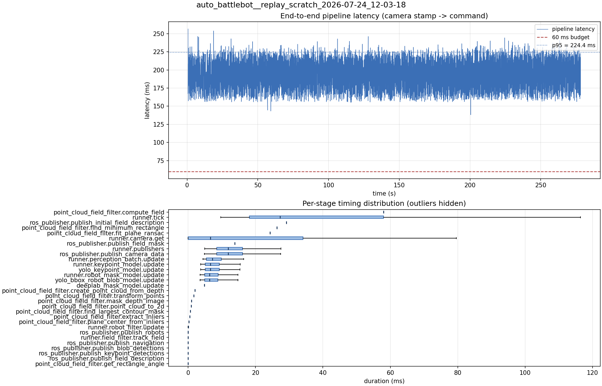

# Latency report: 2026-05-01T17-42-24 (par_streams)

- Source: `data/recordings/auto_battlebot__replay_scratch_2026-07-24_12-03-18.mcap`
- Generated: 2026-07-24 12:29 by `scripts/mcap_latency_report.py`
- Duration: 278.2 s
- Loop rate: 27.0 Hz mean
- End-to-end latency: mean 197.0 ms / p95 224.4 ms / max 256.6 ms
- Budget: 60 ms -> p95 is OVER BUDGET

| Stage | n | mean (ms) | median (ms) | p95 (ms) | max (ms) | % of tick |
| --- | ---: | ---: | ---: | ---: | ---: | ---: |
| pipeline.latency | 6,091 | 197.04 | 201.39 | 224.37 | 256.60 | - |
| point_cloud_field_filter.compute_field | 1 | 57.97 | 57.97 | 57.97 | 57.97 | 156.0% |
| runner.tick | 6,099 | 37.16 | 27.26 | 81.12 | 255.73 | 100.0% |
| ros_publisher.publish_initial_field_description | 1 | 29.15 | 29.15 | 29.15 | 29.15 | 78.5% |
| point_cloud_field_filter.find_minimum_rectangle | 1 | 26.37 | 26.37 | 26.37 | 26.37 | 71.0% |
| point_cloud_field_filter.fit_plane_ransac | 1 | 24.33 | 24.33 | 24.33 | 24.33 | 65.5% |
| runner.camera.get | 6,099 | 16.49 | 6.59 | 54.14 | 132.53 | 44.4% |
| ros_publisher.publish_field_mask | 1 | 13.87 | 13.87 | 13.87 | 13.87 | 37.3% |
| runner.publishers | 6,091 | 12.63 | 11.92 | 21.81 | 33.08 | 34.0% |
| ros_publisher.publish_camera_data | 6,099 | 12.58 | 11.88 | 21.75 | 32.93 | 33.8% |
| runner.perception_batch.update | 6,091 | 7.90 | 7.24 | 12.89 | 22.44 | 21.3% |
| runner.keypoint_model.update | 6,091 | 7.36 | 6.66 | 12.16 | 22.20 | 19.8% |
| yolo_keypoint_model.update | 6,091 | 7.35 | 6.65 | 12.15 | 22.20 | 19.8% |
| runner.robot_mask_model.update | 6,091 | 7.07 | 6.40 | 11.69 | 20.74 | 19.0% |
| yolo_bbox_robot_blob_model.update | 6,091 | 7.07 | 6.39 | 11.69 | 20.73 | 19.0% |
| deeplab_mask_model.update | 1 | 4.87 | 4.87 | 4.87 | 4.87 | 13.1% |
| point_cloud_field_filter.create_point_cloud_from_depth | 1 | 2.05 | 2.05 | 2.05 | 2.05 | 5.5% |
| point_cloud_field_filter.transform_points | 1 | 1.65 | 1.65 | 1.65 | 1.65 | 4.4% |
| point_cloud_field_filter.mask_depth_image | 1 | 1.00 | 1.00 | 1.00 | 1.00 | 2.7% |
| point_cloud_field_filter.point_cloud_to_2d | 1 | 0.95 | 0.95 | 0.95 | 0.95 | 2.5% |
| point_cloud_field_filter.find_largest_contour_mask | 1 | 0.71 | 0.71 | 0.71 | 0.71 | 1.9% |
| point_cloud_field_filter.extract_inliers | 1 | 0.48 | 0.48 | 0.48 | 0.48 | 1.3% |
| point_cloud_field_filter.plane_center_from_inliers | 1 | 0.27 | 0.27 | 0.27 | 0.27 | 0.7% |
| runner.robot_filter.update | 6,091 | 0.06 | 0.05 | 0.12 | 0.29 | 0.2% |
| ros_publisher.publish_robots | 6,091 | 0.02 | 0.02 | 0.03 | 0.61 | 0.1% |
| runner.field_filter.track_field | 6,091 | 0.01 | 0.01 | 0.03 | 0.21 | 0.0% |
| ros_publisher.publish_navigation | 6,091 | 0.01 | 0.01 | 0.02 | 0.60 | 0.0% |
| ros_publisher.publish_blob_detections | 6,091 | 0.01 | 0.01 | 0.01 | 0.35 | 0.0% |
| ros_publisher.publish_keypoint_detections | 6,091 | 0.00 | 0.00 | 0.01 | 0.45 | 0.0% |
| ros_publisher.publish_field_description | 6,091 | 0.00 | 0.00 | 0.01 | 0.03 | 0.0% |
| point_cloud_field_filter.get_rectangle_angle | 1 | 0.00 | 0.00 | 0.00 | 0.00 | 0.0% |

