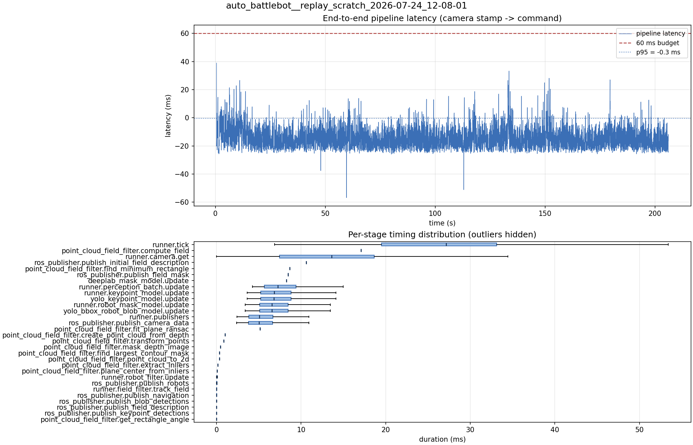

# Latency report: 2026-05-02T10-06-06 (par_streams)

- Source: `data/recordings/auto_battlebot__replay_scratch_2026-07-24_12-08-01.mcap`
- Generated: 2026-07-24 12:29 by `scripts/mcap_latency_report.py`
- Duration: 206.1 s
- Loop rate: 33.5 Hz mean
- End-to-end latency: mean -14.0 ms / p95 -0.3 ms / max 38.9 ms
- Budget: 60 ms -> p95 is within budget

| Stage | n | mean (ms) | median (ms) | p95 (ms) | max (ms) | % of tick |
| --- | ---: | ---: | ---: | ---: | ---: | ---: |
| runner.tick | 6,164 | 26.33 | 27.13 | 41.70 | 113.52 | 100.0% |
| point_cloud_field_filter.compute_field | 1 | 17.09 | 17.09 | 17.09 | 17.09 | 64.9% |
| runner.camera.get | 6,164 | 12.85 | 13.62 | 24.62 | 64.94 | 48.8% |
| ros_publisher.publish_initial_field_description | 1 | 10.60 | 10.60 | 10.60 | 10.60 | 40.2% |
| point_cloud_field_filter.find_minimum_rectangle | 1 | 8.64 | 8.64 | 8.64 | 8.64 | 32.8% |
| ros_publisher.publish_field_mask | 1 | 8.47 | 8.47 | 8.47 | 8.47 | 32.2% |
| deeplab_mask_model.update | 1 | 8.27 | 8.27 | 8.27 | 8.27 | 31.4% |
| runner.perception_batch.update | 6,152 | 7.72 | 7.24 | 12.19 | 19.00 | 29.3% |
| runner.keypoint_model.update | 6,152 | 7.25 | 6.80 | 11.62 | 18.93 | 27.5% |
| yolo_keypoint_model.update | 6,152 | 7.25 | 6.80 | 11.62 | 18.93 | 27.5% |
| runner.robot_mask_model.update | 6,152 | 6.98 | 6.55 | 11.19 | 18.18 | 26.5% |
| yolo_bbox_robot_blob_model.update | 6,152 | 6.97 | 6.54 | 11.18 | 18.18 | 26.5% |
| runner.publishers | 6,152 | 5.64 | 5.07 | 10.76 | 19.49 | 21.4% |
| ros_publisher.publish_camera_data | 6,164 | 5.60 | 5.03 | 10.70 | 19.34 | 21.3% |
| point_cloud_field_filter.fit_plane_ransac | 1 | 5.16 | 5.16 | 5.16 | 5.16 | 19.6% |
| point_cloud_field_filter.create_point_cloud_from_depth | 1 | 1.00 | 1.00 | 1.00 | 1.00 | 3.8% |
| point_cloud_field_filter.transform_points | 1 | 0.83 | 0.83 | 0.83 | 0.83 | 3.2% |
| point_cloud_field_filter.mask_depth_image | 1 | 0.47 | 0.47 | 0.47 | 0.47 | 1.8% |
| point_cloud_field_filter.find_largest_contour_mask | 1 | 0.36 | 0.36 | 0.36 | 0.36 | 1.4% |
| point_cloud_field_filter.point_cloud_to_2d | 1 | 0.33 | 0.33 | 0.33 | 0.33 | 1.2% |
| point_cloud_field_filter.extract_inliers | 1 | 0.14 | 0.14 | 0.14 | 0.14 | 0.5% |
| point_cloud_field_filter.plane_center_from_inliers | 1 | 0.07 | 0.07 | 0.07 | 0.07 | 0.3% |
| runner.robot_filter.update | 6,152 | 0.05 | 0.04 | 0.09 | 0.21 | 0.2% |
| ros_publisher.publish_robots | 6,152 | 0.02 | 0.02 | 0.04 | 0.72 | 0.1% |
| runner.field_filter.track_field | 6,152 | 0.01 | 0.01 | 0.03 | 0.23 | 0.1% |
| ros_publisher.publish_navigation | 6,152 | 0.01 | 0.01 | 0.03 | 1.81 | 0.0% |
| ros_publisher.publish_blob_detections | 6,152 | 0.01 | 0.01 | 0.03 | 1.02 | 0.0% |
| ros_publisher.publish_field_description | 6,152 | 0.01 | 0.00 | 0.01 | 0.32 | 0.0% |
| ros_publisher.publish_keypoint_detections | 6,152 | 0.00 | 0.00 | 0.01 | 0.44 | 0.0% |
| point_cloud_field_filter.get_rectangle_angle | 1 | 0.00 | 0.00 | 0.00 | 0.00 | 0.0% |
| pipeline.latency | 6,152 | -13.96 | -15.09 | -0.34 | 38.90 | - |

