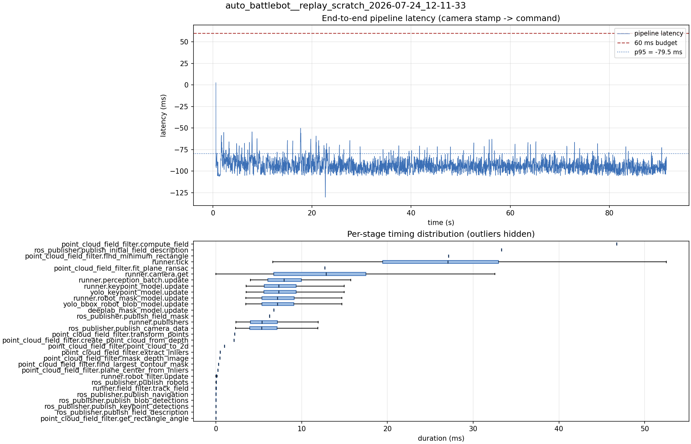

# Latency report: 2026-05-02T11-45-08 (par_streams)

- Source: `data/recordings/auto_battlebot__replay_scratch_2026-07-24_12-11-33.mcap`
- Generated: 2026-07-24 12:29 by `scripts/mcap_latency_report.py`
- Duration: 91.5 s
- Loop rate: 33.4 Hz mean
- End-to-end latency: mean -93.1 ms / p95 -79.5 ms / max 2.6 ms
- Budget: 60 ms -> p95 is within budget

| Stage | n | mean (ms) | median (ms) | p95 (ms) | max (ms) | % of tick |
| --- | ---: | ---: | ---: | ---: | ---: | ---: |
| point_cloud_field_filter.compute_field | 1 | 46.74 | 46.74 | 46.74 | 46.74 | 177.8% |
| ros_publisher.publish_initial_field_description | 1 | 33.29 | 33.29 | 33.29 | 33.29 | 126.6% |
| point_cloud_field_filter.find_minimum_rectangle | 1 | 27.12 | 27.12 | 27.12 | 27.12 | 103.2% |
| runner.tick | 2,731 | 26.29 | 27.05 | 41.29 | 164.79 | 100.0% |
| point_cloud_field_filter.fit_plane_ransac | 1 | 12.70 | 12.70 | 12.70 | 12.70 | 48.3% |
| runner.camera.get | 2,731 | 12.04 | 12.84 | 23.64 | 62.17 | 45.8% |
| runner.perception_batch.update | 2,719 | 8.17 | 7.93 | 12.53 | 18.33 | 31.1% |
| runner.keypoint_model.update | 2,719 | 7.65 | 7.34 | 11.88 | 17.89 | 29.1% |
| yolo_keypoint_model.update | 2,719 | 7.64 | 7.34 | 11.88 | 17.89 | 29.1% |
| runner.robot_mask_model.update | 2,719 | 7.40 | 7.16 | 11.58 | 17.87 | 28.2% |
| yolo_bbox_robot_blob_model.update | 2,719 | 7.40 | 7.15 | 11.58 | 17.87 | 28.2% |
| deeplab_mask_model.update | 1 | 6.74 | 6.74 | 6.74 | 6.74 | 25.6% |
| ros_publisher.publish_field_mask | 1 | 6.26 | 6.26 | 6.26 | 6.26 | 23.8% |
| runner.publishers | 2,719 | 5.91 | 5.36 | 11.07 | 16.67 | 22.5% |
| ros_publisher.publish_camera_data | 2,731 | 5.87 | 5.31 | 11.04 | 16.56 | 22.3% |
| point_cloud_field_filter.transform_points | 1 | 2.16 | 2.16 | 2.16 | 2.16 | 8.2% |
| point_cloud_field_filter.create_point_cloud_from_depth | 1 | 2.12 | 2.12 | 2.12 | 2.12 | 8.1% |
| point_cloud_field_filter.point_cloud_to_2d | 1 | 1.00 | 1.00 | 1.00 | 1.00 | 3.8% |
| point_cloud_field_filter.extract_inliers | 1 | 0.50 | 0.50 | 0.50 | 0.50 | 1.9% |
| point_cloud_field_filter.mask_depth_image | 1 | 0.46 | 0.46 | 0.46 | 0.46 | 1.8% |
| point_cloud_field_filter.find_largest_contour_mask | 1 | 0.30 | 0.30 | 0.30 | 0.30 | 1.1% |
| point_cloud_field_filter.plane_center_from_inliers | 1 | 0.24 | 0.24 | 0.24 | 0.24 | 0.9% |
| runner.robot_filter.update | 2,719 | 0.07 | 0.06 | 0.12 | 0.32 | 0.3% |
| ros_publisher.publish_robots | 2,719 | 0.03 | 0.02 | 0.06 | 0.95 | 0.1% |
| runner.field_filter.track_field | 2,719 | 0.02 | 0.02 | 0.03 | 0.22 | 0.1% |
| ros_publisher.publish_navigation | 2,719 | 0.01 | 0.01 | 0.03 | 0.63 | 0.1% |
| ros_publisher.publish_blob_detections | 2,719 | 0.01 | 0.01 | 0.03 | 0.17 | 0.0% |
| ros_publisher.publish_keypoint_detections | 2,719 | 0.01 | 0.00 | 0.02 | 0.24 | 0.0% |
| ros_publisher.publish_field_description | 2,719 | 0.01 | 0.00 | 0.01 | 0.03 | 0.0% |
| point_cloud_field_filter.get_rectangle_angle | 1 | 0.00 | 0.00 | 0.00 | 0.00 | 0.0% |
| pipeline.latency | 2,719 | -93.10 | -93.98 | -79.46 | 2.62 | - |

