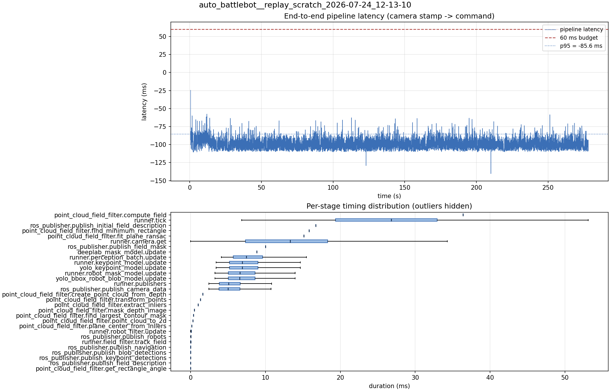

# Latency report: 2026-05-02T14-12-27 (par_streams)

Context: desktop x86 replay of an NHRL May SVO (mrs_buff_mk3_playback base, prescribed svo_start_frame, real-time mode, max_loop_rate = 30). ParallelModelBatch plus per-engine CUDA streams and pinned async IO in TrtEngine. Phase 3 of the desktop A/B in ../comparison.md.

- Source: `data/recordings/auto_battlebot__replay_scratch_2026-07-24_12-13-10.mcap`
- Generated: 2026-07-24 12:29 by `scripts/mcap_latency_report.py`
- Duration: 278.1 s
- Loop rate: 33.5 Hz mean
- End-to-end latency: mean -98.5 ms / p95 -85.6 ms / max -24.6 ms
- Budget: 60 ms -> p95 is within budget

| Stage | n | mean (ms) | median (ms) | p95 (ms) | max (ms) | % of tick |
| --- | ---: | ---: | ---: | ---: | ---: | ---: |
| point_cloud_field_filter.compute_field | 1 | 36.38 | 36.38 | 36.38 | 36.38 | 138.9% |
| runner.tick | 8,312 | 26.19 | 26.82 | 41.59 | 141.87 | 100.0% |
| ros_publisher.publish_initial_field_description | 1 | 16.72 | 16.72 | 16.72 | 16.72 | 63.8% |
| point_cloud_field_filter.find_minimum_rectangle | 1 | 15.80 | 15.80 | 15.80 | 15.80 | 60.3% |
| point_cloud_field_filter.fit_plane_ransac | 1 | 15.14 | 15.14 | 15.14 | 15.14 | 57.8% |
| runner.camera.get | 8,312 | 12.61 | 13.32 | 24.46 | 64.17 | 48.2% |
| ros_publisher.publish_field_mask | 1 | 10.02 | 10.02 | 10.02 | 10.02 | 38.3% |
| deeplab_mask_model.update | 1 | 8.85 | 8.85 | 8.85 | 8.85 | 33.8% |
| runner.perception_batch.update | 8,301 | 7.84 | 7.44 | 12.42 | 21.31 | 30.0% |
| runner.keypoint_model.update | 8,301 | 7.34 | 6.89 | 11.86 | 20.62 | 28.0% |
| yolo_keypoint_model.update | 8,301 | 7.33 | 6.89 | 11.85 | 20.62 | 28.0% |
| runner.robot_mask_model.update | 8,301 | 7.01 | 6.57 | 11.21 | 21.15 | 26.8% |
| yolo_bbox_robot_blob_model.update | 8,301 | 7.00 | 6.57 | 11.20 | 21.14 | 26.7% |
| runner.publishers | 8,301 | 5.60 | 5.06 | 10.29 | 24.33 | 21.4% |
| ros_publisher.publish_camera_data | 8,312 | 5.54 | 5.01 | 10.23 | 24.17 | 21.2% |
| point_cloud_field_filter.create_point_cloud_from_depth | 1 | 1.63 | 1.63 | 1.63 | 1.63 | 6.2% |
| point_cloud_field_filter.transform_points | 1 | 1.31 | 1.31 | 1.31 | 1.31 | 5.0% |
| point_cloud_field_filter.extract_inliers | 1 | 1.02 | 1.02 | 1.02 | 1.02 | 3.9% |
| point_cloud_field_filter.mask_depth_image | 1 | 0.48 | 0.48 | 0.48 | 0.48 | 1.8% |
| point_cloud_field_filter.find_largest_contour_mask | 1 | 0.38 | 0.38 | 0.38 | 0.38 | 1.5% |
| point_cloud_field_filter.point_cloud_to_2d | 1 | 0.31 | 0.31 | 0.31 | 0.31 | 1.2% |
| point_cloud_field_filter.plane_center_from_inliers | 1 | 0.15 | 0.15 | 0.15 | 0.15 | 0.6% |
| runner.robot_filter.update | 8,301 | 0.06 | 0.06 | 0.11 | 0.34 | 0.2% |
| ros_publisher.publish_robots | 8,301 | 0.02 | 0.02 | 0.05 | 0.73 | 0.1% |
| runner.field_filter.track_field | 8,301 | 0.01 | 0.01 | 0.03 | 0.22 | 0.1% |
| ros_publisher.publish_navigation | 8,301 | 0.01 | 0.01 | 0.03 | 1.14 | 0.0% |
| ros_publisher.publish_blob_detections | 8,301 | 0.01 | 0.01 | 0.03 | 0.14 | 0.0% |
| ros_publisher.publish_keypoint_detections | 8,301 | 0.01 | 0.00 | 0.01 | 0.69 | 0.0% |
| ros_publisher.publish_field_description | 8,301 | 0.01 | 0.00 | 0.01 | 0.49 | 0.0% |
| point_cloud_field_filter.get_rectangle_angle | 1 | 0.00 | 0.00 | 0.00 | 0.00 | 0.0% |
| pipeline.latency | 8,301 | -98.54 | -99.45 | -85.63 | -24.61 | - |

