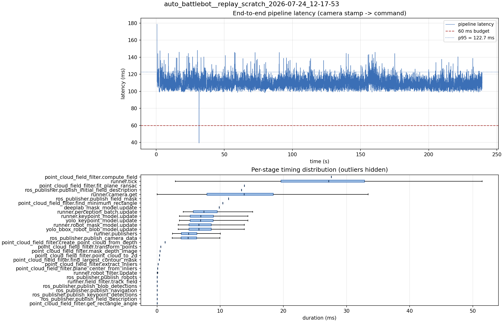

# Latency report: 2026-05-02T15-35-04 (par_streams)

Context: desktop x86 replay of an NHRL May SVO (mrs_buff_mk3_playback base, prescribed svo_start_frame, real-time mode, max_loop_rate = 30). ParallelModelBatch plus per-engine CUDA streams and pinned async IO in TrtEngine. Phase 3 of the desktop A/B in ../comparison.md.

- Source: `data/recordings/auto_battlebot__replay_scratch_2026-07-24_12-17-53.mcap`
- Generated: 2026-07-24 12:29 by `scripts/mcap_latency_report.py`
- Duration: 239.3 s
- Loop rate: 33.5 Hz mean
- End-to-end latency: mean 110.3 ms / p95 122.7 ms / max 178.8 ms
- Budget: 60 ms -> p95 is OVER BUDGET

| Stage | n | mean (ms) | median (ms) | p95 (ms) | max (ms) | % of tick |
| --- | ---: | ---: | ---: | ---: | ---: | ---: |
| pipeline.latency | 7,140 | 110.28 | 109.28 | 122.70 | 178.83 | - |
| point_cloud_field_filter.compute_field | 1 | 27.60 | 27.60 | 27.60 | 27.60 | 105.0% |
| runner.tick | 7,152 | 26.30 | 27.15 | 40.94 | 131.76 | 100.0% |
| point_cloud_field_filter.fit_plane_ransac | 1 | 13.81 | 13.81 | 13.81 | 13.81 | 52.5% |
| ros_publisher.publish_initial_field_description | 1 | 13.37 | 13.37 | 13.37 | 13.37 | 50.8% |
| runner.camera.get | 7,152 | 12.85 | 13.78 | 24.13 | 90.04 | 48.9% |
| ros_publisher.publish_field_mask | 1 | 11.32 | 11.32 | 11.32 | 11.32 | 43.0% |
| point_cloud_field_filter.find_minimum_rectangle | 1 | 10.40 | 10.40 | 10.40 | 10.40 | 39.6% |
| deeplab_mask_model.update | 1 | 9.85 | 9.85 | 9.85 | 9.85 | 37.5% |
| runner.perception_batch.update | 7,140 | 7.85 | 7.41 | 12.46 | 22.13 | 29.8% |
| runner.keypoint_model.update | 7,140 | 7.31 | 6.90 | 11.75 | 19.00 | 27.8% |
| yolo_keypoint_model.update | 7,140 | 7.31 | 6.90 | 11.74 | 19.00 | 27.8% |
| runner.robot_mask_model.update | 7,140 | 7.03 | 6.61 | 11.34 | 18.99 | 26.7% |
| yolo_bbox_robot_blob_model.update | 7,140 | 7.03 | 6.61 | 11.33 | 18.98 | 26.7% |
| runner.publishers | 7,140 | 5.47 | 4.99 | 9.97 | 18.37 | 20.8% |
| ros_publisher.publish_camera_data | 7,152 | 5.42 | 4.93 | 9.93 | 18.30 | 20.6% |
| point_cloud_field_filter.create_point_cloud_from_depth | 1 | 1.28 | 1.28 | 1.28 | 1.28 | 4.9% |
| point_cloud_field_filter.transform_points | 1 | 0.57 | 0.57 | 0.57 | 0.57 | 2.2% |
| point_cloud_field_filter.mask_depth_image | 1 | 0.46 | 0.46 | 0.46 | 0.46 | 1.7% |
| point_cloud_field_filter.point_cloud_to_2d | 1 | 0.40 | 0.40 | 0.40 | 0.40 | 1.5% |
| point_cloud_field_filter.find_largest_contour_mask | 1 | 0.36 | 0.36 | 0.36 | 0.36 | 1.4% |
| point_cloud_field_filter.extract_inliers | 1 | 0.15 | 0.15 | 0.15 | 0.15 | 0.6% |
| point_cloud_field_filter.plane_center_from_inliers | 1 | 0.08 | 0.08 | 0.08 | 0.08 | 0.3% |
| runner.robot_filter.update | 7,140 | 0.06 | 0.06 | 0.11 | 0.38 | 0.2% |
| ros_publisher.publish_robots | 7,140 | 0.02 | 0.02 | 0.05 | 0.96 | 0.1% |
| runner.field_filter.track_field | 7,140 | 0.02 | 0.01 | 0.04 | 0.34 | 0.1% |
| ros_publisher.publish_blob_detections | 7,140 | 0.01 | 0.01 | 0.02 | 0.60 | 0.0% |
| ros_publisher.publish_navigation | 7,140 | 0.01 | 0.01 | 0.02 | 1.18 | 0.0% |
| ros_publisher.publish_keypoint_detections | 7,140 | 0.01 | 0.00 | 0.01 | 0.60 | 0.0% |
| ros_publisher.publish_field_description | 7,140 | 0.01 | 0.00 | 0.01 | 0.92 | 0.0% |
| point_cloud_field_filter.get_rectangle_angle | 1 | 0.00 | 0.00 | 0.00 | 0.00 | 0.0% |

