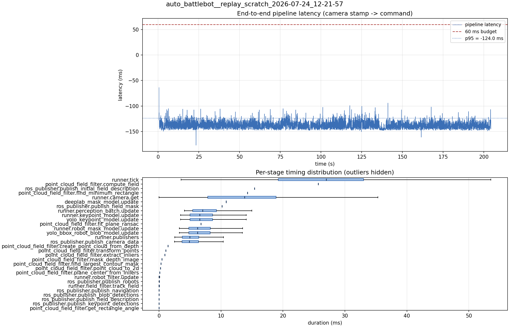

# Latency report: 2026-05-02T16-18-07 (par_streams)

- Source: `data/recordings/auto_battlebot__replay_scratch_2026-07-24_12-21-57.mcap`
- Generated: 2026-07-24 12:29 by `scripts/mcap_latency_report.py`
- Duration: 204.3 s
- Loop rate: 33.5 Hz mean
- End-to-end latency: mean -136.9 ms / p95 -124.0 ms / max -63.8 ms
- Budget: 60 ms -> p95 is within budget

| Stage | n | mean (ms) | median (ms) | p95 (ms) | max (ms) | % of tick |
| --- | ---: | ---: | ---: | ---: | ---: | ---: |
| runner.tick | 6,122 | 26.15 | 26.99 | 41.08 | 140.35 | 100.0% |
| point_cloud_field_filter.compute_field | 1 | 25.71 | 25.71 | 25.71 | 25.71 | 98.3% |
| ros_publisher.publish_initial_field_description | 1 | 15.41 | 15.41 | 15.41 | 15.41 | 58.9% |
| point_cloud_field_filter.find_minimum_rectangle | 1 | 14.28 | 14.28 | 14.28 | 14.28 | 54.6% |
| runner.camera.get | 6,122 | 13.03 | 13.79 | 24.68 | 68.02 | 49.8% |
| deeplab_mask_model.update | 1 | 10.84 | 10.84 | 10.84 | 10.84 | 41.4% |
| ros_publisher.publish_field_mask | 1 | 10.15 | 10.15 | 10.15 | 10.15 | 38.8% |
| runner.perception_batch.update | 6,110 | 7.57 | 7.02 | 12.21 | 20.07 | 28.9% |
| runner.keypoint_model.update | 6,110 | 7.06 | 6.55 | 11.56 | 19.90 | 27.0% |
| yolo_keypoint_model.update | 6,110 | 7.05 | 6.55 | 11.56 | 19.90 | 27.0% |
| point_cloud_field_filter.fit_plane_ransac | 1 | 6.75 | 6.75 | 6.75 | 6.75 | 25.8% |
| runner.robot_mask_model.update | 6,110 | 6.73 | 6.23 | 11.01 | 18.46 | 25.7% |
| yolo_bbox_robot_blob_model.update | 6,110 | 6.73 | 6.23 | 10.99 | 18.46 | 25.7% |
| runner.publishers | 6,110 | 5.44 | 4.94 | 9.85 | 19.91 | 20.8% |
| ros_publisher.publish_camera_data | 6,122 | 5.40 | 4.90 | 9.80 | 19.82 | 20.6% |
| point_cloud_field_filter.create_point_cloud_from_depth | 1 | 1.43 | 1.43 | 1.43 | 1.43 | 5.5% |
| point_cloud_field_filter.transform_points | 1 | 1.08 | 1.08 | 1.08 | 1.08 | 4.1% |
| point_cloud_field_filter.extract_inliers | 1 | 0.93 | 0.93 | 0.93 | 0.93 | 3.5% |
| point_cloud_field_filter.mask_depth_image | 1 | 0.46 | 0.46 | 0.46 | 0.46 | 1.8% |
| point_cloud_field_filter.find_largest_contour_mask | 1 | 0.32 | 0.32 | 0.32 | 0.32 | 1.2% |
| point_cloud_field_filter.point_cloud_to_2d | 1 | 0.22 | 0.22 | 0.22 | 0.22 | 0.9% |
| point_cloud_field_filter.plane_center_from_inliers | 1 | 0.12 | 0.12 | 0.12 | 0.12 | 0.5% |
| runner.robot_filter.update | 6,110 | 0.04 | 0.04 | 0.09 | 0.31 | 0.2% |
| ros_publisher.publish_robots | 6,110 | 0.02 | 0.02 | 0.04 | 0.64 | 0.1% |
| runner.field_filter.track_field | 6,110 | 0.02 | 0.01 | 0.03 | 0.35 | 0.1% |
| ros_publisher.publish_navigation | 6,110 | 0.01 | 0.01 | 0.02 | 1.39 | 0.0% |
| ros_publisher.publish_blob_detections | 6,110 | 0.01 | 0.01 | 0.02 | 1.05 | 0.0% |
| ros_publisher.publish_field_description | 6,110 | 0.00 | 0.00 | 0.01 | 0.07 | 0.0% |
| ros_publisher.publish_keypoint_detections | 6,110 | 0.00 | 0.00 | 0.01 | 0.05 | 0.0% |
| point_cloud_field_filter.get_rectangle_angle | 1 | 0.00 | 0.00 | 0.00 | 0.00 | 0.0% |
| pipeline.latency | 6,110 | -136.93 | -137.98 | -124.00 | -63.78 | - |

