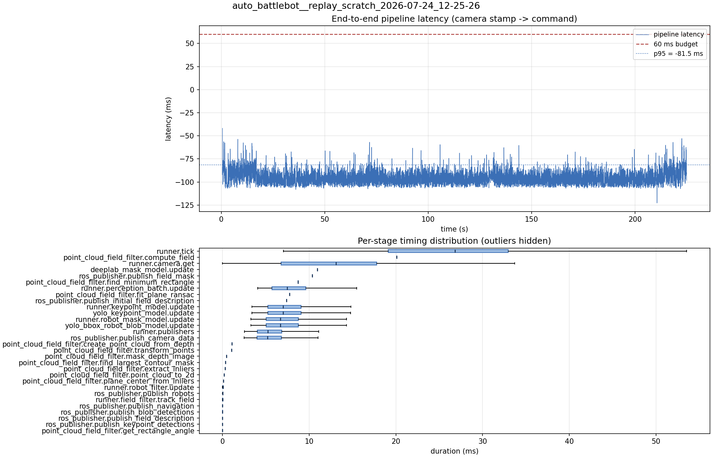

# Latency report: 2026-05-02T17-26-14 (par_streams)

- Source: `data/recordings/auto_battlebot__replay_scratch_2026-07-24_12-25-26.mcap`
- Generated: 2026-07-24 12:29 by `scripts/mcap_latency_report.py`
- Duration: 224.9 s
- Loop rate: 33.2 Hz mean
- End-to-end latency: mean -94.7 ms / p95 -81.5 ms / max -41.8 ms
- Budget: 60 ms -> p95 is within budget

| Stage | n | mean (ms) | median (ms) | p95 (ms) | max (ms) | % of tick |
| --- | ---: | ---: | ---: | ---: | ---: | ---: |
| runner.tick | 6,722 | 26.16 | 26.80 | 41.16 | 116.44 | 100.0% |
| point_cloud_field_filter.compute_field | 1 | 20.10 | 20.10 | 20.10 | 20.10 | 76.8% |
| runner.camera.get | 6,722 | 12.27 | 13.08 | 23.76 | 57.35 | 46.9% |
| deeplab_mask_model.update | 1 | 10.94 | 10.94 | 10.94 | 10.94 | 41.8% |
| ros_publisher.publish_field_mask | 1 | 10.36 | 10.36 | 10.36 | 10.36 | 39.6% |
| point_cloud_field_filter.find_minimum_rectangle | 1 | 8.70 | 8.70 | 8.70 | 8.70 | 33.2% |
| runner.perception_batch.update | 6,710 | 7.89 | 7.45 | 12.59 | 22.19 | 30.1% |
| point_cloud_field_filter.fit_plane_ransac | 1 | 7.74 | 7.74 | 7.74 | 7.74 | 29.6% |
| ros_publisher.publish_initial_field_description | 1 | 7.38 | 7.38 | 7.38 | 7.38 | 28.2% |
| runner.keypoint_model.update | 6,710 | 7.37 | 6.98 | 11.85 | 22.03 | 28.2% |
| yolo_keypoint_model.update | 6,710 | 7.37 | 6.98 | 11.84 | 22.02 | 28.2% |
| runner.robot_mask_model.update | 6,710 | 7.09 | 6.68 | 11.48 | 18.57 | 27.1% |
| yolo_bbox_robot_blob_model.update | 6,710 | 7.09 | 6.68 | 11.47 | 18.57 | 27.1% |
| runner.publishers | 6,710 | 5.86 | 5.24 | 11.02 | 23.35 | 22.4% |
| ros_publisher.publish_camera_data | 6,722 | 5.82 | 5.20 | 10.99 | 23.22 | 22.2% |
| point_cloud_field_filter.create_point_cloud_from_depth | 1 | 1.09 | 1.09 | 1.09 | 1.09 | 4.2% |
| point_cloud_field_filter.transform_points | 1 | 1.04 | 1.04 | 1.04 | 1.04 | 4.0% |
| point_cloud_field_filter.mask_depth_image | 1 | 0.45 | 0.45 | 0.45 | 0.45 | 1.7% |
| point_cloud_field_filter.find_largest_contour_mask | 1 | 0.36 | 0.36 | 0.36 | 0.36 | 1.4% |
| point_cloud_field_filter.extract_inliers | 1 | 0.32 | 0.32 | 0.32 | 0.32 | 1.2% |
| point_cloud_field_filter.point_cloud_to_2d | 1 | 0.21 | 0.21 | 0.21 | 0.21 | 0.8% |
| point_cloud_field_filter.plane_center_from_inliers | 1 | 0.13 | 0.13 | 0.13 | 0.13 | 0.5% |
| runner.robot_filter.update | 6,710 | 0.06 | 0.06 | 0.11 | 0.29 | 0.2% |
| ros_publisher.publish_robots | 6,710 | 0.02 | 0.02 | 0.04 | 1.49 | 0.1% |
| runner.field_filter.track_field | 6,710 | 0.02 | 0.01 | 0.03 | 0.24 | 0.1% |
| ros_publisher.publish_navigation | 6,710 | 0.01 | 0.01 | 0.03 | 1.07 | 0.0% |
| ros_publisher.publish_blob_detections | 6,710 | 0.01 | 0.01 | 0.02 | 0.56 | 0.0% |
| ros_publisher.publish_field_description | 6,710 | 0.01 | 0.00 | 0.01 | 0.33 | 0.0% |
| ros_publisher.publish_keypoint_detections | 6,710 | 0.00 | 0.00 | 0.01 | 0.65 | 0.0% |
| point_cloud_field_filter.get_rectangle_angle | 1 | 0.00 | 0.00 | 0.00 | 0.00 | 0.0% |
| pipeline.latency | 6,710 | -94.75 | -95.68 | -81.49 | -41.82 | - |

