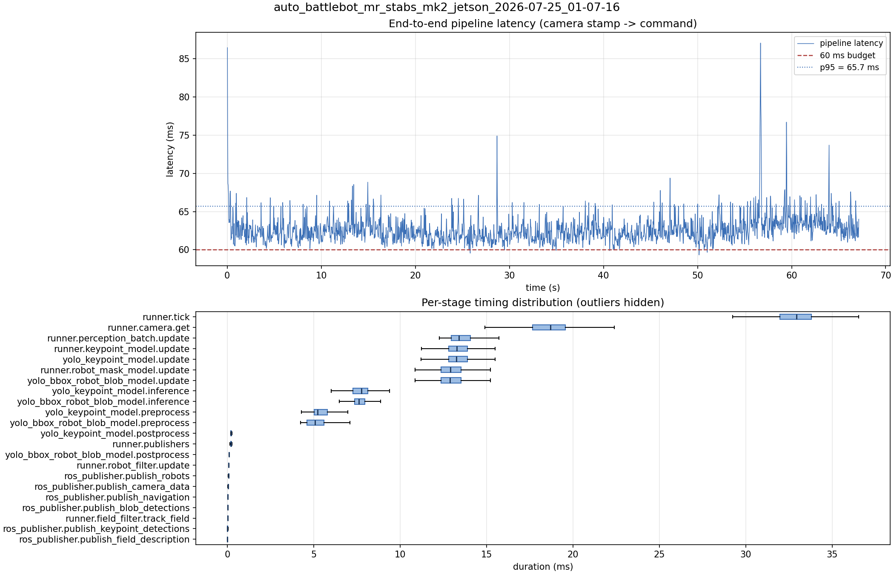

# Latency report: auto_battlebot_mr_stabs_mk2_jetson_2026-07-25_01-07-16

Using cv::dnn::blobFromImage to preprocess image for yolo instead of iterating over the whole image with for loops and `.at<Vec3f>`.

- Source: `/home/ben/Desktop/auto_battlebot_mr_stabs_mk2_jetson_2026-07-25_01-07-16.mcap`
- Generated: 2026-07-25 01:09 by `scripts/mcap_latency_report.py`
- Duration: 67.1 s
- Window: after field init (3.6 s into the recording)
- Loop rate: 30.2 Hz mean
- End-to-end latency: mean 62.6 ms / p95 65.7 ms / max 87.0 ms
- Budget: 60 ms -> p95 is OVER BUDGET

| Stage | n | mean (ms) | median (ms) | p95 (ms) | max (ms) | % of tick |
| --- | ---: | ---: | ---: | ---: | ---: | ---: |
| pipeline.latency | 2,015 | 62.63 | 62.33 | 65.70 | 87.05 | - |
| runner.tick | 2,015 | 32.76 | 32.94 | 35.65 | 47.00 | 100.0% |
| runner.camera.get | 2,015 | 18.38 | 18.71 | 20.86 | 28.79 | 56.1% |
| runner.perception_batch.update | 2,015 | 13.60 | 13.40 | 15.09 | 29.73 | 41.5% |
| runner.keypoint_model.update | 2,015 | 13.42 | 13.27 | 14.84 | 29.66 | 41.0% |
| yolo_keypoint_model.update | 2,015 | 13.41 | 13.26 | 14.83 | 29.66 | 40.9% |
| runner.robot_mask_model.update | 2,015 | 13.03 | 12.90 | 14.53 | 27.04 | 39.8% |
| yolo_bbox_robot_blob_model.update | 2,015 | 13.02 | 12.89 | 14.53 | 27.04 | 39.7% |
| yolo_keypoint_model.inference | 2,015 | 7.76 | 7.76 | 9.05 | 22.35 | 23.7% |
| yolo_bbox_robot_blob_model.inference | 2,015 | 7.72 | 7.61 | 8.80 | 18.54 | 23.6% |
| yolo_keypoint_model.preprocess | 2,015 | 5.37 | 5.23 | 6.44 | 9.27 | 16.4% |
| yolo_bbox_robot_blob_model.preprocess | 2,015 | 5.14 | 5.07 | 6.28 | 8.34 | 15.7% |
| yolo_keypoint_model.postprocess | 2,015 | 0.23 | 0.21 | 0.28 | 2.23 | 0.7% |
| runner.publishers | 2,015 | 0.22 | 0.21 | 0.27 | 1.46 | 0.7% |
| yolo_bbox_robot_blob_model.postprocess | 2,015 | 0.11 | 0.10 | 0.13 | 1.79 | 0.3% |
| runner.robot_filter.update | 2,015 | 0.08 | 0.08 | 0.11 | 0.21 | 0.3% |
| ros_publisher.publish_robots | 2,015 | 0.08 | 0.08 | 0.10 | 1.04 | 0.2% |
| ros_publisher.publish_camera_data | 2,015 | 0.05 | 0.04 | 0.06 | 0.98 | 0.1% |
| ros_publisher.publish_navigation | 2,015 | 0.03 | 0.03 | 0.04 | 1.00 | 0.1% |
| ros_publisher.publish_blob_detections | 2,015 | 0.03 | 0.02 | 0.03 | 1.20 | 0.1% |
| runner.field_filter.track_field | 2,015 | 0.02 | 0.02 | 0.05 | 0.11 | 0.1% |
| ros_publisher.publish_keypoint_detections | 2,015 | 0.02 | 0.01 | 0.03 | 1.25 | 0.1% |
| ros_publisher.publish_field_description | 2,015 | 0.01 | 0.01 | 0.01 | 0.06 | 0.0% |

