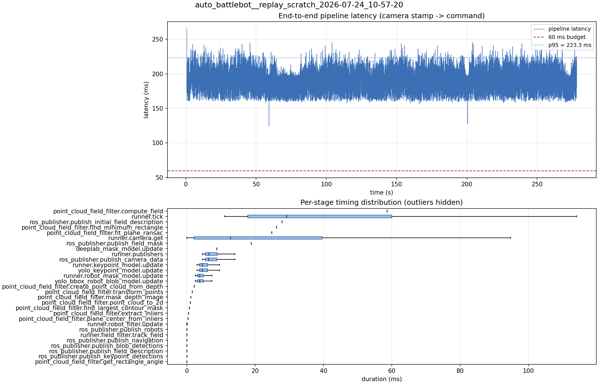

# Latency report: 2026-05-01T17-42-24 (seq)

Context: desktop x86 replay of an NHRL May SVO (mrs_buff_mk3_playback base, prescribed svo_start_frame, real-time mode, max_loop_rate = 30). Sequential model calls (temporary rollback of ParallelModelBatch). Baseline phase of the desktop A/B in ../comparison.md.

- Source: `data/recordings/auto_battlebot__replay_scratch_2026-07-24_10-57-20.mcap`
- Generated: 2026-07-24 11:24 by `scripts/mcap_latency_report.py`
- Duration: 278.2 s
- Loop rate: 27.9 Hz mean
- End-to-end latency: mean 194.4 ms / p95 223.3 ms / max 265.2 ms
- Budget: 60 ms -> p95 is OVER BUDGET

| Stage | n | mean (ms) | median (ms) | p95 (ms) | max (ms) | % of tick |
| --- | ---: | ---: | ---: | ---: | ---: | ---: |
| pipeline.latency | 6,175 | 194.39 | 197.92 | 223.33 | 265.21 | - |
| point_cloud_field_filter.compute_field | 1 | 58.61 | 58.61 | 58.61 | 58.61 | 155.5% |
| runner.tick | 6,183 | 37.69 | 29.16 | 81.45 | 261.82 | 100.0% |
| ros_publisher.publish_initial_field_description | 1 | 27.82 | 27.82 | 27.82 | 27.82 | 73.8% |
| point_cloud_field_filter.find_minimum_rectangle | 1 | 26.28 | 26.28 | 26.28 | 26.28 | 69.7% |
| point_cloud_field_filter.fit_plane_ransac | 1 | 24.79 | 24.79 | 24.79 | 24.79 | 65.8% |
| runner.camera.get | 6,183 | 20.45 | 12.76 | 58.57 | 135.51 | 54.3% |
| ros_publisher.publish_field_mask | 1 | 18.80 | 18.80 | 18.80 | 18.80 | 49.9% |
| deeplab_mask_model.update | 1 | 8.78 | 8.78 | 8.78 | 8.78 | 23.3% |
| runner.publishers | 6,175 | 7.51 | 6.37 | 13.15 | 27.45 | 19.9% |
| ros_publisher.publish_camera_data | 6,183 | 7.48 | 6.34 | 13.14 | 27.38 | 19.8% |
| runner.keypoint_model.update | 6,175 | 5.22 | 4.46 | 9.15 | 17.79 | 13.8% |
| yolo_keypoint_model.update | 6,175 | 5.21 | 4.46 | 9.14 | 17.79 | 13.8% |
| runner.robot_mask_model.update | 6,175 | 4.39 | 3.75 | 8.06 | 21.77 | 11.7% |
| yolo_bbox_robot_blob_model.update | 6,175 | 4.39 | 3.74 | 8.06 | 21.75 | 11.6% |
| point_cloud_field_filter.create_point_cloud_from_depth | 1 | 2.15 | 2.15 | 2.15 | 2.15 | 5.7% |
| point_cloud_field_filter.transform_points | 1 | 1.54 | 1.54 | 1.54 | 1.54 | 4.1% |
| point_cloud_field_filter.mask_depth_image | 1 | 1.15 | 1.15 | 1.15 | 1.15 | 3.0% |
| point_cloud_field_filter.point_cloud_to_2d | 1 | 0.97 | 0.97 | 0.97 | 0.97 | 2.6% |
| point_cloud_field_filter.find_largest_contour_mask | 1 | 0.76 | 0.76 | 0.76 | 0.76 | 2.0% |
| point_cloud_field_filter.extract_inliers | 1 | 0.51 | 0.51 | 0.51 | 0.51 | 1.4% |
| point_cloud_field_filter.plane_center_from_inliers | 1 | 0.29 | 0.29 | 0.29 | 0.29 | 0.8% |
| runner.robot_filter.update | 6,175 | 0.04 | 0.04 | 0.08 | 0.29 | 0.1% |
| ros_publisher.publish_robots | 6,175 | 0.02 | 0.01 | 0.02 | 0.51 | 0.0% |
| runner.field_filter.track_field | 6,175 | 0.01 | 0.01 | 0.02 | 0.19 | 0.0% |
| ros_publisher.publish_navigation | 6,175 | 0.01 | 0.01 | 0.02 | 0.49 | 0.0% |
| ros_publisher.publish_blob_detections | 6,175 | 0.01 | 0.01 | 0.01 | 0.36 | 0.0% |
| ros_publisher.publish_field_description | 6,175 | 0.00 | 0.00 | 0.01 | 0.04 | 0.0% |
| ros_publisher.publish_keypoint_detections | 6,175 | 0.00 | 0.00 | 0.01 | 0.07 | 0.0% |
| point_cloud_field_filter.get_rectangle_angle | 1 | 0.00 | 0.00 | 0.00 | 0.00 | 0.0% |

