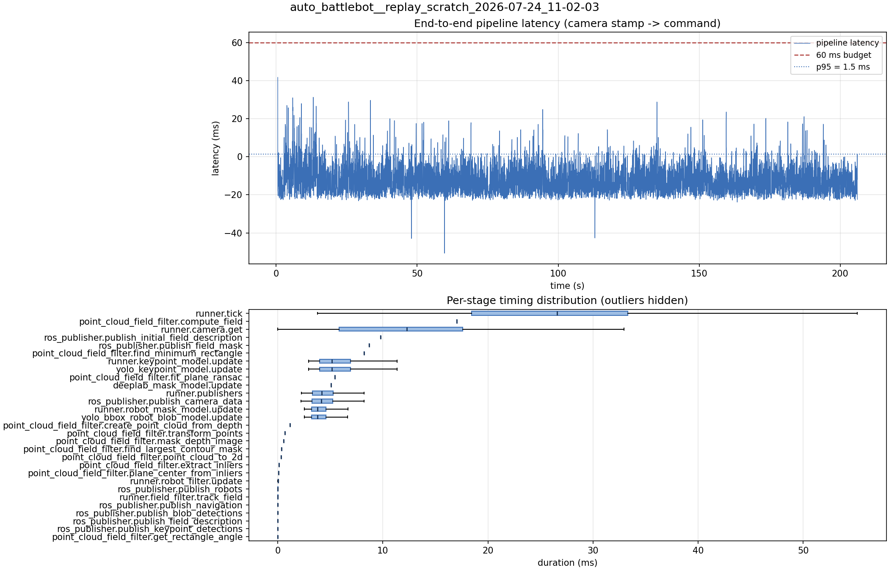

# Latency report: 2026-05-02T10-06-06 (seq)

- Source: `data/recordings/auto_battlebot__replay_scratch_2026-07-24_11-02-03.mcap`
- Generated: 2026-07-24 11:24 by `scripts/mcap_latency_report.py`
- Duration: 206.1 s
- Loop rate: 33.3 Hz mean
- End-to-end latency: mean -11.9 ms / p95 1.5 ms / max 41.8 ms
- Budget: 60 ms -> p95 is within budget

| Stage | n | mean (ms) | median (ms) | p95 (ms) | max (ms) | % of tick |
| --- | ---: | ---: | ---: | ---: | ---: | ---: |
| runner.tick | 6,168 | 26.24 | 26.58 | 42.43 | 132.94 | 100.0% |
| point_cloud_field_filter.compute_field | 1 | 17.05 | 17.05 | 17.05 | 17.05 | 65.0% |
| runner.camera.get | 6,168 | 11.77 | 12.27 | 23.76 | 78.06 | 44.8% |
| ros_publisher.publish_initial_field_description | 1 | 9.79 | 9.79 | 9.79 | 9.79 | 37.3% |
| ros_publisher.publish_field_mask | 1 | 8.71 | 8.71 | 8.71 | 8.71 | 33.2% |
| point_cloud_field_filter.find_minimum_rectangle | 1 | 8.21 | 8.21 | 8.21 | 8.21 | 31.3% |
| runner.keypoint_model.update | 6,156 | 5.72 | 5.16 | 9.89 | 17.82 | 21.8% |
| yolo_keypoint_model.update | 6,156 | 5.71 | 5.16 | 9.88 | 17.82 | 21.8% |
| point_cloud_field_filter.fit_plane_ransac | 1 | 5.41 | 5.41 | 5.41 | 5.41 | 20.6% |
| deeplab_mask_model.update | 1 | 5.07 | 5.07 | 5.07 | 5.07 | 19.3% |
| runner.publishers | 6,156 | 4.49 | 4.17 | 7.61 | 19.75 | 17.1% |
| ros_publisher.publish_camera_data | 6,168 | 4.46 | 4.14 | 7.59 | 21.90 | 17.0% |
| runner.robot_mask_model.update | 6,156 | 4.17 | 3.77 | 7.06 | 18.88 | 15.9% |
| yolo_bbox_robot_blob_model.update | 6,156 | 4.17 | 3.77 | 7.06 | 18.86 | 15.9% |
| point_cloud_field_filter.create_point_cloud_from_depth | 1 | 1.15 | 1.15 | 1.15 | 1.15 | 4.4% |
| point_cloud_field_filter.transform_points | 1 | 0.68 | 0.68 | 0.68 | 0.68 | 2.6% |
| point_cloud_field_filter.mask_depth_image | 1 | 0.56 | 0.56 | 0.56 | 0.56 | 2.1% |
| point_cloud_field_filter.find_largest_contour_mask | 1 | 0.38 | 0.38 | 0.38 | 0.38 | 1.4% |
| point_cloud_field_filter.point_cloud_to_2d | 1 | 0.33 | 0.33 | 0.33 | 0.33 | 1.3% |
| point_cloud_field_filter.extract_inliers | 1 | 0.13 | 0.13 | 0.13 | 0.13 | 0.5% |
| point_cloud_field_filter.plane_center_from_inliers | 1 | 0.08 | 0.08 | 0.08 | 0.08 | 0.3% |
| runner.robot_filter.update | 6,156 | 0.03 | 0.03 | 0.06 | 0.25 | 0.1% |
| ros_publisher.publish_robots | 6,156 | 0.02 | 0.01 | 0.03 | 0.42 | 0.1% |
| runner.field_filter.track_field | 6,156 | 0.01 | 0.01 | 0.03 | 0.26 | 0.1% |
| ros_publisher.publish_navigation | 6,156 | 0.01 | 0.01 | 0.02 | 0.58 | 0.0% |
| ros_publisher.publish_blob_detections | 6,156 | 0.01 | 0.01 | 0.02 | 0.31 | 0.0% |
| ros_publisher.publish_field_description | 6,156 | 0.00 | 0.00 | 0.01 | 0.36 | 0.0% |
| ros_publisher.publish_keypoint_detections | 6,156 | 0.00 | 0.00 | 0.01 | 1.41 | 0.0% |
| point_cloud_field_filter.get_rectangle_angle | 1 | 0.00 | 0.00 | 0.00 | 0.00 | 0.0% |
| pipeline.latency | 6,156 | -11.88 | -13.24 | 1.53 | 41.77 | - |

