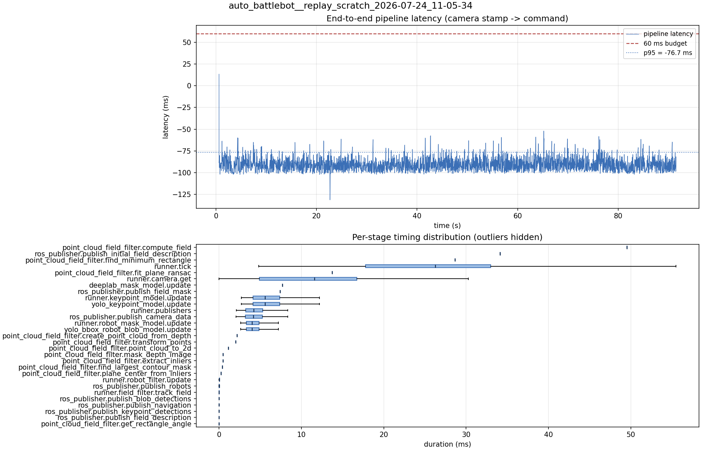

# Latency report: 2026-05-02T11-45-08 (seq)

- Source: `data/recordings/auto_battlebot__replay_scratch_2026-07-24_11-05-34.mcap`
- Generated: 2026-07-24 11:24 by `scripts/mcap_latency_report.py`
- Duration: 91.5 s
- Loop rate: 33.2 Hz mean
- End-to-end latency: mean -90.1 ms / p95 -76.7 ms / max 13.4 ms
- Budget: 60 ms -> p95 is within budget

| Stage | n | mean (ms) | median (ms) | p95 (ms) | max (ms) | % of tick |
| --- | ---: | ---: | ---: | ---: | ---: | ---: |
| point_cloud_field_filter.compute_field | 1 | 49.52 | 49.52 | 49.52 | 49.52 | 190.2% |
| ros_publisher.publish_initial_field_description | 1 | 34.13 | 34.13 | 34.13 | 34.13 | 131.1% |
| point_cloud_field_filter.find_minimum_rectangle | 1 | 28.67 | 28.67 | 28.67 | 28.67 | 110.1% |
| runner.tick | 2,737 | 26.03 | 26.26 | 42.32 | 169.71 | 100.0% |
| point_cloud_field_filter.fit_plane_ransac | 1 | 13.72 | 13.72 | 13.72 | 13.72 | 52.7% |
| runner.camera.get | 2,737 | 11.07 | 11.58 | 23.10 | 62.30 | 42.5% |
| deeplab_mask_model.update | 1 | 7.69 | 7.69 | 7.69 | 7.69 | 29.5% |
| ros_publisher.publish_field_mask | 1 | 7.42 | 7.42 | 7.42 | 7.42 | 28.5% |
| runner.keypoint_model.update | 2,725 | 6.00 | 5.60 | 10.26 | 18.40 | 23.1% |
| yolo_keypoint_model.update | 2,725 | 6.00 | 5.60 | 10.25 | 18.40 | 23.1% |
| runner.publishers | 2,725 | 4.47 | 4.20 | 7.49 | 17.34 | 17.2% |
| ros_publisher.publish_camera_data | 2,737 | 4.45 | 4.16 | 7.53 | 19.25 | 17.1% |
| runner.robot_mask_model.update | 2,725 | 4.35 | 3.99 | 7.21 | 16.87 | 16.7% |
| yolo_bbox_robot_blob_model.update | 2,725 | 4.35 | 3.99 | 7.21 | 16.86 | 16.7% |
| point_cloud_field_filter.create_point_cloud_from_depth | 1 | 2.20 | 2.20 | 2.20 | 2.20 | 8.5% |
| point_cloud_field_filter.transform_points | 1 | 2.02 | 2.02 | 2.02 | 2.02 | 7.8% |
| point_cloud_field_filter.point_cloud_to_2d | 1 | 1.14 | 1.14 | 1.14 | 1.14 | 4.4% |
| point_cloud_field_filter.mask_depth_image | 1 | 0.49 | 0.49 | 0.49 | 0.49 | 1.9% |
| point_cloud_field_filter.extract_inliers | 1 | 0.48 | 0.48 | 0.48 | 0.48 | 1.8% |
| point_cloud_field_filter.find_largest_contour_mask | 1 | 0.42 | 0.42 | 0.42 | 0.42 | 1.6% |
| point_cloud_field_filter.plane_center_from_inliers | 1 | 0.25 | 0.25 | 0.25 | 0.25 | 1.0% |
| runner.robot_filter.update | 2,725 | 0.05 | 0.04 | 0.08 | 0.15 | 0.2% |
| ros_publisher.publish_robots | 2,725 | 0.02 | 0.01 | 0.03 | 0.45 | 0.1% |
| runner.field_filter.track_field | 2,725 | 0.01 | 0.01 | 0.03 | 0.18 | 0.1% |
| ros_publisher.publish_blob_detections | 2,725 | 0.01 | 0.01 | 0.02 | 0.28 | 0.0% |
| ros_publisher.publish_navigation | 2,725 | 0.01 | 0.01 | 0.02 | 0.39 | 0.0% |
| ros_publisher.publish_keypoint_detections | 2,725 | 0.00 | 0.00 | 0.01 | 0.76 | 0.0% |
| ros_publisher.publish_field_description | 2,725 | 0.00 | 0.00 | 0.01 | 0.27 | 0.0% |
| point_cloud_field_filter.get_rectangle_angle | 1 | 0.00 | 0.00 | 0.00 | 0.00 | 0.0% |
| pipeline.latency | 2,725 | -90.15 | -91.19 | -76.74 | 13.41 | - |

