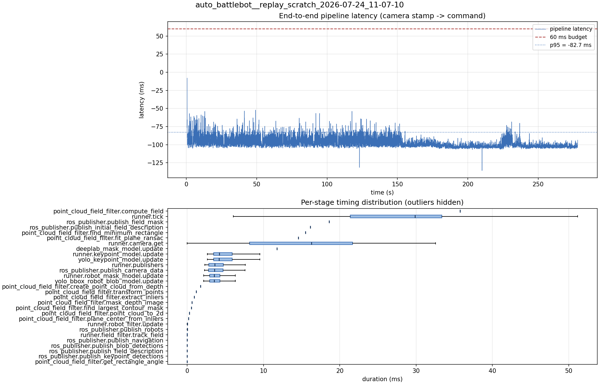

# Latency report: 2026-05-02T14-12-27 (seq)

Context: desktop x86 replay of an NHRL May SVO (mrs_buff_mk3_playback base, prescribed svo_start_frame, real-time mode, max_loop_rate = 30). Sequential model calls (temporary rollback of ParallelModelBatch). Baseline phase of the desktop A/B in ../comparison.md.

- Source: `data/recordings/auto_battlebot__replay_scratch_2026-07-24_11-07-10.mcap`
- Generated: 2026-07-24 11:24 by `scripts/mcap_latency_report.py`
- Duration: 278.1 s
- Loop rate: 33.3 Hz mean
- End-to-end latency: mean -96.6 ms / p95 -82.7 ms / max -8.1 ms
- Budget: 60 ms -> p95 is within budget

| Stage | n | mean (ms) | median (ms) | p95 (ms) | max (ms) | % of tick |
| --- | ---: | ---: | ---: | ---: | ---: | ---: |
| point_cloud_field_filter.compute_field | 1 | 35.75 | 35.75 | 35.75 | 35.75 | 130.5% |
| runner.tick | 8,327 | 27.40 | 29.86 | 39.86 | 147.44 | 100.0% |
| ros_publisher.publish_field_mask | 1 | 18.62 | 18.62 | 18.62 | 18.62 | 67.9% |
| ros_publisher.publish_initial_field_description | 1 | 16.14 | 16.14 | 16.14 | 16.14 | 58.9% |
| point_cloud_field_filter.find_minimum_rectangle | 1 | 15.51 | 15.51 | 15.51 | 15.51 | 56.6% |
| point_cloud_field_filter.fit_plane_ransac | 1 | 14.56 | 14.56 | 14.56 | 14.56 | 53.2% |
| runner.camera.get | 8,327 | 14.45 | 16.29 | 24.62 | 55.81 | 52.7% |
| deeplab_mask_model.update | 1 | 11.77 | 11.77 | 11.77 | 11.77 | 43.0% |
| runner.keypoint_model.update | 8,316 | 4.97 | 4.20 | 9.14 | 16.40 | 18.1% |
| yolo_keypoint_model.update | 8,316 | 4.97 | 4.20 | 9.14 | 16.40 | 18.1% |
| runner.publishers | 8,316 | 4.02 | 3.64 | 6.69 | 20.31 | 14.7% |
| ros_publisher.publish_camera_data | 8,327 | 3.98 | 3.60 | 6.66 | 20.15 | 14.5% |
| runner.robot_mask_model.update | 8,316 | 3.85 | 3.54 | 6.30 | 20.48 | 14.1% |
| yolo_bbox_robot_blob_model.update | 8,316 | 3.85 | 3.54 | 6.29 | 20.47 | 14.1% |
| point_cloud_field_filter.create_point_cloud_from_depth | 1 | 1.76 | 1.76 | 1.76 | 1.76 | 6.4% |
| point_cloud_field_filter.transform_points | 1 | 1.20 | 1.20 | 1.20 | 1.20 | 4.4% |
| point_cloud_field_filter.extract_inliers | 1 | 0.95 | 0.95 | 0.95 | 0.95 | 3.5% |
| point_cloud_field_filter.mask_depth_image | 1 | 0.62 | 0.62 | 0.62 | 0.62 | 2.2% |
| point_cloud_field_filter.find_largest_contour_mask | 1 | 0.54 | 0.54 | 0.54 | 0.54 | 2.0% |
| point_cloud_field_filter.point_cloud_to_2d | 1 | 0.29 | 0.29 | 0.29 | 0.29 | 1.1% |
| point_cloud_field_filter.plane_center_from_inliers | 1 | 0.20 | 0.20 | 0.20 | 0.20 | 0.7% |
| runner.robot_filter.update | 8,316 | 0.04 | 0.04 | 0.07 | 0.29 | 0.2% |
| ros_publisher.publish_robots | 8,316 | 0.02 | 0.01 | 0.03 | 0.74 | 0.1% |
| runner.field_filter.track_field | 8,316 | 0.01 | 0.01 | 0.02 | 0.54 | 0.0% |
| ros_publisher.publish_navigation | 8,316 | 0.01 | 0.01 | 0.02 | 1.53 | 0.0% |
| ros_publisher.publish_blob_detections | 8,316 | 0.01 | 0.01 | 0.02 | 0.70 | 0.0% |
| ros_publisher.publish_field_description | 8,316 | 0.00 | 0.00 | 0.01 | 0.29 | 0.0% |
| ros_publisher.publish_keypoint_detections | 8,316 | 0.00 | 0.00 | 0.01 | 0.40 | 0.0% |
| point_cloud_field_filter.get_rectangle_angle | 1 | 0.00 | 0.00 | 0.00 | 0.00 | 0.0% |
| pipeline.latency | 8,316 | -96.64 | -99.06 | -82.67 | -8.08 | - |

