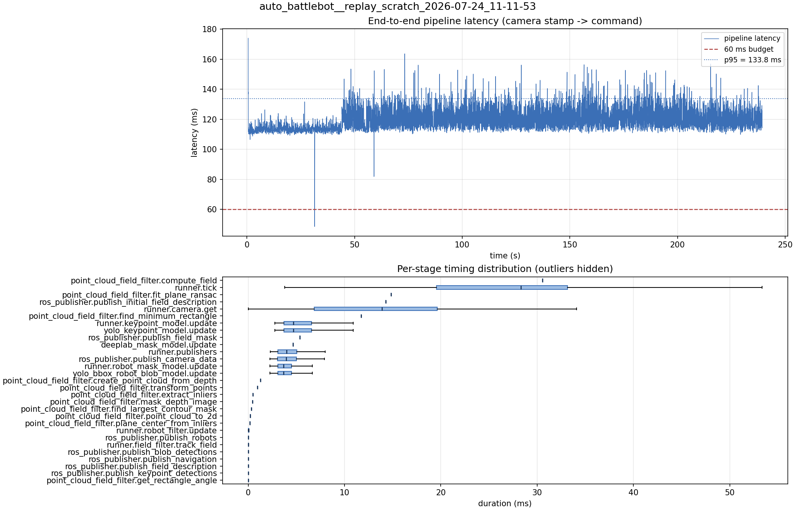

# Latency report: 2026-05-02T15-35-04 (seq)

Context: desktop x86 replay of an NHRL May SVO (mrs_buff_mk3_playback base, prescribed svo_start_frame, real-time mode, max_loop_rate = 30). Sequential model calls (temporary rollback of ParallelModelBatch). Baseline phase of the desktop A/B in ../comparison.md.

- Source: `data/recordings/auto_battlebot__replay_scratch_2026-07-24_11-11-53.mcap`
- Generated: 2026-07-24 11:24 by `scripts/mcap_latency_report.py`
- Duration: 239.3 s
- Loop rate: 33.3 Hz mean
- End-to-end latency: mean 120.5 ms / p95 133.8 ms / max 174.0 ms
- Budget: 60 ms -> p95 is OVER BUDGET

| Stage | n | mean (ms) | median (ms) | p95 (ms) | max (ms) | % of tick |
| --- | ---: | ---: | ---: | ---: | ---: | ---: |
| pipeline.latency | 7,157 | 120.45 | 118.83 | 133.79 | 174.02 | - |
| point_cloud_field_filter.compute_field | 1 | 30.58 | 30.58 | 30.58 | 30.58 | 114.4% |
| runner.tick | 7,168 | 26.73 | 28.32 | 40.72 | 132.70 | 100.0% |
| point_cloud_field_filter.fit_plane_ransac | 1 | 14.82 | 14.82 | 14.82 | 14.82 | 55.5% |
| ros_publisher.publish_initial_field_description | 1 | 14.29 | 14.29 | 14.29 | 14.29 | 53.5% |
| runner.camera.get | 7,168 | 13.00 | 13.91 | 24.15 | 88.67 | 48.6% |
| point_cloud_field_filter.find_minimum_rectangle | 1 | 11.73 | 11.73 | 11.73 | 11.73 | 43.9% |
| runner.keypoint_model.update | 7,157 | 5.39 | 4.71 | 9.40 | 15.17 | 20.2% |
| yolo_keypoint_model.update | 7,157 | 5.39 | 4.71 | 9.40 | 15.17 | 20.2% |
| ros_publisher.publish_field_mask | 1 | 5.37 | 5.37 | 5.37 | 5.37 | 20.1% |
| deeplab_mask_model.update | 1 | 4.64 | 4.64 | 4.64 | 4.64 | 17.3% |
| runner.publishers | 7,157 | 4.26 | 3.98 | 6.98 | 15.48 | 16.0% |
| ros_publisher.publish_camera_data | 7,168 | 4.22 | 3.93 | 6.92 | 15.39 | 15.8% |
| runner.robot_mask_model.update | 7,157 | 3.97 | 3.67 | 6.32 | 18.00 | 14.9% |
| yolo_bbox_robot_blob_model.update | 7,157 | 3.97 | 3.67 | 6.31 | 18.00 | 14.9% |
| point_cloud_field_filter.create_point_cloud_from_depth | 1 | 1.27 | 1.27 | 1.27 | 1.27 | 4.8% |
| point_cloud_field_filter.transform_points | 1 | 0.96 | 0.96 | 0.96 | 0.96 | 3.6% |
| point_cloud_field_filter.extract_inliers | 1 | 0.51 | 0.51 | 0.51 | 0.51 | 1.9% |
| point_cloud_field_filter.mask_depth_image | 1 | 0.46 | 0.46 | 0.46 | 0.46 | 1.7% |
| point_cloud_field_filter.find_largest_contour_mask | 1 | 0.32 | 0.32 | 0.32 | 0.32 | 1.2% |
| point_cloud_field_filter.point_cloud_to_2d | 1 | 0.22 | 0.22 | 0.22 | 0.22 | 0.8% |
| point_cloud_field_filter.plane_center_from_inliers | 1 | 0.15 | 0.15 | 0.15 | 0.15 | 0.6% |
| runner.robot_filter.update | 7,157 | 0.04 | 0.04 | 0.07 | 0.35 | 0.2% |
| ros_publisher.publish_robots | 7,157 | 0.02 | 0.01 | 0.04 | 1.05 | 0.1% |
| runner.field_filter.track_field | 7,157 | 0.02 | 0.01 | 0.03 | 0.26 | 0.1% |
| ros_publisher.publish_blob_detections | 7,157 | 0.01 | 0.01 | 0.02 | 0.49 | 0.0% |
| ros_publisher.publish_navigation | 7,157 | 0.01 | 0.01 | 0.02 | 0.61 | 0.0% |
| ros_publisher.publish_field_description | 7,157 | 0.00 | 0.00 | 0.01 | 0.05 | 0.0% |
| ros_publisher.publish_keypoint_detections | 7,157 | 0.00 | 0.00 | 0.01 | 0.32 | 0.0% |
| point_cloud_field_filter.get_rectangle_angle | 1 | 0.00 | 0.00 | 0.00 | 0.00 | 0.0% |

