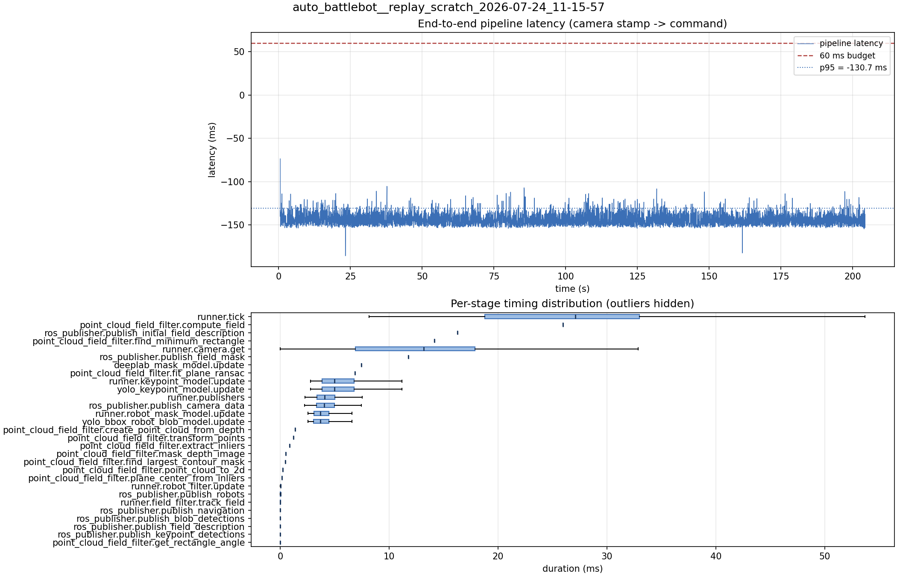

# Latency report: 2026-05-02T16-18-07 (seq)

- Source: `data/recordings/auto_battlebot__replay_scratch_2026-07-24_11-15-57.mcap`
- Generated: 2026-07-24 11:24 by `scripts/mcap_latency_report.py`
- Duration: 204.3 s
- Loop rate: 33.5 Hz mean
- End-to-end latency: mean -143.1 ms / p95 -130.7 ms / max -73.6 ms
- Budget: 60 ms -> p95 is within budget

| Stage | n | mean (ms) | median (ms) | p95 (ms) | max (ms) | % of tick |
| --- | ---: | ---: | ---: | ---: | ---: | ---: |
| runner.tick | 6,131 | 26.18 | 27.10 | 41.23 | 141.20 | 100.0% |
| point_cloud_field_filter.compute_field | 1 | 25.98 | 25.98 | 25.98 | 25.98 | 99.3% |
| ros_publisher.publish_initial_field_description | 1 | 16.26 | 16.26 | 16.26 | 16.26 | 62.1% |
| point_cloud_field_filter.find_minimum_rectangle | 1 | 14.14 | 14.14 | 14.14 | 14.14 | 54.0% |
| runner.camera.get | 6,131 | 12.31 | 13.19 | 23.76 | 70.96 | 47.0% |
| ros_publisher.publish_field_mask | 1 | 11.77 | 11.77 | 11.77 | 11.77 | 45.0% |
| deeplab_mask_model.update | 1 | 7.45 | 7.45 | 7.45 | 7.45 | 28.5% |
| point_cloud_field_filter.fit_plane_ransac | 1 | 6.87 | 6.87 | 6.87 | 6.87 | 26.2% |
| runner.keypoint_model.update | 6,119 | 5.49 | 5.00 | 9.26 | 14.62 | 21.0% |
| yolo_keypoint_model.update | 6,119 | 5.49 | 4.99 | 9.26 | 14.62 | 21.0% |
| runner.publishers | 6,119 | 4.32 | 4.06 | 6.80 | 15.13 | 16.5% |
| ros_publisher.publish_camera_data | 6,131 | 4.29 | 4.01 | 6.78 | 15.10 | 16.4% |
| runner.robot_mask_model.update | 6,119 | 3.96 | 3.69 | 6.17 | 14.12 | 15.1% |
| yolo_bbox_robot_blob_model.update | 6,119 | 3.95 | 3.68 | 6.17 | 14.11 | 15.1% |
| point_cloud_field_filter.create_point_cloud_from_depth | 1 | 1.38 | 1.38 | 1.38 | 1.38 | 5.3% |
| point_cloud_field_filter.transform_points | 1 | 1.19 | 1.19 | 1.19 | 1.19 | 4.6% |
| point_cloud_field_filter.extract_inliers | 1 | 0.87 | 0.87 | 0.87 | 0.87 | 3.3% |
| point_cloud_field_filter.mask_depth_image | 1 | 0.52 | 0.52 | 0.52 | 0.52 | 2.0% |
| point_cloud_field_filter.find_largest_contour_mask | 1 | 0.48 | 0.48 | 0.48 | 0.48 | 1.8% |
| point_cloud_field_filter.point_cloud_to_2d | 1 | 0.25 | 0.25 | 0.25 | 0.25 | 0.9% |
| point_cloud_field_filter.plane_center_from_inliers | 1 | 0.14 | 0.14 | 0.14 | 0.14 | 0.6% |
| runner.robot_filter.update | 6,119 | 0.03 | 0.03 | 0.06 | 0.16 | 0.1% |
| ros_publisher.publish_robots | 6,119 | 0.02 | 0.01 | 0.04 | 0.94 | 0.1% |
| runner.field_filter.track_field | 6,119 | 0.01 | 0.01 | 0.03 | 0.34 | 0.1% |
| ros_publisher.publish_navigation | 6,119 | 0.01 | 0.01 | 0.02 | 0.67 | 0.0% |
| ros_publisher.publish_blob_detections | 6,119 | 0.01 | 0.01 | 0.02 | 0.31 | 0.0% |
| ros_publisher.publish_field_description | 6,119 | 0.00 | 0.00 | 0.01 | 0.31 | 0.0% |
| ros_publisher.publish_keypoint_detections | 6,119 | 0.00 | 0.00 | 0.01 | 0.35 | 0.0% |
| point_cloud_field_filter.get_rectangle_angle | 1 | 0.00 | 0.00 | 0.00 | 0.00 | 0.0% |
| pipeline.latency | 6,119 | -143.12 | -144.14 | -130.71 | -73.64 | - |

