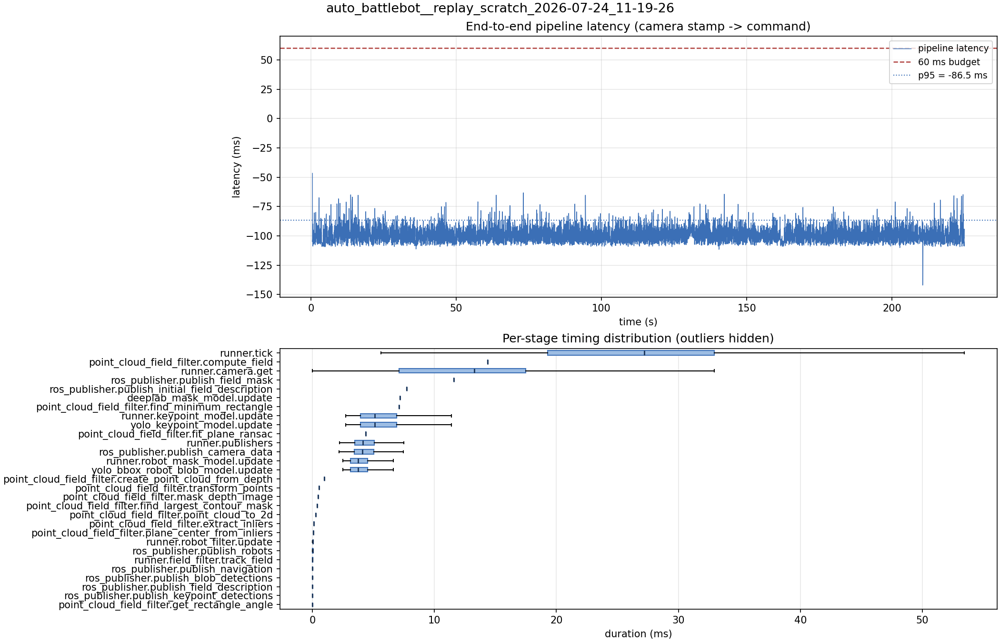

# Latency report: 2026-05-02T17-26-14 (seq)

Context: desktop x86 replay of an NHRL May SVO (mrs_buff_mk3_playback base, prescribed svo_start_frame, real-time mode, max_loop_rate = 30). Sequential model calls (temporary rollback of ParallelModelBatch). Baseline phase of the desktop A/B in ../comparison.md.

- Source: `data/recordings/auto_battlebot__replay_scratch_2026-07-24_11-19-26.mcap`
- Generated: 2026-07-24 11:24 by `scripts/mcap_latency_report.py`
- Duration: 224.9 s
- Loop rate: 33.2 Hz mean
- End-to-end latency: mean -98.3 ms / p95 -86.5 ms / max -46.7 ms
- Budget: 60 ms -> p95 is within budget

| Stage | n | mean (ms) | median (ms) | p95 (ms) | max (ms) | % of tick |
| --- | ---: | ---: | ---: | ---: | ---: | ---: |
| runner.tick | 6,741 | 26.24 | 27.19 | 40.56 | 112.22 | 100.0% |
| point_cloud_field_filter.compute_field | 1 | 14.37 | 14.37 | 14.37 | 14.37 | 54.8% |
| runner.camera.get | 6,741 | 12.20 | 13.25 | 23.38 | 59.61 | 46.5% |
| ros_publisher.publish_field_mask | 1 | 11.58 | 11.58 | 11.58 | 11.58 | 44.1% |
| ros_publisher.publish_initial_field_description | 1 | 7.72 | 7.72 | 7.72 | 7.72 | 29.4% |
| deeplab_mask_model.update | 1 | 7.17 | 7.17 | 7.17 | 7.17 | 27.3% |
| point_cloud_field_filter.find_minimum_rectangle | 1 | 7.11 | 7.11 | 7.11 | 7.11 | 27.1% |
| runner.keypoint_model.update | 6,729 | 5.58 | 5.09 | 9.29 | 14.30 | 21.3% |
| yolo_keypoint_model.update | 6,729 | 5.58 | 5.09 | 9.29 | 14.29 | 21.3% |
| point_cloud_field_filter.fit_plane_ransac | 1 | 4.38 | 4.38 | 4.38 | 4.38 | 16.7% |
| runner.publishers | 6,729 | 4.38 | 4.12 | 6.78 | 14.43 | 16.7% |
| ros_publisher.publish_camera_data | 6,741 | 4.34 | 4.08 | 6.77 | 17.90 | 16.6% |
| runner.robot_mask_model.update | 6,729 | 3.98 | 3.73 | 6.13 | 12.61 | 15.2% |
| yolo_bbox_robot_blob_model.update | 6,729 | 3.98 | 3.73 | 6.12 | 12.61 | 15.1% |
| point_cloud_field_filter.create_point_cloud_from_depth | 1 | 0.96 | 0.96 | 0.96 | 0.96 | 3.7% |
| point_cloud_field_filter.transform_points | 1 | 0.54 | 0.54 | 0.54 | 0.54 | 2.0% |
| point_cloud_field_filter.mask_depth_image | 1 | 0.48 | 0.48 | 0.48 | 0.48 | 1.8% |
| point_cloud_field_filter.find_largest_contour_mask | 1 | 0.39 | 0.39 | 0.39 | 0.39 | 1.5% |
| point_cloud_field_filter.point_cloud_to_2d | 1 | 0.26 | 0.26 | 0.26 | 0.26 | 1.0% |
| point_cloud_field_filter.extract_inliers | 1 | 0.12 | 0.12 | 0.12 | 0.12 | 0.4% |
| point_cloud_field_filter.plane_center_from_inliers | 1 | 0.06 | 0.06 | 0.06 | 0.06 | 0.2% |
| runner.robot_filter.update | 6,729 | 0.04 | 0.04 | 0.07 | 0.21 | 0.2% |
| ros_publisher.publish_robots | 6,729 | 0.02 | 0.01 | 0.04 | 0.79 | 0.1% |
| runner.field_filter.track_field | 6,729 | 0.01 | 0.01 | 0.03 | 0.20 | 0.1% |
| ros_publisher.publish_navigation | 6,729 | 0.01 | 0.01 | 0.02 | 0.98 | 0.0% |
| ros_publisher.publish_blob_detections | 6,729 | 0.01 | 0.01 | 0.03 | 0.37 | 0.0% |
| ros_publisher.publish_field_description | 6,729 | 0.00 | 0.00 | 0.01 | 0.34 | 0.0% |
| ros_publisher.publish_keypoint_detections | 6,729 | 0.00 | 0.00 | 0.01 | 0.53 | 0.0% |
| point_cloud_field_filter.get_rectangle_angle | 1 | 0.00 | 0.00 | 0.00 | 0.00 | 0.0% |
| pipeline.latency | 6,729 | -98.35 | -99.22 | -86.50 | -46.66 | - |

