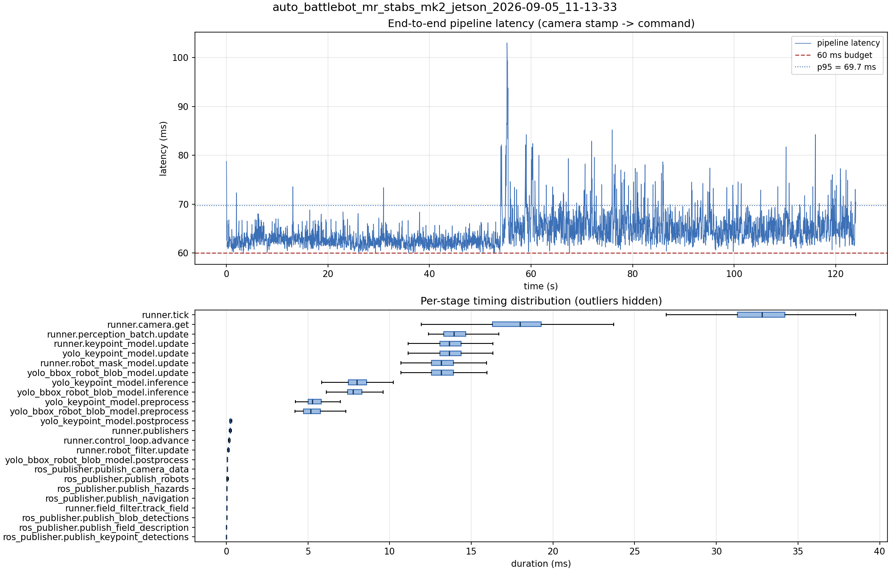

# Latency report: auto_battlebot_mr_stabs_mk2_jetson_2026-09-05_11-13-33

engine: yolo26n_nhrl_robots_bbox_2class_mixed_2026-07-31_aarch64_sm87.engine (deployed baseline)

- Source: `/home/ben/auto-battlebot/data/recordings/auto_battlebot_mr_stabs_mk2_jetson_2026-09-05_11-13-33.mcap`
- Generated: 2026-09-05 12:13 by `scripts/mcap_latency_report.py`
- Duration: 124.0 s
- Window: after field init (4.6 s into the recording)
- Loop rate: 30.4 Hz mean
- End-to-end latency: mean 64.4 ms / p95 69.7 ms / max 103.0 ms
- Budget: 60 ms -> p95 is OVER BUDGET

| Stage | n | mean (ms) | median (ms) | p95 (ms) | max (ms) | % of tick |
| --- | ---: | ---: | ---: | ---: | ---: | ---: |
| pipeline.latency | 3,718 | 64.39 | 63.46 | 69.66 | 103.05 | - |
| runner.tick | 3,718 | 32.67 | 32.81 | 37.34 | 65.44 | 100.0% |
| runner.camera.get | 3,718 | 17.52 | 17.99 | 21.37 | 51.96 | 53.6% |
| runner.perception_batch.update | 3,718 | 14.27 | 13.93 | 16.67 | 35.13 | 43.7% |
| runner.keypoint_model.update | 3,718 | 13.92 | 13.66 | 15.96 | 35.04 | 42.6% |
| yolo_keypoint_model.update | 3,718 | 13.91 | 13.65 | 15.95 | 35.04 | 42.6% |
| runner.robot_mask_model.update | 3,718 | 13.41 | 13.16 | 15.49 | 30.58 | 41.0% |
| yolo_bbox_robot_blob_model.update | 3,718 | 13.41 | 13.16 | 15.48 | 30.57 | 41.0% |
| yolo_keypoint_model.inference | 3,718 | 8.15 | 8.00 | 9.82 | 28.43 | 25.0% |
| yolo_bbox_robot_blob_model.inference | 3,718 | 7.95 | 7.75 | 9.39 | 23.87 | 24.3% |
| yolo_keypoint_model.preprocess | 3,718 | 5.42 | 5.26 | 6.65 | 13.87 | 16.6% |
| yolo_bbox_robot_blob_model.preprocess | 3,718 | 5.32 | 5.16 | 6.67 | 17.36 | 16.3% |
| yolo_keypoint_model.postprocess | 3,718 | 0.28 | 0.24 | 0.34 | 6.61 | 0.9% |
| runner.publishers | 3,718 | 0.26 | 0.24 | 0.31 | 3.73 | 0.8% |
| runner.control_loop.advance | 3,718 | 0.18 | 0.17 | 0.23 | 3.69 | 0.6% |
| runner.robot_filter.update | 3,718 | 0.13 | 0.12 | 0.16 | 3.48 | 0.4% |
| yolo_bbox_robot_blob_model.postprocess | 3,718 | 0.08 | 0.07 | 0.09 | 4.25 | 0.2% |
| ros_publisher.publish_camera_data | 3,718 | 0.07 | 0.06 | 0.08 | 0.96 | 0.2% |
| ros_publisher.publish_robots | 3,718 | 0.06 | 0.06 | 0.09 | 1.08 | 0.2% |
| ros_publisher.publish_hazards | 3,718 | 0.04 | 0.04 | 0.04 | 1.91 | 0.1% |
| ros_publisher.publish_navigation | 3,718 | 0.03 | 0.03 | 0.03 | 0.86 | 0.1% |
| runner.field_filter.track_field | 3,718 | 0.02 | 0.02 | 0.05 | 0.17 | 0.1% |
| ros_publisher.publish_blob_detections | 3,718 | 0.02 | 0.02 | 0.03 | 3.46 | 0.1% |
| ros_publisher.publish_field_description | 3,718 | 0.01 | 0.01 | 0.01 | 1.04 | 0.0% |
| ros_publisher.publish_keypoint_detections | 3,718 | 0.01 | 0.01 | 0.01 | 0.44 | 0.0% |

