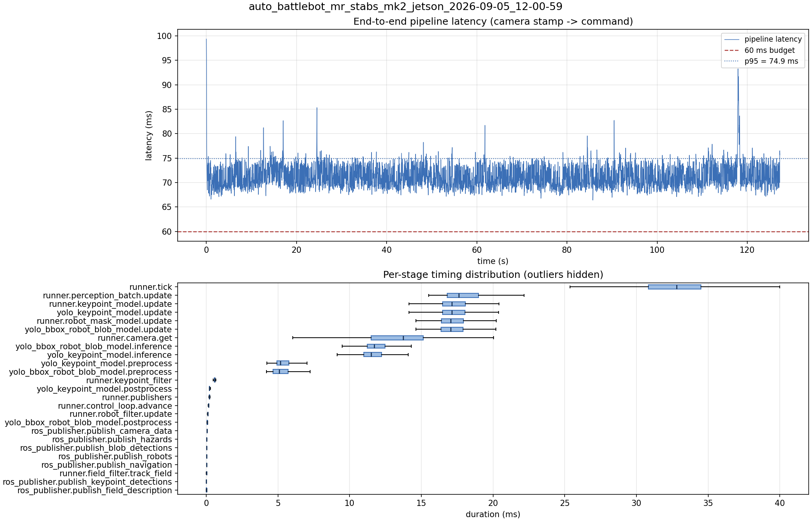

# Latency report: auto_battlebot_mr_stabs_mk2_jetson_2026-09-05_12-00-59

engine: yolo26s_nhrl_robots_bbox_2class_2026-09-04_aarch64_sm87.engine

- Source: `/home/ben/auto-battlebot/data/recordings/auto_battlebot_mr_stabs_mk2_jetson_2026-09-05_12-00-59.mcap`
- Generated: 2026-09-05 12:13 by `scripts/mcap_latency_report.py`
- Duration: 127.2 s
- Window: after field init (5.7 s into the recording)
- Loop rate: 30.3 Hz mean
- End-to-end latency: mean 71.2 ms / p95 74.9 ms / max 99.4 ms
- Budget: 60 ms -> p95 is OVER BUDGET

| Stage | n | mean (ms) | median (ms) | p95 (ms) | max (ms) | % of tick |
| --- | ---: | ---: | ---: | ---: | ---: | ---: |
| pipeline.latency | 3,818 | 71.21 | 70.59 | 74.86 | 99.36 | - |
| runner.tick | 3,818 | 32.72 | 32.79 | 37.55 | 45.60 | 100.0% |
| runner.perception_batch.update | 3,818 | 17.99 | 17.60 | 20.86 | 27.62 | 55.0% |
| runner.keypoint_model.update | 3,818 | 17.43 | 17.13 | 20.33 | 26.13 | 53.3% |
| yolo_keypoint_model.update | 3,818 | 17.42 | 17.13 | 20.33 | 26.12 | 53.2% |
| runner.robot_mask_model.update | 3,818 | 17.35 | 17.05 | 20.15 | 27.56 | 53.0% |
| yolo_bbox_robot_blob_model.update | 3,818 | 17.34 | 17.04 | 20.14 | 27.55 | 53.0% |
| runner.camera.get | 3,818 | 13.32 | 13.72 | 16.79 | 23.57 | 40.7% |
| yolo_bbox_robot_blob_model.inference | 3,818 | 11.98 | 11.72 | 14.64 | 21.28 | 36.6% |
| yolo_keypoint_model.inference | 3,818 | 11.72 | 11.49 | 14.28 | 21.32 | 35.8% |
| yolo_keypoint_model.preprocess | 3,818 | 5.32 | 5.17 | 6.38 | 9.64 | 16.3% |
| yolo_bbox_robot_blob_model.preprocess | 3,818 | 5.20 | 5.08 | 6.34 | 10.93 | 15.9% |
| runner.keypoint_filter | 3,818 | 0.57 | 0.58 | 0.70 | 3.22 | 1.8% |
| yolo_keypoint_model.postprocess | 3,818 | 0.32 | 0.23 | 0.44 | 5.29 | 1.0% |
| runner.publishers | 3,818 | 0.25 | 0.21 | 0.28 | 4.23 | 0.8% |
| runner.control_loop.advance | 3,818 | 0.16 | 0.15 | 0.20 | 3.64 | 0.5% |
| runner.robot_filter.update | 3,818 | 0.11 | 0.10 | 0.13 | 2.15 | 0.3% |
| yolo_bbox_robot_blob_model.postprocess | 3,818 | 0.11 | 0.07 | 0.11 | 4.35 | 0.3% |
| ros_publisher.publish_camera_data | 3,818 | 0.07 | 0.06 | 0.08 | 2.72 | 0.2% |
| ros_publisher.publish_hazards | 3,818 | 0.04 | 0.04 | 0.05 | 3.52 | 0.1% |
| ros_publisher.publish_blob_detections | 3,818 | 0.03 | 0.02 | 0.04 | 3.98 | 0.1% |
| ros_publisher.publish_robots | 3,818 | 0.03 | 0.03 | 0.04 | 0.99 | 0.1% |
| ros_publisher.publish_navigation | 3,818 | 0.03 | 0.03 | 0.03 | 3.48 | 0.1% |
| runner.field_filter.track_field | 3,818 | 0.02 | 0.02 | 0.06 | 0.12 | 0.1% |
| ros_publisher.publish_keypoint_detections | 3,818 | 0.01 | 0.01 | 0.01 | 3.68 | 0.0% |
| ros_publisher.publish_field_description | 3,818 | 0.01 | 0.01 | 0.01 | 0.88 | 0.0% |

