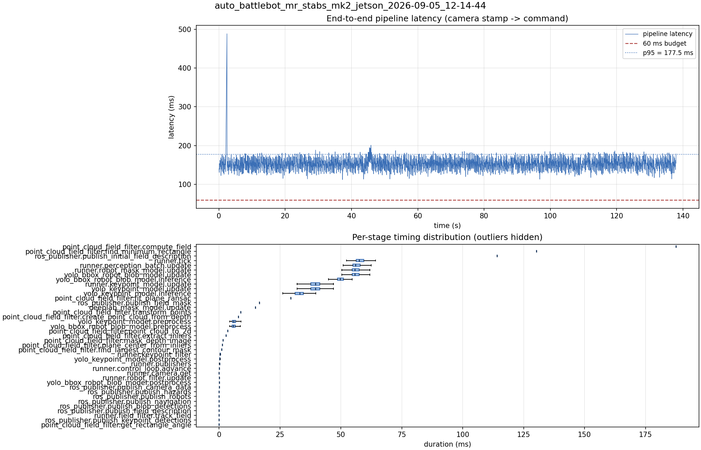

# Latency report: auto_battlebot_mr_stabs_mk2_jetson_2026-09-05_12-14-44

new engine: yolo26x_nhrl_robots_bbox_2class_2026-09-04_aarch64_sm87.engine

- Source: `/home/ben/auto-battlebot/data/recordings/auto_battlebot_mr_stabs_mk2_jetson_2026-09-05_12-14-44.mcap`
- Generated: 2026-09-05 12:19 by `scripts/mcap_latency_report.py`
- Duration: 137.9 s
- Window: after field init (4.6 s into the recording)
- Loop rate: 17.0 Hz mean
- End-to-end latency: mean 152.8 ms / p95 177.5 ms / max 488.5 ms
- Budget: 60 ms -> p95 is OVER BUDGET

| Stage | n | mean (ms) | median (ms) | p95 (ms) | max (ms) | % of tick |
| --- | ---: | ---: | ---: | ---: | ---: | ---: |
| point_cloud_field_filter.compute_field | 1 | 187.57 | 187.57 | 187.57 | 187.57 | 322.2% |
| pipeline.latency | 2,335 | 152.83 | 152.98 | 177.51 | 488.52 | - |
| point_cloud_field_filter.find_minimum_rectangle | 1 | 130.31 | 130.31 | 130.31 | 130.31 | 223.8% |
| ros_publisher.publish_initial_field_description | 1 | 114.06 | 114.06 | 114.06 | 114.06 | 195.9% |
| runner.tick | 2,335 | 58.22 | 57.51 | 62.97 | 389.05 | 100.0% |
| runner.perception_batch.update | 2,335 | 56.63 | 56.03 | 61.61 | 69.74 | 97.3% |
| runner.robot_mask_model.update | 2,335 | 56.32 | 55.77 | 60.77 | 69.66 | 96.7% |
| yolo_bbox_robot_blob_model.update | 2,335 | 56.31 | 55.77 | 60.74 | 69.65 | 96.7% |
| yolo_bbox_robot_blob_model.inference | 2,335 | 49.96 | 49.65 | 53.87 | 62.68 | 85.8% |
| runner.keypoint_model.update | 2,335 | 39.53 | 39.61 | 46.93 | 55.54 | 67.9% |
| yolo_keypoint_model.update | 2,335 | 39.52 | 39.60 | 46.92 | 55.53 | 67.9% |
| yolo_keypoint_model.inference | 2,335 | 32.81 | 33.09 | 38.74 | 46.81 | 56.3% |
| point_cloud_field_filter.fit_plane_ransac | 1 | 29.41 | 29.41 | 29.41 | 29.41 | 50.5% |
| ros_publisher.publish_field_mask | 1 | 16.54 | 16.54 | 16.54 | 16.54 | 28.4% |
| deeplab_mask_model.update | 1 | 14.91 | 14.91 | 14.91 | 14.91 | 25.6% |
| point_cloud_field_filter.transform_points | 1 | 8.92 | 8.92 | 8.92 | 8.92 | 15.3% |
| point_cloud_field_filter.create_point_cloud_from_depth | 1 | 7.92 | 7.92 | 7.92 | 7.92 | 13.6% |
| yolo_keypoint_model.preprocess | 2,335 | 6.35 | 6.05 | 9.40 | 14.11 | 10.9% |
| yolo_bbox_robot_blob_model.preprocess | 2,335 | 6.21 | 5.93 | 9.14 | 12.74 | 10.7% |
| point_cloud_field_filter.point_cloud_to_2d | 1 | 3.52 | 3.52 | 3.52 | 3.52 | 6.0% |
| point_cloud_field_filter.extract_inliers | 1 | 2.90 | 2.90 | 2.90 | 2.90 | 5.0% |
| point_cloud_field_filter.mask_depth_image | 1 | 1.57 | 1.57 | 1.57 | 1.57 | 2.7% |
| point_cloud_field_filter.plane_center_from_inliers | 1 | 1.30 | 1.30 | 1.30 | 1.30 | 2.2% |
| point_cloud_field_filter.find_largest_contour_mask | 1 | 1.10 | 1.10 | 1.10 | 1.10 | 1.9% |
| runner.keypoint_filter | 2,335 | 0.50 | 0.47 | 0.69 | 2.10 | 0.9% |
| yolo_keypoint_model.postprocess | 2,335 | 0.30 | 0.25 | 0.48 | 4.24 | 0.5% |
| runner.publishers | 2,335 | 0.23 | 0.21 | 0.27 | 3.01 | 0.4% |
| runner.control_loop.advance | 2,335 | 0.16 | 0.14 | 0.29 | 0.84 | 0.3% |
| runner.camera.get | 2,335 | 0.11 | 0.01 | 0.03 | 5.60 | 0.2% |
| runner.robot_filter.update | 2,335 | 0.10 | 0.09 | 0.12 | 0.39 | 0.2% |
| yolo_bbox_robot_blob_model.postprocess | 2,335 | 0.09 | 0.07 | 0.14 | 4.79 | 0.2% |
| ros_publisher.publish_camera_data | 2,335 | 0.07 | 0.06 | 0.08 | 1.10 | 0.1% |
| ros_publisher.publish_hazards | 2,335 | 0.04 | 0.04 | 0.05 | 0.33 | 0.1% |
| ros_publisher.publish_robots | 2,335 | 0.03 | 0.03 | 0.04 | 0.97 | 0.1% |
| ros_publisher.publish_navigation | 2,335 | 0.03 | 0.03 | 0.03 | 1.04 | 0.0% |
| ros_publisher.publish_blob_detections | 2,335 | 0.02 | 0.02 | 0.03 | 2.77 | 0.0% |
| ros_publisher.publish_field_description | 2,335 | 0.01 | 0.01 | 0.01 | 0.10 | 0.0% |
| runner.field_filter.track_field | 2,335 | 0.01 | 0.01 | 0.02 | 0.80 | 0.0% |
| ros_publisher.publish_keypoint_detections | 2,335 | 0.01 | 0.01 | 0.01 | 0.88 | 0.0% |
| point_cloud_field_filter.get_rectangle_angle | 1 | 0.00 | 0.00 | 0.00 | 0.00 | 0.0% |

