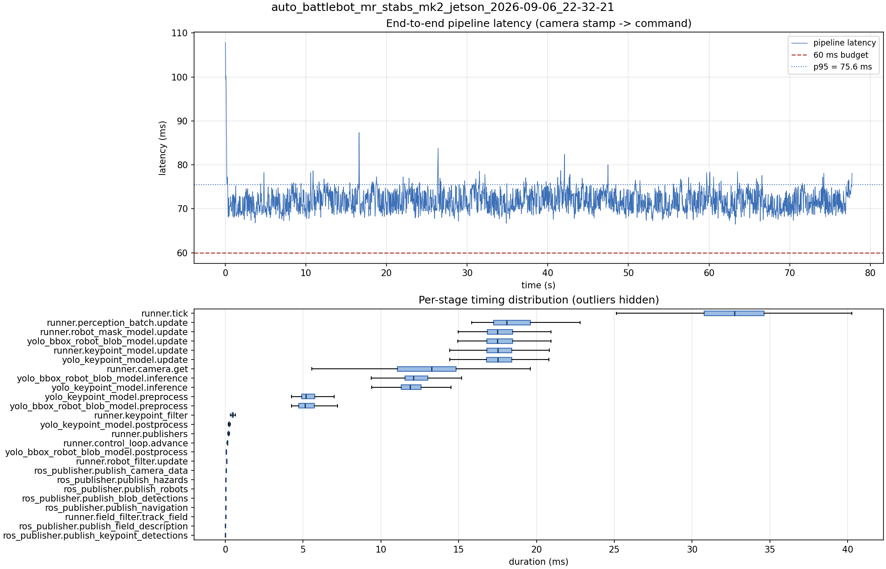

# Latency report: auto_battlebot_mr_stabs_mk2_jetson_2026-09-06_22-32-21

engine: yolo26s_nhrl_robots_bbox_2class_2026-09-04_aarch64_sm87.engine

- Source: `data/recordings/auto_battlebot_mr_stabs_mk2_jetson_2026-09-06_22-32-21.mcap`
- Generated: 2026-09-06 23:02 by `scripts/mcap_latency_report.py`
- Duration: 77.7 s
- Window: after field init (3.9 s into the recording)
- Loop rate: 30.3 Hz mean
- End-to-end latency: mean 71.8 ms / p95 75.6 ms / max 107.8 ms
- Budget: 60 ms -> p95 is OVER BUDGET

| Stage | n | mean (ms) | median (ms) | p95 (ms) | max (ms) | % of tick |
| --- | ---: | ---: | ---: | ---: | ---: | ---: |
| pipeline.latency | 2,333 | 71.84 | 71.48 | 75.55 | 107.82 | - |
| runner.tick | 2,333 | 32.72 | 32.72 | 37.51 | 45.31 | 100.0% |
| runner.perception_batch.update | 2,333 | 18.45 | 18.09 | 21.06 | 32.08 | 56.4% |
| runner.robot_mask_model.update | 2,333 | 17.82 | 17.49 | 20.56 | 31.24 | 54.5% |
| yolo_bbox_robot_blob_model.update | 2,333 | 17.81 | 17.48 | 20.55 | 31.23 | 54.4% |
| runner.keypoint_model.update | 2,333 | 17.78 | 17.52 | 20.60 | 32.01 | 54.3% |
| yolo_keypoint_model.update | 2,333 | 17.77 | 17.51 | 20.60 | 32.00 | 54.3% |
| runner.camera.get | 2,333 | 12.98 | 13.27 | 16.68 | 19.61 | 39.7% |
| yolo_bbox_robot_blob_model.inference | 2,333 | 12.42 | 12.10 | 15.20 | 24.27 | 38.0% |
| yolo_keypoint_model.inference | 2,333 | 12.09 | 11.86 | 14.71 | 24.49 | 36.9% |
| yolo_keypoint_model.preprocess | 2,333 | 5.30 | 5.18 | 6.37 | 8.87 | 16.2% |
| yolo_bbox_robot_blob_model.preprocess | 2,333 | 5.24 | 5.12 | 6.40 | 9.34 | 16.0% |
| runner.keypoint_filter | 2,333 | 0.49 | 0.48 | 0.63 | 2.77 | 1.5% |
| yolo_keypoint_model.postprocess | 2,333 | 0.32 | 0.24 | 0.46 | 4.61 | 1.0% |
| runner.publishers | 2,333 | 0.23 | 0.21 | 0.26 | 3.66 | 0.7% |
| runner.control_loop.advance | 2,333 | 0.15 | 0.14 | 0.18 | 0.74 | 0.4% |
| yolo_bbox_robot_blob_model.postprocess | 2,333 | 0.09 | 0.06 | 0.11 | 3.87 | 0.3% |
| runner.robot_filter.update | 2,333 | 0.09 | 0.09 | 0.11 | 0.69 | 0.3% |
| ros_publisher.publish_camera_data | 2,333 | 0.06 | 0.06 | 0.08 | 0.98 | 0.2% |
| ros_publisher.publish_hazards | 2,333 | 0.04 | 0.04 | 0.05 | 2.88 | 0.1% |
| ros_publisher.publish_robots | 2,333 | 0.03 | 0.03 | 0.04 | 0.91 | 0.1% |
| ros_publisher.publish_blob_detections | 2,333 | 0.03 | 0.02 | 0.04 | 3.43 | 0.1% |
| ros_publisher.publish_navigation | 2,333 | 0.03 | 0.02 | 0.03 | 3.36 | 0.1% |
| runner.field_filter.track_field | 2,333 | 0.02 | 0.02 | 0.06 | 0.14 | 0.1% |
| ros_publisher.publish_field_description | 2,333 | 0.01 | 0.01 | 0.01 | 0.99 | 0.0% |
| ros_publisher.publish_keypoint_detections | 2,333 | 0.01 | 0.01 | 0.01 | 0.11 | 0.0% |

